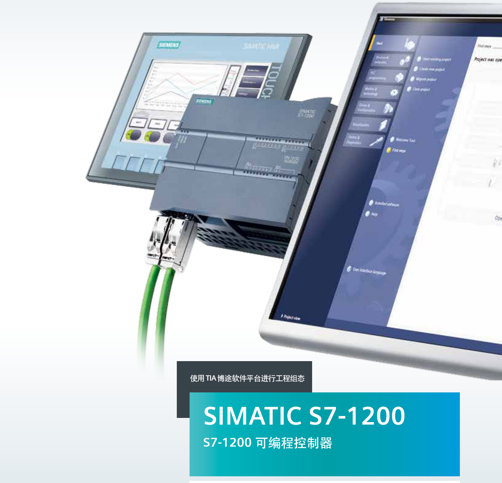

# 编程基础

## 数据类型

- {width="15" height="20"} __[基本数据类型]__   包括 位、位序列、整数、浮点数、日期时间。此外 字符 也属于基本数据类型。
- {width="15" height="20"} __[结构数据Struct]__   Struct类型是一种由多个不同数据类型元素组成的数据结构，其元素可以是基本数据类型，也可以是Struct、数组等复杂数据类型以及PLC数据类型（UDT）等。
- {width="15" height="20"}  __[UDT]__    UDT类型是一种由多个不同数据类型元素组成的数据结构，元素可以是基本数据类型，也可以是STRUCT、数组等复杂数据类型以及其它UDT等。
- {width="25" height="20"} __[数组]__   ARRAY类型是由数目固定且数据类型相同的元素组成的数据结构
- {width="20" height="15"} __[系统数据SDT]__    系统数据类型由系统提供具有预定义的结构，结构由固定数目的具有各种数据类型的元素构成，不能更改该结构。系统数据类型只能用于特定指令。
- {width="20" height="15"} __[硬件数据]__   硬件数据类型：硬件数据类型由 CPU 提供。 可用硬件数据类型的数目取决于 CPU。
- {width="20" height="15"} __[Variant]__   Variant类型是一个参数数据类型，只能出现在除FB的静态变量以外的OB/FC/FB接口区。
- {width="20" height="15"} __[DB_ANY]__   DB_ANY 数据类型用来标识任意数据块。对于 S7-1200，可以选择访问编程期间尚不可用的数据块。
- {width="20" height="15"} __[字符String]__   数据类型为 string 的操作数可存储多个字符，最多可包括 254个字符。字符串中的第一个字节为总长度，第二个字节为有效字符数量。
- {width="20" height="15"} __[宽字符WString]__   数据类型为 wstring（宽字符串）的操作数用于在一个字符串中存储多个数据类型为 wchar 的 Unicode 字符。如果未指定长度，则字符串的长度为预置的 254 个字。
- {width="20" height="15"} [时间数据DTL]   日期和时间的数据类型 DTL 的操作数长度为 12个字节，用于存储日期和时间信息。

## 组织块OB

- {width="20" height="25"} __[组织块OB简介]__   组织块是操作系统和用户程序之间的接口。OB 用于执行具体的程序：
      - 在 CPU 启动时
      - 循环程序处理
      - 在循环或延时时间到达时
      - 当发生外部条件触发时
      - 当发生故障、错误时
- {width="20" height="25"} __[程序循环 OB1]__   程序循环 OB 在 CPU 处于 RUN 模式时，周期性地循环执行。可在程序循环 OB 中放置控制程序的指令或调用其它功能块（FC 或 FB）。
- {width="20" height="25"} __[时间中断 OB10]__  时间中断 OB 用于在时间可控的应用中定期运行一部分用户程序，可实现在某个预设时间到达时只运行一次；或者在设定的触发日期到达后，按每分/小时/天/周/月等周期运行。
- {width="20" height="25"} __[延时中断 OB20]__   延时中断 OB 在经过一段指定的时间延时后，才执行相应的 OB 中的程序。
- {width="20" height="25"} __[循环中断 OB30]__   循环中断 OB 在经过一段固定的时间间隔后执行相应的中断 OB 中的程序。S7-1200 最多支持 4 个循环中断 OB ，在创建循环中断 OB 时设定固定的间隔扫描时间。
- {width="20" height="25"} __[硬件中断 OB40]__    硬件中断 OB 在发生相关硬件事件时执行，可以快速的响应并执行硬件中断 OB 中的程序（例如立即停止某些关键设备）。
- {width="20" height="25"} __[时间错误 OB80]__   当 CPU 中的程序执行时间超过最大循环时间或者发生时间错误事件（例如，循环中断 OB 仍在执行前一次调用时，该循环中断 OB 的启动事件再次发生）时，将触发时间错误中断优先执行 OB80 。
- {width="20" height="25"} __[诊断错误 OB82]__   S7-1200 支持诊断错误中断，可以为具有诊断功能的模块启用诊断错误中断功能来检测模块状态。
- {width="20" height="25"} __[插拔中断 OB83]__   如果移除或插入了已组态且未禁用的分布式 I/O模块或子模块（PROFIBUS、PROFINET 和 AS-i），编程访问 OB83 的启动信息可以判断触发 OB83 的模块并作出响应。
- {width="20" height="25"} __[机架或站故障 OB86]__   当 CPU 检测到分布式机架或站出现故障或发生通信丢失时，可以编程访问机架或站故障 OB86 的启动信息判断触发中断的站并作出响应。
- {width="20" height="25"} __[启动 OB100]__   如果 CPU 的操作模式从 STOP 切换到 RUN 时，包括启动模式处于 RUN 模式时 CPU 断电再上电和执行 STOP 到 RUN 命令切换时，启动组织块 OB 将被执行一次。

## FC,FB功能块

- {width="20" height="25"} __[FC功能]__   FC（功能）是不含存储区的代码块,常用于对一组输入值执行特定运算，例如：可使用FC执行标准运算和可重复使用的运算（例如数学计算）或者执行工艺功能（如使用位逻辑运算执行独立的控制）。
- {width="20" height="25"} __[DB数据块]__   在项目中添加了S7-1200设备之后,在项目树中此PLC的"程序块"下即可以添加新的数据块。
- {width="20" height="25"} __[DB快照功能]__   通过捕获 DB 块变量实际值快照用于恢复值操作，捕获的实际快照值可以复制到 CPU 中的实际值中，也可以用于替换变量的起始值。
- {width="20" height="25"} __[FB功能块]__   功能块 (FB) 是从另一个代码块（OB、FB 或 FC）进行调用时执行的子例程。在调用 FB 块时会生成与之相匹配的背景数据块，在背景数据块中可以存储定义的接口参数及静态变量。

  [基本数据类型]: ./01-Data_Type/01-basic.md
  [结构数据Struct]: ./01-Data_Type/02-Struct.md
  [UDT]: ./01-Data_Type/03-UDT.md
  [数组]: ./01-Data_Type/04-Array.md
  [系统数据SDT]: ./01-Data_Type/05-SDT.md
  [硬件数据]: ./01-Data_Type/06-hardware.md
  [Variant]: ./01-Data_Type/07-Variant.md
  [DB_ANY]: ./01-Data_Type/08-DB_ANY.md
  [字符String]: ./01-Data_Type/09-String.md
  [宽字符WString]: ./01-Data_Type/10-WString.md
  [时间数据DTL]: ./01-Data_Type/11-DTL.md

  [组织块OB简介]: ./02-OB/01-intro.md
  [程序循环 OB1]: ./02-OB/02-OB1.md
  [时间中断 OB10]: ./02-OB/09-OB10.md
  [延时中断 OB20]: ./02-OB/03-OB20.md
  [循环中断 OB30]: ./02-OB/04-OB30.md
  [硬件中断 OB40]: ./02-OB/05-OB40.md
  [时间错误 OB80]: ./02-OB/06-OB80.md
  [诊断错误 OB82]: ./02-OB/07-OB82.md
  [插拔中断 OB83]: ./02-OB/10-OB83.md
  [机架或站故障 OB86]: ./02-OB/11-OB86.md
  [启动 OB100]: ./02-OB/08-OB100.md
  
  [FC功能]: ./03-Block/01-FC.md
  [DB数据块]: ./03-Block/02-DB.md
  [DB快照功能]: ./03-Block/03-DB_Snapshots.md
  [FB功能块]: ./03-Block/04-FB.md