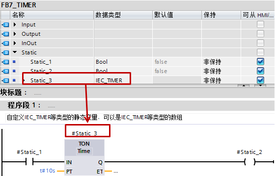
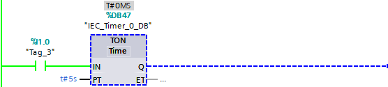
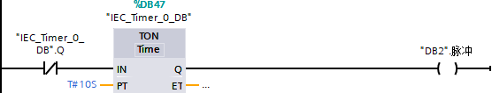

# S7-1200 定时器

S7-1200的定时器为IEC定时器，用户程序中可以使用的定时器数量仅仅受CPU的存储器容量限制。\
使用定时器需要使用定时器相关的背景数据块或者数据类型为IEC_TIMER（或TP_TIME、TON_TIME、TOF_TIME、TONR_TIME）的DB块变量，不同的上述变量代表着不同的定时器。

!!! note "注:"

    S7-1200的IEC定时器没有定时器号（即没有T0、T37这种带定时器号的定时器）。

S7-1200包含四种定时器：

- 生成脉冲定时器（TP）
- 接通延时定时器（TON）
- 关断延时定时器（TOF）
- 时间累加器（TONR）

此外还包含复位定时器（RT）和加载持续时间（PT）这两个指令。

指令位置参见图1，定时器引脚参考表1，定时器使用及时序图参考表2。
这四种定时器又都有功能框和线圈型两种，区别参见常见问题3。

{width="411" height="387"}

图1 指令位置

表1定时器引脚汇总

  输入变量：

  |名称          |    说明         |     数据类型    |      备注         |
  |--------------|-----------------|-----------------|-----------------|
  |IN             |   输入位        |    BOOL         |  TP、TON、TONR：0=禁用定时器，1=启用定时器    TOF：0=启用定时器，1=禁用定时器|
  |PT           |     设定的时间输入  |  TIME       |  |
  |R             |    复位       |       BOOL       |   仅出现在TONR指令|

  输出的变量：

  名称          |    说明         |     数据类型    |      备注         |
  |--------------|-----------------|-----------------|----------------|
  |Q              |   输出位         |   BOOL               |
  |ET             |   已计时的时间    |  TIME               |

表2定时器使用及时序图

| 指令           | 说明    | 时序图 |
|-----------------------------|----------------------------------------------|------------------------------------------------|
| 生成脉冲   LAD：   {width="118" height="139"}   或-( TP )- SCL：TP      |     IN从&ldquo;0&rdquo;变为&ldquo;1&rdquo;，定时器启动，Q立即输出&ldquo;1&rdquo;；         当ET&lt;PT时，IN的改变不影响Q的输出和ET的计时；        当ET=PT时，ET立即停止计时，Q立即输出&ldquo;0&rdquo;；此时如果IN为&ldquo;0&rdquo;，则ET回到0；如果IN为&ldquo;1&rdquo;，则ET保持；    |    {width="275" height="148"}    |
| 接通延时  LAD：   {width="118" height="139"}   或-( TON )- SCL：TON    |       IN从&ldquo;0&rdquo;变为&ldquo;1&rdquo;，定时器启动；          当ET=PT时，Q立即输出&ldquo;1&rdquo;，ET立即停止计时并保持；         在任意时刻，只要IN变为&ldquo;0&rdquo;，ET立即停止计时并回到0，Q输出&ldquo;0&rdquo;；  |   {width="261" height="158"}    |
| 关断延时  LAD：    {width="118" height="139"}    或-( TOF )- SCL：TOF    |                 只要IN为&ldquo;1&rdquo;时，Q即输出为&ldquo;1&rdquo;。                IN从&ldquo;1&rdquo;变为&ldquo;0&rdquo;，定时器启动；              当ET=PT时，Q立即输出&ldquo;0&rdquo;，ET立即停止计时并保持。                   在任意时刻，只要IN变为&ldquo;1&rdquo;，ET立即停止计时并回到0。          |    {width="261" height="160"}     |
| 时间累加器  LAD：   {width="118" height="139"}  或-( TONR )- SCL：TONR |                 只要IN为&ldquo;0&rdquo;时，Q即输出为&ldquo;0&rdquo;；             IN从&ldquo;0&rdquo;变为&ldquo;1&rdquo;，定时器启动；           当ET&lt;PT时，IN为&ldquo;1&rdquo;时，则ET保持计时，IN为&ldquo;0&rdquo;时，ET立即停止计时并保持；                  当ET=PT时，Q立即输出&ldquo;1&rdquo;，ET立即停止计时并保持，直到IN变为&ldquo;0&rdquo;，ET回到0。                 在任意时刻，只要R为&ldquo;1&rdquo;时，Q输出&ldquo;0&rdquo;，ET立即停止计时并回到0。              R从&ldquo;1&rdquo;变为&ldquo;0&rdquo;时，如果此时IN为&ldquo;1&rdquo;，定时器启动。       |   {width="250" height="195"}     |
| 复位定时器  LAD：-(RT)- SCL：RESET_TIMER        |       指令前的运算结果为&quot;1&quot;时使得指定定时器的ET立即停止计时并回到0。              TP指令：激活RT至取消激活RT过程中，Q和IN保持一致。取消激活RT时，如果IN为&quot;1&quot;， ET则立即开始计时。                TON指令：当ET=PT时激活RT，Q立即输出&quot;0&quot;。取消激活RT时，如果IN为&quot;1&quot;， ET则立即开始计时。                TOF指令：激活RT至取消激活RT过程中，Q和IN保持一致。                 TONR指令：R与RT或的结果取代之前的R。           |
| 加载持续时间   LAD：-(PT)- SCL：PRESET_TIMER      |      指令前的运算结果为&quot;1&quot;时使得指定定时器的新设定值立即生效。（在定时器计时过程中，实时修改方框定时器的PT引脚的值在此次计时中不能生效）       |

## S7-1200 定时器创建

S7-1200定时器创建有以下几种方法：

### 1\.功能框指令直接拖入块中，自动生成定时器的背景数据块，该块位于"系统块\>程序资源"中

参见图2

{width="717" height="403"}

图2 自动生成定时器的背景数据块

### 2\. 功能框指令直接拖入FB块中，生成多重背景

参见图3

{width="962" height="517"}

图3 多重背景

### 3\.功能框指令直接拖入FB、FC块中，生成参数实例，从TIA博途V14开始

参见图4

{width="805" height="498"}

图4 参数实例

### 4\.在DB块、FB的静态变量、FC和FB的INOUT变量中新建IEC_TIMER、TP_TIME、TON_TIME、TOF_TIME、TONR_TIME（后面四个从TIA博途V11开始）类型变量，

在程序中将功能框定时器指令拖入块中时，在弹出的"调用选项"页面点击"取消"按钮，之后将该建好的变量填入指定位置。对于线圈型指令，这是首选方法。

（1）
DB块中新建IEC_TIMER等类型变量（LAD/FBD），如果是IEC_TIMER等类型变量的数组，S7-1200从V2.0版本开始支持，参见图5～图7。

{width="525" height="134"}

图5 DB块中的定义

{width="564" height="171"}

图6 功能框定时器使用

{width="570" height="235"}

图7 线圈型定时器使用

（2）
FB的静态变量中新建IEC_TIMER等类型变量（LAD/FBD），如果是IEC_TIMER等类型变量的数组，S7-1200从V2.0版本开始支持，参见图8。

{width="560" height="359"}

图8 静态变量中定义

（3）
FC和FB的INOUT变量中新建IEC_TIMER等类型变量（LAD/FBD），如果是IEC_TIMER等类型变量的数组，S7-1200从V2.0版本开始支持，从TIA博途V14开始支持IEC_TIMER等类型变量的变长数组（ARRAY\[#\]），参见图9。

{width="559" height="361"}

图9 INOUT中定义

（4） 以上三种方法的SCL版本，从TIA博途V14开始支持，参见图10。

{width="763" height="223"}

图10 SCL中使用

从以上4个示例可以看出，IEC_TIMER、TP_TIME、TON_TIME、TOF_TIME、TONR_TIME五种数据类型没有本质的区别，可以互换使用，为使得程序明确，建议只使用定时器对应名字的数据类型。

### 5\.在插入DB时，选择IEC_TIMER类型的数据块，将该数据块填在指令上方

此种方法生成的数据块等同于第一种的背景数据块，位于"系统块\>程序资源"中，从TIA博途V11开始，线圈型指令同样适用，参见图11。

{width="689" height="600"}

图11 新建IEC_TIMER类型DB

## S7-1200 定时器常见问题

!!! question "1.为什么定时器不计时？"

    答：可能原因如下：

    - 1）定时器的输入位需要有电平信号的跳变，定时器才会开始计时。如果保持不变的信号作为输入位是不会开始计时的。TP、TON、TONR需要IN从"0"变为"1"启动，TOF需要IN从"1"变为"0"启动。
    - （2）定时器的背景数据块重复使用。
    - （3）只有在定时器功能框的Q点或ET连接变量，或者在程序中使用背景DB（或IEC_TIMER类型的变量）中的Q点或者ET，定时器才会开始计时，并且更新定时时间。参考表3。

表3 定时器的使用

| 示例                              | 计时与否                          |
|-----------------------------------|-----------------------------------|
| {width="556"height="125"}   | **不计时**     原因:   定时器功能框的Q或ET既没有连接变量，也没有使用背景数据块的Q或者ET  |
| {width="556"   height="90"}  |   **计时**     原因： 定时器功能框的Q连接变量          |
| {width="556" height="125"}    | **计时**     原因：定时器功能框的ET连接变量     |
| {width="556" height="144"}        | **计时**     原因：使用背景数据块的Q    |
| {width="556"  height="200"}           |   **计时**     原因：使用背景数据块的Q     |
| {width="556"  height="239"}    |    **计时**     原因：使用背景数据块的ET                                 |
| {width="556" height="185"}    | **计时**     原因：使用背景数据块的ET     |

!!! question "2. 如何编程自复位定时器并产生脉冲？"

    答：正确答案参考表4，同时附上2种常见错误编程方式。
    原因：<u> **S7-1200的定时器的时间更新发生在定时器功能框的Q点或ET连接变量时，或者在程序中使用背景DB（或IEC_TIMER类型的变量）中的Q点或者ET时。** </u> 即如果程序中多次使用同一背景DB的Q点，或者既使用定时器功能框的Q点或ET连接变量，又使用背景DB的Q点，以上两种情况都会造成定时器在一个扫描周期内的多次更新，可能造成定时器不能正常使用的情况。

表4 自复位定时器示例

| 示例                              | 正确与否                          |
|-----------------------------------|-----------------------------------|
| {width="556" height="108"}    | 正确                              |
| {width="556" height="183"} | 错误      多次使用同一背景DB的Q点   |
| {width="556" height="106"}     | 错误          同时使用背景DB的Q点以及定时器功能框的Q点连接变量  |

正确方法的流程，将程序根据指令分为两部分，如图12所示：

{width="563" height="227"}

图12 分解正确指令

阶段1.初始"DB2".脉冲=False，于是"DB2".脉冲取反为True，触发计时器开始计时，输出的"DB2".脉冲=False，状态不变；定时时间不到，则始终在阶段1；

阶段2.当定时时间到发生在①所处的位置，在TON处定时器更新，Q输出True，因此输出的"DB2".脉冲=True，等到下周期时"DB2".脉冲取反为False，导致输出的"DB2".脉冲=False，等再到下周期时就回到了阶段1；

阶段3.当定时时间到发生在②所处的位置，不影响定时器的更新，需要到下一周期才会改变输出，就回到了阶段2。

从上可知，定时器实现了自复位，并且"DB2".脉冲=True只保持一个周期，形成了脉冲。

以第一个错误方法解释一下为什么这种方法不能实现自复位定时器并产生脉冲，如图13所示，将程序根据指令分为三部分：

{width="571" height="319"}

图13 分解错误指令

阶段1.初始第一行"IEC_Timer_0_DB".Q=False，触发计时器开始计时，第二行，当定时时间不到，"IEC_Timer_0_DB".Q=False保持不变，输出的"DB2".脉冲=False；定时时间不到，则始终在阶段1；

阶段2.当定时时间到发生在①所处的位置，在第一行的"IEC_Timer_0_DB".Q处定时器更新，更新后，"IEC_Timer_0_DB".Q=True，取反为False，此时作为TON的输入，使得定时器复位，第二行的"IEC_Timer_0_DB".Q=False，输出的"DB2".脉冲=False，到下周期时就回到了阶段1；

阶段3.当定时时间到发生在②所处的位置，在第二行的"IEC_Timer_0_DB".Q处定时器更新，更新后，"IEC_Timer_0_DB".Q=True，输出的"DB2".脉冲=True，等到下周期时，"IEC_Timer_0_DB".Q=True，取反为False，此时作为TON的输入，使得定时器复位，第二行的"IEC_Timer_0_DB".Q=False，输出的"DB2".脉冲=False，等再到下周期时就回到了阶段1；

阶段4.当定时时间到发生在③所处的位置，不影响定时器的更新，需要到下一周期才会改变输出，就回到了阶段2。

从上可知无论定时器时间到发生在哪个点，定时器都可以实现自复位，但是只有当定时时间到发生在②所处的位置时，"DB2".脉冲=True只保持一个周期，形成了脉冲，而在①和③时"DB2".脉冲始终为False无法形成脉冲。在正常程序中②的执行时间在整个扫描周期中占比很小，因此只有很低的概率可以实现脉冲。所以不能使用此种方法，第二个错误方法与之类似。

!!! question "3\. 如何使用定时器实现精确定时？"

    答：不能做到。

    举例来说，定时1s的接通延时定时器，当程序扫描到 <u> **定时器功能框的Q点或ET时** </u> 或者扫描到 <u> **背景DB（或IEC_TIMER类型的变量）中的Q点或者ET时** </u>，如果时间为997ms，只会继续定时等下一次扫描，而下一次扫描到可能就是1003ms，此时定时器接通。也就是说几乎不可能正好1s接通，如果再配合计数器实现更长时间的定时，误差只会越来越大。

    所以精确定时还是推荐使用循环中断（OB30）配合计数器来实现。

!!! question "4\. 定时器指令中，功能框和线圈型的区别？"

    答：原理上是完全一样的，细微区别：

    （1）
    功能框定时器上可以定义Q点或ET，在程序中可以不必出现背景DB（或IEC_TIMER类型的变量）中的Q点或者ET；而线圈型定时器必须使用背景DB（或IEC_TIMER类型的变量）中的Q点或者ET；

    （2）
    功能框定时器在使用时可以自动提示生成背景块，或者选择不生成；而线圈型定时器只能通过手动方式建立背景块；

    （3）
    线圈型定时器如果出现在网络段中间时不影响RLO的变化，如图14所示，"DB46".Static_1和I1.0同步变化。

    {width="556" height="185"}

    图14 线圈型定时器示例
