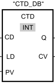

# S7-1200 计数器

S7-1200的计数器为IEC计数器，用户程序中可以使用的计数器数量仅受CPU的存储器容量限制。

这里所说的是软件计数器，最大计数速率受所在OB的执行速率限制。指令所在OB的执行频率必须足够高，以检测输入脉冲的所有变化，如果需要更快的计数操作，请参考高速计数器（HSC）。

!!! note "注:"

    S7-1200的IEC计数没有计数器号（即没有C0、C1这种带计数器号的计数器）。

S7-1200的计数器包含3种计数器，指令位置参见图1：

- 1.计数器（CTU）
- 2.减计数器（CTD）
- 3.加减计数器（CTUD）

{width="311" height="308"}

图1 指令位置

对于每种计数器，计数值可以是任何整数数据类型，并且需要使用每种整数对应的数据类型的DB结构（见表1）或背景数据块来存储计数器数据。计数器引脚参考表2，计数器使用及时序图参考表3（本文均以INT计数器为例）。

表1 计数器类型及范围

 | 整数类型 | 计数器类型    | 计数器类型（TIA博途V14开始）                     | 计数范围                |
 | -------- | ------------- | ------------------------------------------------ | ----------------------- |
 | SINT     | IEC_SCOUNTER  | CTU_SINT     \|        CTD_SINT \|   CTUD_SINT   | -128～127               |
 | INT      | IEC_COUNTER   | CTU_INT       \|     CTD_INT  \|   CTUD_INT      | -32768～32767           |
 | DINT     | IEC_DCOUNTER  | CTU_DINT     \|    CTD_DINT  \|  CTUD_DINT       | -2147483648～2147483647 |
 | USINT    | IEC_USCOUNTER | CTU_USINT     \|     CTD_USINT  \| CTUD_USINT    | 0～255                  |
 | UINT     | IEC_UCOUNTER  | CTU_UINT     \|          CTD_UINT  \|  CTUD_UINT | 0～65535                |
 | UDINT    | IEC_UDCOUNTER | CTU_UDINT   \|   CTD_UDINT  \| CTUD_UDINT        | 0～4294967295           |

表2 计数器引脚汇总

 输入的变量

  | 名称 | 说明           | 数据类型 | 备注              |
  | ---- | -------------- | -------- | ----------------- |
  | CU   | 加计数输入脉冲 | BOOL     | 仅出现在CTU、CTUD |
  | CD   | 减计数输入脉冲 | BOOL     | 仅出现在CTD、CTUD |
  | R    | CV清0          | BOOL     | 仅出现在CTU、CTUD |
  | LD   | CV设置为PV     | BOOL     | 仅出现在CTD、CTUD |
  | PV   | 预设值         | 整数     | 仅出现在CTU、CTUD |
  
  输出的变量

  | 名称 | 说明   | 数据类型 | 备注             |
  | ---- | ------ | -------- | ---------------- |
  | Q    | 输出位 | BOOL     | 仅出现在CTU、CTD |
  | QD   | 输出位 | BOOL     | 仅出现在CTUD     |
  | QU   | 输出位 | BOOL     | 仅出现在CTUD     |
  | CV   | 计数值 | 整数     |                  |

表3计数器使用及时序图

| 指令                                                                                                | 说明                                                                                                                                                                                                                                                                                                                                                                                                                                                                                                                                                                                                                                              | 时序图                                        |
| --------------------------------------------------------------------------------------------------- | ------------------------------------------------------------------------------------------------------------------------------------------------------------------------------------------------------------------------------------------------------------------------------------------------------------------------------------------------------------------------------------------------------------------------------------------------------------------------------------------------------------------------------------------------------------------------------------------------------------------------------------------------- | --------------------------------------------- |
| 加计数  LAD：    {width="113" height="171"}  SCL：CTU                   |                 当CU从&ldquo;0&rdquo;变为&ldquo;1&rdquo;，CV增加1；                        当CV=PV时，Q输出&ldquo;1&rdquo;，此后当CU从&ldquo;0&rdquo;变为&ldquo;1&rdquo;，Q保持输出&ldquo;1&rdquo;，CV继续增加1直到达到计数器指定的整数类型的最大值。；                       在任意时刻，只要R为&ldquo;1&rdquo;时，Q输出&ldquo;0&rdquo;，CV立即停止计数并回到0；                                                                                                                                                                                                                                                   | {width="414" height="261"} |
| 减计数        LAD：    {width="113" height="117"}           SCL：CTD    |                 当CD从&ldquo;0&rdquo;变为&ldquo;1&rdquo;，CV减少1；                        当CV=0时，Q输出&ldquo;1&rdquo;，此后当CU从&ldquo;0&rdquo;变为&ldquo;1&rdquo;，Q保持输出&ldquo;1&rdquo;，CV继续减少1直到达到计数器指定的整数类型的最小值；                       只要LD为&ldquo;1&rdquo;时，Q输出&ldquo;0&rdquo;，CV立即停止计数并回到PV值；                                                                                                                                                                                                                                                              | {width="411" height="218"} |
| 加减计数        LAD：    {width="113" height="250"}           SCL：CTUD |           当CU从&ldquo;0&rdquo;变为&ldquo;1&rdquo;，CV增加1；                   当CD从&ldquo;0&rdquo;变为&ldquo;1&rdquo;，CV减少1；                 当CV&gt;=PV时，QU输出&ldquo;1&rdquo;；当CV&lt;PV时，QU输出&ldquo;0&rdquo;；                当CV&lt;=0时，QD输出&ldquo;1&rdquo;；当CV&gt;0时，QD输出&ldquo;0&rdquo;；                   CV的上下限取决于计数器指定的整数类型的最大值与最小值；                  只要R为&ldquo;1&rdquo;时，QD输出&ldquo;1&rdquo;，CV立即停止计数并回到0；                 只要LD为&ldquo;1&rdquo;时，QU输出&ldquo;1&rdquo;，CV立即停止计数并回到PV值。          | {width="409" height="274"} |

## S7-1200 计数器创建

S7-1200计数器创建有以下几种方法：

### 1\.指令直接拖入块中

自动生成计数器的背景数据块，该块位于 <kbd> 系统块 \> 程序资源 </kbd> 中，参见图2。需要在指令中修改计数值类型。

{width="785" height="549"}

图2 自动生成计数器的背景数据块

### 2\.指令直接拖入FB块中，生成多重背景

参见图3。多重背景的数据类型在TIA博途V14之前是IEC_COUNTER类型，从TIA博途V14开始是CTU_INT、CTD_INT、CTUD_INT等类型（取决于指令）。

{width="959" height="503"}

图3 多重背景

### 3\. 指令直接拖入FB、FC块中，生成参数实例，从TIA博途V14开始

参见图4。

{width="952" height="485"}

图4 参数实例

### 4\.在DB块、FB的静态变量、FC和FB的INOUT变量中新建IEC_COUNTER、CTU_INT、CTD_INT、CTUD_INT类型变量

在程序中将计数器指令拖入块中时，在弹出的 <kbd>**调用选项**</kbd> 页面点击 <kbd>**取消**</kbd> 按钮，之后将该建好的变量填入指定位置。

（1）DB块中新建IEC_COUNTER等类型变量（LAD/FBD），如果是IEC_COUNTER等类型变量的数组，S7-1200从V2.0版本开始支持，参见图5、6。

{width="633" height="409"}

图5 DB块中的定义

{width="556" height="186"}

图6 计数器使用

（2）FB的静态变量中新建IEC_COUNTER等类型变量（LAD/FBD），如果是IEC_COUNTER等类型变量的数组，S7-1200从V2.0版本开始支持，参见图7。

{width="556" height="362"}

图7 静态变量中定义

（3）FC和FB的INOUT变量中新建IEC_COUNTER等类型变量（LAD/FBD），如果是IEC_COUNTER等类型变量的数组，S7-1200从V2.0版本开始支持，从TIA博途V14开始支持IEC_COUNTER等类型变量的变长数组（ARRAY\[#\]），参见图8。

{width="559" height="362"}

图8 INOUT中定义

（4） 以上三种方法的SCL版本，从TIA博途V14开始支持，参见图9。

{width="750" height="146"}

图9 SCL中使用

从以上四个示例可以看出，IEC_COUNTER、CTU_INT、CTD_INT、CTUD_INT四种数据类型没有本质的区别，可以互换使用，为使得程序明确，建议只使用计数器对应名字的数据类型。

### 5\.在插入DB时，选择IEC_COUNTER类型的数据块，将该数据块填在指令上方

此种方法生成的数据块等同于第一种的背景数据块，位于<kbd>**系统块\>程序资源**</kbd>中，从TIA博途V11开始，参见图10.

{width="688" height="600"}

图10 新建IEC_COUNTER类型DB

## S7-1200 计数器常见问题

1\. 为什么计数器不计数?

    答：可能原因如下：

    - （1）计数器的输入位（CU、CD）需要有电平信号的跳变，计数器才会计数。如果保持不变的信号作为输入位是不会开始计数的。

    - （2）计数器的背景数据块重复使用。

2\. 如何编程自复位计数器并产生脉冲?

    答：正确答案见图11，错误答案见图12、13。

    {width="556" height="161"}

    图11 正确程序

    {width="556" height="253"}

    图12 错误程序1

    {width="556" height="307"}

    图13 错误程序2

    正确原因：当计数值达到10，"DB77".Static_15（False）作为计数器R的输入，并没有复位，Q输出"DB77".Static_15为True，在下一周期时执行复位指令，使得计数值清零，之后Q输出"DB77".Static_15为False，实现自复位计数器并产生脉冲。

    错误1原因：当计数值达到10，首先置位"数据块_2".QU，紧接着"数据块_2".QU作为计数器R的输入，使得计数值清零，同时复位"数据块_2".QU，在下一网络段"DB77".Static_15依然是False，无法实现脉冲。

    错误2原因：当计数值达到10，"数据块_2".CV=10，紧接着"数据块_2".CV与"数据块_2".PV的比较结果（True）作为计数器R的输入，使得计数值清零，同时复位"数据块_2".QU，在下一网络段"DB77".Static_15依然是False，无法实现脉冲。

从例子可知，计数器的执行是先处理输入，再处理输出，在指令块执行过程中，内部变量（例如QU、CV）可能出现多次变化。

 
