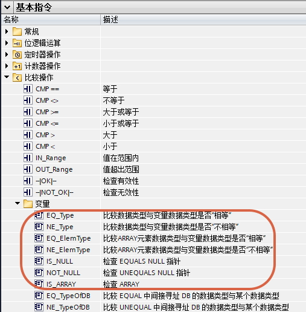
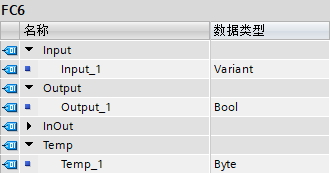
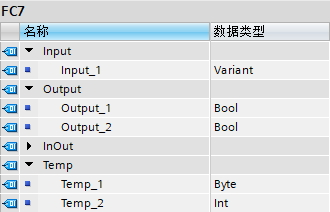

### 比较操作 - 变量 指令说明

从TIA V13SP1 开始，S7-1200
V4.0开始，支持以下处理Variant类型的变量的指令，如图1-2所示。

{width="507" height="516"}

图1 LAD中Variant类型的变量比较操作指令

{width="422" height="216"}

图2 SCL中Variant类型的变量比较操作指令

注：EQ_TypeOfDB、NE_TypeOfDB、TypeOfDB指令参见[DB_ANY](../../02-basic/01-Data_Type/08-DB_ANY.html#TypeOfDB)。

[]{#Type}

#### EQ_Type、NE_Type、TypeOf

表1 LAD指令详情

+-----------------+-----------------+-----------------+-----------------+
| LAD指令         | 操作数1         | 操作数2         | 说明            |
+=================+=================+=================+=================+
| 操作数1\        | Variant         | 除Vari          | 比较操          |
| ┫EQ_Type┣\      |                 | ant以外所有类型 | 作数1对应的实参 |
| 操作数2         |                 |                 | 与操作数2的数据 |
|                 |                 |                 | 类型是否相等，  |
|                 |                 |                 | 相等则该指令返  |
|                 |                 |                 | 回逻辑运算结果  |
|                 |                 |                 | (RL             |
|                 |                 |                 | O)"1"。如果不相 |
|                 |                 |                 | 等则该指令返回  |
|                 |                 |                 | RLO"0"。操作    |
|                 |                 |                 | 数1是FC/FB的In  |
|                 |                 |                 | put/Output/InOu |
|                 |                 |                 | t/Temp以及OB的T |
|                 |                 |                 | emp中定义为Vari |
|                 |                 |                 | ant类型的参数。 |
+-----------------+-----------------+-----------------+-----------------+
| 操作数1\        | Variant         | 除Vari          | 比较操作数      |
| ┫NE_Type┣\      |                 | ant以外所有类型 | 1对应的实参与操 |
| 操作数2         |                 |                 | 作数2的数据类型 |
|                 |                 |                 | 是否不相等，不  |
|                 |                 |                 | 相等则该指令返  |
|                 |                 |                 | 回逻辑运算结果  |
|                 |                 |                 | (               |
|                 |                 |                 | RLO)"1"。如果相 |
|                 |                 |                 | 等则该指令返回  |
|                 |                 |                 | RLO"0"。操作    |
|                 |                 |                 | 数1是FC/FB的In  |
|                 |                 |                 | put/Output/InOu |
|                 |                 |                 | t/Temp以及OB的T |
|                 |                 |                 | emp中定义为Vari |
|                 |                 |                 | ant类型的参数。 |
+-----------------+-----------------+-----------------+-----------------+

SCL指令：TypeOf（操作数），操作数是FC/FB的Input/Output/InOut/Temp中定义为Variant类型的参数，该语句输出是数据类型，在程序中只能用在IF与CASE进行比较。

用法1：IF指令，操作数对应的实参的类型与一个变量类型的比较，例如：

IF (TypeOf(操作数1) = 变量类型（例如Byte）)\
\...\
END_IF;

用法2：IF指令，两个操作数对应的实参的类型比较，例如：

IF (TypeOf(操作数1) = TypeOf(操作数2))\
\...\
END_IF;

用法3：CASE OF指令，操作数对应的实参的类型与多个变量类型的比较，例如：

CASE (TypeOf(操作数)) OF\
Byte:\
\...\
Int:\
\...\
ELSE\
\...\
END_CASE;

使用举例：

编写FC，检查输入Variant变量类型，Byte则输出True，其它则输出False，如图3-6所示。

{width="330" height="173"}

图3 FC6参数定义

{width="556" height="108"}

图4 程序详情

SCL的版本程序，如图5所示。

{width="220" height="99"}

图5 SCL版本的程序

OB1多次调用该FC6，可以看到结果，\"DB16\".Static_1是Byte类型，\"DB16\".Static_3不是Byte类型。

{width="556" height="281"}

图6 OB1多次调用FC6

[]{#ElemType}

#### EQ_ElemType、NE_ElemType、TypeOfElements

表2 LAD指令说明

+-----------------+-----------------+-----------------+-----------------+
| LAD指令         | 操作数1         | 操作数2         | 说明            |
+=================+=================+=================+=================+
| 操作数1\        | Variant         | 除Vari          | 如果操          |
| ┫EQ_ElemType┣\  |                 | ant以外所有类型 | 作数1对应的实参 |
| 操作数2         |                 |                 | 是数组类型，则  |
|                 |                 |                 | 比较其数组元素  |
|                 |                 |                 | 与操作数2的数据 |
|                 |                 |                 | 类型是否相等，  |
|                 |                 |                 | 相等则该指令返  |
|                 |                 |                 | 回逻辑运算结果  |
|                 |                 |                 | (RL             |
|                 |                 |                 | O)"1"，如果不相 |
|                 |                 |                 | 等则该指令返回  |
|                 |                 |                 | RLO"0"；如果操  |
|                 |                 |                 | 作数1对应的实参 |
|                 |                 |                 | 不是数组类型，  |
|                 |                 |                 | 并且操作数1对应 |
|                 |                 |                 | 的实参与操作数  |
|                 |                 |                 | 2的数据类型相等 |
|                 |                 |                 | ，则该指令返回  |
|                 |                 |                 | RLO"1"，其余情  |
|                 |                 |                 | 况，该指令返回  |
|                 |                 |                 | RLO"            |
|                 |                 |                 | 0"。操作数1是FC |
|                 |                 |                 | /FB的Input/Outp |
|                 |                 |                 | ut/InOut/Temp以 |
|                 |                 |                 | 及OB的Temp中定  |
|                 |                 |                 | 义为Variant类型 |
|                 |                 |                 | 的参数。比较之  |
|                 |                 |                 | 前，通常先使用I |
|                 |                 |                 | S_ARRAY检查操作 |
|                 |                 |                 | 数1对应的实参是 |
|                 |                 |                 | 否是数组类型。  |
+-----------------+-----------------+-----------------+-----------------+
| 操作数1\        | Variant         | 除Vari          | 如果操作        |
| ┫NE_ElemType┣\  |                 | ant以外所有类型 | 数1对应的实参是 |
| 操作数2         |                 |                 | 数组类型，则比  |
|                 |                 |                 | 较其数组元素与  |
|                 |                 |                 | 操作数2的数据类 |
|                 |                 |                 | 型是否相等，不  |
|                 |                 |                 | 相等则该指令返  |
|                 |                 |                 | 回逻辑运算结果  |
|                 |                 |                 | (               |
|                 |                 |                 | RLO)"1"，如果相 |
|                 |                 |                 | 等则该指令返回  |
|                 |                 |                 | RLO"0"。如果    |
|                 |                 |                 | 操作数1对应的实 |
|                 |                 |                 | 参不是数组类型  |
|                 |                 |                 | ，则该指令返回  |
|                 |                 |                 | RLO"            |
|                 |                 |                 | 1"。操作数1是FC |
|                 |                 |                 | /FB的Input/Outp |
|                 |                 |                 | ut/InOut/Temp以 |
|                 |                 |                 | 及OB的Temp中定  |
|                 |                 |                 | 义为Variant类型 |
|                 |                 |                 | 的参数。比较之  |
|                 |                 |                 | 前，通常先使用I |
|                 |                 |                 | S_ARRAY检查操作 |
|                 |                 |                 | 数1对应的实参是 |
|                 |                 |                 | 否是数组类型。  |
+-----------------+-----------------+-----------------+-----------------+

SCL指令：TypeOfElements（操作数），操作数是FC/FB的Input/Output/InOut/Temp中定义为Variant类型的参数，该语句输出是数据类型，在程序中只能用在IF与CASE进行比较。

比较之前，通常先使用IS_ARRAY检查操作数对应的实参是否是数组类型。

用法1：IF指令，操作数对应的实参为数组类型，对该数组元素的类型与一个变量类型的比较，例如：

IF (TypeOfElements(操作数1) = 变量类型（例如Byte）)\
\...\
END_IF;

用法2：IF指令，两个操作数对应的实参均为数组类型的类型，比较它们数组元素的类型，例如：

IF (TypeOfElements(操作数1) = TypeOfElements(操作数2))\
\...\
END_IF;

用法3：CASE
OF指令，操作数对应的实参为数组类型，对该数组元素的类型与多个变量类型的比较，例如：

CASE (TypeOfElements(操作数)) OF\
Byte:\
\...\
Int:\
\...\
ELSE\
\...\
END_CASE;

注意

1.如果上述三种用法操作数不是数组类型，但是数据类型和比较对象的数据类型相同，也会当做该数据类型的数组进行处理，相当于执行的TypeOf指令。

2.用法2，也可以是这样的：

IF (TypeOfElements(操作数1) = TypeOf(操作数2))\
\...\
END_IF;

或者

IF (TypeOf(操作数1) = TypeOfElements(操作数2))\
\...\
END_IF;

即一边是数组，一边不是数组的比较。

使用举例：

编写FC，检查输入Variant变量类型，数组元素如果是Byte则输出1为True，输出2为False，数组元素如果是Int则输出1为False，输出2为True，其余情况输出1为False，输出2为False，如图7-10所示。

{width="330" height="212"}

图7 FC7参数定义

{width="556" height="587"}

图8 程序详情

SCL的版本程序，如图9所示。

{width="282" height="286"}

图9 SCL版本的程序

OB1多次调用该FC7，可以看到结果，\"DB17\".Static_1是Byte数组，\"DB17\".Static_4是Int数组，\"DB17\".Static_7不是以上两种类型。

{width="556" height="478"}

图10 OB1多次调用FC7

#### []{#Null}IS_NULL、NOT_NULL

表3 LAD指令说明

+-----------------------+-----------------------+-----------------------+
| LAD指令               | 操作数                | 说明                  |
+=======================+=======================+=======================+
| 操作数\               | Variant               | 如果操作数对应        |
| ┫IS_NULL┣\            |                       | 的实参有指向变量，该  |
|                       |                       | 指令返回逻辑运算结果  |
|                       |                       | (RL                   |
|                       |                       | O)"0"，否则该指令返回 |
|                       |                       | RL                    |
|                       |                       | O"1"。操作数是FC/FB的 |
|                       |                       | Input/Output/InOut/T  |
|                       |                       | emp以及OB的Temp中定义 |
|                       |                       | 为Variant类型的参数。 |
+-----------------------+-----------------------+-----------------------+
| 操作数\               | Variant               | 如果操作数对应        |
| ┫NOT_NULL┣\           |                       | 的实参有指向变量，该  |
|                       |                       | 指令返回逻辑运算结果  |
|                       |                       | (RL                   |
|                       |                       | O)"1"，否则该指令返回 |
|                       |                       | RL                    |
|                       |                       | O"1"。操作数是FC/FB的 |
|                       |                       | Input/Output/InOut/T  |
|                       |                       | emp以及OB的Temp中定义 |
|                       |                       | 为Variant类型的参数。 |
+-----------------------+-----------------------+-----------------------+

对于SCL，虽然没有相对应指令，但是可以在IF指令中，将Variant变量与NULL比较

IF (操作数 = NULL)\
\...\
END_IF;

理论上来说，对于每个参数出现了Variant的FC/FB，都应该检查该Variant变量是否指向了空指针，此处的空指针不一定是形参填写NULL，也有可能填写没有初始化的Temp中的Variant。

对于最新的S7-1200
V4.2版本，只有一种情况可以初始化Temp中的Variant，就是指令DB_ANY_TO_VARIANT（参见[DB_ANY](../../02-basic/01-Data_Type/08-DB_ANY#UDT.html)），同时运行没有错误，否则Temp中的Variant就相当于NULL。

使用举例：

程序架构：OB1调用FC9，FC9调用FC8，FC8中检查3个输入是否是NULL，是则输出True，不是则输出False，FC9的3个Temp变量作为FC8的3个输入，Temp_1是不赋值的Int变量，Temp_2和Temp_3是通过DB_ANY_TO_VARIANT初始化的Variant变量，其中为Temp_2初始化的DB1是不满足DB_ANY_TO_VARIANT条件的DB块，为Temp_3初始化的DB19是不满足DB_ANY_TO_VARIANT条件的DB块，最终将FC8的3个输出关联FC9的3个输出至OB1中显示，如图11-13所示。

{width="558" height="440"}

图11 FC8程序详情

{width="594" height="523"}

图12 FC9程序详情

OB1调用FC9

{width="556" height="202"}

图13 OB1调用FC9

从图13中可知，不满足DB_ANY_TO_VARIANT条件的DB1初始化的Temp_2相当于NULL，其余两个都可以视作有明确指向。

#### []{#Array}IS_ARRAY

表4 LAD指令说明

+-----------------------+-----------------------+-----------------------+
| LAD                   | 操作数                | 说明                  |
+=======================+=======================+=======================+
| 操作数\               | Variant               | 如果                  |
| ┫IS_ARRAY┣\           |                       | 操作数对应的实参为数  |
|                       |                       | 组或者P#指针格式，该  |
|                       |                       | 指令返回逻辑运算结果  |
|                       |                       | (RL                   |
|                       |                       | O)"1"，否则该指令返回 |
|                       |                       | RL                    |
|                       |                       | O"0"。操作数是FC/FB的 |
|                       |                       | Input/Output/InOut/T  |
|                       |                       | emp以及OB的Temp中定义 |
|                       |                       | 为Variant类型的参数。 |
+-----------------------+-----------------------+-----------------------+

SCL指令：

IS_ARRAY(操作数)，操作数是FC/FB的Input/Output/InOut/Temp中定义为Variant类型的参数，当操作数对应的实参为数组或者P#指针格式，IS_ARRAY(操作数)
为True，否则IS_ARRAY(操作数) 为False。

使用方法：

IF IS_ARRAY(操作数) THEN\
\...\
END_IF;

使用举例参见[CountOfElements](04-Move/05-MOVE_Variant.html#Count)。
