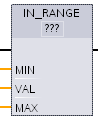
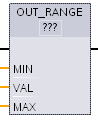

# IN\_Range（范围内值）和 OUT\_Range（范围外值）

## 范围内值和范围外值指令

|     |     |     |
| --- | --- | --- |
| ​LAD/FBD \*| ​SCL | ​说明 |
| ​   | out := IN_RANGE(min, val, max); | ​测试输入值是在指定的值范围之内还是之外。  ​如果比较结果为 TRUE，则功能框输出为 TRUE。 指令范围评估OUT_Range（值超出范围）IN_Range（值在范围之内） |
| ​   | out := OUT_RANGE(min, val, max); |

!!!note " \*  对于 LAD 和 FBD：单击“???”并从下拉列表中选择数据类型。"

## 参数的数据类型

|     |     |     |
| --- | --- | --- |
| ​参数 | ​数据类型 \*  | ​说明 |
| ​MIN, VAL, MAX | ​SInt, Int, DInt, USInt, UInt, UDInt, Real, LReal, ​常数 | ​比较器输入 |

!!! note "\*  输入参数 MIN、VAL 和 MAX 的数据类型必须相同。"

* ​满足以下条件时 ​IN_RANGE​ 比较结果为真：​MIN​ <= ​VAL​ <= ​MAX
* ​满足以下条件时 ​OUT_RANGE​ 比较结果为真：​VAL​ < ​MIN​ 或 ​VAL​ \> ​MAX