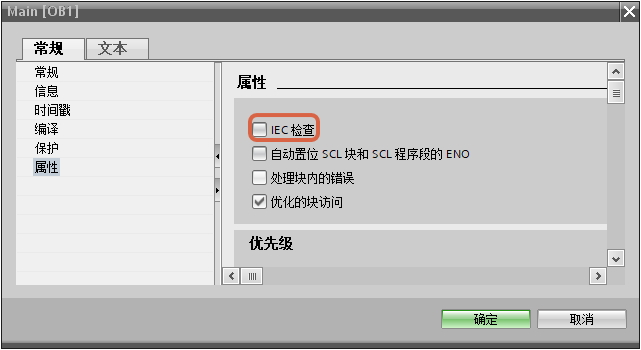
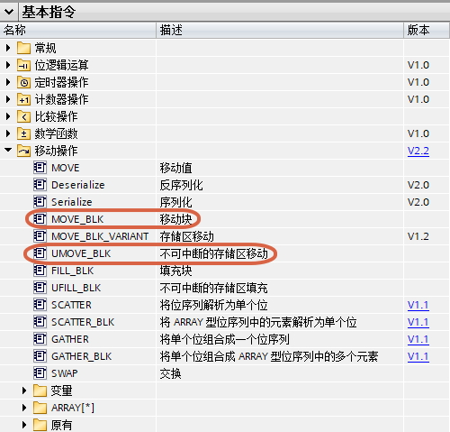
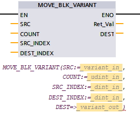
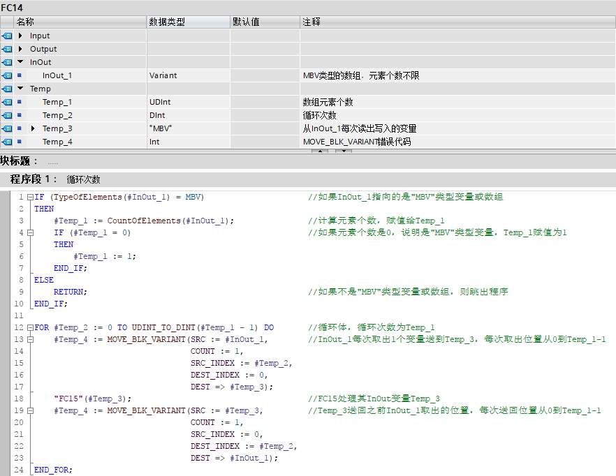

# MOVE 系列指令

## MOVE

LAD为MOVE指令，SCL使用\":=\"表达式可以完成MOVE的功能（":="还可以有其他功能）。

MOVE指令是当EN条件满足时，实现相同数据类型（不包括位、字符串、Variant类型）的变量间的传送。

{width="502" height="482"}

图1 指令位置

注意：

（1）LAD传送字符串需要使用S_MOVE指令（SCL使用":="），但是传送字符串中的字符需要使用MOVE指令。

（2）支持通过一个MOVE指令将一个变量传送到多个变量，但是该功能不支持传送复杂数据类型（DTL、结构、数组等）或字符串中的字符。

（3）传送数组时，要求元素数据类型以及元素个数必须完全一样，数组限值可以不同，例如Array\[0..1\]
of Byte可以MOVE到Array\[1..2\] of Byte。

（4）如果MOVE两边是基本数据类型，则可以在满足以下兼容条件时传送，参见表1。

表1 MOVE的传送条件

| 传送源 (IN)     | 传送目标 (OUT1)        |                                                                                     |
| --------------- | ---------------------- | ----------------------------------------------------------------------------------- |
|                 | 进行 IEC 检查          | 不进行 IEC 检查                                                                     |
| BYTE            | BYTE、WORD、DWORD      | BYTE、WORD、DWORD、SINT、USINT、INT、UINT、DINT、UDINT、TIME、DATE、TOD、CHAR       |
| WORD            | WORD、DWORD            | BYTE、WORD、DWORD、SINT、USINT、INT、UINT、DINT、UDINT、TIME、DATE、TOD、CHAR       |
| DWORD           | DWORD                  | BYTE、WORD、DWORD、SINT、USINT、INT、UINT、DINT、UDINT、REAL、TIME、DATE、TOD、CHAR |
| SINT            | SINT                   | BYTE, WORD, DWORD, SINT, USINT, INT, UINT, DINT, UDINT, TIME, DATE, TOD             |
| USINT           | USINT, UINT, UDINT     | BYTE, WORD, DWORD, SINT, USINT, INT, UINT, DINT, UDINT, TIME, DATE, TOD             |
| INT             | INT                    | BYTE, WORD, DWORD, SINT, USINT, INT, UINT, DINT, UDINT, TIME, DATE, TOD             |
| UINT            | USINT, UINT            | BYTE, WORD, DWORD, SINT, USINT, INT, UINT, DINT, UDINT, TIME, DATE, TOD             |
| DINT            | DINT                   | BYTE, WORD, DWORD, SINT, USINT, INT, UINT, DINT, UDINT, TIME, DATE, TOD             |
| UDINT           | UDINT                  | BYTE, WORD, DWORD, SINT, USINT, INT, UINT, DINT, UDINT, TIME, DATE, TOD             |
| REAL            | REAL                   | DWORD, REAL                                                                         |
| LREAL           | LREAL                  | LREAL                                                                               |
| TIME            | TIME                   | BYTE, WORD, DWORD, SINT, USINT, INT, UINT, DINT, UDINT, TIME                        |
| DATE            | DATE                   | BYTE, WORD, DWORD, SINT, USINT, INT, UINT, DINT, UDINT, DATE                        |
| TOD             | TOD                    | BYTE, WORD, DWORD, SINT, USINT, INT, UINT, DINT, UDINT, TOD                         |
| CHAR            | CHAR, String中的字符   | BYTE, WORD, DWORD，CHAR，String中的字符                                             |
| WCHAR           | WCHAR, WString中的字符 | BYTE，WORD，DWORD，CHAR，WCHAR，WString中的字符                                     |
| String中的字符  | CHAR, String中的字符   | CHAR, String中的字符                                                                |
| WString中的字符 | WCHAR, WString中的字符 | WCHAR, WString中的字符                                                              |

:::{attention}

    - 1.如果输入 IN 数据类型的位长度超出输出 OUT
    数据类型的位长度，则源值的高位会丢失。如果输入 IN
    数据类型的位长度低于输出 OUT 数据类型的位长度，则目标值的高位会被改写为0。
    - 2.REAL传送至DWORD时是按位传送，不是取整。如果需要取整，可以使用ROUND、CONVERT_REAL_TO_DINT等指令。
    - 3.（不）进行IEC检查是指，在MOVE指令所在的OB/FC/FB属性中的\"IEC检查\"选项，仅在此块中生效。默认的\"IEC检查\"不激活。设置如图2所示。
:::

{width="641" height="350"}

图2 IEC检查的设置

## MOVE的使用

{width="426" height="270"}

图3 DB25

1\. 单个基本类型变量的传送

{width="556" height="115"}

图4 单个基本类型变量的传送

2\. 数组的传送

{width="556" height="98"}

图5 数组的传送

3\. UDT的传送

{width="556" height="97"}

图6 UDT的传送

4\. String中的字符的传送

{width="556" height="117"}

图7 String中的字符的传送

5\. DTL中的变量的传送

{width="556" height="113"}

图8 DTL中的变量的传送

6\. DB整体之间的传送

条件：DB块为非优化块，或者将优化DB块的存储器预留区域与预留可保持性存储器设置为0字节（如图9所示），并且两个DB块结构完全相同。
 
{width="641" height="349"} 
  
图9 存储器预留区域设置

:::{warning}

    - 1.IN和OUT的DB必须同时为优化DB或者非优化DB
    - 2.不允许同时输出到多个DB，即图4的形式。
:::

{width="889" height="120"}

图10 DB整体传送

{width="556" height="118"}

图11 DB整体传送程序

## (U)MOVE_BLK

LAD和SCL均为(U)MOVE_BLK指令。

(U)MOVE_BLK指令是当EN条件满足时，实现相同数组之间部分元素的传送。MOVE_BLK和UMOVE_BLK的区别是UMOVE_BLK不会被中断打断，并且最多16kB的数据量。

{width="500" height="479"}

图12 程序位置

{width="475" height="131"}

图13 指令详情

:::{attention}

    1\.IN和OUT必须是数组的一个元素，例如\"DB26\".Static_1\[0\]，不能是常数、常量、普通变量，也不能是数组名。

    2\.IN和OUT类型必须完全相同，并且必须是基本数据类型，不能是UDT、Struct等的数组。

    3\.IN是源数组中传送的起始元素，OUT是目的数组中接收的起始元素。

    4\.COUNT是传输个数，可以是正整数的常数，如果是变量，数据类型支持USINT、UINT、UDINT。

    5\.如果目的数组接收区域小于源数组的传送区域，则只传送目的数组可接收的区域的数据。如果激活指令的ENO功能，则ENO=False。

## (U)MOVE_BLK的使用

实现功能：将\"DB26\".Static_1\[0\]开始的4个元素传送至\"DB26\".Static_2\[4\]开始的数组中。

{width="556" height="135"}

图14 程序使用

{width="775" height="173"}

图15 运行结果

## MOVE_BLK_VARIANT

LAD和SCL均为MOVE_BLK_VARIANT指令。

MOVE_BLK_VARIANT的基本功能是数组之间部分元素的传送，并且是可以处理Variant类型的变量的指令之一，适合处理Variant指向的变长数组。

从TIA V13SP1，S7-1200 V4.0开始支持该指令。

{width="503" height="478"}

图16 指令位置

{width="278" height="227"}

图17 指令详情

表2 参数说明

  | 参数                                              | 声明   | 数据类型                                          |
  | ------------------------------------------------- | ------ | ------------------------------------------------- |
  | SRC                                               | Input  | Variant、Array、其他（不包括Bool，Array of Bool） |
  | COUNT                                             | Input  | UDINT                                             |
  | SRC_INDEX                                         | Input  | DINT                                              |
  | DEST_INDEX                                        | Input  | DINT                                              |
  | DEST                                              | Output |
  | Variant、Array、其他（不包括Bool，Array of Bool） |
  | RET_VAL                                           | Return | INT                                               |

MOVE_BLK_VARIANT指令通常用于将源数组SRC的部分元素传送至目的数组DEST的部分元素中，SRC与DEST数组元素必须完全相同。COUNT是传送的元素个数，SRC_INDEX是待传送的源数组的起始编号，DEST_INDEX是目的数组接收的起始编号，此处用编号不是下标的意思是，SRC_INDEX和DEST_INDEX都从0开始，对应SRC和DEST的第一个元素。

同样是传送部分数组元素的指令，MOVE_BLK_VARIANT相对MOVE_BLK有以下优点：

1\. SRC和DEST不可以是Bool数组，但可以是Struct、UDT等复杂数据类型数组

2\.
SRC和DEST都可以是普通的单个变量，例如SRC为一个INT变量，DEST作为一个INT数组，此时需要设置COUNT=1，SRC_INDEX=0，然后根据DEST_INDEX的值，传入DEST的指定位置。

3\.
SRC和DEST填写的通常是数组名，也可以是普通的单个变量，或者数组的一个元素，后两种情况都需要像（2）一样处理。

4\.
SRC和DEST可以是参数类型Variant的变量，也就是可以直接填写P#指针的格式，指令将会把P#指针看做数组处理（[原因](../../../02-basic/01-Data_Type/07-Variant.html)）。即使是SRC和DEST都指向Variant类型，其指向的形参的数组元素数据类型也需要相同，所以通常需要在使用指令之前用EQ_ElemType检查其中元素的数据类型。

使用MOVE_BLK_VARIANT指令的注意：

（1）COUNT\>=1，否则报错并且不传送任何数据。

（2）
COUNT+SRC_INDEX与COUNT+DEST_INDEX决定了SRC与DEST数组元素编号上限，超出范围将报错并且不传送任何数据。

使用举例：

1\. 实现功能将结构完全一样的M区数据送入DB区

{width="846" height="194"}

图18 运行结果

需要注意的是将DB块改为非优化，M区和DB区均是16Byte，SRC和DEST可以是P#BYTE
16，P#WORD 8，P#DWORD 4等都可以，但是要注意COUNT和元素数相同（P#BYTE
16，COUNT=16；P#WORD 8，COUNT=8；P#DWORD
4，COUNT=4），SRC和DEST结构一致即可。

{width="556" height="172"}

图19 程序详情

2\. 实现变长数组的处理

功能：FC15处理MBV类型变量，该变量作为InOut，FC14中输入MBV类型变量的变长数组，在其内部判断数组大小，然后数组元素逐个执行FC15指令，最后送回变长数组。

{width="882" height="682"}

图20 指令详情
