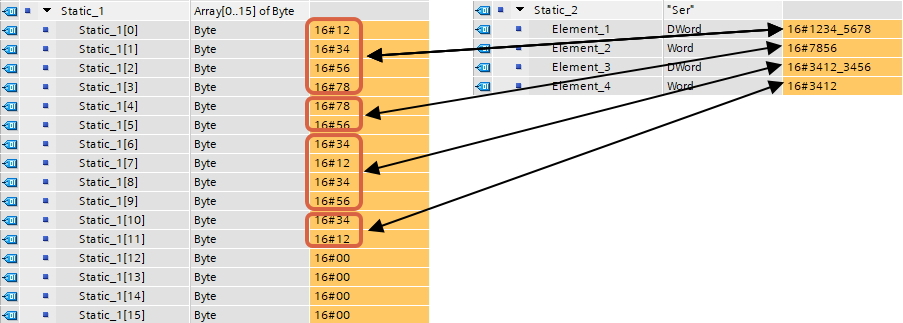
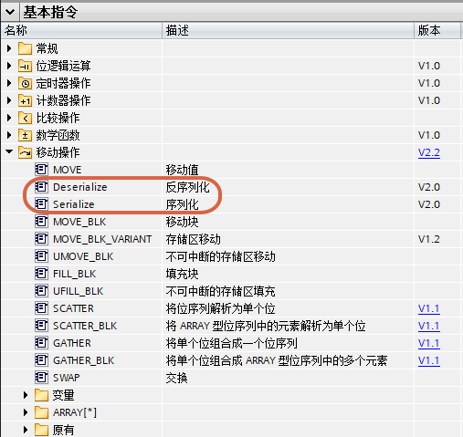
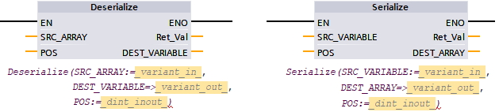
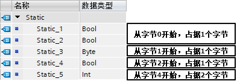
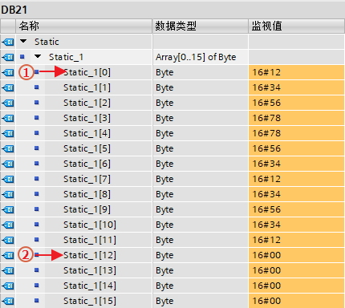
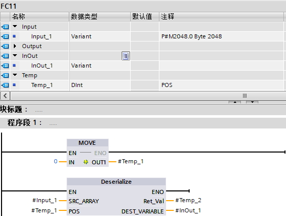
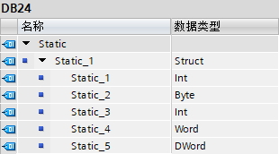
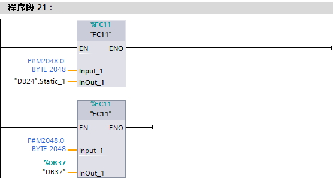

# Deserialize（反序列化）、Serialize（序列化）

S7-1200将Byte数组（即Byte流）看做是序列，也就是标准数组。与之相反，其他所有格式都是非序列的，通常程序使用的都是非序列的，例如Struct，UDT，或其他格式。序列化和反序列化指令的作用就是在实现标准数组和其他格式的转换。对于某些标准功能块，最方便处理的是Byte数组，但处理对象往往是多样的例如Struct、UDT或者其他格式，这时最好的方法就是先将各类对象统一序列化成Byte数组，然后执行相关功能块，最后在执行反序列化返回初始对象。如图1所示，为这两个指令实现的结果。

从TIA V13SP1，S7-1200 V4.0开始支持这两个指令。

{width="903" height="323"}

图1 指令实现的功能

{width="507" height="479"}

图2 指令位置

{width="629" height="142"}

图3 指令详情

对于Deserialize（反序列化）、Serialize（序列化），目前出了2个版本的指令：

1\. TIA 博途 V13SP1开始，S7-1200
V4.0、V4.1支持V1版本，以下为V1版本说明：

Deserialize：参数参见表1

表1 Deserialize参数

  |参数      |      声明   |  数据类型       |                 说明|
  |----------|--------|------------------------------|-------------|
  |SRC_ARRAY   |    Input |   Variant或Array of Byte   | 标准Byte数组|
  |POS        |     InOut  |  DInt      |    见下面注意4  |
  |Ret_Val     |    Return  | Int        |       错误代码|
  |DEST_VARIABLE |  Output  | Variant或Struct、UDT、Array等  反序列化后的输出变量|

Serialize：参数参见表2

表2 Serialize参数

  |参数        |   声明   |  数据类型           |             说明|
  |--------------|------|----------------------|--------------------|
  |SRC_VARIABLE |  Input   | Variant或Struct、UDT、Array等 |  待序列化的输入变量|
  |POS        |    InOut   | DInt           |                 见下面注意4|
  |Ret_Val     |   Return  | Int             |                错误代码|
  |DEST_ARRAY   |  Output   |Variant或Array of Byte    |      标准Byte数组|

注意：

（1） V1版本中标准Byte数组不能是优化数据块的数组，可以是诸如P#M100.0
Byte
10这种看做是数组的（[原因](../../../02-basic/01-Data_Type/07-Variant.html#P)）。所以Deserialize的SRC_ARRAY与Serialize的DEST_ARRAY支持的Variant类型其实指向的就是P#指针这种，指向其他类型都不可以。

（2）同样是Variant类型，Deserialize的DEST_VARIABLE与Serialize的SRC_VARIABLE是真正的支持Variant类型，并且是可以处理Variant类型的变量的指令之二。

（3）
SRC_ARRAY/DEST_ARRAY的数组大小要大于DEST_VARIABLE/SRC_VARIABLE的空间占用

（4）DEST_VARIABLE/SRC_VARIABLE空间占用的计算规则：

-   位变量位于另一位变量后则地址连续排布，如果位于其他变量类型的后面，则需要从整字节地址开始；
-   字节大小的变量从整字节地址开始；
-   字、双字、四字的变量从偶数字节地址开始；

例子：如图4所示，虽然总数上是5个字节，但是因为整形变量从偶数字节地址开始所以空出了一个字节，因此这种排布需要占6个字节。

{width="393" height="135"}

图4 6个字节的排布

（4）POS变量

POS变量声明是InOut，用在Byte数组的下标变量，有输入有输出。

Deserialize：POS的初始输入作为待转化的Byte数组的起始元素，指令结束后，POS的输出=初始输入+DEST_VARIABLE占据的字节数

也可以看做指针，初始指针指向Byte数组所在的POS位置，转化后，指针移动了DEST_VARIABLE占据的字节数。

注意：POS\>=0，当POS=0时，为Byte数组的第一个元素，所以建议Byte数组使用Array\[0..x\]
of Byte，这样Byte数组下标可以和POS对应上。

例子：POS实例，如图5所示。

{width="430" height="384"}

图5 POS示例

①：初始POS=0，指针指向数组第0个元素

②：执行Deserialize，转化了12个字节，POS的输出=0+12=12，指针指向数组第12个元素

Serialize：POS的初始输入作为转化后的Byte数组的起始元素，指令结束后，POS的输出=初始输入+SRC_VARIABLE占据的字节数

也可以看做指针，初始指针指向Byte数组所在的POS位置，转化后，指针移动了SRC_VARIABLE占据的字节数。

注意：POS\>=0，当POS=0时，为Byte数组的第一个元素，所以建议Byte数组使用Array\[0..x\]
of Byte，这样Byte数组下标可以和POS对应上。

例子参考图5：

①：初始POS=0，指针指向数组第0个元素

②：执行Serialize，转化了12个字节，POS的输出=0+12=12，指针指向数组第12个元素

2\. TIA 博途 V14开始，S7-1200 V4.2支持V2版本

功能与V1版本不同的是

（1）标准Byte数组可以是优化数据块的数组

（2）Deserialize的SRC_ARRAY支持Array\[\*\] of Byte

使用举例：

编写FC，实现清零各种DB块的变量

思路：

1\.
将需要清空的DB块内所有变量放入Struct/UDT，或者将需要清空的数据块建立成UDT类型生成的DB，然后使用Deserialize（反序列化）指令清空。

2\.
用于清空的Byte数组可以使用M区。对于S7-1211C与S7-1212C有4kB的M区，对于S7-1214C、S7-1215C、S7-1217C有8kB的M区，通常不会用到很多，这样可以利用其中靠后不常用的区域，例如2kB来清空最多2kB的DB块。

3\. 有多个不同的结构的DB，都可以先后清空。

编写的FC、DB及调用，如图6-8所示。

{width="558" height="422"}

图6 FC编写

{width="310" height="172"}

图7 使用的DB24

{width="556" height="298"}

图8 FC调用

图8中DB37为UDT_1类型生成的DB，可以直接填写在Variant类型的InOut_1的实参处，并且完整清空DB37。
