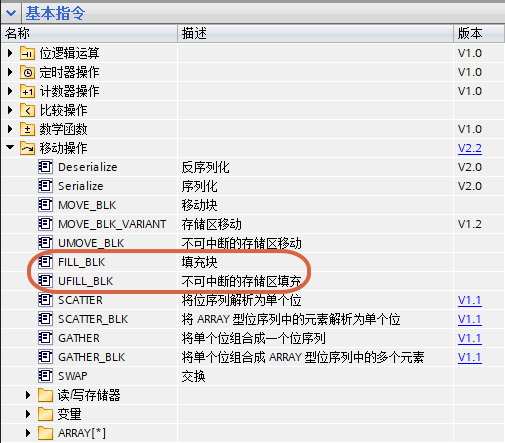
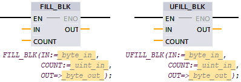
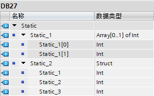
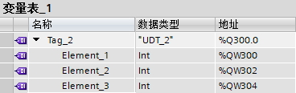
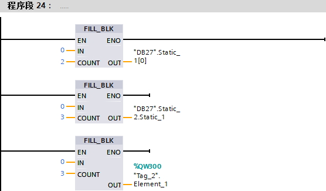

# (U)FILL_BLK

## (U)FILL_BLK指令

LAD和SCL均为(U)FILL_BLK指令。

(U)FILL_BLK指令是当EN条件满足时，实现用输入变量批量填充输出区域的功能。FILL_BLK和UFILL_BLK的区别是UFILL_BLK不会被中断打断，并且最多16kB的数据量。

如图1所示为指令详情，如图2所示为指令位置。

{width="505" height="443"}

图1 指令位置

{width="398" height="136"}

图2 指令详情

:::{note}

1\.IN只能是基本数据类型，或者常数，不能是Struct、UDT、DTL等复杂数据类型。

2\.OUT可以是和IN相同类型的数组中的元素，例如图3中的\"DB27\".Static_1\[0\]，TIA
博途V14之后也可以是Struct、UDT中的连续相同数据类型的变量，例如图3中的\"DB27\".Static_2.Static_1。

如果I、Q区是UDT类型的连续相同数据类型的变量，OUT也支持该变量。

此外，如果IN是常数，IN只支持OUT数据范围的常数。例如，如果OUT是INT类型，则IN的范围为-32768\~32767。

{width="310" height="194"}

图3 DB27详情

{width="368" height="116"}

图4 Q点详情

3\.COUNT是传输个数，可以是正整数的常数，如果是变量，数据类型支持USINT、UINT、UDINT。

4\.如果接收区域的变量个数小于COUNT，则只传送可接收的区域的数据。如果激活指令的ENO功能，则ENO=False。
:::

## (U)FILL_BLK的使用

实现功能：清空图3的DB27和图4的Tag_2中的所有变量，如图5所示。

{width="556" height="325"}

图5 例子程序
