### 位序列的组合与分解

位序列的组合与分解（LAD和SCL）包括如图1所示4个指令：

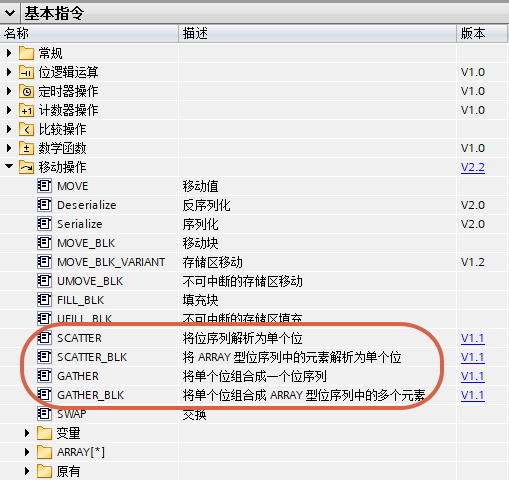{width="509" height="481"}

图1 指令位置

其中SCATTER(\_BLK)是将位序列（数组）分解成若干Bool变量，GATHER(\_BLK)是将若干Bool变量组合成位序列（数组）。

版本：

1\. TIA 博途 V14SP1开始，S7-1200 V4.2支持V1.0版本

2\. TIA 博途 V15开始，S7-1200 V4.2支持V1.1版本

#### SCATTER

{width="200" height="115"}

图2 SCATTER指令详情

V1.0版本：SCATTER指令是将位序列（Byte、Word、DWord）分解成Bool数组，其中Byte分解成8Bool元素的数组，Word分解成16Bool元素的数组，DWord分解成32Bool元素的数组。LAD需要在下拉框"???"选择输入类型（Byte、Word、DWord），SCL无需选择。IN是待分解的位序列变量，OUT是Bool数组名，元素数量必须正好符合要求。

V1.1版本：OUT除Bool数组之外，可以是Struct、UDT类型的变量，变量内是连续的8Bool、16Bool、32Bool，OUT处填写Struct、UDT类型的变量名。

注：LAD版本的SCATTER，如果调用该块的OB\\FB\\FC如果没有激活IEC检查，IN变量支持整数、字符、TIME、DATE、TOD类型。

使用举例，如图3-5所示：

1\. 将Word变量\"DB66\".Static_1分解成Array\[0..15\] of
Bool变量\"DB66\".Static_2，将Byte变量\"DB66\".Static_3分解成UDT中的连续8个Bool变量Tag_3

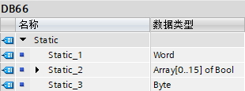{width="310" height="116"}

图3 DB66的定义

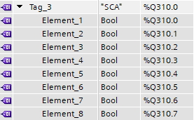{width="277" height="171"}

图4 Q点在PLC变量表的定义

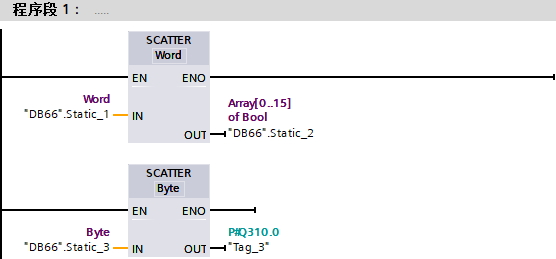{width="556" height="259"}

图5 程序详情

#### SCATTER_BLK

{width="246" height="152"}

图6 SCATTER_BLK指令详情

V1.0版本：SCATTER_BLK指令是将位序列（Byte、Word、DWord）数组分解成Bool数组。LAD需要在下拉框选择输入数组IN的类型（Byte、Word、DWord），COUNT_IN的类型（USInt、UInt、UDInt），SCL无需选择。IN是待分解的位序列数组起始元素，COUNT_IN是待分解的位序列数组元素个数，OUT是接收的Bool数组起始元素。

V1.1版本：OUT除Bool数组之外，可以是Struct、UDT类型的变量，变量内是连续的Bool变量，OUT处填写Struct、UDT类型内的接收的Bool起始变量。

注意：

1\.
当COUNT_IN超过了位序列数组元素个数，将不执行指令。如果激活指令的ENO功能，则ENO=False。

2\. 当所需的Boo数量超过了已有的Bool数量，指令正常执行，多余部分被舍弃。

3\. 当Bool数组起始

使用举例，如图7-8所示：

1\.
将\"DB67\".Static_1，从第3个元素开始的2个Byte变量分解成\"DB67\".Static_2，从第1个元素开始

2\.
将\"DB67\".Static_3，从第1个元素开始的2个Byte变量变量分解成\"DB67\".Static_4，从这个Struct第一个变量开始

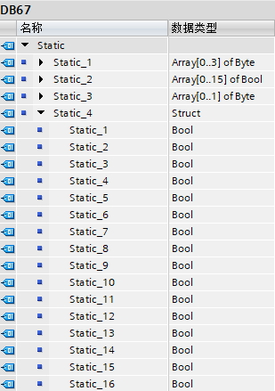{width="309" height="439"}

图7 DB67中的定义

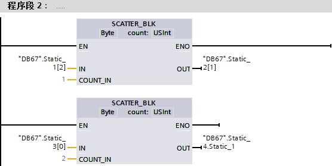{width="556" height="279"}

图8 程序详情

#### GATHER

{width="169" height="115"}

图9 GATHER指令详情

V1.0版本：GATHER指令是将Bool数组合并成位序列（Byte、Word、DWord），其中8Bool元素的数组合并成Byte，16Bool元素的数组合并成Word，32Bool元素的数组合并成DWord。LAD需要在下拉框选择输出类型（Byte、Word、DWord），SCL无需选择。IN是Bool数组名，元素数量必须正好符合要求，OUT是合并后的位序列变量。

V1.1版本：IN除Bool数组之外，可以是Struct、UDT类型的变量，变量内是连续的8Bool、16Bool、32Bool，OUT处填写Struct、UDT类型的变量名。

使用举例，如图10-12所示：

1\. 将Array\[0..15\] of
Bool变量\"DB68\".Static_1合并成Word变量\"DB68\".Static_2，将UDT中的连续8个Bool变量Tag_4合并成Byte变量\"DB68\".Static_3

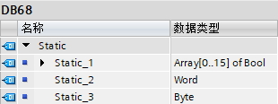{width="310" height="116"}

图10 DB68中的定义

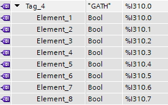{width="275" height="172"}

图11 I点在PLC变量表的定义

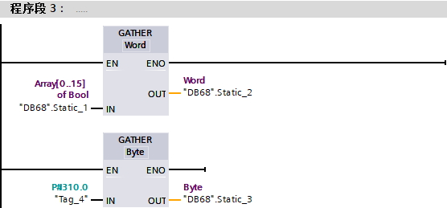{width="556" height="259"}

图12 程序详情

#### GATHER_BLK

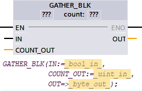{width="240" height="154"}

图13 GATHER_BLK指令详情

V1.0版本：GATHER_BLK指令是将Bool数组合并成位序列（Byte、Word、DWord）数组。LAD需要在下拉框选择输出数组OUT的类型（Byte、Word、DWord），COUNT_IN的类型（USInt、UInt、UDInt），SCL无需选择。IN是待合并的Bool数组起始元素，COUNT_IN是合并后的位序列数组元素个数，OUT是位序列数组起始元素。

V1.1版本：IN除Bool数组之外，可以是Struct、UDT类型的变量，变量内是连续的Bool变量，IN处填写Struct、UDT类型内的接收的Bool起始变量。

注意：

1\.
当COUNT_IN超过了位序列数组元素个数，将不执行指令。如果激活指令的ENO功能，则ENO=False。

2\.
当所需的Boo数量超过了已有的Bool数量，将不执行指令，如果激活指令的ENO功能，则ENO=False。

使用举例，如图14-15所示：

1\.
将\"DB69\".Static_2，从第1个Bool元素开始合并成\"DB69\".Static_1，从第3个元素开始的2个Byte变量

2\.
将\"DB69\".Static_4，从Struct第1个元素开始合并成\"DB69\".Static_3，从第1个元素开始的2个Byte变量

{width="310" height="440"}

图14 DB69中的定义

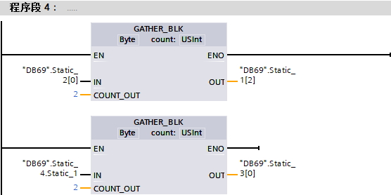{width="556" height="278"}

图15 程序详情
