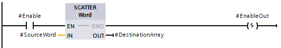
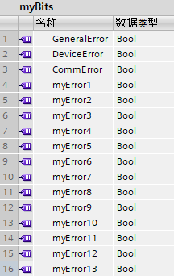
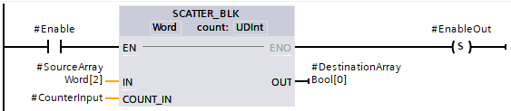
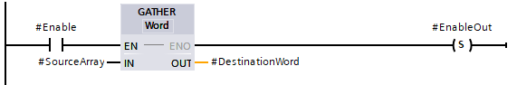

# 位序列的组合与分解

位序列的组合与分解（LAD和SCL）包括如图1所示4个指令：

{width="509" height="481"}

图1 指令位置

其中SCATTER(\_BLK)是将位序列（数组）分解成若干Bool变量，GATHER(\_BLK)是将若干Bool变量组合成位序列（数组）。

版本：

1\. TIA 博途 V14SP1开始，S7-1200 V4.2支持V1.0版本

2\. TIA 博途 V15开始，S7-1200 V4.2支持V1.1版本

## SCATTER：将位序列解析为单个位

{width="200" height="115"}

| ​LAD/FBD                                        | ​SCL                                                                 | ​说明                                                                                                                                                                                                                                                                             |
| ----------------------------------------------- | -------------------------------------------------------------------- | --------------------------------------------------------------------------------------------------------------------------------------------------------------------------------------------------------------------------------------------------------------------------------- |
| {width="200" height="115"} | SCATTER   (IN := #SourceWord,    OUT => #DestinationArray); | ​SCATTER：​“将位序列解析为单个位”​指令用于将数据类型为 Byte、Word 或 DWord 的变量解析为单个位，并保存在仅包含布尔型元素的 Bool、Struct 或 PLC 数据类型的数组中。  ​例如，可以解析状态字，并使用索引读取和改变单个位的状态。使用 GATHER，可再次将各个位组合为位序列。SCATTER |

### SCATTER 指令的数据类型

​下表列出了该指令的参数：

| ​参数 | ​声明   | ​数据类型                                                                      | ​存储区               | ​说明                                                                                                                                                                                  |
| ----- | ------- | ------------------------------------------------------------------------------ | --------------------- | -------------------------------------------------------------------------------------------------------------------------------------------------------------------------------------- |
| ​EN   | ​Input  | ​Bool                                                                          | ​I、Q、M、D、L 或常量 | ​使能输入                                                                                                                                                                              |
| ​ENO  | ​Output | ​Bool                                                                          | ​I、Q、M、D、L        | ​使能输出  ​如果满足下列条件之一，使能输出 ENO 将返回信号状态“0”：   - ​使能输入 EN 的信号状态为“0”。   - ​Array、Struct 或 PLC 数据类型中包含的 Bool 元素数目不足。 |
| ​IN   | ​Input  | ​Byte, Word, DWord                                                             | ​I、Q、M、D、L        | ​所解析的位序列  ​这些值不得位于的 I/O 区域或工艺对象的 DB 内。                                                                                                                  |
| ​OUT  | ​Output | ​Array[\*] of Bool、Struct 或 PLC 数据类型  ​ \*：8、16、32 或 64 个元素 | ​I、Q、M、D、L        | ​保存各个位的 Array、Struct 或 PLC 数据类型                                                                                                                                            |

:::{note} 

1. **多维 Array of Bool**  使用“​将位序列解析为单个位​”指令时，不允许使用多维 Array of Bool。

2. **Array、Struct 或 PLC数据类型的长度** ​Array、Struct 或 PLC 数据类型中包含的元素数目必须恰好等于位序列指定的数量。例如，如果数据类型为 Byte，则 Array、Struct 或 PLC 数据类型中必须恰好包含 8 个元素（Word = 16、Dword = 32）。
:::

### 示例：使用 Array 的 SCATTER 指令

​在块接口中创建以下变量：

|                   |                         |           |
| ----------------- | ----------------------- | --------- |
| ​变量             | ​区域                   | ​数据类型 |
| ​Enable           | ​Input                  | ​Bool     |
| ​SourceWord       | ​Word                   |
| ​EnableOut        | ​Output                 | ​Bool     |
| ​DestinationArray | ​Array\[0..15\] of Bool |

​以下示例说明了该指令的工作原理：

​下表将通过具体的操作数值对该指令的工作原理进行说明：

| ​参数 | ​操作数         | ​数据类型                                                                                        |
| ----- | --------------- | ------------------------------------------------------------------------------------------------ |
| ​IN   | ​SourceWord     | ​Word（16 位）                                                                                   |
| ​OUT  | ​DestinationUDT | ​操作数“DestinationUDT”为 PLC 数据类型 (UDT)，其中包含 16 个元素，因此与待解析 Word 的长度相同。 |

​如果操作数 #Enable 在使能输入 EN 返回信号状态“1”，则将执行该指令。数据类型为 Word 的操作数 #SourceWord 解析为单个位 (16)，并将其分配给操作数 #DestinationArray 的各个元素。如果在指令执行期间出现错误，操作数 #EnableOut 将在使能输出 ENO 处返回信号状态“0”。

### 示例：使用 PLC 数据类型 (UDT) 的 SCATTER 指令

​创建以下 PLC 数据类型“​myBits​”：

​在块接口中创建以下变量：

| ​变量           | ​区域   | ​数据类型 |
| --------------- | ------- | --------- |
| ​Enable         | ​Input  | ​Bool     |
| ​SourceWord     | ​Input  | ​Word     |
| ​EnableOut      | ​Output | ​Bool     |
| ​DestinationUDT | ​Output | ​“myBits” |

​以下示例说明了该指令的工作原理：

​下表将通过具体的操作数值对该指令的工作原理进行说明：

| ​参数 | ​操作数         | ​数据类型                                                                                        |
| ----- | --------------- | ------------------------------------------------------------------------------------------------ |
| ​IN   | ​SourceWord     | ​Word（16 位）                                                                                   |
| ​OUT  | ​DestinationUDT | ​操作数“DestinationUDT”为 PLC 数据类型 (UDT)，其中包含 16 个元素，因此与待解析 Word 的长度相同。 |

​如果操作数 #Enable 在使能输入 EN 返回信号状态“1”，则将执行该指令。数据类型为 Word 的操作数 #SourceWord 解析为单个位 (16)，并将其分配给操作数 #DestinationArray 的各个元素。如果在指令执行期间出现错误，操作数 #EnableOut 将在使能输出 ENO 处返回信号状态“0”。

## SCATTER_BLK

{width="246" height="152"}

### SCATTER_BLK：将 ARRAY of &lt;位序列&gt; 的元素解析为单个位

| ​LAD/FBD                                        | ​SCL                                                                                                                     | ​描述                                                                                                                                                                                                                                                              |
| ----------------------------------------------- | ------------------------------------------------------------------------------------------------------------------------ | ------------------------------------------------------------------------------------------------------------------------------------------------------------------------------------------------------------------------------------------------------------------ |
| {width="246" height="152"} | SCATTER_BLK   (IN:=\_byte\_in_,      COUNT\_IN:=\_uint\_in\_,      OUT=>\_bool\_out_);\_IN:=\_uint\_in\_, | ​“​将 ARRAY of &lt;位序列&gt; 的元素解析为单个位​”指令用于解析数组的一个或多个元素，并保存在 Struct、PLC 数据类型或 Array of Boolean 元素中。  ​例如，可以解析状态字，并使用索引读取和改变单个位的状态。使用 GATHER，可再次将各个位组合为位序列。SCATTER_BLK |

### SCATTER_BLK 指令的数据类型

​下表列出了该指令的参数：

| ​参数     | ​声明   | ​数据类型                                                                                                                                                | ​存储区               | ​描述                                                                                                                                                                                                                                                                                                                                                                                                                         |
| --------- | ------- | -------------------------------------------------------------------------------------------------------------------------------------------------------- | --------------------- | ----------------------------------------------------------------------------------------------------------------------------------------------------------------------------------------------------------------------------------------------------------------------------------------------------------------------------------------------------------------------------------------------------------------------------- |
| ​EN       | ​Input  | ​Bool                                                                                                                                                    | ​I、Q、M、D、L 或常量 | ​使能输入                                                                                                                                                                                                                                                                                                                                                                                                                     |
| ​ENO      | ​Output | ​Bool                                                                                                                                                    | ​I、Q、M、D、L        | ​使能输出。如果 ENO 为 FALSE，则不会将任何数据写入输出。  ​如果满足下列条件之一，使能输出 ENO 将返回信号状态“0”：  * ​使能输入 EN 的信号状态为“0”。      * ​源数组中的元素数量少于 COUNT_IN 参数中的指定数量。      * ​目标数组的索引不以 Byte、Word 或 Dword 限值开始。在这种情况下，将不向 Array of Bool 中写入任何结果。      * ​Array of Bool、Struct 或 PLC 数据类型未提供所需的元素数量。 |
| ​IN       | ​Input  | ​下列一个数组的元素：  * ​Array \[*\] of Byte      * ​Array \[*\] of Word   * ​Array \[*\] of DWord      * ​Array \[*\] of LWord | ​I、Q、M、D、L        | ​这些值不得位于的 I/O 区域或工艺对象的 DB 内。  ​在指令名称下方和左侧提供输入数组（IN 参数）的[​数据类型](#)  ​IN 参数的源数组中包含的元素数可多于 COUNT_IN 参数指定的数量。                                                                                                                                                                                                                                      |
| ​COUNT_IN | ​Input  | ​USInt, UInt, UDInt                                                                                                                                      | ​I、Q、M、D、L        | ​将解析到 OUT 参数中的源数组元素数量计数器。  ​执行“count:”后在指令名称下方提供 COUNT_IN 参数的数据类型。  ​COUNT_IN 值不得位于的 I/O 区域或工艺对象的数据库内。                                                                                                                                                                                                                                                  |
| ​OUT      | ​Output | ​下列一个数组的元素：  * ​Array \[*\] of Bool      * ​Array \[*\] of Struct      * ​Array \[*\] of &lt;PLC 数据类型&gt;                | ​I、Q、M、D、L        | ​保存各个位的 Array、Struct 或 PLC 数据类型                                                                                                                                                                                                                                                                                                                                                                                   |

:::{note}

1. **多维 Array of Bool**  ​如果数组是一个多维 Array of Bool，将对维度中的所有位进行计数。  ​示例 1：Array\[1..10,0..4,1..2\] of Bool 包含 10x5x2 位，共可解析 100 位。  ​示例 2：Array\[0..399\] of Bool 包含 400 个可解析的位。

2. **如果目标数组的 Array下限不是“0”，请注意以下几点**：  ​出于性能原因，索引必须始终以 Byte、Word 或 Dword 边界限值开始。这就意味着数组索引必须从数组的下限处开始计算。 
:::

### 示例：下限为“0”的目标数组

​在块接口中创建以下变量：

| ​变量                 | ​区域                   | ​数据类型 |
| --------------------- | ----------------------- | --------- |
| ​Enable               | ​输入                   | ​Bool     |
| ​SourceArrayWord      | ​Array\[0..5\] of Word  |
| ​CounterInput         | ​UDInt                  |
| ​EnableOut            | ​输出                   | ​Bool     |
| ​DestinationArrayBool | ​Array\[0..95\] of Bool |

​以下示例说明了该指令的工作原理：

​下表将通过具体的操作数值对该指令的工作原理进行说明：

| ​参数     | ​操作数                    | ​数据类型                                                                                                                                                                                           |
| --------- | -------------------------- | --------------------------------------------------------------------------------------------------------------------------------------------------------------------------------------------------- |
| ​IN       | ​SourceArrayWord\[2\]      | ​Array\[0..5\] of Word（可解析 96 位）。                                                                                                                                                            |
| ​COUNT_IN | ​CounterInput = 3          | ​CounterInput 值为 3 表示将解析 3 个 Word 或 48 位。这意味着目标数组中至少需包含 48 个位。                                                                                                          |
| ​OUT      | ​DestinationArrayBool\[0\] | ​操作数“DestinationArrayBool”的数据类型为 Array\[0..95\] of Bool。这表示它可以提供 96 个 Bool 元素。  ​OUT 参数必须包含足够多的元素，以保存已解析位序列的各个位；但目标存储区可能也需要更大。 |

​如果操作数 #Enable 在使能输入 EN 返回信号状态“1”，则将执行该指令。从分配给操作数 #DestinationArrayBool 各元素的第 1 个元素开始，将操作数 #SourceArrayWord 的第 3、第 4 和第 5 个 Word 解析为单个的位 (48)。如果在指令执行期间出现错误，操作数 #EnableOut 将在使能输出 ENO 处返回信号状态“0”。

### 示例：下限为“-2”的目标数组

​本例与上例相同，但将目标数组的下限设为负值，并输出到 #DestinationArrayBool\[14\] 中。

​块接口与上例中相同，只有 DestinationArrayBool 维度不同。

| ​变量                 | ​区域 | ​数据类型                |
| --------------------- | ----- | ------------------------ |
| ​DestinationArrayBool | ​输出 | ​Array\[-2..93\] of Bool |

​以下示例说明了该指令的工作原理：

​参数表与上例中相同，只有 OUT 参数不同。

| ​参数 | ​操作数                     | ​数据类型                                                                                                                                                                                                     |
| ----- | --------------------------- | ------------------------------------------------------------------------------------------------------------------------------------------------------------------------------------------------------------- |
| ​OUT  | ​DestinationArrayBool\[14\] | ​操作数“DestinationArrayBool”的数据类型为 Array\[-2..93\] of Bool。这表示它可以提供 96 个 BOOL 元素。  ​由于 DestinationArrayBool 的下限为 -2，因此 DestinationArrayBool\[14\] 是该数组的第 16 个元素。 |

## GATHER：将各个位组合为位序列

{width="169" height="115"}

| ​LAD/FBD                                        | ​SCL                                                               | ​描述                                                                                                                                                                                       |
| ----------------------------------------------- | ------------------------------------------------------------------ | ------------------------------------------------------------------------------------------------------------------------------------------------------------------------------------------- |
| {width="169" height="115"} | GATHER   (IN := #SourceArray,  OUT => #DestinationArray); | ​GATHER：“​将各个位组合为位序列​”指令用于将仅包含布尔型元素的 ARRAY of Bool、Struct 或 PLC 数据类型中的各个位组合为一个位序列。位序列保存在数据类型为 Byte、Word 或 DWord 的变量中。 GATHER |

### GATHER 指令的数据类型

​下表列出了该指令的参数：

| ​参数 | ​声明   | ​数据类型                                                                     | ​存储区               | ​描述                                                                                                                                                                                                                                                                                        |
| ----- | ------- | ----------------------------------------------------------------------------- | --------------------- | -------------------------------------------------------------------------------------------------------------------------------------------------------------------------------------------------------------------------------------------------------------------------------------------- |
| ​EN   | ​Input  | ​Bool                                                                         | ​I、Q、M、D、L 或常量 | ​使能输入                                                                                                                                                                                                                                                                                    |
| ​ENO  | ​Output | ​Bool                                                                         | ​I、Q、M、D、L        | ​使能输出  ​如果满足下列条件之一，使能输出 ENO 将返回信号状态“0”：  * ​使能输入 EN 的信号状态为“0”。      * ​Array、Struct 或 PLC 数据类型 (UDT) 中 Bool 元素的数量少于或多于位序列所指定的数量。此时，系统不传送 Bool 元素。      * ​可用的元素数少于所需的位数量。 |
| ​IN   | ​Input  | ​Array\[*\] of Bool、Struct 或 PLC 数据类型  ​*：8、16、32 或 64 个元素 | ​I、Q、M、D、L        | ​Array、Struct 或 PLC 数据类型，这些数据类型中的各个位将组合为一个位序列。  ​这些值不得位于的 I/O 区域或工艺对象的 DB 内。                                                                                                                                                             |
| ​OUT  | ​Output | ​Byte, Word, DWord                                                            | ​I、Q、M、D、L        | ​组合后的位序列，保存在一个变量中                                                                                                                                                                                                                                                            |

:::{note}

1. **多维 Array of Bool**  ​使用“​将各个位组合为位序列​”指令时，不支持多维 Array of Bool。

2. **Array、Struct 或 PLC 数据类型的长度**  ​Array、Struct 或 PLC 数据类型中包含的元素数目必须恰好等于位序列指定的数量。  ​例如，如果数据类型为 Byte，则 Array、Struct 或 PLC 数据类型中必须恰好包含 8 个元素（Word = 16、Dword = 32）。
:::

### 示例：使用 Array 的 GATHER 指令

​在块接口中创建以下变量：

| ​变量            | ​区域                   | ​数据类型 |
| ---------------- | ----------------------- | --------- |
| ​Enable          | ​输入                   | ​Bool     |
| ​SourceArray     | ​Array\[0..15\] of Bool |
| ​EnableOut       | ​输出                   | ​Bool     |
| ​DestinationWord | ​Word                   |

​以下示例说明了该指令的工作原理：

​下表将通过具体的操作数值对该指令的工作原理进行说明：

| ​参数 | ​操作数          | ​数据类型                                                                                                               |
| ----- | ---------------- | ----------------------------------------------------------------------------------------------------------------------- |
| ​IN   | ​SourceArray     | ​操作数“SourceArray”的数据类型为 Array\[0..15\] of Bool。其中包含 16 个元素，因此与需要将位进行组合的 Word 的长度相当。 |
| ​OUT  | ​DestinationWord | ​Word（16 位）                                                                                                          |

​如果操作数 #Enable 在使能输入 EN 返回信号状态“1”，则将执行该指令。操作数 #SourceArray 的各个位将组合为一个 Word。如果在指令执行期间出现错误，操作数 #EnableOut 将在使能输出 ENO 处返回信号状态“0”。

### 示例：使用 PLC 数据类型 (UDT) 的 GATHER 指令

​创建以下 PLC 数据类型“​myBits​”：

​在块接口中创建以下变量：

| ​变量            | ​区域     | ​数据类型 |
| ---------------- | --------- | --------- |
| ​Enable          | ​输入     | ​Bool     |
| ​SourceUDT       | ​“myBits” |
| ​EnableOut       | ​输出     | ​Bool     |
| ​DestinationWord | ​Word     |

​以下示例说明了该指令的工作原理：

​下表将通过具体的操作数值对该指令的工作原理进行说明：

| ​参数 | ​操作数          | ​数据类型                                                                                               |
| ----- | ---------------- | ------------------------------------------------------------------------------------------------------- |
| ​IN   | ​SourceUDT       | ​操作数“SourceUDT”为 PLC 数据类型 (UDT)，其中包含 16 个元素，因此与需要将位进行组合的 Word 的长度相当。 |
| ​OUT  | ​DestinationWord | ​Word（16 位）                                                                                          |

​如果操作数 #Enable 在使能输入 EN 返回信号状态“1”，则将执行该指令。操作数 #SourceUDT 的各个位将组合为一个 Word。如果在指令执行期间出现错误，操作数 #EnableOut 将在使能输出 ENO 处返回信号状态“0”。

## GATHER_BLK

{width="240" height="154"}

图13 GATHER_BLK指令详情

V1.0版本：GATHER_BLK指令是将Bool数组合并成位序列（Byte、Word、DWord）数组。LAD需要在下拉框选择输出数组OUT的类型（Byte、Word、DWord），COUNT_IN的类型（USInt、UInt、UDInt），SCL无需选择。IN是待合并的Bool数组起始元素，COUNT_IN是合并后的位序列数组元素个数，OUT是位序列数组起始元素。

V1.1版本：IN除Bool数组之外，可以是Struct、UDT类型的变量，变量内是连续的Bool变量，IN处填写Struct、UDT类型内的接收的Bool起始变量。

:::{note}

1\.
当COUNT_IN超过了位序列数组元素个数，将不执行指令。如果激活指令的ENO功能，则ENO=False。

2\.
当所需的Boo数量超过了已有的Bool数量，将不执行指令，如果激活指令的ENO功能，则ENO=False。
:::

使用举例，如图14-15所示：

1\.
将\"DB69\".Static_2，从第1个Bool元素开始合并成\"DB69\".Static_1，从第3个元素开始的2个Byte变量

2\.
将\"DB69\".Static_4，从Struct第1个元素开始合并成\"DB69\".Static_3，从第1个元素开始的2个Byte变量

{width="310" height="440"}

图14 DB69中的定义

{width="556" height="278"}

图15 程序详情
