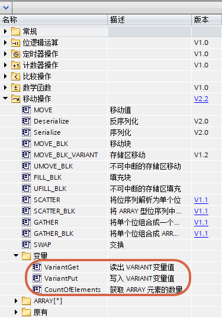
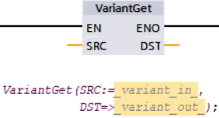
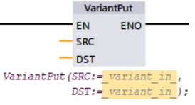
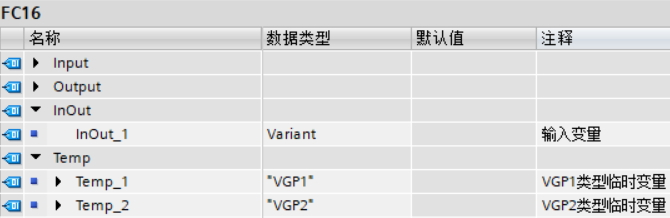
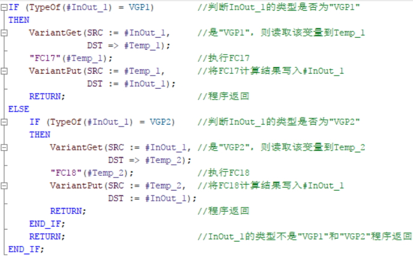
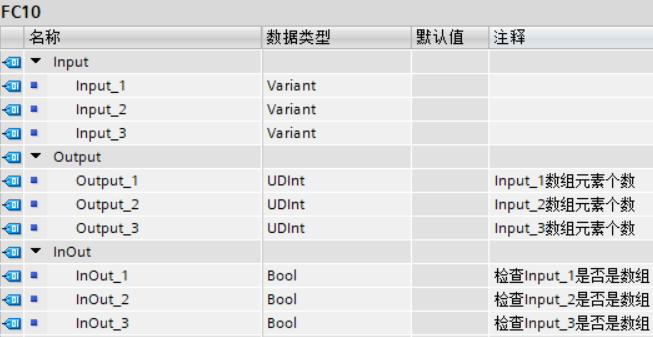
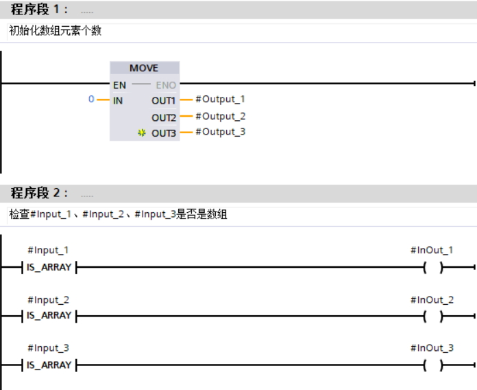
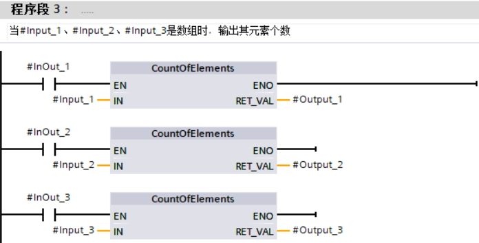
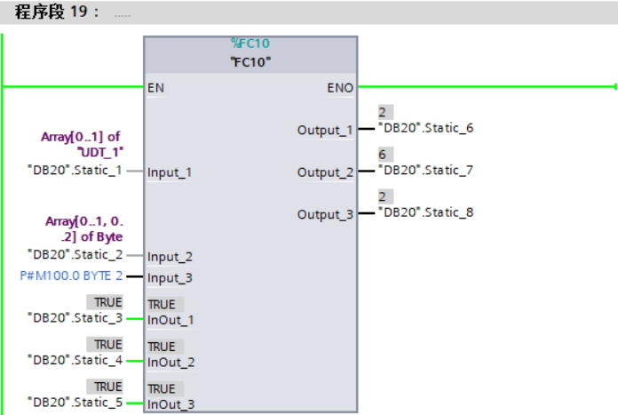

# 移动操作 - 变量指令

从TIA V13SP1 开始，S7-1200
V4.0开始，支持以下处理Variant类型的变量的指令，如图1所示。

{width="375" height="538"}

图1 指令位置

## VariantGet、VariantPut

{width="274" height="148"}

图2 VariantGet指令详情

{width="274" height="148"}

图3 VariantPut指令详情

### VariantGet

表1 VariantGet指令说明

| 参数 | 声明   | 数据类型                   | 说明         |
| ---- | ------ | -------------------------- | ------------ |
| SRC  | Input  | Variant                    | 待读取的变量 |
| DST  | Output | 基本数据类型、复杂数据类型 | 读取的结果   |

注意：DST不能是复杂数据类型的数组。

:::{note}

1\.
VariantGet的SRC是FC/FB的Input/Output/InOut/Temp以及OB的Temp中定义为Variant类型的参数。

2\.
VariantGet将Variant参数指向的变量读取到DST中，要求Variant参数指向的变量一定要和DST的变量类型相同。

3\.
建议读取之前使用IS_NULL判断Variant是否指向NULL。通过Variant判断指令确定指向的变量类型，或者数组类型。

4\.
如果双方是相同元素的数组类型，其长度可以不同，读取时只按照双方中元素少的数量读取。

5\.
如果双方类型不相同，则不会发生读取。如果激活指令的ENO功能，则ENO=False。

:::

### VariantPut

表2 VariantPut指令说明

| 参数 | 声明  | 数据类型                   | 说明         |
| ---- | ----- | -------------------------- | ------------ |
| SRC  | Input | 基本数据类型、复杂数据类型 | 待读取的变量 |
| DST  | Input | Variant                    | 读取的结果   |

注意：SRC不能是复杂数据类型的数组。

:::{note}

1\.
VariantPut的DST是FC/FB的Input/Output/InOut/Temp以及OB的Temp中定义为Variant类型的参数。

2\.
VariantPut将SRC的变量写入到Variant参数指向的变量中，要求Variant参数指向的变量一定要和SRC的变量类型相同。

3\.
VariantPut无法初始化一个Variant类型变量。所以建议写入之前使用IS_NULL判断Variant是否指向NULL。通过Variant判断指令确定指向的变量类型，或者数组类型。

4\.
如果双方是相同元素的数组类型，其长度可以不同，读取时只按照双方中元素少的数量读取。

5\.
如果双方类型不相同，则不会发生读取。如果激活指令的ENO功能，则ENO=False。
:::

使用场合：

通常，VariantGet、VariantPut用在不定长度数组，但数组长度有固定上限时，或者有多种数据类型的数组时，都会非常高效。

此外，这两个指令还可以配合DB_ANY_TO_VARIANT与VARIANT_TO_DB_ANY实现更多功能。

使用举例：

编写FC16，根据不同的输入类型，调用不同FC17和FC18，FC17的InOut为"VGP1"，FC18的InOut为"VGP2"，如图4图5所示。

{width="670" height="218"}

图4 参数设置

{width="688" height="427"}

图5 例子程序

## CountOfElements

| LAD                                            | 操作数  | 说明                                                                                                                                                                             |
| ---------------------------------------------- | ------- | -------------------------------------------------------------------------------------------------------------------------------------------------------------------------------- |
| {width="344" height="55"} | Variant | 如果操作数对应的实参为数组或者P#指针格式，该指令返回元素总个数，否则返回0。返回值RET_VAL为UDInt类型。操作数是FC/FB的Input/Output/InOut/Temp以及OB的Temp中定义Variant类型的参数。 |

CountOfElements(操作数)，操作数是FC/FB的Input/Output/InOut/Temp中定义为Variant类型的参数，如果操作数对应的实参为数组或者P#指针格式，CountOfElements(操作数)为元素总个数。

:::{note}

1\. 如果Variant指向单个变量，则返回0。

2\. 如果Variant 指向 Array of
Bool，则填充元素包含在计数中。（例如，Array\[0..1\] of Bool 将返回 8）。
:::

使用方法：

元素个数（UDInt） := CountOfElements（操作数）;

使用举例：

编写FC，检查输入的3个Variant变量类型，分别判断实参是否是数组形式，如果是则输出True，不是则输出False，此外如果是数组则输出数组元素个数，不是则输出0，如图6-9所示。

{width="653" height="337"}

图6 参数设置

{width="696" height="568"}

图7 例子程序1

{width="696" height="353"}

图8 例子程序2

{width="696" height="467"}

图9 FC10的调用

由图9中可知，Array\[0..1\] of \"UDT_1\"是数组，元素个数是2，Array\[0..1,
0..2\] of Byte是数组，该二维数组元素总个数是2×3=6，P#M100.0 BYTE
2视作数组，元素个数是2。
