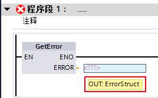
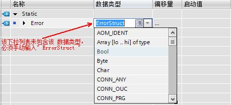
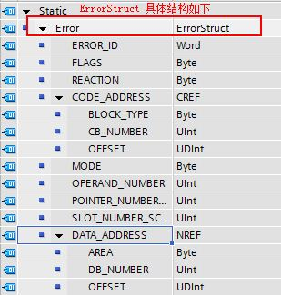
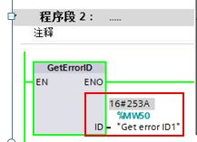
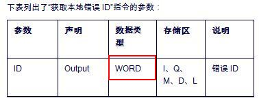
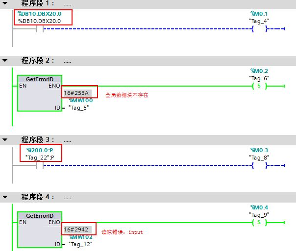
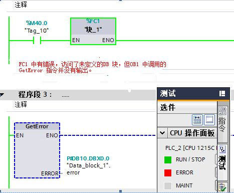

# GetError 与 GetErrorID 指令

在 STEP7 11 中，可以通过GetError （获取本地错误信息）或者GetErrorID
（获取本地错误ID ）指令查询块内出现的错误。

 请注意：GetError 和 GetErrorID
均支持块内的错误处理。当在程序块中调用GetError 或GetErrorID
指令后，如果该程序块发生错误，CPU则将忽略任何预定义的系统响应。也就是说CPU
会忽略此错误，而且CPU 的Error 灯（红色）也不会亮，CPU
也不会停机。所以说**该指令在某种程度上也起到了抑制程序错误的作用，同时有一定的风险存在。**

**建议该指令在程序块中的最后一个网络中调用，
这样可以诊断整个程序块中的错误，如果在程序中间调用该指令，则后面的程序如果有错误，CPU
也会忽略错误，不会停机，也没有相关报错，将不利于问题的诊断**。

## 1. GetError 与 GetErrorID 的调用

在编程界面下， 点击右侧 "指令-\> 基本指令-\> 程序控制操作"
中可以找到GetError及GetErrorID 两个指令。（见下图1）

{width="378" height="501"}

图1.

## 2. GerError 指令的使用

**GetError** ： 使用"获取本地错误信息"指令，可以查询块内出现的错误。
如果在块执行期间出现错误，则发生的第一个错误的详细信息将保存在输出 ERROR
中。消除第一个错误后，该指令会在Error
处输出下一个错误的信息。仅当使能输入 EN
的信号状态为"1"且显示了错误信息时，才置位"获取本地错误信息"指令的使能输出
ENO。

GetError 指令的输出参数Error
的**数据类型为**：**ErrorStruct**（见图2）,请注意：常规的变量类型中并未包含此类型。

{width="268" height="167"}

图2

**定义Error 变量的步骤：**

**1.** 需要创建一个全局数据块并定义变量，例如变量名为Error，在DB
块中**手动输入**\" Errorstruct
\"，该变量类型无法通过下拉列表选择（见图3）。

{width="472" height="214"}

图3

通常输入" E " 时就可以看见该变量类型，可以直接点选。（见图4）

{width="391" height="161"}

图4.

2\. 定义后的Error
结构如下：（见图5），详细的参数介绍请参考该指令的帮助文件。（**选中块，
按键盘上功能键 F**1 )

{width="309" height="325"}

图5.

3\. 定义完成后可以直接在引脚输入所创建的DB
块的名称，即可在下拉框中找到所定义的Error 变量( 见图6）。

{width="498" height="130"}

图6.

直接选择Error 即可完成输出参数的定义（图7）。

{width="241" height="132"}

图7.

可以通过打开DB
块，监控Error的状态判断程序是否报错。详细报错信息请参考该块的帮助（**选中块，
按键盘上功能键 F**1 )

例如: 在FC1 中编程调用一个不存在的地址 DB1.DBX0.0，此时GetError
指令执行， cpu 运行正常， 没有error 灯亮，诊断缓冲区也不会报错（ 见图8
）。

{width="511" height="314"}

图8.

  注意：在TIA Protal v11
中，如果程序中使用了未定义的变量或未创建的变量，编译将会报警，但程序可以下载,
未定义变量不能通过变量分配，见下图9。

{width="549" height="236"}

图9.

此时监控DB 块中Error 变量的状态， 根据监视值查询帮助可以知道 FC1
中调用的全局数据块 DB1 中，偏移地址0 不存在（图10）。

{width="555" height="384"}

图10.

 

## 3. GetErrorID 的使用

**GetErrorID**： 使用"获取本地错误
ID"指令（见图11），可以查询块内出现的错误。如果在块执行过程中系统信号出错，会将发生的第一个错误的
ID 保存在输出 ID 的变量中。 ID 输出中只能指定 WORD
数据类型的操作数（见图12）。
消除第一个错误后，该指令才会输出发生的下一个错误的ID。仅当"获取本地错误
ID"指令的输入的信号状态为"1"且显示了错误信息时，才置位该指令的输出。

{width="217" height="157"}

图11

{width="378" height="147"}

图12

下表列出了GetRrrorID 指令的输出参数 ID
可以输出的值对应的报错信息。（GetError
指令输出结构变量中的ErrorID适用于下表）

| ID   | ID    | 说明                               |
| ---- | ----- | ---------------------------------- |
| 0    | 0     | 无错误                             |
| 2503 | 9475  | 指针无效                           |
| 2505 | 9477  | 在用户程序中调用“Stop”指令 (SFC46) |
| 2520 | 9504  | STRING 无效                        |
| 2522 | 9506  | 读取错误：操作数超出有效范围       |
| 2523 | 9507  | 写入错误：操作数超出有效范围       |
| 2524 | 9508  | 读取错误：操作数无效               |
| 2525 | 9509  | 写入错误：操作数无效               |
| 2528 | 9512  | 读取错误：数据对齐                 |
| 2529 | 9513  | 写入错误：数据对齐                 |
| 252C | 9516  | 指针无效                           |
| 2530 | 9520  | 写入错误：数据块                   |
| 2533 | 9523  | 使用了无效指针                     |
| 2534 | 9524  | 块编号错误 FC                      |
| 2535 | 9525  | 块编号错误 FB                      |
| 2538 | 9528  | 访问错误：DB 不存在                |
| 2539 | 9529  | 访问错误：使用了错误 DB            |
| 253A | 9530  | 全局数据块不存在                   |
| 253C | 9532  | 故障信息或函数不存在               |
| 253D | 9533  | 系统函数不存在                     |
| 253E | 9534  | 故障信息或函数块不存在             |
| 253F | 9535  | 系统块不存在                       |
| 2550 | 9552  | 访问错误：DB 不存在                |
| 2551 | 9553  | 访问错误：使用了错误 DB            |
| 2575 | 9589  | 程序嵌套深度出错                   |
| 2576 | 9590  | 本地数据分配出错                   |
| 2942 | 10562 | 读取错误：Input                    |
| 2943 | 10563 | 写入错误：Output                   |

# 常问问题

{width="15" height="15"} **GetError 与GetErrorID
的区别？**

**答**：GetError 与GetErrorID 区别在于 GetError
可以得到比较详细的信息，如块编号，偏移地址等,
便于问题的快速诊断及定位。GetErrorID 指令仅输出简单报错信息。

如果程序比较复杂，建议使用GetError 指令可以更快捷的帮助查找程序错误 。

{width="15" height="15"} **是否可以在一个块中（ FC 或
FB )中不同的网络段中（Network）多次调用 GetError 或 GetError ID 指令？**

**答**：可以。在一个块中不同的网络段中调用多次GetError 指令或 GetErrorID
指令，可以诊断一个块中不同网络段中的错误（见图13）。

{width="604" height="513"}

图13.

当然也可以在一个块中的最后一个网络只调用一次，如果程序中存在多处错误，发生的第一个错误的详细信息将输出至输出参数Error
或 ID 处, 当第一个错误消失后，第二个错误的错误信息才被输出至输出参数。

{width="15" height="15"} **是否可以在 OB1
中调用GetError 或 GetError ID 指令？**

答： 可以，使用方法与在FC 或 FB 中调用类似。

**情况一：OB1 程序中出错:**

如果OB1 中的程序出错，例如调用未组态硬件的 I 地址，但未调用GetError
指令，CPU error 灯会红色闪烁，诊断缓冲区报错（见图14）， 但CPU不会停机(
仅限于CPU 固件版本v2.0 以上版本，固件版本为V1.0 的CPU
在此种情况下会停机）

{width="533" height="83"}

图14.

此时如果在OB1 中最后一条网络调用GetError 或GetErrorID
指令，则诊断缓冲区的报错信息消失， CPU 指示灯恢复正常。

**情况二： OB1 本身的网络中没有错误， 但在 OB1 中调用的块中存在错误,
例如FC1中存在错误** :

1 ) **如果OB1 中无条件调用的块例如FC1 出错,** OB1的其它网络没有错误，
FC1 中有错误但并没有调用Get Error 指令，CPU error
灯也会红色闪烁，诊断缓冲区报错（见图15），但CPU不会停机( 仅限于CPU
固件版本v2.0 以上版本，固件版本为V1.0 的CPU 在此种情况下会停机）,
**当在FC1 调用GetError 指令后， CPU 报错信息消失，指示灯恢复正常。**

{width="530" height="74"}

图15.

2 ) **如果OB1 中有条件调用块,** 例如FC1， 但FC1 在OB 1
中的执行条件没有满足，则 CPU 不会报错。一旦FC1 调用条件满足被执行，且FC1
中的错误一直存在，则CPU error 灯也会闪，诊断缓冲区报错（见图15）,
但CPU不会停机( 仅限于CPU 固件版本v2.0 以上版本，固件版本为V1.0 的CPU
在此种情况下会停机） 。

3\) 如果OB1 中调用的块FC 有错误，在OB1 中调用了GetError 指令，但出错的块
FC1 中未调用 GetError 指令，则CPU 也会出现 指示灯Error
红色闪烁，诊断缓冲器报错。见图16。

{width="467" height="385"}

图16.

**总结： 由此可见， GetErrorID 或GetError
指令是基于块的指令，只能诊断调用它的块中的错误，如果出错的程序中未调用该指令，则无法诊断该块中的错误。\
**
