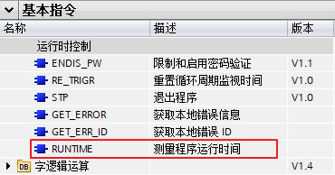
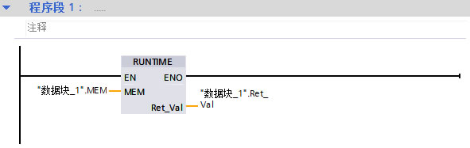
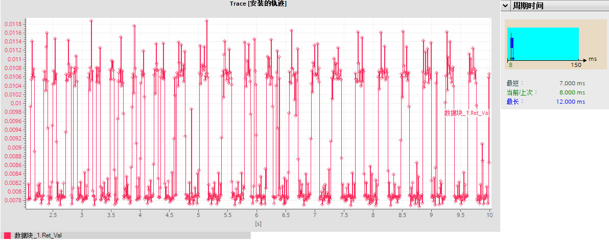
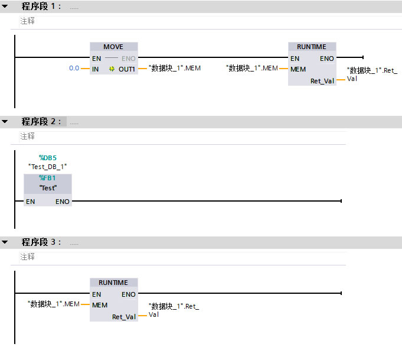
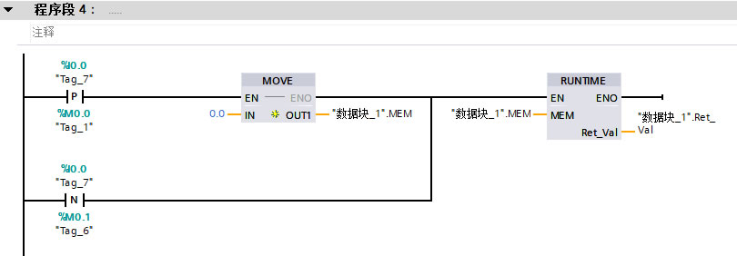

# RUNTIME 

## RUNTIME 指令概述

在 STEP 7（TIA Portal）中，可以使用 "RUNTIME" 指令来测量 S7-1200 CPU 中整个程序执行周期或单个块的运行时间，也可以测量信号接通或间隔时间。"RUNTIME" 指令在"基本指令>程序控制指令>运行时控制"菜单下，如下图1所示。指令从TIA PORTAL V13开始支持，没有CPU固件版本限制。

图1\. RUNTIME 指令

表1\. RUNTIME 指令引脚参数

| 参数  | 声明  | 数据类型 | 存储区 | 说明  |
| --- | --- | --- | --- | --- |
| EN  | Input | BOOL | I、Q、M、D、L | 使能输入 |
| ENO | Output | BOOL | I、Q、M、D、L | 使能输出 |
| MEM | Input | LREAL | I、Q、M、D、L | 用于关联 CPU 内部高频计数器值，当首次执行指令时会返回内部高频计数器值存在 MEM 中，当再次执行指令时会把上次读取的高频计数值输入到指令，内部程序通过与当前计数值比较计算后得出这两次指令执行的间隔时间，输出到RET_VAL。 |
| RET_VAL | Output | LREAL | I、Q、M、D、L | 返回两次指令执行的间隔时间，单位为秒。 |

## 主要内容和实验环境

在本应用示例中，主要介绍 RUNTIME 指令和运用此指令测量 S7-1200 程序的执行周期、某一程序块的执行时间，以及运用指令测量某信号点接通或间隔时间，使用测试环境如下所示。

**软件：**

TIA V16 Professional Update 3

**硬件：**

CPU1217C DC/DC/DC 6ES7217-1AG40-0XB0 V4.4

## 示例程序

**示例1: 用 "RUNTIME" 指令测量 S7-1200 程序的执行周期**

测量整个程序的执行周期，可在 OB1 中首个程序段调用指令 “RUNTIME”，如图 2 所示。第一个扫描周期调用时开始测量，在第二次调用后输出 RET_VAL 将返回上一周期的时间，依次类推，每次的返回值即为上一周期的执行时间。测量的运行时间包括程序执行过程中可能运行的所有 CPU 进程，比如由较高级别事件或通信引起的中断。 如图 3 可以通过 TRACE 功能监控每个周期的时间，与 CPU 的在线诊断中统计的时间基本一致。

图2\. 测量程序

图3\. 测量执行周期

**示例2**：**用 "RUNTIME" 指令测量 S7-1200 某一程序块的执行时间**

测量某一程序块的运行时间，需要三个单独的程序段。首次调用 RUNTIME 指令前先初始化 MEM 变量，执行后得出时间测量的起始点。然后在下一个程序段中调用所需的程序块。最后再次调用 RUNTIME 指令并将相同的存储器分配给 MEM 参数，与第一次调用指令时参数分配完全一样。第三个程序段中的 RUNTIME 指令将把第一个程序段中得出的内部计数器值与本次执行得出的内部计数值比较计算后得出两个指令执行的间隔时间，也就是中间程序块的执行时间。

图4\. 测量程序块

**示例3**：**用 "RUNTIME" 指令测量某一信号点的接通或间隔时间**

测量某个信号的接通时间，如图 2 所示。分别在信号的上升沿和下降沿执行一次 RUNTIME 指令，检测到上升沿后初始化 MEM 变量，得出起始测量点，检测下降沿后再次执行 RUNTIME 指令，通过两次执行指令得出内部计数器之间差值，进而得出信号的接通时间。两个信号间隔时间的测量也是同样原理，在两个信号处分别执行 RUNTIME 指令后得出间隔时间。如果担心 OB1 周期的影响，也可把程序放到硬件中断或是循环中断中执行。

图5\. 测量信号程序