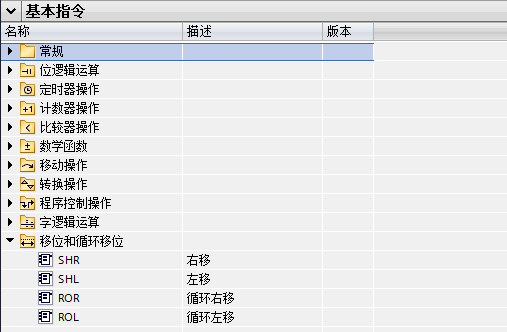
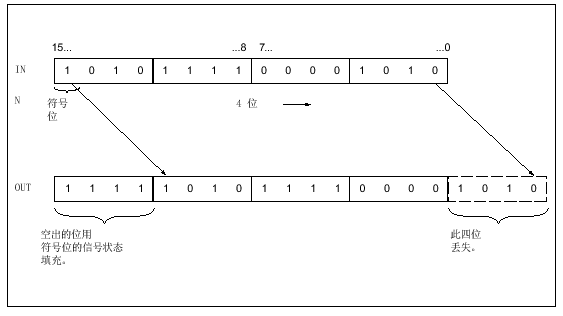
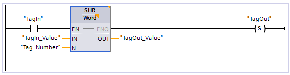
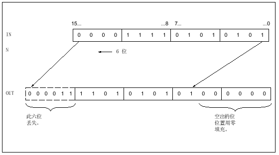
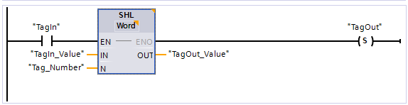
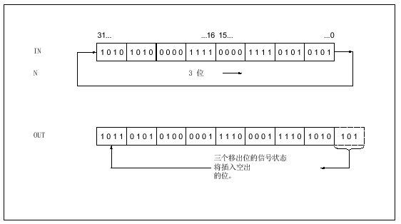
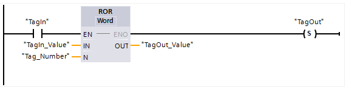
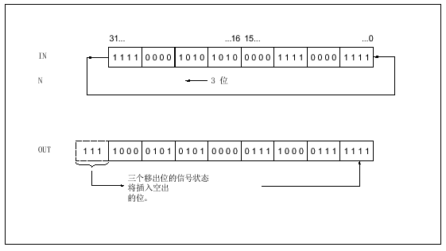
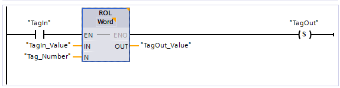

# 移位和循环指令

可以在基本指令目录下移位和循环移位文件夹中调用SHR右移、SHL左移、ROR循环右移、ROL循环左移指令。

{width="507" height="332"}

## SHR指令

可以使用"右移"指令将输入 IN 中操作数的内容按位向右移位，并在输出 OUT
中查询结果。 参数 N 用于指定将指定值移位的位数。当参数 N
的值为"0"时，输入 IN 的值将复制到输出 OUT 中的操作数中。如果参数 N
的值大于可用位数，则输入 IN
中的操作数值将向右移动可用位数个位。无符号值(如：UInt,Word)移位时，用零填充操作数左侧区域中空出的位。
如果指定值有符号(如：Int)，则用符号位的信号状态填充空出的位。可以从指令框的"???下拉列表中选择该指令的数据类型。下图说明了如何将整数数据类型操作数的内容向右移动
4 位：

{width="563" height="316"}

**示例**

以下示例说明了该指令的工作原理：

{width="574" height="149"}

| 参数 | 操作数       | 值                  |
| ---- | ------------ | ------------------- |
| IN   | TagIn_Value  | 0011 1111 1010 1111 |
| N    | TagNumber    | 3                   |
| OUT  | TagOut_Value | 0000 0111 1111 0101 |

如果操作数"TagIn"的信号状态为"1"，则将执行"右移"指令。
"TagIn_Value"操作数的内容将向右移动 3 位。
结果发送到输出"TagOut_Value"中。 如果该指令执行成功，则使能输出 ENO
的信号状态为"1"，同时置位输出"TagOut"。

## SHL指令

可以使用"左移"指令将输入 IN 中操作数的内容按位向左移位，并在输出 OUT
中查询结果。 参数 N 用于指定将指定值移位的位数。当参数 N
的值为"0"时，输入 IN 的值将复制到输出 OUT 中的操作数中。如果参数 N
的值大于可用位数，则输入 IN
中的操作数值将向左移动可用位数个位。用零填充操作数右侧部分因移位空出的位。可以从指令框的"???下拉列表中选择该指令的数据类型。

下图说明了如何将 WORD 数据类型操作数的内容向左移动 6 位：

{width="560" height="312"}

**示例**

以下示例说明了该指令的工作原理：

{width="571" height="147"}

| 参数 | 操作数       | 值                  |
| ---- | ------------ | ------------------- |
| IN   | TagIn_Value  | 0011 1111 1010 1111 |
| N    | TagNumber    | 4                   |
| OUT  | TagOut_Value | 1111 1010 1111 0000 |

如果操作数"TagIn"的信号状态为"1"，则执行"左移"指令。
操作数"TagIn_Value"的内容将向左移动 4 位。
结果发送到输出"TagOut_Value"中。 如果该指令执行成功，则使能输出 ENO
的信号状态为"1"，同时置位输出"TagOut"。

## ROR指令

可以使用"循环右移"指令将输入 IN 中操作数的内容按位向右循环移位，并在输出
OUT 中查询结果。 参数 N 用于指定循环移位中待移动的位数。
用移出的位填充因循环移位而空出的位。当参数 N 的值为"0"时，输入 IN
的值将复制到输出 OUT 中的操作数中。如果参数 N 的值大于可用位数，则输入
IN
中的操作数值仍会循环移动指定位数。可以从指令框的"???下拉列表中选择该指令的数据类型。

下图显示了如何将 DWORD 数据类型操作数的内容向右循环移动 3 位：

{width="562" height="314"}

**示例**

以下示例说明了该指令的工作原理：

{width="570" height="144"}

| 参数 | 操作数       | 值                  |
| ---- | ------------ | ------------------- |
| IN   | TagIn_Value  | 0000 1111 1001 0101 |
| N    | TagNumber    | 5                   |
| OUT  | TagOut_Value | 1010 1000 0111 1100 |

如果操作数"TagIn"的信号状态为"1"，则将执行"循环右移"指令。
"TagIn_Value"操作数的内容将向右循环移动 5 位。
结果发送到输出"TagOut_Value"中。 如果该指令执行成功，则使能输出 ENO
的信号状态为"1"，同时置位输出"TagOut"。

## ROL指令

可以使用"循环左移"指令将输入 IN 中操作数的内容按位向左循环移位，并在输出
OUT 中查询结果。参数 N
用于指定循环移位中待移动的位数。用移出的位填充因循环移位而空出的位。当参数
N 的值为"0"时，输入 IN 的值将复制到输出 OUT 中的操作数中。如果参数 N
的值大于可用位数，则输入 IN
中的操作数值仍会循环移动指定位数。可以从指令框的"???下拉列表中选择该指令的数据类型。

下图显示了如何将 DWORD 数据类型操作数的内容向左循环移动 3 位：

{width="561" height="316"}

**示例**

以下示例说明了该指令的工作原理：

{width="575" height="150"}

| 参数 | 操作数       | 值                  |
| ---- | ------------ | ------------------- |
| IN   | TagIn_Value  | 1010 1000 1111 0110 |
| N    | TagNumber    | 5                   |
| OUT  | TagOut_Value | 0001 1110 1101 0101 |

如果输入"TagIn"的信号状态为"1"，则执行"循环左移"指令。
"TagIn_Value"操作数的内容将向左循环移动 5 位。
结果发送到输出"TagOut_Value"中。 如果该指令执行成功，则使能输出 ENO
的信号状态为"1"，同时置位输出"TagOut"。
