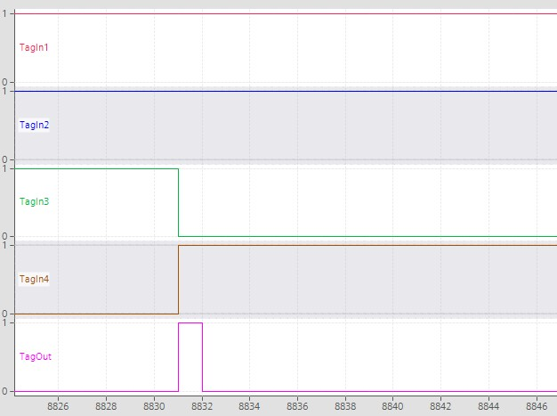
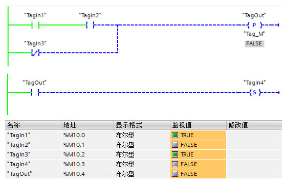
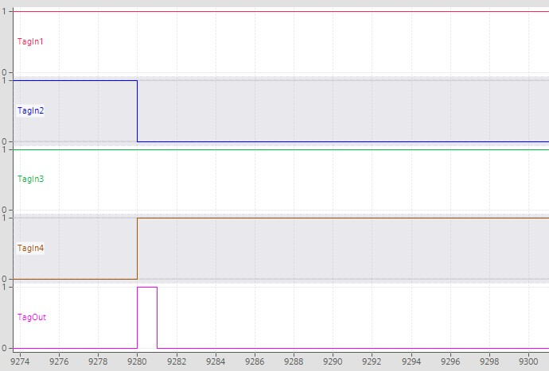
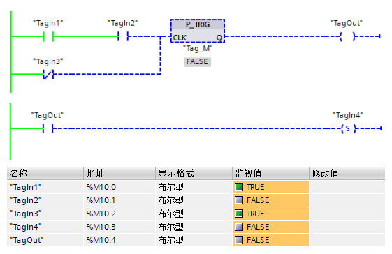
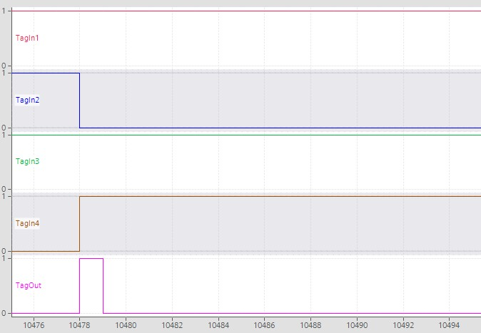

### 沿指令

S7-1200
CPU中有多种沿检测指令，这些指令可以用于变量或者逻辑运算结果（RLO）的上升沿、下降沿检测，指令位置如图1所示，指令说明如表1所示。

{width="439" height="550"}

图1、沿指令位置

+-----------------------+-----------------------+-----------------------+
| LAD                   | SCL                   | 说明                  |
+=======================+=======================+=======================+
| {width="94" |                       | 作数的信号上升沿。**  |
| height="87"}          |                       |                       |
|                       |                       | 在触点分配的 \"IN\"   |
|                       |                       | 位                    |
|                       |                       | 上检测到正跳变（0-\>  |
|                       |                       | 1）时，该触点的状态为 |
|                       |                       | T                     |
|                       |                       | RUE。该触点逻辑状态随 |
|                       |                       | 后与能流输入状态组合  |
|                       |                       | 以设置能流输出状态。P |
|                       |                       | 触点可                |
|                       |                       | 以放置在程序段中除分  |
|                       |                       | 支结尾外的任何位置。  |
|                       |                       |                       |
|                       |                       | [                     |
|                       |                       | **指令说明链接**](#a) |
+-----------------------+-----------------------+-----------------------+
| {width="83" |                       | 作数的信号下降沿。**  |
| height="91"}          |                       |                       |
|                       |                       | 在触点分配的 \"IN\"   |
|                       |                       | 位                    |
|                       |                       | 上检测到负跳变（1-\>  |
|                       |                       | 0）时，该触点的状态为 |
|                       |                       | T                     |
|                       |                       | RUE。该触点逻辑状态随 |
|                       |                       | 后与能流输入状态组合  |
|                       |                       | 以设置能流输出状态。N |
|                       |                       | 触点可                |
|                       |                       | 以放置在程序段中除分  |
|                       |                       | 支结尾外的任何位置。  |
|                       |                       |                       |
|                       |                       | [                     |
|                       |                       | **指令说明链接**](#b) |
+-----------------------+-----------------------+-----------------------+
| {width="104" |                       | 上升沿置位操作数。**  |
| height="83"}          |                       |                       |
|                       |                       | 在进入线圈            |
|                       |                       | 的能流中检测到正跳变  |
|                       |                       | （0-\>1）时，分配的位 |
|                       |                       | \"OUT\" 为            |
|                       |                       | TRUE。能流            |
|                       |                       | 输入状态总是通过线圈  |
|                       |                       | 后变为能流输出状态。P |
|                       |                       | 线圈可以放置在        |
|                       |                       | 程序段中的任何位置。  |
|                       |                       |                       |
|                       |                       | [                     |
|                       |                       | **指令说明链接**](#c) |
+-----------------------+-----------------------+-----------------------+
| {width="101" |                       | 下降沿置位操作数。**  |
| height="84"}          |                       |                       |
|                       |                       | 在进入线圈            |
|                       |                       | 的能流中检测到负跳变  |
|                       |                       | （1-\>0）时，分配的位 |
|                       |                       | \"OUT\" 为            |
|                       |                       | TRUE。能流            |
|                       |                       | 输入状态总是通过线圈  |
|                       |                       | 后变为能流输出状态。N |
|                       |                       | 线圈可以放置在        |
|                       |                       | 程序段中的任何位置。  |
|                       |                       |                       |
|                       |                       | [                     |
|                       |                       | **指令说明链接**](#d) |
+-----------------------+-----------------------+-----------------------+
| {width="160" |                       | RLO（逻辑运算结       |
| height="82"}          |                       | 果）的信号上升沿。**  |
|                       |                       |                       |
|                       |                       | 在 \"CLK\"            |
|                       |                       | 能流输入中检测到      |
|                       |                       | 正跳变（0-\>1）时，Q  |
|                       |                       | 输                    |
|                       |                       | 出能流或者逻辑状态为  |
|                       |                       | TRUE。 P_TRIG         |
|                       |                       | 指令不能放置在        |
|                       |                       | 程序段的开头或结尾。  |
|                       |                       |                       |
|                       |                       | [                     |
|                       |                       | **指令说明链接**](#e) |
+-----------------------+-----------------------+-----------------------+
| {width="140" |                       | RLO（逻辑运算结果     |
| height="84"}          |                       | ）的的信号下降沿。**  |
|                       |                       |                       |
|                       |                       | 在 \"CLK\"            |
|                       |                       | 能流输入中检测到      |
|                       |                       | 负跳变（1-\>0）时，Q  |
|                       |                       | 输                    |
|                       |                       | 出能流或者逻辑状态为  |
|                       |                       | TRUE。 N_TRIG         |
|                       |                       | 指令不能放置在        |
|                       |                       | 程序段的开头或结尾。  |
|                       |                       |                       |
|                       |                       | [                     |
|                       |                       | **指令说明链接**](#f) |
+-----------------------+-----------------------+-----------------------+
| {width="150" | 7-08.png){width="213" | 号上升沿置位变量。**  |
| height="99"}          | height="77"}          |                       |
|                       |                       | 分配                  |
|                       |                       | 的背景数据块用于存储  |
|                       |                       | CLK                   |
|                       |                       | 输入的前一状态。在    |
|                       |                       | CLK 能流输入 (LAD)    |
|                       |                       | 中检测到              |
|                       |                       | 正跳变（0-\>1）时，Q  |
|                       |                       | 输                    |
|                       |                       | 出能流或者逻辑状态为  |
|                       |                       | TRUE。在 LAD          |
|                       |                       | 中，R_TRIG            |
|                       |                       | 指令不能放置在        |
|                       |                       | 程序段的开头或结尾。  |
|                       |                       |                       |
|                       |                       | [                     |
|                       |                       | **指令说明链接**](#g) |
+-----------------------+-----------------------+-----------------------+
| {width="148" | 7-10.png){width="213" | 号下降沿置位变量。**  |
| height="103"}         | height="81"}          |                       |
|                       |                       | 分配                  |
|                       |                       | 的背景数据块用于存储  |
|                       |                       | CLK                   |
|                       |                       | 输入的前一状态。在    |
|                       |                       | CLK 能流输入 (LAD)    |
|                       |                       | 中检测到              |
|                       |                       | 负跳变（1-\>0）时，Q  |
|                       |                       | 输                    |
|                       |                       | 出能流或者逻辑状态为  |
|                       |                       | TRUE。 在 LAD         |
|                       |                       | 中，F_TRIG            |
|                       |                       | 指令不能放置在        |
|                       |                       | 程序段的开头或结尾。  |
|                       |                       |                       |
|                       |                       | [                     |
|                       |                       | **指令说明链接**](#h) |
+-----------------------+-----------------------+-----------------------+

表1、沿指令说明

### 沿指令使用

#### []{#a}---\|P\|---：扫描操作数的信号上升沿

\<操作数 1\>\
  ---\|P\|---\
\<操作数 2\>

使用该指令，可以确定\<操作数 1\>的信号状态是否从"0"变为"1"。该指令将比较
\<操作数 1\> 的当前信号状态与 \<操作数 1\> 上一次扫描的信号状态，
\<操作数 1\> 上一次扫描的信号状态保存在边沿存储位\<操作数 2\>中。

如果 \<操作数 1\> 上一次扫描信号状态（\<操作数 2\>）为"0"，\<操作数
1\>当前信号状态为"1"，则检测到\<操作数 1\>信号的上升沿。

指令参数如表2所示，指令的使用示例如图2-4所示。

  参数           声明    数据类型   存储区                说明
  -------------- ------- ---------- --------------------- --------------------------------------
  \<操作数 1\>   Input   Bool       I、Q、M、D、L或常量   要扫描的信号
  \<操作数 2\>   InOut   Bool       I、Q、M、D、L         保存上一次查询的信号状态的边沿存储位

表2、扫描操作数的信号上升沿指令参数

{width="565" height="392"}

图2、扫描操作数的信号上升沿示例

{width="567" height="382"}

图3、扫描操作数的信号上升沿示例

{width="707" height="471"}

图4、扫描操作数的信号上升沿示例 Trace 轨迹

在上述示例中，TagIn3为\<操作数 1\>，Tag_M为\<操作数
2\>，当操作数"TagIn1"、"TagIn2"的信号状态为1时，当TagIn3信号状态从"0"变为"1"时，即检测到TagIn3的上升沿，此时将操作数"TagOut"置位为"1"一个周期，通过"TagOut"将"TagIn4"置位为"1"。

#### []{#b}---\|N\|---：扫描操作数的信号下降沿

\<操作数 1\>\
  ---\|N\|---\
\<操作数 2\>

使用该指令，可以确定\<操作数 1\>的信号状态是否从"1"变为"0"。该指令将比较
\<操作数 1\> 的当前信号状态与 \<操作数 1\> 上一次扫描的信号状态，
\<操作数 1\> 上一次扫描的信号状态保存在边沿存储器位 \<操作数 2\> 中。

如果 \<操作数 1\> 上一次扫描信号状态（\<操作数 2\>）为"1"，\<操作数
1\>当前信号状态为"0"，则检测到\<操作数 1\>信号的下降沿。

指令参数如表3所示，指令的使用示例如图5-7所示。

  参数           声明    数据类型   存储区                说明
  -------------- ------- ---------- --------------------- --------------------------------------
  \<操作数 1\>   Input   Bool       I、Q、M、D、L或常量   要扫描的信号
  \<操作数 2\>   InOut   Bool       I、Q、M、D、L         保存上一次查询的信号状态的边沿存储位

表3、扫描操作数的信号下降沿指令参数

{width="566" height="359"}

图5、扫描操作数的信号下降沿示例

{width="562" height="374"}

图6、扫描操作数的信号下降沿示例

{width="626" height="467"}

图7、扫描操作数的信号下降沿示例 Trace g轨迹

在上述示例中，TagIn3为\<操作数 1\>，Tag_M为\<操作数
2\>，当操作数"TagIn1"、"TagIn2""的信号状态为1时，当TagIn3信号状态从"1"变为"0"时，即检测到TagIn3的下降沿，此时将操作数"TagOut"置位为"1"一个周期，通过"TagOut"将"TagIn4"置位为"1"。

#### []{#c}---(P)---：在信号上升沿置位操作数

\<操作数 1\>\
   ---(P)---\
\<操作数 2\>

可以使用该指令在逻辑运算结果 (RLO) 从\"0\"变为\"1\"时置位\<操作数
1\>。该指令将比较 RLO 的当前信号状态与 RLO 上一次扫描的信号状态， RLO
上一次扫描的信号状态保存在边沿存储器位 \<操作数 2\> 中。

如果上一次扫描的 RLO （\<操作数 2\>）为"0"，当前 RLO
信号状态为"1"，则说明出现了一个信号上升沿。检测到信号上升沿时，\<操作数
1\>
的信号状态将在一个程序周期内保持置位为"1"。在其它任何情况下，\<操作数
1\>的信号状态均为"0"。

指令参数如表4所示，指令的使用示例如图8-10所示。

  参数           声明     数据类型   存储区          说明
  -------------- -------- ---------- --------------- --------------------------------------
  \<操作数 1\>   Output   Bool       I、Q、M、D、L   上升沿置位的操作数
  \<操作数 2\>   InOut    Bool       I、Q、M、D、L   保存上一次查询的信号状态的边沿存储位

表4、在信号上升沿置位操作数指令参数

{width="561" height="361"}

图8、在信号上升沿置为操作数示例

{width="563" height="374"}

图9、在信号上升沿置为操作数示例

{width="662" height="467"}

图10、在信号上升沿置为操作数示例 Trace 轨迹

在上述示例中，"TagOut"为\<操作数 1\>，\"Tag_M\"为\<操作数
2\>，当操作数"TagIn1"、"TagIn2"、"TagIn3"的逻辑运算结果 (RLO)
从"0"变为"1"时，则将操作数"TagOut"置位一个程序周期，通过"TagOut"将"TagIn4"置位为"1"，然后"TagOut"又变为"0"。在其它任何情况下，操作数"TagOut"的信号状态均为"0"。

#### []{#d}---(N)---：在信号下降沿置位操作数

\<操作数 1\>\
  ---(N)---\
\<操作数 2\>

可以使用该指令在逻辑运算结果 (RLO) 从\"1\"变为\"0\"时置位\<操作数
1\>。该指令将比较 RLO 的当前信号状态与 RLO 上一次扫描的信号状态， RLO
上一次扫描的信号状态保存在边沿存储器位 \<操作数 2\> 中。

如果上一次扫描的 RLO （\<操作数 2\>）为"1"，当前 RLO
信号状态为"0"，则说明出现了一个信号下降沿。检测到信号下降沿时，\<操作数
1\>
的信号状态将在一个程序周期内保持置位为"1"。在其它任何情况下，\<操作数
1\>的信号状态均为"0"。

指令参数如表5所示，指令的使用示例如图11-13所示。

  参数           声明     数据类型   存储区          说明
  -------------- -------- ---------- --------------- --------------------------------------
  \<操作数 1\>   Output   Bool       I、Q、M、D、L   下降沿置位的操作数
  \<操作数 2\>   InOut    Bool       I、Q、M、D、L   保存上一次查询的信号状态的边沿存储位

表5、在信号下降沿置位操作数指令参数

{width="564" height="376"}

图11、在信号下降沿置为操作数示例

{width="565" height="375"}

图12、在信号下降沿置为操作数示例

{width="558" height="463"}

图13、在信号下降沿置为操作数示例 Trace 轨迹

在上述示例中，"TagOut"为\<操作数 1\>，\"Tag_M\"为\<操作数
2\>，当操作数"TagIn1"、"TagIn2"、"TagIn3"的逻辑运算结果 (RLO)
从"1"变为"0"时，则将操作数"TagOut"置位一个程序周期，通过"TagOut"将"TagIn4"置位为"1"，然后"TagOut"又变为"0"。在其它任何情况下，操作数"TagOut"的信号状态均为"0"。

#### []{#e}P_TRIG: 扫描 RLO 的信号上升沿

{width="156" height="58"}\
           \<操作数\>

可以使用该指令在 CLK 从\"0\"变为\"1\"时置位输出 Q。该指令将比较 CLK
的当前信号状态与 CLK 上一次扫描的信号状态， CLK
上一次扫描的信号状态保存在边沿存储器位 \<操作数\> 中。

如果上一次扫描的 CLK （\<操作数 \>）为"0"，当前 CLK
信号状态为"1"，则说明出现了一个信号上升沿。检测到信号上升沿时，输出 Q
信号状态将在一个程序周期内保持置位为"1"。在其它任何情况下，输出 Q
的信号状态均为"0"。

指令参数如表6所示，指令的使用示例如图14-16所示。

  参数         声明     数据类型   存储区                说明
  ------------ -------- ---------- --------------------- --------------------------------------
  CLK          Input    Bool       I、Q、M、D、L或常量   当前逻辑运算结果 (RLO)
  \<操作数\>   InOut    Bool       I、Q、M、D、L         保存上一次查询的信号状态的边沿存储位
  Q            Output   Bool       I、Q、M、D、L         边沿检测的结果

表6、扫描 RLO 的信号上升沿指令参数

{width="561" height="364"}

图14、扫描 RLO 的信号上升沿示例

{width="563" height="372"}

图15、扫描 RLO 的信号上升沿示例

{width="649" height="465"}

图16、扫描 RLO 的信号上升沿示例 Trace 轨迹

在上述示例中，当操作数"TagIn1"、"TagIn2"、"TagIn3"的逻辑运算结果 (RLO)
即 CLK 输入从"0"变为"1"时，该指令输出 Q
将立即返回状态"1"一个程序周期，此时将操作数"TagOut"置位为一个程序周期，通过"TagOut"将"TagIn4"置位为"1"。

#### []{#f}N_TRIG: 扫描 RLO 的信号下降沿

{width="145" height="59"}\
           \<操作数\>

可以使用该指令在 CLK 从\"1\"变为\"0\"时置位输出 Q。该指令将比较 CLK
的当前信号状态与 CLK 上一次扫描的信号状态， CLK
上一次扫描的信号状态保存在边沿存储器位 \<操作数\> 中。

如果上一次扫描的 CLK （\<操作数 \>）为"1"，当前 CLK
信号状态为"0"，则说明出现了一个信号下降沿。检测到信号下降沿时，输出 Q
信号状态将在一个程序周期内保持置位为"1"。在其它任何情况下，输出 Q
的信号状态均为"0"。

指令参数如表7所示，指令的使用示例如图17-19所示。

  参数         声明     数据类型   存储区                说明
  ------------ -------- ---------- --------------------- --------------------------------------
  CLK          Input    Bool       I、Q、M、D、L或常量   当前逻辑运算结果 (RLO)
  \<操作数\>   InOut    Bool       I、Q、M、D、L         保存上一次查询的信号状态的边沿存储位
  Q            Output   Bool       I、Q、M、D、L         边沿检测的结果

表7、扫描 RLO 的信号下降沿指令参数

{width="564" height="368"}

图17、扫描 RLO 的信号下降沿示例

{width="565" height="368"}

图18、扫描 RLO 的信号下降沿示例

{width="603" height="464"}

图19、扫描 RLO 的信号下降沿示例 Trace 轨迹

在上述示例中，当操作数"TagIn1"、"TagIn2"、"TagIn3"的逻辑运算结果 (RLO)
即 CLK 输入从"1"变为"0"时，该指令输出 Q
将立即返回状态"1"一个程序周期，此时将操作数"TagOut"置位为一个程序周期，通过"TagOut"将"TagIn4"置位为"1"。

#### []{#g}R_TRIG: 检查信号上升沿

{width="150" height="99"}

可以使用该指令在 CLK 从\"0\"变为\"1\"时置位输出 Q。该指令将比较 CLK
的当前信号状态与 CLK 上一次扫描的信号状态， CLK
上一次扫描的信号状态保存在背景数据块中。

如果上一次扫描的 CLK （保存在背景数据块）为"0"，当前 CLK
信号状态为"1"，则说明出现了一个信号上升沿。检测到信号上升沿时，输出 Q
信号状态将在一个程序周期内保持置位为"1"。在其它任何情况下，输出 Q
的信号状态均为"0"。

指令参数如表8所示，指令的使用示例如图20-22所示。

  参数   声明     数据类型   存储区                说明
  ------ -------- ---------- --------------------- ------------------------
  EN     Input    Bool       I、Q、M、D、L或常量   使能输入
  ENO    Output   Bool       I、Q、M、D、L         使能输出
  CLK    Input    Bool       I、Q、M、D、L或常量   当前逻辑运算结果 (RLO)
  Q      Output   Bool       I、Q、M、D、L         边沿检测的结果

表8、检查信号上升沿指令参数

{width="561" height="438"}

图20、检测信号上升沿示例

{width="563" height="435"}

图21、检测信号上升沿示例

{width="559" height="453"}

图22、检测信号上升沿示例 Trace 轨迹

在上述示例中，当操作数"TagIn2"由"0"变为"1"时，当操作数"TagIn1"、"TagIn2"、"TagIn3"的逻辑运算结果
(RLO) 即 CLK 输入从"0"变为"1"时，该指令输出 Q
中生成一个信号上升沿，输出的值将在一个循环周期内为"1"，从图16-3中可以看到此时操作数"TagOut"被置位一个循环周期，通过"TagOut"将"TagIn4"置位为"1"。

#### []{#h}F_TRIG: 检查信号下降沿

{width="148" height="103"}

可以使用该指令在 CLK 从\"1\"变为\"0\"时置位输出 Q。该指令将比较 CLK
的当前信号状态与 CLK 上一次扫描的信号状态， CLK
上一次扫描的信号状态保存在背景数据块中。

如果上一次扫描的 CLK （保存在背景数据块）为"1"，当前 CLK
信号状态为"0"，则说明出现了一个信号下降沿。检测到信号下降沿时，输出 Q
信号状态将在一个程序周期内保持置位为"1"。在其它任何情况下，输出 Q
的信号状态均为"0"。

指令参数如表9所示，指令的使用示例如图23-25所示。

  参数   声明     数据类型   存储区                说明
  ------ -------- ---------- --------------------- ------------------------
  EN     Input    Bool       I、Q、M、D、L或常量   使能输入
  ENO    Output   Bool       I、Q、M、D、L         使能输出
  CLK    Input    Bool       I、Q、M、D、L或常量   当前逻辑运算结果 (RLO)
  Q      Output   Bool       I、Q、M、D、L         边沿检测的结果

表9、检查信号下降沿指令参数

{width="564" height="426"}

图23、检测信号下降沿示例

{width="565" height="436"}

图24、检测信号下降沿示例

{width="658" height="469"}

图25、检测信号下降沿示例 Trace 轨迹

在上述示例中，当操作数"TagIn2"由"1"变为"0"时，操作数"TagIn1"、"TagIn2"、"TagIn3"的逻辑运算结果
(RLO) 即 CLK 输入 从"1"变为"0"，该指令输出 Q
中生成一个信号下降沿，输出的值在一个循环周期内为"1"，从图18-3中可以看到此时操作数"TagOut"被置位一个循环周期，通过"TagOut"将"TagIn4"置位为"1"。

### 使用注意

---\|P\|---、---\|N\|---、 ---(P)--- 、---(N)---、P_TRIG、N_TRIG
均出现边沿存储位，该存储位：

-   如果使用全局变量（ DB 或者 M
    ），则该全局变量在程序中只能使用一次，即使一个变量判断多次检测边沿也是一样，每次检测边沿使用不同全局变量。
-   如果使用局部变量，则只能使用 FC 的 InOut，FB 的 InOut、Static
    ，不能使用 Temp。并且每个边沿位使用不同的局部变量。

R_TRIG、F_TRIG指令：因为边沿存储位位于背景数据块中，所以背景数据块、多重背景等不能重复使用，也就是每次使用都是一个新的背景数据块或者多重背景。

### 常见问题

为什么进行边沿检测，得不到正确的输出？

答：边沿检测不能正常输出，原因有以下几种可能：

1、输入必须出现跳变，上升沿是从\"0\"变为\"1\"，下降沿是从\"1\"变为\"0\"

对于---\|P\|---、---\|N\|---，检测的是触点上面操作数的输入变化，对于 ---(P)---
、---(N)---，检测的是线圈前的逻辑计算结果、对于
P_TRIG、N_TRIG、R_TRIG、F_TRIG 检测是的 CLK 输入。

2、---\|P\|---、---\|N\|---、 ---(P)--- 、---(N)---、P_TRIG、N_TRIG
均出现边沿存储位，该存储位：

-   如果使用全局变量（ DB 或者 M
    ），则该全局变量在程序中只能使用一次，即使一个变量判断多次检测边沿也是一样，每次检测边沿使用不同全局变量。
-   如果使用局部变量，则只能使用 FC 的 InOut，FB 的 InOut、Static
    ，不能使用 Temp。并且每个边沿位使用不同的局部变量。

3、R_TRIG、F_TRIG指令：背景数据块、多重背景不能重复使用，也就是每次使用都是一个新的背景数据块或者多重背景。

4、边沿输出只有一个扫描周期置位，监视程序是看不到的，需要连接一个置位指令或者加法指令进行捕捉。
