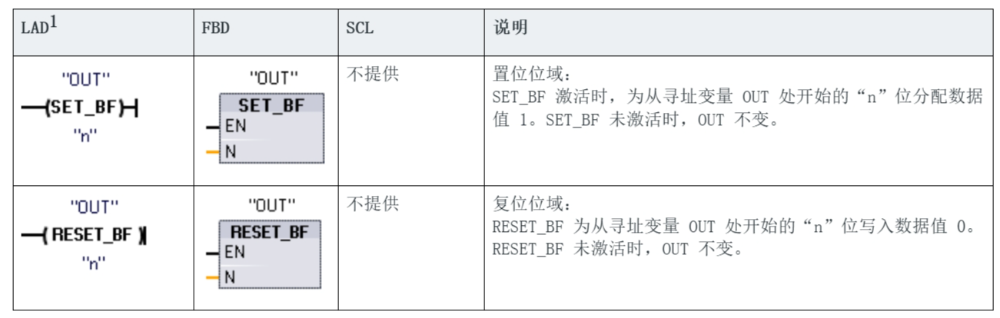
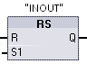

# 置位和复位

S 和 R 指令

!!! info "提示"

    - 1 对于 LAD 和 FBD：这些指令可放置在程序段的任何位置。
    - 2 对于 SCL：必须在应用程序内编写代码来复制该函数。

参数的数据类型

|​参数|​数据类型|​说明|
|----|-------|------------------|
|IN​（或连接到触点/门逻辑） | ​Bool    |  要监视位置的位变量 |
|OUT|​Bool|​要置位或复位位置的位变量|

## 置位和复位位域

!!! note "提示"

    **多位置位** 和 **多位复位** 指令

SET_BF 和 RESET_BF 指令

!!! warning "注意"

    - 1 对于 LAD 和 FBD：这些指令必须是分支中最右端的指令。
    - 2 对于 SCL：必须在应用程序内编写代码来复制该函数。

## 置位优先 和 复位优先

RS 和 SR 指令

|​LAD/FBD|SCL|​说明|
|----|-------|------------------|
||​不提供  |  复位/置位触发器：   ​RS 是置位优先锁存，其中置位优先。如果置位 (S1) 和复位 (R) 信号都为真，则地址 ​INOUT​ 的值将为 1。 |
||​不提供 |置位/复位触发器：   ​SR 是复位优先锁存，其中复位优先。如果置位 (S) 和复位 (R1) 信号都为真，则地址 ​INOUT​ 的值将为 0。|

!!! warning "注意"

    - 1 对于 LAD 和 FBD：这些指令必须是分支中最右端的指令。
    - 2 对于 SCL：必须在应用程序内编写代码来复制该函数。

参数的数据类型

|​参数|​数据类型|​说明|
|----|-------|------------------|
|​S, S1| ​Bool    |  置位输入；1 表示优先 |
|​R, R1| ​Bool    |  复位输入；1 表示优先 |
|​INOUT| ​Bool    |  分配的位变量“​INOUT​”|
|Q    | ​Bool    |  遵循“​INOUT​”位的状态 |

!!! note "提示"

    “​INOUT​”变量分配要置位或复位的位地址。可选输出 Q 遵循“​INOUT​”地址的信号状态。

|指令|S1|R| “INOUT”位 |
|--|--|---|----|
|​RS 置位优先|​0|​0|​先前状态|
|​  |​0|1|0|
|​  |1|​0|1|
|​  |1|1|1|

---

|指令|S|​R1|“INOUT”位|
|--|--|---|----|
|​SR 复位优先​ |0|0|​先前状态|
|​  |​0|1|0|
|​  |1|​0|1|
|​  |1|1|0|

