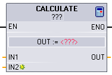
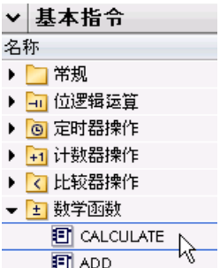
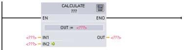
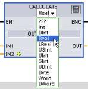
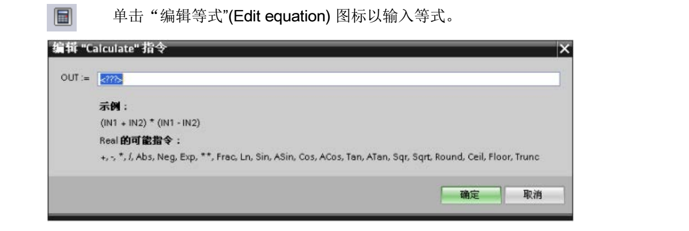

# Calculate（数学计算）

## CALCULATE 指令

| LAD/FBD     | SCL                    | 说明                    |
|-----------|---------------------------------|-------------|
| | 使用标准 SCL 数学表达式创建等式。 | CALCULATE 指令可以根据定义的等式生成作用于输入（IN1、IN2、.. INn）并在 OUT 中生成结果的数学函数。<br>  首先选择数据类型。所有输入和输出的数据类型必须相同。 <br>  要添加其它输入，请单击最后一个输入处的图标。 |

## 参数的数据类型


| 参数            | 数据类型\*                                     |
| --------------- | ----------------------------------------------- |
| IN1, IN2, ..INn | SInt, Int, DInt, USInt, UInt, UDInt, Real, LReal, Byte, Word, DWord |
| OUT             | SInt, Int, DInt, USInt, UInt, UDInt, Real, LReal, Byte, Word, DWord |

:::{note} IN 和 OUT 参数必须具有相同的数据类型（通过对输入参数进行隐式转换）。例如：
:::

单击计算器图标可打开对话框，在其中定义数学函数。输入等式作为输入（如 IN1 和 IN2）和操作数。单击“确定”(OK) 保存函数时，对话框会自动生成 CALCULATE 指令的输入。

对话框显示一个示例，以及可根据 OUT 参数的数据类型加入的一列指令：


:::{note} 还必须为函数中的任何常量生成输入。然后会在指令 CALCULATE 的相关输入中输入该常量值。<br> 通过输入常量作为输入，可将 CALCULATE 指令复制到用户程序的其它位置，从而无需更改函数。之后，不需要修改函数，就可以更改指令输入的值或变量。"
:::

当执行 CALCULATE 并成功完成计算中的所有单个运算时，ENO = 1。否则：ENO = 0。

有关 CALCULATE 指令的示例，请参见“使用简单指令创建复杂等式”。

## 使用简单指令创建复杂等式

Calculate 指令 (页 240)可以根据定义的等式生成作用于多个输入参数的数学函数，从而生
成结果。 



在 Basic 指令树中，展开“数学函数”(Math functions) 文件夹。 双击 Calculate 指令以将该指令插入用户程序中。


{align=left } 

未组态的 Calculate 指令提供了两个输入参数和一个输出参数。




单击“???”并为输入参数和输出参数选择数据类型。 （所有输入参数和输出参数的数据类型必须相同。）对于本示例，请选择“Real”数据类型。




对于本示例，请输入以下等式来标定原有模拟值。 （“In”和“Out”标识对应于 Calculate 指令
的参数。） 

``` yaml

Out value = ((Out high - Out low) / (In high - In low)) * (In value - In low) + Out low
Out = ((in4 - in5) / (in2 - in3)) * (in1 - in3) + in5
其中： Out value (Out) 标定的输出值
In value (in1) 模拟量输入值
In high (in2) 标定输入值的上限
In low (in3) 标定输入值的下限
Out high (in4) 标定输出值的上限
Out low (in5) 标定输出值的下限

在“编辑 Calculate”(Edit Calculate) 框中，输入带有参数名称的等式：
OUT = ((in4 - in5) / (in2 - in3)) * (in1 - in3) + in5

```


单击“确定”(OK) 后，Calculate 指令就会生成指令所需的输入。

{ align=right}

输入与参数对应的值的变量名称。

{ align=right}