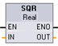
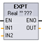

# 指数、对数及三角函数

## 指数、对数及三角函数指令

​使用浮点指令可编写使用 ​Real​ 或 ​LReal​ 数据类型的数学运算程序：TAN（计算正切值）ACOS（计算反余弦值）COS（计算余弦值）ASIN（计算反正弦值）SIN（计算正弦值）FRAC（提取小数）EXPT（取幂）EXP（计算指数值）LN（计算自然对数）SQRT（计算平方根）SQR（计算平方）三角函数指令

- ​SQR​：计算平方 (IN^2^ ​= OUT)
    
- ​SQRT​：计算平方根 (√IN = OUT)
    
- ​LN​：计算自然对数 (LN(IN) = OUT)
    
- ​EXP​：计算指数值 (e^IN^ ​= OUT)，其中底数 e = 2.71828182845904523536
    
- ​EXPT​：取幂 (IN1^IN2^ ​= OUT)
    
    ​EXPT​ 参数 IN1 和 OUT 总是为同一数据类型，可以选定为 Real 或 LReal。可以从众多数据类型中为指数参数 IN2 选择数据类型。
    
- ​FRAC​：提取小数（浮点数 IN 的小数部分 = OUT）
    
- ​SIN:​计算正弦值 (sin(IN radians) = OUT)
    
- ​ASIN​：计算反正弦值（arcsine(IN) = OUT 弧度），其中 sin(OUT 弧度) = IN
    
- ​COS​：计算余弦（cos(IN 弧度) = OUT）
    
- ​ACOS​：计算反余弦值 (arccos(IN) = OUT 弧度)，其中 cos(OUT 弧度) = IN
    
- ​TAN​：计算正切值（tan(IN 弧度) = OUT）
    
- ​ATAN​：计算反正切值 (arctan(IN) = OUT 弧度)，其中 tan(OUT 弧度) = IN

## 浮点型数学运算指令示例

| ​LAD/FBD | ​SCL | ​说明|
| --- | --- | --- |
| | out := SQR(in);  ​或  out := in*in; | ​平方：​IN^2^ ​= ​OUT  ​例如：如果 ​IN​ = 9，则 ​OUT​ = 81。 |
|  | out := in1 **in2; | ​综合指数：​IN1​^IN2^​= ​OUT  ​例如：如果 ​IN1​ = 3 且 ​IN2​ = 2，则 ​OUT​ = 9。 |

!!! note "提示"
    - 1 对于 LAD 和 FBD：单击“???”（按指令名称）并从下拉菜单中选择数据类型。
    - 2 对于 SCL：还可以使用基本的 SCL 数学运算符来创建数学表达式。

## 参数的数据类型

| ​参数 | ​数据类型 | ​说明|
| --- | --- | ---|
| ​IN, IN1 | ​Real, LReal​, 常数 | ​输入 |
| ​IN2 | ​SInt, Int, DInt, USInt, UInt,UDInt, Real, LReal​, 常数 | ​EXPT​ 指数输入 |
| ​OUT | ​Real, LReal | ​输出 |

## ENO 状态

| ​ENO | ​指令 | ​条件 | ​结果 (OUT)|
| --- | --- | --- | ---|
| ​1  | ​全部 | ​无错误 | ​有效结果 |
| ​0  | ​SQR | ​结果超出有效 Real/LReal 范围 | ​+INF |
| ​IN 为 +/- NaN（不是数字） | ​+NaN |
| ​SQRT | ​IN 为负数 | ​-NaN |
| ​IN 为 +/- INF（无穷大）或 +/- NaN | ​\+/\- INF 或 +/- NaN |
| ​LN | ​IN 为 0.0、负数、-INF 或 -NaN | ​-NaN |
| ​IN 为 +INF 或 +NaN | ​+INF 或 +NaN |
| ​EXP | ​结果超出有效 Real/LReal 范围 | ​+INF |
| ​IN 为 +/- NaN | ​\+/\- NaN |
| ​SIN​, ​COS​, ​TAN | ​IN 为 +/- INF 或 +/- NaN | ​\+/\- INF 或 +/- NaN |
| ​ASIN​，​ACOS | ​IN 超出 -1.0 到 +1.0 的有效范围 | ​+NaN |
| ​IN 为 +/- NaN | ​\+/\- NaN |
| ​ATAN | ​IN 为 +/- NaN | ​\+/\- NaN |
| ​FRAC | ​IN 为 +/- INF 或 +/- NaN | ​+NaN |
| ​EXPT | ​IN1 为 +INF 且 IN2 不是 -INF | ​+INF |
| ​IN1 为负数或 -INF | ​如果 IN2 为 Real/LReal，则为 +NaN，   ​否则为 -INF |
| ​IN1 或 IN2 为 +/- NaN | ​+NaN |
| ​IN1 为 0.0 且 IN2 为 Real/LReal（只能为 Real/LReal） | ​+NaN |
