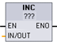
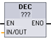

# INC（递增）和 DEC（递减）

## INC 和 DEC 指令

| ​LAD/FBD \*| ​SCL | ​说明 |
| --- | --- | --- |
|  | in\_out := in\_out + 1; | ​递增有符号或无符号整数值： INC（递增）  ​IN_OUT ​ 值 +1 = ​IN_OUT ​ 值 |
|  | in\_out := in\_out - 1; | ​递减有符号或无符号整数值： DEC（递减）  ​IN_OUT ​ 值 \- 1 = ​IN_OUT ​ 值 |

!!! note "\* : LAD 和 FBD：单击“???”并从下拉菜单中选择数据类型。"

## 参数的数据类型

| ​参数 | ​数据类型 | ​说明|
| --- | --- | ---|
| ​IN/OUT | ​SInt, Int, DInt, USInt, UInt, UDInt | ​数学运算输入和输出 |

## ENO 状态

| ​ENO |说明 |
|---| ----|
| ​1  | ​无错误 |
| ​0  | ​结果值超出所选数据类型的有效数值范围。  ​SInt​ 示例：(+127) ​INC​ 的结果为 +128，超出该数据类型的最大值。 |