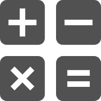
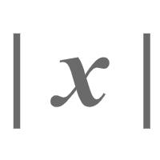

# 数学函数

- {width="18" height="20"} &nbsp; __[数学计算]__
- {width="18" height="18"} &nbsp; __[加减乘除]__
- {width="18" height="20"} &nbsp; __[取模]__
- {width="18" height="18"}  &nbsp; __[取反]__
- {width="18" height="25"} &nbsp;__[递增和递减]__
- {width="18" height="25"} &nbsp;__[绝对值]__
- {width="18" height="25"}&nbsp; __[最小值和最大值]__
- {width="20" height="25"}&nbsp; __[极限值]__
- :fontawesome-solid-square-root-variable: &nbsp; __[指数、对数及三角函数]__ 

[数学计算]: ./calculate.md
[加减乘除]: ./add.md
[取模]: ./mod.md
[取反]: ./neg.md
[递增和递减]: ./inc_dec.md
[绝对值]: ./abs.md
[最小值和最大值]: ./max_min.md
[极限值]: ./limit.md
[指数、对数及三角函数]: ./exponent.md