# 时钟功能指令的使用

在TIA 软件V13 版本中，可以通过相应的时钟功能指令去实现对S7-1200 CPU的系统/本地时钟的操作。

* 读取S7-1200CPU的系统/本地时钟。
* 设置S7-1200CPU的系统/本地时钟。
* 设置S7-1200CPU的时区。
* 设置、启动、停止和读取S7-1200CPU 的 32 位运行小时计数器。

本文将详细介绍上述各个指令的使用。

## 系统/本地时间区别

系统时间（System Time）：格林威治标准时间。
本地时间（Local Time）：根据S7-1200CPU所处时区设置的本地标准时间。

## 读取S7-1200CPU的系统/本地时钟

1\. 读取S7-1200CPU的系统/本地时钟指令的调用。

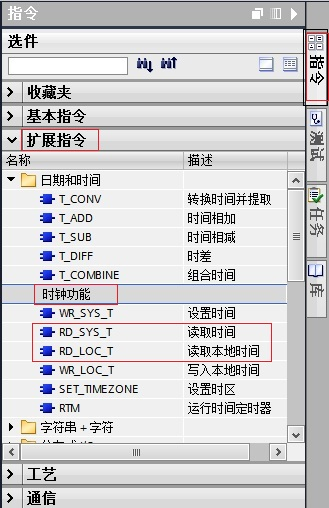
图1\. 调用读取系统/本地时间指令

2.读取S7-1200CPU的系统/本地时钟指令的使用。

在DB块中创建数据类型为DTL（时间和日期）的变量。

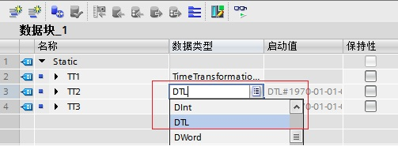
图2\. 在数据块中创建DTL变量。

在OB1中编程，读出的系统/本地时间通过输出管脚“OUT”放入数据块相应的变量中。

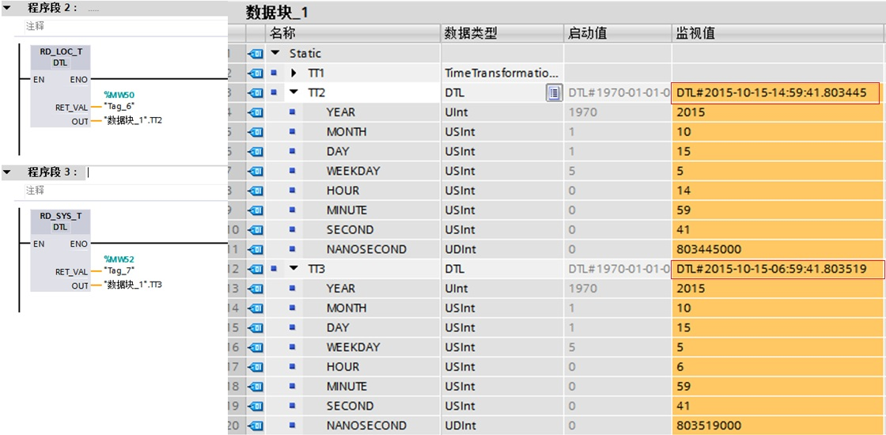
图3\. 编程读出系统/本地时间。

从上图可以看出，读出的系统时间和本地时间相差8小时，这是因为S7-1200CPU所设置的时区与格林威治时间相差8小时。

输出管脚“RET_VAL”为指令状态输出，具体含义参见指令帮助。

## 设置S7-1200CPU的系统/本地时钟

1.设置S7-1200CPU的系统/本地时钟指令的调用。

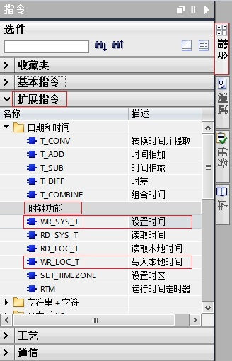
图4\. 调用设置系统/本地时间指令

2.设置S7-1200CPU的系统/本地时钟指令的使用。

在DB块中创建数据类型为DTL（时间和日期）的变量。

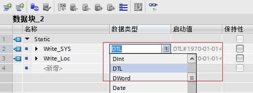

图5\. 在数据块中创建DTL变量。

通过触摸屏或者强制变量的方式给DTL变量写入所想要设置的时间日期数值。

在OB1中编程，将DTL变量填写在输入管脚“IN”（设置系统时间指令）/“LOCTIME”（设置本地时间指令）。

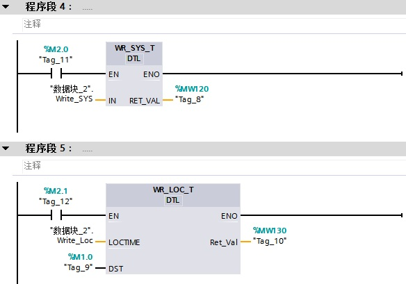

图6\. 编程设置系统/本地时间。

如果“EN”端填写的变量信号状态为“TRUE”，则执行设置系统/本地时间指令。将用要设置的时间覆盖 CPU 时钟的系统/本地时间。

输出管脚“RET_VAL”为指令状态输出，具体含义参见指令帮助。

3.设置本地时间指令在夏令时与标准时间切换时的使用。

* 从标准时间切换到夏令时。

  假设切换时间为凌晨 2:00，然后将时间向前移动一小时。 这意味着在 02:00:00:000000000 AM 和 02:59:59:999999999 AM 之间没有时间。如果“LOCTIME”指定的时间在此期间，将产生错误代码 W#16#8089。

  DST 参数与此无关。
* 从夏令时切换到标准时间。

  假设切换时间为凌晨 3:00，然后将时间向后移动一小时。 这意味着在 02:00:00:000000000 AM 和 02:59:59:999999999 AM 之间有两小时。

  因此对于“LOCTIME”中所有介于 02:00:00:000000000 AM 和 02:59:59:999999999 AM 的时间，需要声明该时间是在时间切换之前还是之后。DST 参数的用法如下：

  * DST=TRUE 时，时间是两个小时中的第一个，即仍然在夏令时中。
  * DST=FALSE 时，时间是两个小时中的第二个，即位于标准时间。对于 LOCTIME 中所有位于双数小时之外的时间，DST 参数与此无关。

## 设置S7-1200CPU的时区

1.设置S7-1200CPU时区指令的调用。

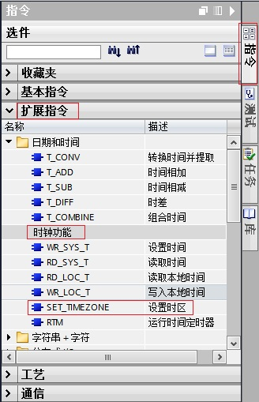
图7.调用设置时区指令

2.设置S7-1200CPU时区指令的使用。

在DB块中创建数据类型“TimeTransformationRule”的变量，需要在数据类型一栏中直接输入“TimeTransformationRule”。

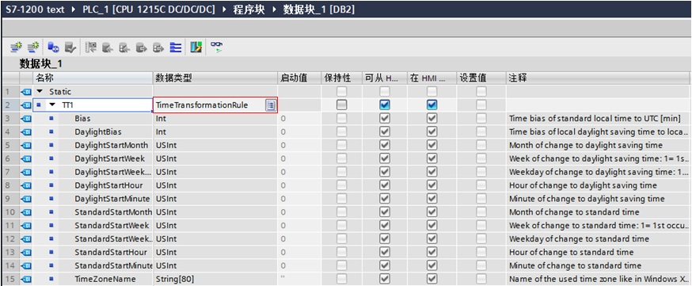

图8.在数据块中创建数据类型“TimeTransformationRule”的变量

此参数变量的具体含义参见指令帮助。

在OB1中编程，将“TimeTransformationRule”变量填写在输入管脚“Time Zone”，并通过触摸屏或者强制变量的方式给“TimeTransformationRule”变量写入所想要设置的时区相关参数 。

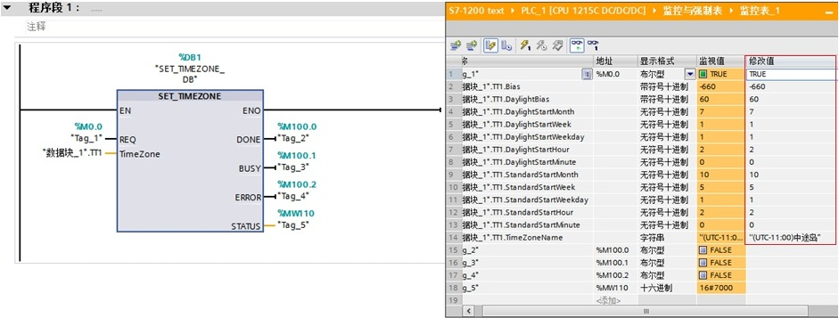
图9.编程设置CPU的时区

从上图可以看出，将CPU的时区设置为UTC-11：00，即本地时间与系统时间之间的时差为-660分钟。

输出管脚显示指令的完成、故障，状态等信息，具体含义参见指令帮助。

## 运行时间定时器的使用

1.运行时间定时器指令的调用。

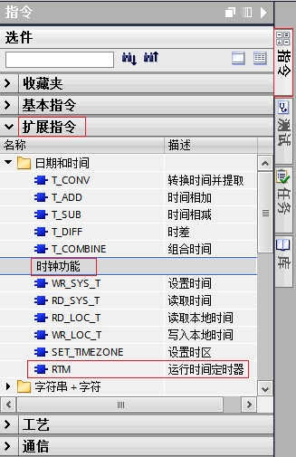

图10.调用运行时间定时器指令

2.运行时间定时器指令的使用。

使用该指令对 S7-1200CPU 的 32 位运行小时计数器执行设置、启动、停止和读取操作。

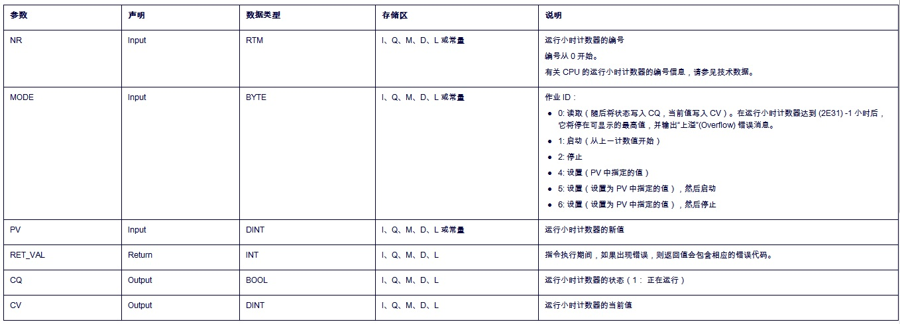

图11.运行时间定时器指令的管脚含义

在OB1中编程，输入参数 MODE的值设置为“5”，如果EN输入端的信号状态为“TRUE”，则执行“RTM”指令。CPU 的运行小时计数器设置为PV中的数值并启动。在启动运行小时计数器后，将输入参数 MODE的值设置为“0”。因此，“RTM”指令读取运行小时计数器的当前值并写入输出管脚CV。输出参数 CQ指示运行小时计数器正在运行。输出参数 RET_VAL指示处理正在运行，且无错误。

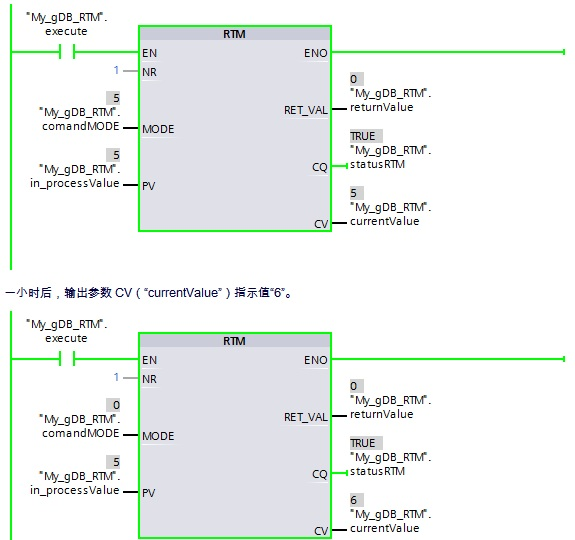

图12.编程使用运行时间定时器指令

## 常见问题

 **为什么 CPU 系统时钟比实际时间快一小时？**

使用 STEP 7 V13 SP1 组态 S7-1200 CPU， 设备组态属性-常规-时间，默认的本地时间时区是UTC+01:00，即使更改时区为UTC+08:00，但仍然默认勾选"激活夏令时"。如下图13 所示：

虽然国内没有使用夏令时，时区选择UTC+08:00，读取的时钟仍然会比实际时钟快一小时。如要使系统时间与实际时间一致，取消勾选“激活夏令时"，重新下载项目即可。

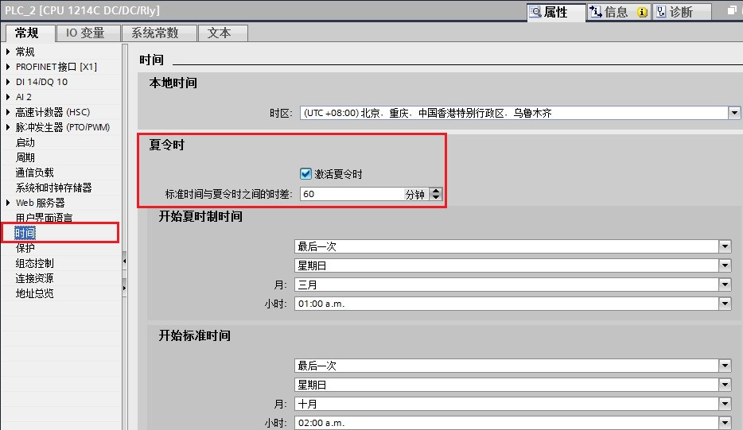

图13\. 夏令时

 ** 注意：STEP7 V14中组态的 S7-1200, 更改时区为UTC+08:00后，默认是不勾选"激活夏令时"。因此不存在以上问题。**
