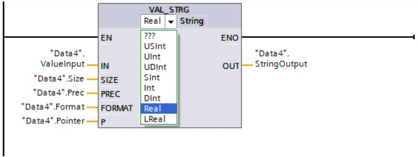

# 字符串指令的使用

在TIA STEP7 V16版本中，可以通过相应的字符串指令去实现对S7-1200 CPU(固件版本V4.4)字符串数据类型的操作。

- [字符串指令的使用](#字符串指令的使用)
  - [移动和转换字符串](#移动和转换字符串)
    - [移动和转换字符串指令的调用，](#移动和转换字符串指令的调用)
    - [移动和转换字符串指令的使用。](#移动和转换字符串指令的使用)
  - [字符串和数值相互进行转换](#字符串和数值相互进行转换)
  - [字符串和字符相互进行转换](#字符串和字符相互进行转换)
  - [将ASCII字符串和十六进制数值相互进行转换](#将ascii字符串和十六进制数值相互进行转换)
  - [合并字符串](#合并字符串)
  - [比较字符串](#比较字符串)
  - [获取字符串长度](#获取字符串长度)
  - [读取、删除、插入、替换和查找字符串](#读取删除插入替换和查找字符串)
  - [常见问题](#常见问题)

本文将详细介绍上述各个指令的使用。

## 移动和转换字符串

### 移动和转换字符串指令的调用，

如图1所示。

  
图1\. 移动和转换字符串指令

### 移动和转换字符串指令的使用。

1.移动字符串指令S_MOVE。

S_MOVE指令可以将参数IN中的字符串写入到参数OUT中的指定数据区域。

在全局DB中创建两个String类型变量，用来保存数据，如图2所示：

  
图2\. 在全局DB中创建变量

在OB1中调用S_MOVE指令，并连接参数，如图3所示：

  
图3\. 在OB1中调用S_MOVE指令

将需要复制的字符串("StringInput")通过输出参数OUT("StringOutput")输出，如图4所示：

  
图4\. S_MOVE指令执行结果

2.转换字符串指令S_CONV。

S_CONV指令可以将参数IN中的数值转换为OUT输出中指定的数据格式，下面列出了可能进行数值转换的数据类型：

- 将字符串转换为数字值

参数IN中的数值数据类型为STRING，WSTRING；参数OUT中数值的数据类型为CHAR，WCHAR，USINT，UINT，UDINT，SINT，INT，DINT，REAL，LREAL。

- 将字符串转换为字符串

参数IN中的数值数据类型为STRING，WSTRING；参数OUT中数值的数据类型为STRING，WSTRING。

- 将数字值或字符转换为字符串

参数IN中的数值数据类型为CHAR，WCHAR，USINT，UINT，UDINT，SINT，INT，DINT，REAL，LREAL；参数OUT中数值的数据类型为STRING，WSTRING。

- 将字符转换为字符

参数IN中的数值数据类型为CHAR，WCHAR；参数OUT中数值的数据类型为CHAR，WCHAR。

在全局DB中创建四个变量，用来保存数据，如图5所示：

  
图5\. 在全局DB中创建变量

在OB1中调用S_CONV指令，并连接参数，选择数据类型。在第一个选项中选择待转换的数据类型("ValueInput")，本例中为Int类型；在第二个选项中选择待生成字符串的数据类型("StringOutput")，本例中为String类型，如图6所示：

  
图6\. 在OB1中调用S_CONV指令

将需要转换的数值("ValueInput")转换为输出格式，在字符串开头处的空白区域写入空格，转换结果以字符串形式通过输出参数OUT("StringOutput")输出，如图7所示：

  
图7\. S_CONV指令执行结果(LAD语言)

!!! note "注"

    如果使用SCL语言调用S_CONV指令，当数字值转换为字符串时，字符串的第一个字符不会使用空格进行填充，如图8所示：
    
    
    图8\. S_CONV指令执行结果(SCL语言)

## 字符串和数值相互进行转换

1\. 字符串和数值相互进行转换指令的调用，如图9所示。

  
图9\. 字符串和数值相互进行转换指令

2\. 字符串和数值相互进行转换指令的使用。

- 将字符串转换为数值指令STRG_VAL。

STRG_VAL指令可以将字符串转换为整数或浮点数，下面介绍指令的参数：

1)IN表示要转换的数字字符串。

2)FORMAT表示字符的输入格式，指定解释字符串字符的方式。

3)P表示要转换的第一个字符的引用，转换从P参数中的指定位置处的字符开始。

4)OUT表示转换的结果。

在全局DB中创建四个变量，用来保存数据，如图10所示：

  
图10\. 在全局DB中创建变量

在OB1中调用STRG_VAL指令，并连接参数，使用左侧的选项，选择字符串的数据类型；使用右侧的选项，选择浮点数的数据类型，如图11所示：

  
图11\. 在OB1中调用STRG_VAL指令

根据参数P("Pointer")的值"3"，从第三个字符开始转换；参数FORMAT("Format")的值为"16#0000"，则字符串中的点是小数点分隔符。将需要转换的字符串("StringInput")在输出参数OUT("ValueOutput")中作为浮点数输出，如图12所示：

  
图12\. STRG_VAL指令执行结果

- 将数值转换为字符串指令VAL_STRG。

VAL_STRG指令可以将数字值转换为字符串，下面介绍指令的参数：

1)IN表示要转换的值。

2)SIZE表示字符位数，指定待写入字符串的字符数。

3)PREC表示小数位数，定义转换浮点数时保留的小数位数；如果要转换的值为整数，可使用该参数指定放置小数点的位置。

4)FORMAT表示字符的输出格式，指定转换期间如何解释数字值以及如何将其写入字符串。

5)P表示写入结果的字符，指定从字符串中的哪个字符开始写入结果。

6)OUT表示转换的结果。

在全局DB中创建六个变量，用来保存数据，如图13所示：

  
图13\. 在全局DB中创建变量

在OB1中调用VAL_STRG指令，并连接参数，选择数据类型。在第一个选项中选择待转换的数据类型("ValueInput")，本例中为Real类型；在第二个选项中选择待生成字符串的数据类型("StringOutput")，本例中为String类型，如图14所示：

  
图14\. 在OB1中调用VAL_STRG指令

根据参数P("Pointer")的值"8"，从第8个字符处开始写入该字符串。根据参数SIZE("Size")的值10，从该位置处开始写入该字符串10个字符长度。参数FORMAT("Format")的值为"16#0005"，则待转换数值("ValueInput")中的点将解释为千位分隔符。参数PREC("Prec")的值为"4"，表示向字符串写入四个小数位。待转换值的符号作为字符存储在字符串中，作为数字的前缀。字符串中剩余的字符作为符号前的空格写入，转换结果以字符串形式通过输出参数OUT("StringOutput")输出，如图15所示：

  
图15\. VAL_STRG指令执行结果

## 字符串和字符相互进行转换

1\. 字符串和字符相互进行转换指令的调用，如图16所示。

  
图16\. 字符串和字符相互进行转换指令

2\. 字符串和字符相互进行转换指令的使用。

(1)将字符串转换为字符指令Strg\_TO\_Chars。

Strg\_TO\_Chars指令可以将数据类型为String的字符串复制到Array of Char或Array of Byte中，或将数据类型为WString的字符串复制到Array of WChar或Array of Word中。下面介绍指令的参数：

1)STRG表示复制操作的源。

2)PCHARS表示Array of (W)CHAR / BYTE / WORD 结构中的位置，从该位置处开始写入字符串的相应字符。

3)CHARS表示复制操作的目标，将字符复制到 Array of (W)CHAR/ BYTE/ WORD 数据类型的结构中。

4)CNT表示移动的字符数量。

在全局DB中创建四个变量，用来保存数据，如图17所示：

  
图17\. 在全局DB中创建变量

在OB1中调用Strg\_TO\_Chars指令，并连接参数，选择字符串的数据类型，如图18所示：

  
图18\. 在OB1中调用Strg\_TO\_Chars指令

将根据Array of Char数据类型创建一个包含各个字符的结构。CHARS结构("Chars")的长度为20个字符(Array...\[0..19\])。根据参数PCHARS("Pchars")的值"5"，从该结构的第五个字符开始写入("0"-"4"为空，"5"包含字符串("StringInput")的第一个字符)。在字符串("StringInput")的字符写入到结构("Chars")后，待创建结构的后面字符将写入为空。字符串中移动的字符数通过输出参数CNT("Count")输出，如图19所示：

  
图19\. Strg\_TO\_Chars指令执行结果

(2)将字符转换为字符串指令Chars\_TO\_Strg。

Chars\_TO\_Strg指令可以将字符串从Array of Char或Array of Byte复制到数据类型为String的字符串中，或将字符串从Array of WChar或Array of Word复制到数据类型为WString的字符串中。下面介绍指令的参数：

1)CHARS表示复制操作的源，从 Array of (W)CHAR / BYTE / WORD 处开始复制字符。

2)PCHARS表示Array of (W)CHAR / BYTE / WORD 中的位置，从该位置处开始复制字符。

3)CNT表示要复制的字符数，使用值“0”将复制所有字符。

4)STRG表示复制操作的目标。

在全局DB中创建四个变量，用来保存数据，如图20所示：

  
图20\. 在全局DB中创建变量

在OB1中调用Chars\_TO\_Strg指令，并连接参数，选择字符串的数据类型，如图21所示：

  
图21\. 在OB1中调用Chars\_TO\_Strg指令

CHARS结构("Chars")的长度为20个字符(Array...\[0..19\])。根据参数PCHARS("Pchars")的值"3"，从该结构的第三个位置处开始将字符复制到字符串("StringOutput")中。从位置"3"开始，结构中的10个字符("Chars")将复制到字符串("StringOutput")中，因为参数CNT("Count")的值为"10"，如图22所示：

  
图22\. Chars\_TO\_Strg指令执行结果

## 将ASCII字符串和十六进制数值相互进行转换

1\. ASCII字符串和十六进制数值相互进行转换指令的调用，如图23所示。

  
图23\. ASCII字符串和十六进制数值相互进行转换指令

2\. ASCII字符串和十六进制数值相互进行转换指令的使用。

- 将ASCII字符串转换为十六进制值指令ATH。

ATH指令可以将输入参数中指定的ASCII字符串转换为十六进制数，转换结果输出到输出参数中。下面介绍指令的参数：

1)IN表示指向 ASCII 字符串的指针。

2)N表示待转换的 ASCII 字符数。

3)RET_VAL表示指令的状态。

4)OUT表示十六进制数。

在全局DB中创建四个变量，用来保存数据，如图24所示：

  
图24\. 在全局DB中创建变量

在OB1中调用ATH指令，并连接参数，如图25所示：

  
图25\. 在OB1中调用ATH指令

将输入的ASCII字符串("StringInput")根据待转换的ASCII字符数N("N")，共五个字符(N的值为"5")，转换为十六进制数并输出到输出参数("Output")中，指令的状态("RetVal")为16#0000，表示无错误，如图26所示：

  
图26\. ATH指令执行结果

- 将十六进制数转换为ASCII字符串指令HTA。

HTA指令可以将输入中指定的十六进制数转换为ASCII字符串。下面介绍指令的参数：

1)IN表示十六进制数的起始地址。

2)N表示待转换的十六进制字节数 。

3)RET_VAL表示错误消息。

4)OUT表示结果的存储地址。

在全局DB中创建四个变量，用来保存数据，如图27所示：

  
图27\. 在全局DB中创建变量

在OB1中调用HTA指令，并连接参数，如图28所示：

  
图28\. 在OB1中调用HTA指令

将输入的十六进制数("Input")根据待转换的十六进制字节数N("N")，共五个字节(N的值为"5")，转换为字符串并输出到输出参数("StringOutput")中，指令的状态("RetVal")为16#0000，表示无错误，如图29所示：

  
图29\. HTA指令执行结果

## 合并字符串

1\. 合并字符串指令的调用，如图30所示。

  
图30\. 合并字符串指令

2\. 合并字符串指令的使用。

合并字符串指令CONCAT。

CONCAT指令可以将输入参数IN1中的字符串和IN2中的字符串合并在一起，结果以String或WString格式输出到输出参数中。

在全局DB中创建三个变量，用来保存数据，如图31所示：

  
图31\. 在全局DB中创建变量

在OB1中调用CONCAT指令，并连接参数，选择字符串的数据类型，如图32所示：

  
图32\. 在OB1中调用CONCAT指令

第二个字符串("StringInput2")中的字符附加到第一个字符串("StringInput1")，并通过输出参数OUT("StringOutput")输出结果，如图33所示：

  
图33\. CONCAT指令执行结果

## 比较字符串

1\. 比较字符串指令的调用，如图34所示。

  
图34\. 比较字符串指令

2\. 比较字符串指令的使用。

比较字符串指令CMP==，CMP&lt;>，CMP&gt;=，CMP&lt;=，CMP&gt;，CMP<。

这些指令可以比较两个字符串数据类型的&lt;操作数1&gt;和&lt;操作数2&gt;是否相等，不相等，大于或等于，小于或等于，大于，小于；如果满足比较条件，则指令返回逻辑运算结果(RLO)"1"。如果不满足比较条件，则该指令返回逻辑运算结果(RLO)"0"。

在全局DB中创建六个变量，用来保存数据，如图35所示：

  
图35\. 在全局DB中创建变量

在OB1中调用CMP==指令，&lt;操作数1&gt;(“StringInput1”)和&lt;操作数2&gt;(“StringInput2”)是字符串类型，CMP==指令中选择String数据类型，因为两个操作数相同，满足比较条件，因此输出("Out1")为TRUE，如图36所示：

  
图36\. CMP==指令执行结果

在OB1中调用CMP>指令，&lt;操作数1&gt;(“StringInput3”)和&lt;操作数2&gt;(“StringInput4”)是字符串类型，CMP>指令中选择String数据类型，因为&lt;操作数1&gt;(“StringInput3”)大于&lt;操作数2&gt;(“StringInput4”)，(根据字符的ASCII码从左侧开始比较字符(例如："a"大于"A")，第一个不同的字符决定比较结果)，满足比较条件，因此输出("Out2")为TRUE，如图37所示：

  
图37\. CMP>指令执行结果

## 获取字符串长度

1\. 获取字符串长度指令的调用，如图38所示。

  
图38\. 获取字符串长度指令

2\. 获取字符串长度指令的使用。

- 获取字符串长度指令MAX_LEN。

String和WString数据类型的变量包含两个长度：最大长度和当前长度(即当前有效字符的数量)。使用指令MAX\_LEN，可以确定IN("StringInput\_1"，数据类型为String)输入参数中指定字符串的最大长度，并将其作为数字值输出到OUT("MaxLen")输出参数中，如图39所示：

  
图39\. 在OB1中调用MAX_LEN指令

- 获取字符串长度指令LEN。

使用指令LEN，可以查询IN("StringInput_1")输入参数中指定字符串的当前长度，并将其作为数字值输出到OUT("Len")输出参数中，如图40所示：

  
图40\. 在OB1中调用LEN指令

## 读取、删除、插入、替换和查找字符串

1\. 读取、删除、插入、替换和查找字符串指令的调用，如图41所示。

  
图41\. 读取、删除、插入、替换和查找字符串指令

2\. 读取、删除、插入、替换和查找字符串指令的使用。

- 读取字符串中的左侧字符指令LEFT。

使用指令LEFT提取以IN("StringInput")输入参数中字符串的第一个字符开头的部分字符串，在L("L")参数中指定要提取的字符数，提取的字符以String或WString格式通过OUT("StringOutput")输出参数输出，如图42所示：

  
图42\. 在OB1中调用LEFT指令

- 读取字符串中的右侧字符指令RIGHT。

使用指令RIGHT提取IN("StringInput2")输入参数中字符串的最后几个字符，在L("L2")参数中指定要提取的字符数，提取的字符以String或WString格式通过OUT("StringOutput2")输出参数输出，如图43所示：

  
图43\. 在OB1中调用RIGHT指令

- 读取字符串中间的几个字符指令MID。

使用指令MID提取IN("StringInput3")输入参数中字符串的一部分，使用P("P3")参数指定要提取的第一个字符的位置，使用L("L3")参数定义要提取的字符串的长度，OUT("StringOutput3")输出参数中输出提取的部分字符串，如图44所示：

  
图44\. 在OB1中调用MID指令

- 删除字符串中的字符指令DELETE。

使用指令DELETE删除IN("StringInput4")输入参数中字符串的一部分，使用P("P4")参数指定要删除的第一个字符的位置，在L("L4")参数中指定要删除的字符数，剩余的部分字符串以String或WString格式通过OUT("StringOutput4")输出参数输出，如图45所示：

  
图45\. 在OB1中调用DELETE指令

- 在字符串中插入字符指令INSERT。

使用指令INSERT将IN2("StringInput5\_2")输入参数中的字符串插入到IN1("StringInput5\_1")输入参数中的字符串中，使用P("P5")参数指定开始插入字符的位置，结果以String或WString格式通过OUT("StringOutput5")输出参数输出，如图46所示：

  
图46\. 在OB1中调用INSERT指令

- 替换字符串中的字符指令REPLACE。

使用指令REPLACE，可将IN1("StringInput6\_1")输入中字符串的一部分替换为IN2("StringInput6\_2")输入参数中的字符串，使用P("P6")参数指定要替换的第一个字符的位置，使用L("L6")参数指定要替换的字符数，结果以String或WString格式通过OUT("StringOutput6")输出参数输出，如图47所示：

  
图47\. 在OB1中调用REPLACE指令

- 在字符串中查找字符指令FIND。

使用指令FIND，可在IN1("StringInput7\_1")输入参数中的字符串内搜索IN2("StringInput7\_2")输入参数中的字符串，开始搜索字符串的字符位置通过OUT("Return")输出参数输出，如图48所示：

  
图48\. 在OB1中调用FIND指令

!!! note "关于字符串指令的更多信息请参考TIA STEP7 V16软件中的帮助文档。"

## 常见问题

!!! question "String和WString数据类型的区别？"

    S7-1200系列的CPU支持使用 String数据类型存储一串单字节字符。String数据类型包含总字符数(1个字节)，当前字符数(1个字节)和最大254个字节。String数据类型中的每个字节都可以是从16#00-16#FF的任意值。可以使用方括号定义String数据类型的最大长度(例如：String\[10\])，如果不定义最大长度，则默认最大长度为254个字符。

    WString数据类型支持单字(双字节)值的较长字符串。第一个字包含最大总字符数，下一个字包含总字符数，WString数据类型中的每个字可以是16#0000-16#FFFF之间的任意值。可以使用方括号定义WString数据类型的长度(例如：WString\[10\])，如果不定义最大长度，则在默认情况下，将WString的长度设为254个字符。可以定义最多16382个字符的长度(例如：WString\[16382\])。

!!! question "ASCII控制字符如何实现？"

    ASCII控制字符可以使用在String和WString数据类型中，控制字符语法如图49所示：
     
  
图49\. 控制字符语法示例