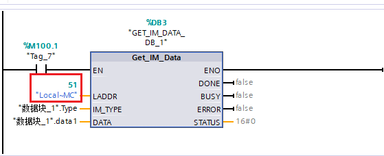

### S7-1200 读取序列号

对于 S7-1200（固件版本 V4.1 开始），可以在 TIA Portal
中使用"Get_IM_Data"指令读取 CPU 以及存储卡的序列号。

指令位于"扩展指令 \> 诊断"下面，如图 1 所示。

{width="381" height="363"}

图 1 指令位置

本示例中以博途V17，CPU1214C V4.5 为例，读取 CPU 序列号以及存储卡序列号：

-   [读取 S7-1200 CPU 序列号](01-Get_IM_Data.html#a)
-   [读取 S7-1200 存储卡序列号](01-Get_IM_Data.html#b)

#### []{#a}读取 S7-1200 CPU 序列号

1\. 在 TIA Portal 中新建项目，添加新 DB 块，在 DB 块中建立变量 Type 和
data，其中 Type 数据类型为 UInt 类型，初始值设为 0，data 数据类型为
IM0_Data，该数据类型需要在数据类型处手动输入，然后回车生效，用来存储读取的信息，如图
2 所示。

{width="755" height="196"}

图 2 DB 块内容

2\. 在 OB1 中添加指令 Get_IM_Data，并将 DB
块中的变量连接到相应的输入引脚，如图 3 所示；LADDR 为硬件标识符，可在
PLC 默认变量表中系统常量下查看，如图 4 所示。

{width="1015" height="436"}

图 3 调用指令

{width="650" height="671"}

图 4 硬件标识符

3\. 编译下载程序，将指令 EN 引脚置位，在线监视 DB 块中 data 变量，如图 5
所示，其中 Serial_Number 为 CPU
序列号，此外还可以从变量中看到订货号，硬件版本号，固件版本等信息。

{width="991" height="449"}

图 5 DB 块显示内容

#### []{#b}读取 S7-1200 存储卡序列号

1\. 对于读取 S7-1200 存储卡序列号，只需要将 Get_IM_Data
指令输入硬件标识符修改为 "Local\~MC"，其他不变，如图 6 所示。

{width="559" height="228"}

图 6 调用指令

2\. 下载并将 EN 引脚置位，在线监视 data1 变量（另外建的 IM0_Data
类型变量），结果如图 7
所示，同样可以从变量中读取到订货号，版本等相关信息。

{width="993" height="466"}

图 7 DB 块显示内容
