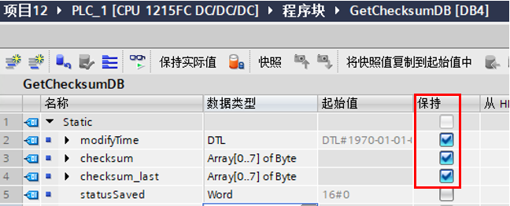
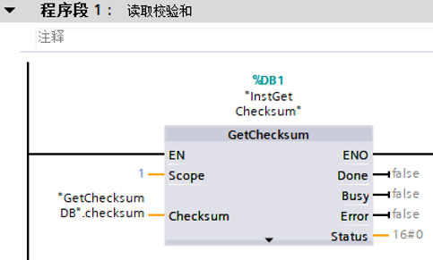
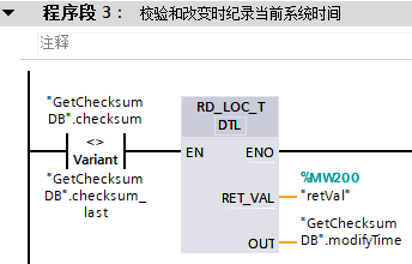
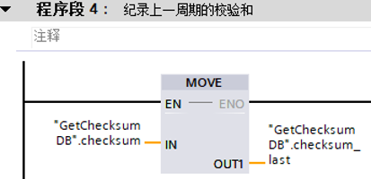
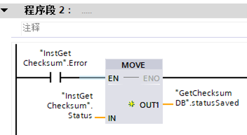
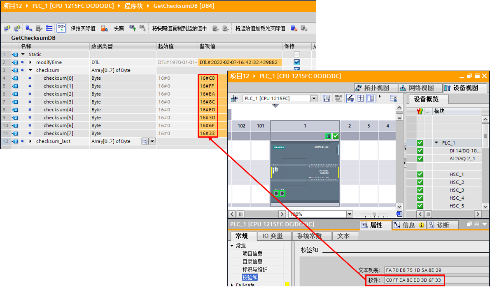

# S7-1200 如何通过编程判断程序是否发生过改动

当 S7-1200 中的程序修改后，软件校验和会发生改变。使用 GetChecksum
指令可以读取 PLC 程序中的软件较验和，将其与之前的校验和进行比较可以得知
PLC 的程序是否被改动。

本文档介绍了如何使用 GetChecksum 指令判断 PLC
中的程序是否被修改并纪录修改时间。

## 1、使用的硬件与软件

硬件： CPU 1215FC V4.4 （V4.2 开始支持）

软件：TIA Portal V17

## 2、编写 PLC 程序，调用读取校验和功能块

## 2.1 建立用于存储校验和及纪录修改时间的 DB 块

建立的 DB 块内容如图 1 所示。

**注意：**此处的校验和变量
、上一周期校验和变量、最终纪录的修改时间一定要设置为保持性变量，否则会在
CPU 停机时，不能正确保存。

{width="648" height="262"}

图 1. 建立存储用 DB

## 2.2 调用功能块

GetChecksum 指令位于"扩展指令\>诊断"文件夹，如图 2 所示。

{width="409" height="455"}

图 2. 指令集中的位置

指令调用如图 3 所示，指令参数参考表 1。

{width="483" height="291"}

图 3. 调用指令块

| 参数  | 说明  |
| --- | --- |
| Scope | * 设置为 1 时，仅纪录标准程序校验和 * 设置为 2 时，仅纪录安全程序校验和 * 设置为 3 时，仅纪录文本列表校验和 |
| Checksum | 用于纪录校验和，连接的变量类型必须为 ARRAY\[0..7\] of Byte |
| Done | 校验和读取完成时为 true |
| Busy | 指令执行中为 true，完成后为 false |
| Error | 指令执行过程中发生错误为 true |
| Status | 指令的执行状态，错误状态仅存在一个周期，抓取错误状态(方法如图 6 所示) |

表 1. 指令管脚说明

## 2.3 判断校验和改变时输出当前时间

当前读取的校验和与上一周期保存的校验和比较，当校验和发生改变时，纪录校验和改变时的时间，这个时间是程序改变后下载的生效时间。如图
4 所示。

{width="412" height="264"}

图 4. 输出程序修改后下载的时间

## 2.4 纪录上一周期的校验和

将本周期计算的校验和保存到上周期校验和变量，用于下一周期的比较，如图 5
所示。

{width="413" height="200"}

图 5. 纪录上一周期的校验和

## 2.5 保存错误代码

错误代码仅当发生错误时出现一个周期，需要使用错误位为 true
时抓取错误代码，如图 6 所示。

{width="423" height="232"}

图 6. 保存错误代码

## 3、检查程序

可以在程序下载后，对比离线的校验和及在线读取的校验和，检查程序是否正确下载，如图
7 所示。

{width="1190" height="701"}

图 7. 检查程序中读取的校验和

**注意：此程序仅检查标准程序的修改；可以通过修改 Scope 为
2，检查安全程序的修改；通过修改 Scope 为 3，检查文本列表的修改。**
