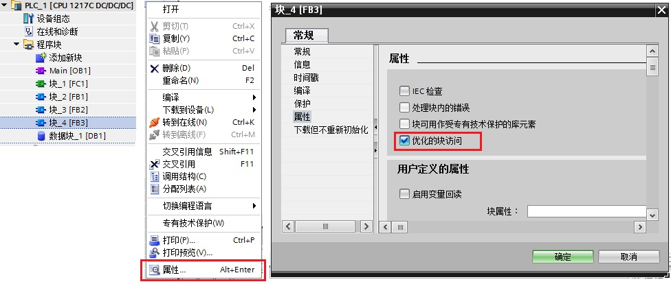
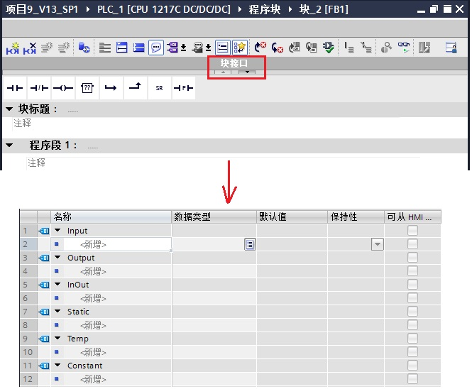
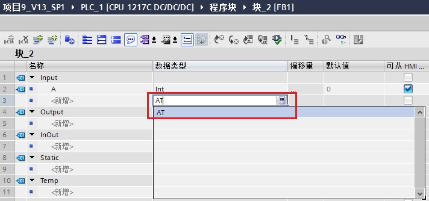
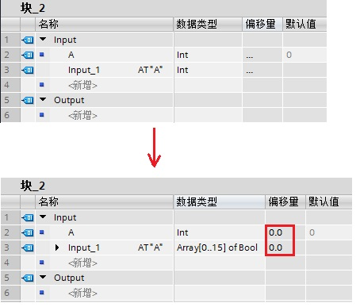
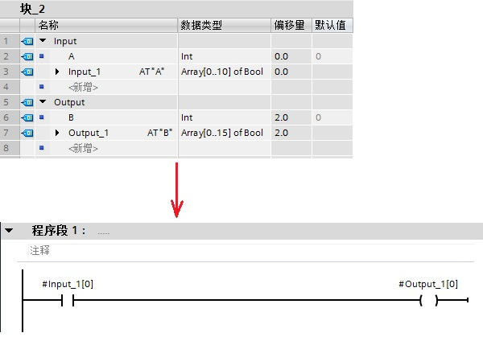
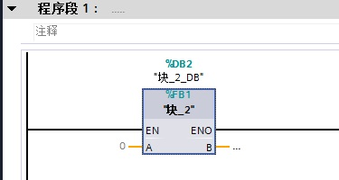
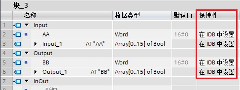
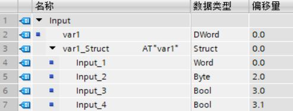
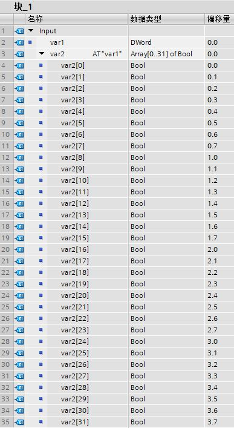
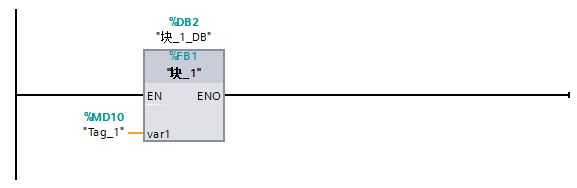

### S7-1200 使用 AT 覆盖参数 {#s7-1200-使用-at-覆盖参数 .STYLE1}

[S7-1200
要访问声明参数内的数据区域，可以通过附加声明来覆盖所声明的参数。这样可以选择对不同数据类型的已声明参数进行寻址，例如，可以使用
Bool 的 Array 对 Word 数据类型参数的各个位寻址。]{.STYLE8}

下面介绍详细的做法。

#### 1. 如何创建 AT 覆盖参数 {#如何创建-at-覆盖参数 .STYLE9}

创建一个 S7-1200 的项目，在程序块中新建一个 FB 块（或者 FC 块），右击 FB
块进入该块的属性中，将 FB 块属性中的"优化的块访问"去掉，如图 1 所示。

{width="976" height="414"}

图 1 创建非优化的 FB 块

双击进入 FB 块， 展开 FB 块的"块接口"，如图 2 所示。

{width="665" height="548"}

图 2 展开 FB 块的"块接口"

在"块接口"中，在 Input 添加一个参数，参数名为 A，数据类型为
int；接着在参数 A 下面一行，数据类型这一列，手动输入"AT"，如图 3 所示。

{width="712" height="334"}

图 3 输入"AT"

Input 中会生成一个新参数"Input_1"，数据类型是
int，将这个参数的数据类型修改成 Array\[0..15\] of Bool ，并编译该 FB
块，可以看到参数 A 和参数 Input_1 的偏移量都是 0.0，这表示参数 A 和参数
Input_1 是相同地址，只是以不同的数据类型显示，如图 4 所示。

{width="454" height="387"}

图 4 生成地址相同的新参数

以此方法新建 Output 的参数 B 和参数 Output_1，这样就可以对参数 A 和参数
B 进行[位操作]{.STYLE11}，如图 5 所示。

{width="600" height="419"}

图 5 对参数进行位操作

OB1 调用 FB 块时，FB 块的管脚不会显示参数 Input_1 和 Output_1，如图 6
所示。

{width="375" height="200"}

图 6 调用生成的 FB 块

如 FB 块选择的是优化的块访问，即：保留了 FB
块属性中的"优化的块访问"的勾选项，见图
1；这时，需要在"保持性"一列中选择"在 IDB 中设置"，才能使用 AT
参数覆盖，如图 7 所示。

{width="487" height="183"}

图 7 FB 块的优化访问处理

对于标准访问 FB 块的输入参数，还可以使用 Struct
对参数进行覆盖，例如：DWord 参数由一个 Struct 覆盖。Struct
包括字、字节和两个布尔值，如图8所示：

{width="493" height="188"}

图 8 AT 参数覆盖示例

#### [2. AT 覆盖参数的顺序]{.STYLE9} {#at-覆盖参数的顺序 .STYLE8}

下面举例说明使用 AT 覆盖参数后，参数的顺序。在
FB1（块_1）的接口区创建数据类型为 DWord 的参数 var1，并创建
Array\[0..31\] of Bool 类型的参数 var2，其中 var2 是 var1 的 AT
覆盖参数，如图 9 所示：

{width="387" height="707"}

图 9 FB 块的接口区

在主程序 OB1 中调用 FB1，并对 var1 赋值实参为 MD10（数据类型为
DWord），如图 10 所示：

{width="577" height="188"}

图 10 调用 FB1

此时，覆盖参数 var2 与被覆盖参数 var1 即输入参数 MD10 的对应关系如下表 1
所示：

  ------------ ------- ------
  var2\[0\]    M10.0   MB10
  var2\[7\]    M10.7   
  var2\[8\]    M11.0   MB11
  var2\[15\]   M11.7   
  var2\[16\]   M12.0   MB12
  var2\[23\]   M12.7   
  var2\[24\]   M13.0   MB13
  var2\[31\]   M13.7   
  ------------ ------- ------

表 1 AT 覆盖参数的对应关系

#### [3. 注意事项和规则]{.STYLE9} {#注意事项和规则 .STYLE8}

对于参数覆盖可适用于以下[通用规则]{.STYLE14}：

1.在 LAD、FBD 和 SCL 中，允许参数覆盖。

2.可以在以下块中覆盖参数：

-   在标准访问的代码中（FB、FC）
-   优化 FB 中激活了 "在 IDB 中设置"的参数
-   [S7-1200 的 OB 一定是优化块，所以 OB 不支持 AT 功能]{.STYLE10}

3.覆盖参数数据宽度必须小于等于被覆盖参数的数据宽度。

4.不可以覆盖 VARIANT 数据类型的参数。

5.多重实例声明不能覆盖。

6.如果被覆盖参数的数据类型为字符串、字节数组、字符数组等，那么其长度应与偶数个字节数对应。

7.无法覆盖库中声明为接口中参数的块。

8.无法覆盖接口中声明为参数的结构化 PLC 参数。

9.无法通过片段访问对覆盖参数进行寻址。

注意事项

对于 S7-1200 中的 **FC 使用
AT**，覆盖参数和被覆盖参数的数据长度必须相同。如果无法通过程序实现，请检查是否可以使用[片段访问](02-Slice.html)来代替
AT
结构，或使用指令["SCATTER"或"GATHER"](../01-Basic/04-Move/04-SCATTERGATHER.html)。

FB/FC 不同接口覆盖参数与被覆盖参数的数据类型规则，如表 2 所示。

                                        覆盖参数         被覆盖参数           
  -------------- ---------------------- ---------------- ------------ --- --- ---
  基本数据类型   结构化数据类型         Any 指针         DB_ANY               
  FB             Input                  基本数据类型     √            √       √
                                        结构化数据类型   √            √   √   √
                                        Any 指针                      √        
                 Temp                   基本数据类型     √            √        
                                        结构化数据类型   √            √   √    
                                        Any 指针                      √        
                 Static、Output         基本数据类型     √            √       √
                                        结构化数据类型   √            √       √
                                        Any 指针                               
                 InOut                  基本数据类型     √                    √
                                        结构化数据类型                √        
                                        Any 指针                               
  FC             Temp                   基本数据类型     √            √        
                                        结构化数据类型   √            √   √    
                                        Any 指针                      √        
                 Input、Output、InOut   基本数据类型     √                    √
                                        结构化数据类型                √        
                                        Any 指针                               

注1：结构化数据类型为多个数据元素组成，例如 PLC
数据类型、数组、结构体等。

注2：Bool、Byte、SINT、USInt 和 Char 不能使用 PLC
数据类型、数组、结构体的参数覆盖。

表 2 AT 覆盖参数的组合规则
