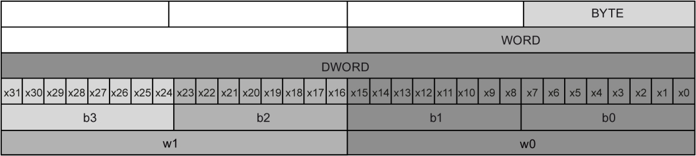
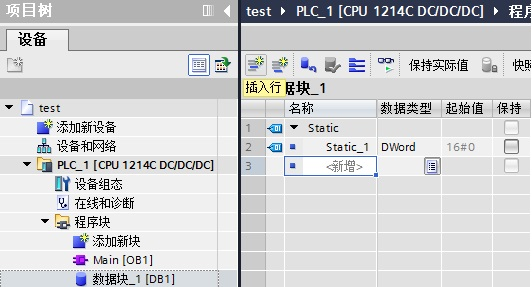
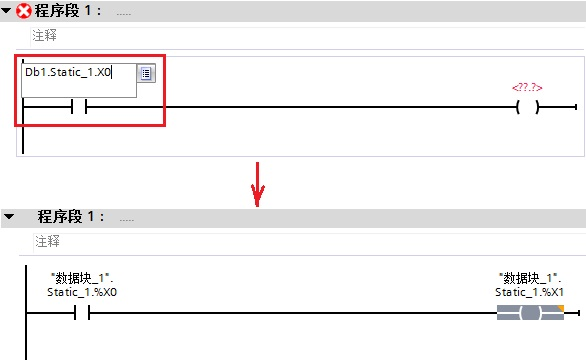
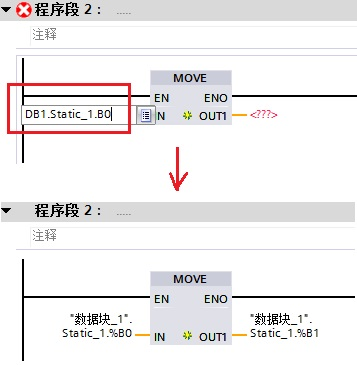
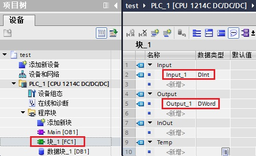
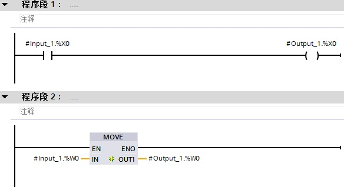

### S7-1200 使用 Slice 方式对变量进行寻址 {#s7-1200-使用-slice-方式对变量进行寻址 .STYLE1}

可以选择包含所声明变量的特定地址区域，可以访问宽为 1 位、8 位、16 位或
32 位的区域，这种访问类型称之为"片段访问"（Slice access）。

通过
slice（片段访问）方式，可以选择所声明变量中的特定寻址区域；可以实现从单个位到变量级别的符号访问；片段访问不能寻址常量。

slice 方式支持这2种方式的块：可标准访问的块、可优化访问的块。

#### [1. 语法表达]{.STYLE9} {#语法表达 .STYLE8}

下列语法用于寻址：

1\. \<Tag\>.x\<Bit number\>

2\. \<Tag\>.b\<BYTE number\>

3\. \<Tag\>.w\<WORD number\>

4\. \<Tag\>.d\<DWORD number\>

语法说明

  ----------------------------------- -----------------------------------
  部分                                说明

  \<Tag\>                             访问的变量标识。

  x\                                  访问宽度为"位（1 位）"的标识\
  b\                                  访问宽度为"字节（8 位）"的标识\
  w\                                  访问宽度为"字（16 位）"的标识\
  d                                   访问宽度为"双字（32 位）"的标识

  \<BIT number\>                      待访问 \<tag\> 内的位号。 编号 0
                                      表示访问最低有效位。

  \<BYTE number\>                     待访问 \<tag\> 内的字节号。编号 0
                                      表示访问最低有效字节。

  \<WORD number\>                     访问的 \<tag\> 内的字号。编号 0
                                      表示访问最低有效字。

  \<DWORD number\>                    访问的 \<tag\> 内的双字号。编号 0
                                      表示访问最低有效双字。
  ----------------------------------- -----------------------------------

通常针对Byte、Word等数据类型的变量进行片段访问，如图1所示，此外也可以对
INT、DINT 等整数数据类型的变量进行片段访问。

{width="1214" height="274"}

[图 1 片段访问结构 ]{.STYLE8}

#### 2. 使用说明 {#使用说明 .STYLE9}

**1. 使用 DB 块变量进行 Slice 访问**

创建一个 S7-1200 的项目，在程序块中新建一个 DB
块（优化的块访问），创建一个变量，数据类型为
DWord，可以看到该变量没有绝对地址，如图 2 所示。

{width="532" height="287"}

图 2 创建 DB 块变量

在程序段 1
中插入常开和赋值指令，常开指令填写地址"DB1.Static_1.X0"，赋值指令填写地址"DB1.Static_1.X1"，其中
X0 和 X1 分别表示变量 Static_1 的第 0 位和第 1 位，如图 3 所示。

{width="586" height="362"}

图 3 对 DB 块变量的位进行 Slice 访问

在程序段 2 中插入 MOVE 指令，IN 管脚填写地址"DB1.Static_1.B0"，OUT
管脚填写地址"DB1.Static_1.B1"，其中 X0 和 X1 分别表示变量 Static_1 的第
0 字节和第 1 字节，如图 4 所示。

{width="357" height="365"}

图 4 对 DB 块变量的字节进行 Slice 访问

依次类推，对字访问，就是填写地址"DB1.Static_1.W0"和"DB1.Static_1.W1"。

**2. FB、FC 块接口变量的 Slice 访问**

创建程序块（本例创建 FC 块，优化的块访问），在 Input 和 Output
分别创建变量"Input_1"和"Output_1",数据类型分别是 DInt 和
Dword，可以看到这两个变量没有绝对地址，如图 5 所示。

{width="502" height="307"}

图 5 创建 FC 块接口变量

程序段
1，常开指令填写地址"Input_1.X0"，赋值指令填写地址"Output_1.X0"；程序段2，MOVE
指令的 IN 管脚填写地址"Input_1.W0"，OUT
管脚填写地址"Output_1.W0"。最后如图 6 所示。

{width="584" height="318"}

图 6 对 FC 接口变量进行 Slice 访问
