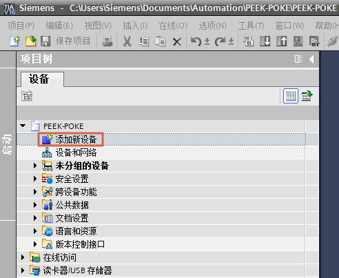
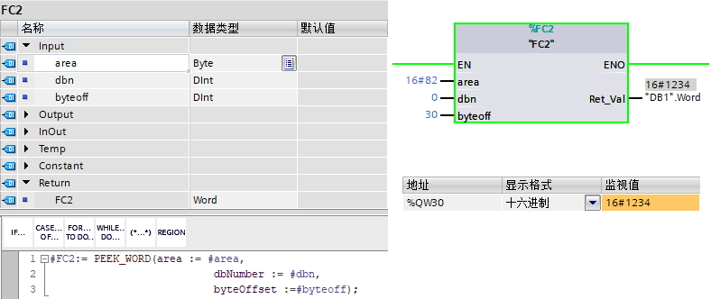
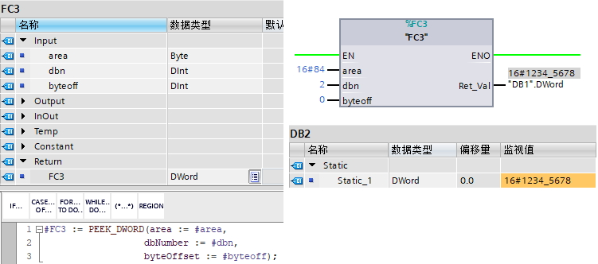
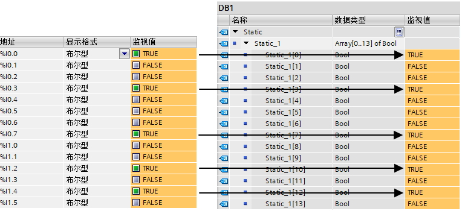
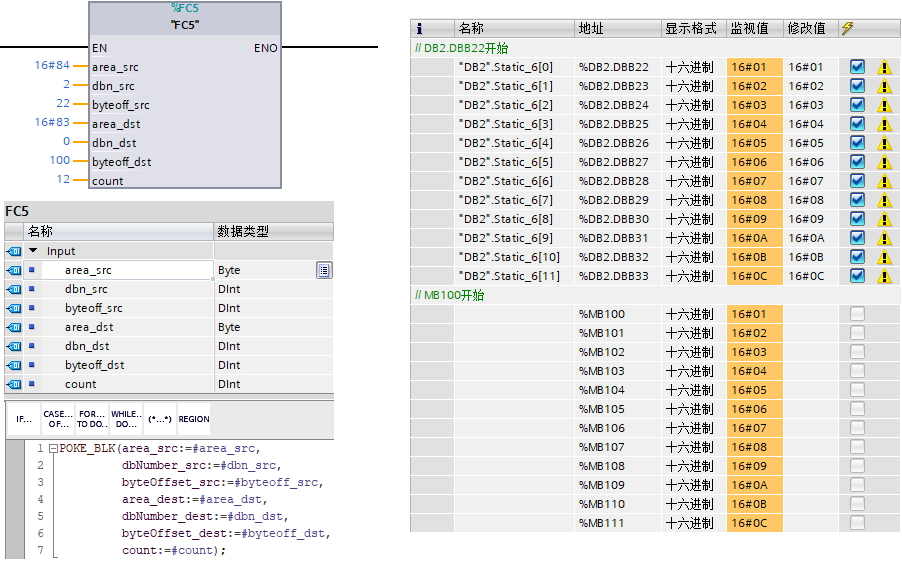
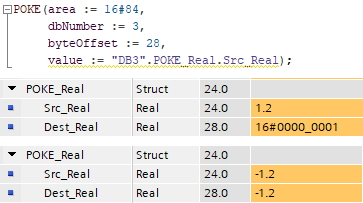

# PEEK 和 POKE 指令 

## S7-1200 SCL PEEK 和 POKE 指令使用

使用S7-1200 SCL 编程语言的 PEEK 和 POKE 指令，可以实现对 I/O、M 存储器和数据块的读取或写入。 而通过 POKE_BLK 指令，还可以实现数据区域的复制或移动。

指令适用条件：

* 只用于 SCL 编程语言；
* 软件从TIA PORTAL V11 SP2起；
* S7-1200 CPU 固件从 V2.2起；
* 适用操作数，I、Q、M、DB；
* DB必须是非优化访问的块。

本文生成环境：

* 硬件： CPU1214C V4.4
* 软件：Windows 10 Pro 1903和 TIA PORTAL 专业版 V16

## 一、项目生成与指令位置：

（1）创建 S7-1200 项目文件  
在TIA PORTAL 创建新项目，双击“添加新设备”在项目中添加 S7-1200 PLC_1，CPU 1214C DC/DC/DC。

图1 添加新设备

（2）添加 SCL 逻辑块  
展开 PLC_1，双击“程序块”中的“添加新块”，选择语言“SCL”，添加 FC 块，名称为 FC1 。

图2 添加新块

（3）添加 PEEK、POK E指令  
双击 FC1 打开 SCL 逻辑块，将指令的“基本指令>移动操作>读写存储器”中 PEEK、POKE指令拖入程序编辑区。

图3 添加指令

## 二、PEEK 指令

## 1、指令格式

PEEK 指令用来读取输入（I）、输出（Q）、存储器（M）或数据块（DB）变量，支持位、字节、字、双字操作。PEEK指令将获取的数据值以返回值的方式赋值给对应的变量。

PEEK_BOOL，读位变量，指令格式。  

图4 PEEK_BOOL

PEEK (_BYTE) ，读字节变量，指令中BYTE 类型可省略，指令格式。  

图5 PEEK_BYTE

PEEK_WORD，读字变量，指令格式。  

图6 PEEK_WORD

PEEK_DWORD，读双字变量，指令格式。  

图7 PEEK_DWORD

需要注意的是，在指令列表中只有PEEK和PEEK\_BOOL两个指令，而PEEK相当于PEEK\_BYTE，当需要使用PEEK\_WORD或者PEEK\_DWORD，可以在将指令拖拽到程序编辑区后手动添加后缀，或者在程序中直接输入指令然后通过选择的方式选定，如图8所示。

图8 输入PEEK

参数area，根据数据所在区域的不同有四种取值。

| area值 | 类型  | 说明  |
| --- | --- | --- |
| 16#81 | I   | 输入区变量 |
| 16#82 | Q   | 输出区变量 |
| 16#83 | M   | M区变量 |
| 16#84 | DB  | 数据块变量 |

## 2、示例程序

（1） PEEK_BOOL 指令

将 M0.1 的状态值读取到 M0_7（M0.7），执行结果如图9 所示：

图9 PEEK_BOOL

（2） PEEK(_BYTE)指令

将 IB20 的值读取到 DB1的Byte类型变量，执行结果如图10 所示：

图10 PEEK(_BYTE)

（3） PEEK_WORD指令

如图11 所示， FC2 是字寻址，执行 FC2，将 QW30 的值读取到 DB1的Word类型变量：

图11 PEEK_WORD

（4） PEEK_DWORD指令

如图12 所示， FC3 是双字寻址，执行 FC3，将变量 DB2.DBD0 的值读取到 DB1的DWord类型变量：

图12 PEEK_DWORD

## 3\. 应用案例

将CPU1214C本体的起始地址I0.0的14个I点的值，分别送入DB1的14个Bool的数组的每一个元素，对应方式：

* I0.0 -- > 元素0
* I0.1 -- > 元素1
* I0.7 -- > 元素7
* I1.0 -- > 元素8
* I1.1 -- > 元素9
* I1.5 -- > 元素13

通过上述对应关系，可以发现规律，数组元素下标从0开始逐个加1，对应的I点输入地址的位变量是从0到7再往复，而字节地址是先是8个0，然后是1，所以总结是字节地址是下标整除8的商，位地址是下标整除8的余数，换成编程语言就是字节地址是下标/8，位地址是下标MOD8。然后就可以利用FOR循环来快速实现逐个位的赋值，如图13所示。结果如图14所示。

图13 程序示例

图14 程序结果

## 三、POKE 写指令

## 1、指令格式

POKE 指令可以用来对输入（I）（一般不使用）、输出（Q）、存储器（M）或数据块（DB）变量地址进行写操作，不仅支持位、字节、字、双字操作，还可以区域操作，实现区域数据移动。  
POKE 指令，可在指令体内将结果传递给对应变量。

POKE 位操作：

图15 POKE 位操作

POKE 字节、字、双字操作：

图16　POKE字节、字、双字

说明：POKE指令和PEEK指令不同，没有POKE\_BYTE、POKE\_WORD、POKE_DWORD指令，实现写入字节、字、双字，取决于待写入的变量value的数据类型，如图17所示，不同的数据类型写入的结果不同。

图17 POKE区别

将源数据块、I/O 或存储区从 byteOffset 开始的“count”个字节，写入目标数据块、I/O 或存储区 byteOffset 开始的区域。

图18　POKE_BLK  

参数area，根据数据所在区域的不同有四种取值。

| area值 | 类型  | 说明  |
| --- | --- | --- |
| 16#81 | I   | 输入区变量 |
| 16#82 | Q   | 输出区变量 |
| 16#83 | M   | M区变量 |
| 16#84 | DB  | 数据块变量 |

## 2、示例程序

（1）POKE_BOOL 指令

将 M0_1（M0.1） 的状态值写入 Q0.7，执行结果如图19 所示：

图19 POKE_BOOL

（2） POKE指令

使用 POKE 指令编写程序 FC4 ，将 MW2 的值写入 DB2.DBW20，执行结果如图20 所示：

图20 POKE字操作

**（3****） POKE_BLK指令**

使用 POKE_BLK 指令编写程序 FC5，将 DB2.DBB22开始的12个字节的值写入 MB100 开始的地址，执行结果如图21 所示：

图21 POKE_BLK

## 四、常见问题

1\. 如何使用PEEK指令将一个Real类型变量读取到另一个Real类型？

因为PEEK指令不检查数据类型，所以理论上可以输入一个Real类型变量的地址，返回一个Real类型，但是实际上和想象不同，如图22 所示。

图22 PEEK指令

当输入一个浮点数，输出的浮点数是一个乱码似的数，需要使用DWORD\_TO\_REAL把该数进行转换，但是转换结果会产生一定的误差。

为了解决这个问题，可以先将原始Real变量使用PEEK指令转换为Dword类型，然后使用DWORD\_TO\_REAL，如图23 所示。

同样是输入1.2，输出也是1.2了。

所以建议使用第二种方法，也就是先将原始Real变量使用PEEK指令转换为Dword类型，然后使用DWORD\_TO\_REAL。

2\. 如何使用POKE指令将一个Real类型变量写入到另一个Real类型？

和问题1类似，因为POKE指令不检查数据类型，所以理论上可以输入一个Real类型变量的地址，返回一个Real类型，但是解决方法和第一个不太一样，如图24 所示。

图24 POKE指令

当输入一个正数，输出的数是通过ROUND取证的一个DINT类型，需要再转换，并且精度丢失，而输入一个负数，输出正常，这种方法肯定是不可取的。

为了解决这个问题，可以先将原始Real类型使用Real\_TO\_DWord转换为Dword类型，然后使用POKE指令，如图25 所示。

图25 POKE指令

所以建议使用第二种方法，先将原始Real类型使用Real\_TO\_DWord转换为Dword类型，然后使用POKE指令。