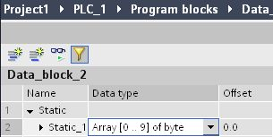

# FieldRead 和 FieldWrite 间接寻址指令

从STEP7 Basic V10.5 + SP2 以上可以使用 FieldRead 和 FieldWrite
指令对数组单元进行间接寻址.

## **指令的调用:**

STEP7 Basic V10.5 + SP2 版本软件在指令树里无法直接找到 FieldRead 和
FieldWrite
指令,调用这两个指令必须先从工具栏中调用一个空指令块,双击问号,从下拉菜单中选择添加指令,操作步骤如图1.

{width="784" height="213"}

图1. 调用 FieldRead 和 FieldWrite 指令

从TIA V11起 FieldRead 和 FieldWrite 指令就可以在指令树里直接找到了。

## 创建DB块，并建立 Array 数据类型的变量

{width="305" height="153"}

图2. 创建DB块并定义数组

## FieldRead 指令

INDEX: 要读取的数组的单元号

MEMBER: 数组单元首地址

VALUE: 存储读出的数据

下例中是读取数组单元\[1\]中的数据11,并保存在参数 VALUE: MB110 中。

{width="795" height="169"}

图3. 读取数组单元中的数据

## FieldWrite 指令

INDEX: 要写入的数组的单元号

VALUE: 要写入的数据

MEMBER: 数组单元首地址

下例中是向数组单元\[2\]中写入数值5。

{width="796" height="168"}

图4. 向数组单元中写入数据

 

## 常见问题

{width="15" height="15"} **为什么软件里无法找到
FieldRead 和 FieldWrite 指令?**

**答:** 只有 STEP7 Basic V10.5 + SP2 以上的版本才支持 FieldRead 和
FieldWrite指令,并且指令树里也无法找到,只能通过调用空指令块,并在下拉菜单里选择使用这两个指令。

{width="15" height="15"} **FieldRead 和 FieldWrite**
**指令是否可以对其它数据区或数据类型实现间接寻址？**

**答：**FieldRead 和
FieldWrite指令只能对DB块中的数组单元进行间接寻址访问，DB
块中的其它数据类型以及其它数据区如M, I，Q 区数据都不支持这个功能。

{width="15" height="15"} **为什么FieldRead 和
FieldWrite** **指令的参数显示红色不正确？**

**答：**必须保证参数 \"MEMBER\" 和 \"VALUE\" 的数据类型一致,
如果一个是字节,一个是实数,就会显示红色不正确的提示,如图5.

{width="916" height="200"}

图5. 参数的正确设置
