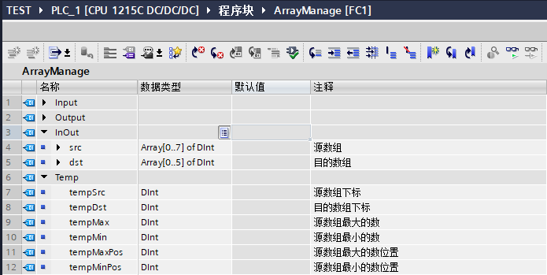
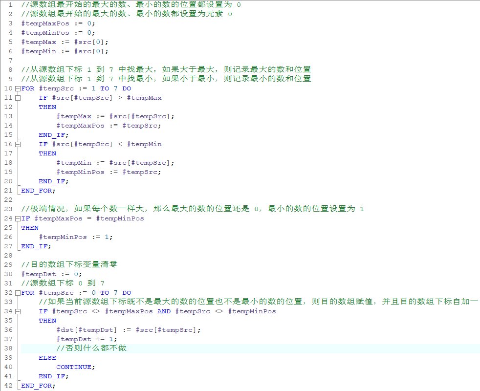
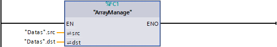
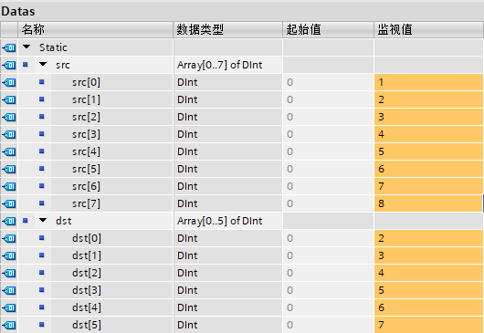
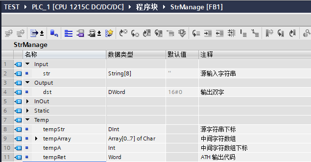
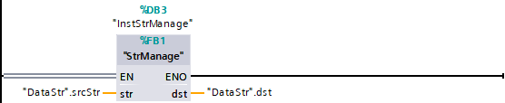
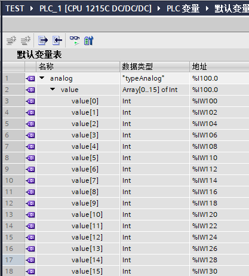
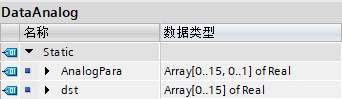
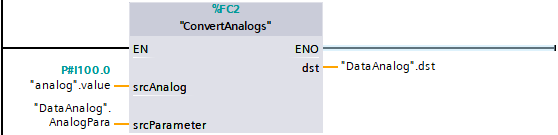

### S7-1200 使用数组实现间接寻址 {#s7-1200-使用数组实现间接寻址 .STYLE1}

[S7-1200 从 固件版本 V2.0
开始就支持数组下标使用变量的方式，这就意味着数组是最方便的间接寻址的方法，通过改变下标变量实现各式各样的功能。]{.STYLE8}

数组的基本介绍参见链接：[链接](../../02-basic/01-Data_Type/04-Array.html)。

数组间接寻址通常有这么几种

-   [DB 中数组，或者块接口、Static、Temp 的数组](05-Array.html#a)
-   [字符串字符间接寻址](05-Array.html#b)
-   [I、Q 的数组](05-Array.html#c)
-   [FB 多重背景的数组](05-Array.html#d)
-   [DB_ANY 的数组](05-Array.html#e)

下面就这几种情况分别介绍。

通常数组间接寻址都是使用 SCL 进行编程，因为这往往伴随着 FOR
循环方便实现，下面都是 SCL 的编程案例。但这不意味着 LAD
无法实现，可以在上面数组介绍中查看如何在 LAD 中实现变址。

#### []{#a}1. 普通数组变量 {#普通数组变量 .STYLE9}

普通数组变量就是一般常见的在 DB
块中直接定义的数组，或者在块接口中出现的，例如常见的 FB 静态变量的数组。

举例：从数组变量中找出最大和最小，然后剔除后按原顺序送入另一数组。整个过程如图
1、2、3、4 所示。

例子程序的源文件链接：[源文件](images/ArrayManage.scl)，使用链接的方式如下：[使用方法](../05-SCL/03-FAQ.html#c)。

[以下例程仅供参考。**读者如欲采纳，风险自担**。]{.STYLE2}

{width="695" height="349"}

图 1. 定义 FC 块接口

{width="982" height="800"}

图 2. 编写程序

{width="557" height="95"}

图 3. 调用块

{width="530" height="365"}

图 4. 监视结果

#### []{#b}2. 字符串字符间接寻址

默认情况下，数据类型 String 和 WString 都包含 254 个字符，WString
最多可以定义 16382
个字符，这些字符可以通过下标进行读取，并且可以认为是数组实现变址寻址。

注意：字符下标是从 1 开始。

举例：将 String\[8\] 中的 0 - 9 和 A-F、a-f
以外的字符去掉，然后转换为一个 DWord 变量。整个过程如图 5、6、7、8
所示。

因为 FC 无法定义带长度的字符串参数接口，所以使用 FB。

例子程序的源文件链接：[源文件](images/StrManage.scl)，使用链接的方式如下：[使用方法](../05-SCL/03-FAQ.html#c)。

[以下例程仅供参考。**读者如欲采纳，风险自担**。]{.STYLE2}

{width="635" height="331"}

图 5. 定义 FB 块接口

{width="751" height="475"}

图 6. 编写程序

{width="556" height="114"}

图 7. 调用块

{width="449" height="98"}

图 8. 监视结果

注：如果对字符串不处理直接进行 ATH 转换，结果如图 9
所示。所有的不合规的字符都转换为 0。

{width="447" height="98"}

图 9. 监视结果

#### []{#c}3. I、Q 的数组

在 PLC 变量表 I、Q 是不能直接定义为数组的，但是从 CPU V4.0
固件以后，I、Q 可以定义为 PLC 数据类型，这样在 PLC
数据类型中定义数组，间接的使得 I、Q
成为数组数据类型，方便的间接寻址，无需再使用 PEEK 指令。

举例：对 IW100 开始 16 个模拟量进行标定。整个过程如图 10、11、12、13、14
所示。

例子程序的源文件链接：[源文件](images/ConvertAnalogs.scl)，使用链接的方式如下：[使用方法](../05-SCL/03-FAQ.html#c)。

[以下例程仅供参考。**读者如欲采纳，风险自担**。]{.STYLE2}

{width="1108" height="395"}

图 10. 编写程序

{width="465" height="142"}

图 11. 定义 PLC 数据类型

{width="417" height="462"}

图 12. 定义 PLC 变量

{width="342" height="99"}

图 13. 定义数据块

{width="558" height="135"}

图 14. 调用程序

#### []{#d}4. FB 多重背景的数组

文档参见[链接](../../02-basic/01-Data_Type/04-Array.html#c)。

#### []{#e}5. DB_ANY 的数组

用于基于 UDT 的 DB_ANY
文档参见[链接](../../02-basic/01-Data_Type/08-DB_ANY.html#UDT)。

用于基于 TO 的 DB_ANY
文档参见[链接](../../02-basic/01-Data_Type/08-DB_ANY.html#motion)。
