# 通过 PROFINET 数据记录库读取 S7-1200 的 IP 地址、MAC 地址及 MRP 环状态

通过 PROFINET 数据记录库中的功能块，可以获取 PROFINET 设备的 IP
地址、MAC 地址、MRP 环状态等数据。

本例中使用 S7-1200 连接 ET200SP 为例介绍相应功能块的使用方法。

硬件：
1.CPU 1215C DC/DC/DC，V4.5
2.ET200SP PN/2 HF，V4.2
3.SCALANCE X204IRT，V5.4

软件：
TIA PORTAL V17

PROFINET 数据记录库下载地址：
**<https://support.industry.siemens.com/cs/us/en/view/109753067>**

## 1. 读取 IP 地址和 MAC 地址

使用 LPNDR_ReadGlobalInfo 函数块可以读取 PROFINET 设备的 IP 地址和 MAC
地址。

### 1-1 使用 TIA PORTAL V17 创建项目

使用 TIA PORTAL V17 创建一个新项目，组态 CPU S7-1200 与分布式 IO ET200SP
,设置 IP 地址，并确认设备名称后下载到 PLC 中，如图 1、2、3 所示。

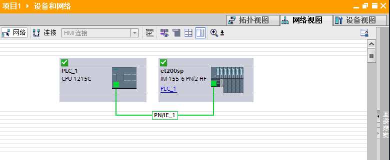{width="780" height="321"}

图 1、在新项目中组态 S7-1200 和 ET200SP

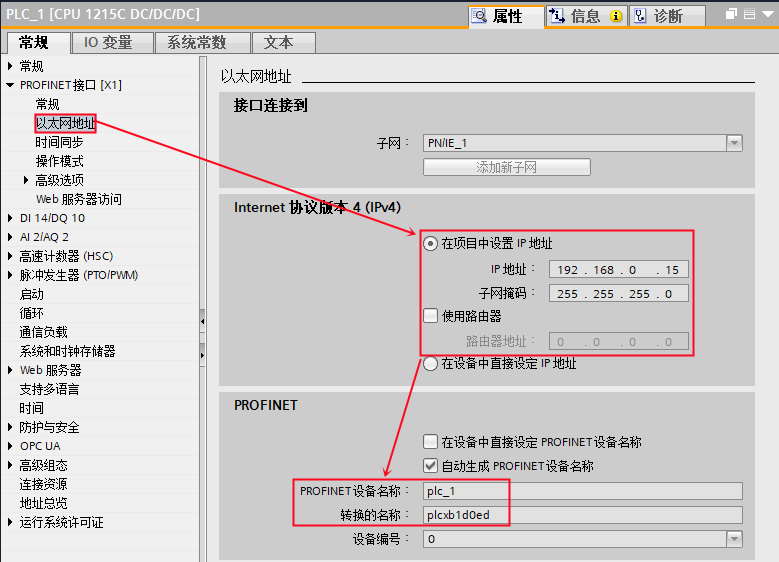{width="779" height="562"}

图 2、设置 S7-1200 参数

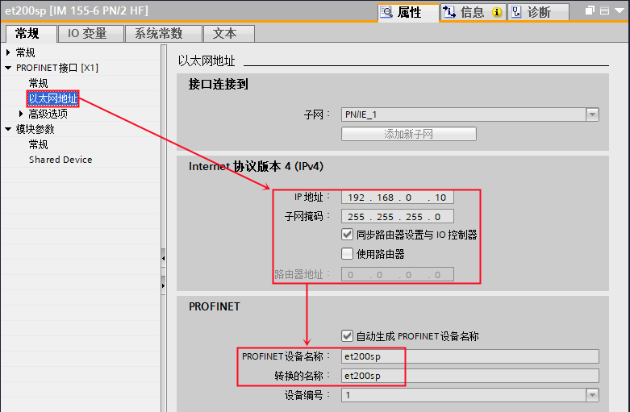{width="781" height="511"}

图 3、设置 ET200SP 参数

### 1-2 编程调用 LPNDR_ReadGlobalInfo 函数块

通过库选项在全局库中打开 PROFINET 数据记录库，从库中调用
LPNDR_ReadGlobalInfo 函数块，如图 4 所示。

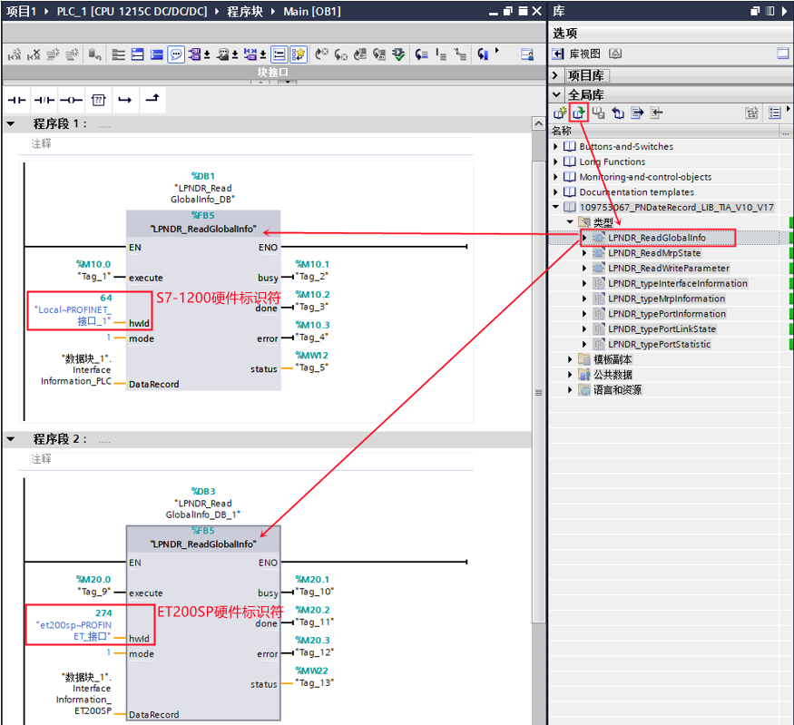{width="875" height="799"}

图 4、调用 LPNDR_ReadGlobalInfo 函数块

表 1、LPNDR_ReadGlobalInfo 引脚说明

| 参数  | 声明  | 数据类型 | 说明  |
| --- | --- | --- | --- |
| execute | IN  | Bool | 读数据记录 |
| hwId | IN  | HW_IO | PROFINET 接口硬件标识符 |
| mode | IN  | Int | 允许值：  1： 接口信息  2： MRP 信息  3： 端口信息  4：端口连接状态  5：端口统计 |
| busy | OUT | Bool | 命令执行中 |
| done | OUT | Bool | 命令执行完成 |
| error | OUT | Bool | 发生错误 |
| status | OUT | Word | 错误说明 |
| DataRecord | IN_OUT | Version | 将信息读取到的目标区域  根据“mode”参数选择数据类型声明目标区域 |

程序段 1 中，用于读取 CPU 1215C 的接口信息，因此 hwId 选择 PLC PROFINET
接口的硬件标识符；mode 选择 1，读取接口信息；DataRecord
选择数据类型为"LPNDR_typeInterfaceInformation"用于接收读取到的接口参数。

程序段 2 中，用于读取 ET200SP 的接口信息，因此 hwId 选择 ET200SP
PROFINET 接口的硬件标识符；mode 选择 1 ，读取接口信息；DataRecord
选择数据类型为"LPNDR_typeInterfaceInformation"用于接收读取到的接口参数。

### 1-3 测试结果

分别触发程序段 1、程序段 2 中功能块的 execute 管脚，执行程序后在
DataRecord 管脚连接的变量中读取到相应的接口信息，如图 5 、6 所示。

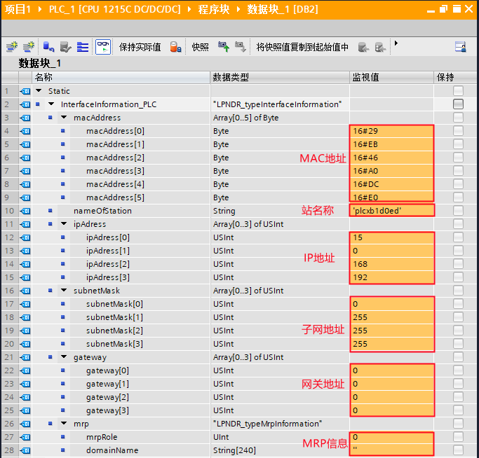{width="683" height="654"}

图 5、读取 S7-1200 接口信息

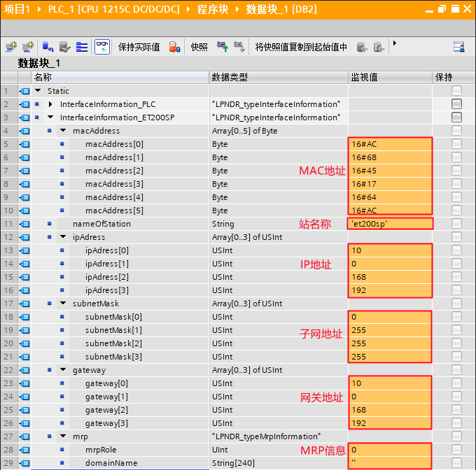{width="680" height="672"}

图 6、读取 ET200SP 接口信息

## 2. 读取MRP环状态

使用 LPNDR_ReadMRPState 函数块可以读取 PROFINET 设备(MRP管理员)的 MRP
环的状态。

### 2-1 组态编程

使用 TIA PORTAL V17 创建一个新项目，组态 CPU S7-1200、分布式IO ET200SP
及 SCALANCE X204 IRT 交换机，网络视图如图 7 所示，并组态拓扑视图，如图 8
所示。

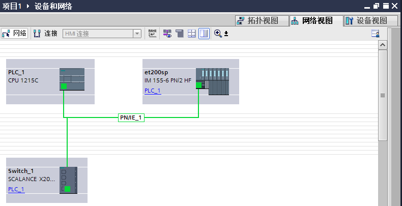{width="790" height="405"}

图 7、网络视图组态

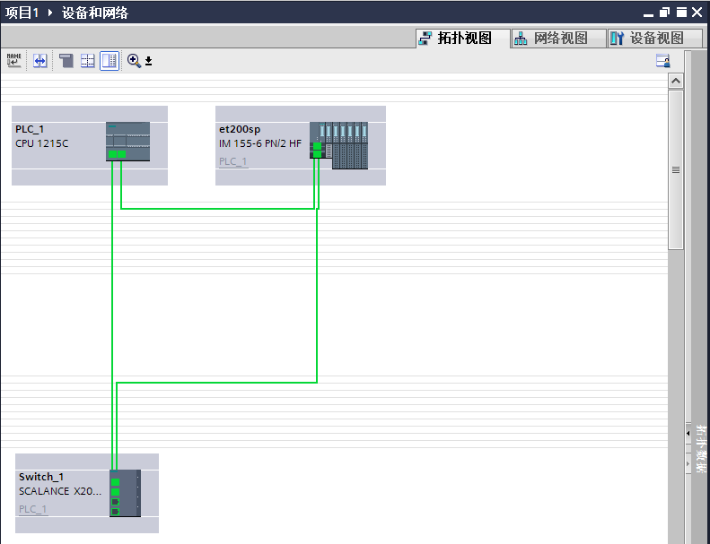{width="791" height="607"}

图 8、拓扑视图组态

分别设置 S7-1200、ET200SP 及 SCALANCE X204 IRT 的介质冗余角色，将
S7-1200 与 ET200SP 设置为客户端，将 SCALANCE X204 IRT 设置为管理员，如图
9、10、11 所示。

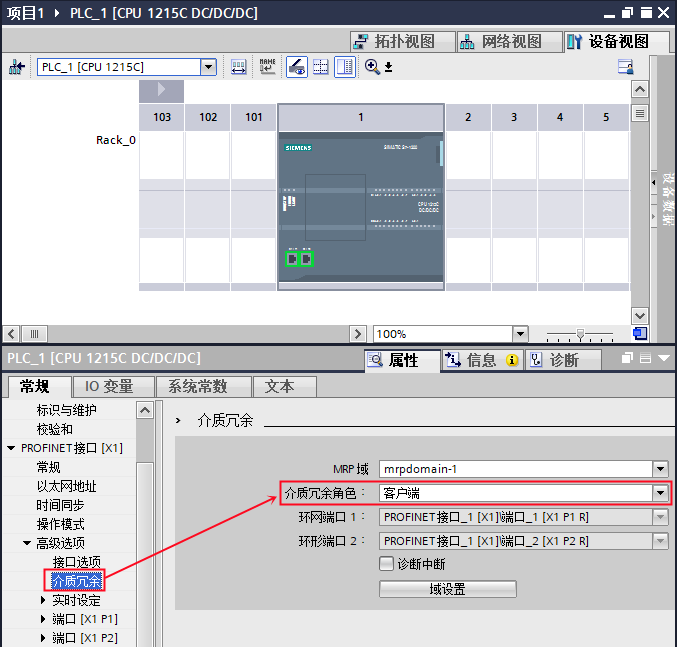{width="677" height="647"}

图9、组态 S7-1200 为介质冗余客户端

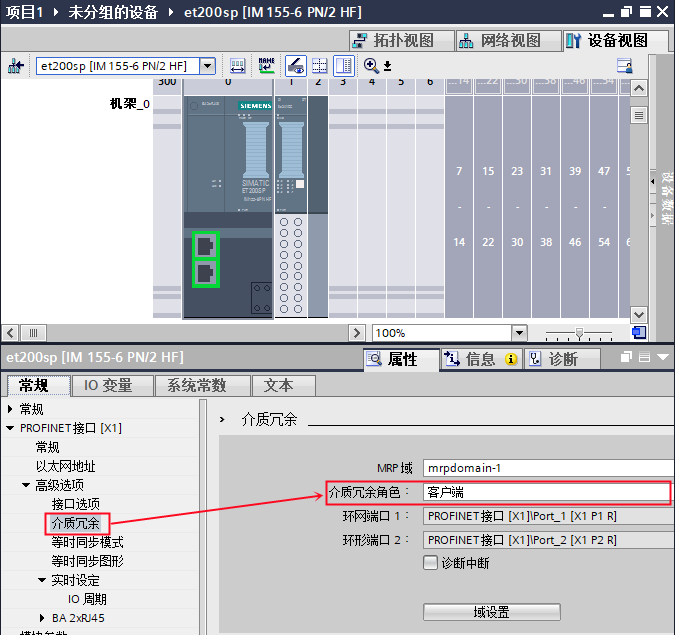{width="675" height="635"}

图 10、组态 ET200SP 为介质冗余客户端

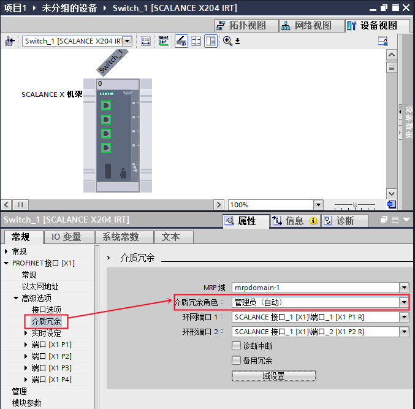{width="677" height="667"}

图 11、组态 SCALANCE X204 IRT 为介质冗余管理员

### 2-2 编程调用 LPNDR_ReadMRPState 函数块

编程调用 LPNDR_ReadMRPState 函数块，用于检测 MRP 环状态，如图 12 所示。

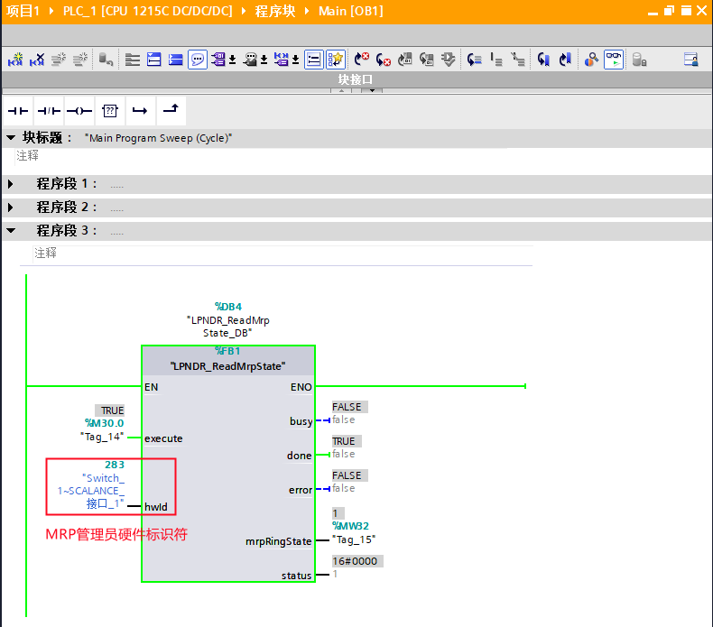{width="790" height="695"}

图 12、调用 LPNDR_ReadMRPState 函数块

表 2、LPNDR_ReadMRPState 引脚说明

|参数          | 声明   |数据类型  |               说明|
|--------------|------|----------|---------------------|
|execute       | IN     |Bool  |       读数据记录|
|hwId          | IN     |HW_IO   |   MRP 管理员接口硬件标识符|
|busy        ||OUT  |      |Bool  |       命令执行中|
|done         ||OUT  |      |Bool  |       命令执行完成|
|error          ||OUT  |      |Bool  |       发生错误|
|mrpRingState   |OUT  |    Word      | MRP 环状态|
|status         |OUT  |    Word      | 错误说明|

### 2-3 测试结果

当 MRP 环连接闭合情况下，通过触发 execute 管脚执行 LPNDR_ReadMRPState
函数块，可以看到输出管脚 mrpRingState 为 1，说明 MRP 环为闭合状态，如图
13 所示。

当 MRP 环连接打开情况下，通过触发 execute 管脚执行 LPNDR_ReadMRPState
函数块，可以看到输出管脚 mrpRingState 为 0，说明 MRP 环为打开状态，如图
14 所示。

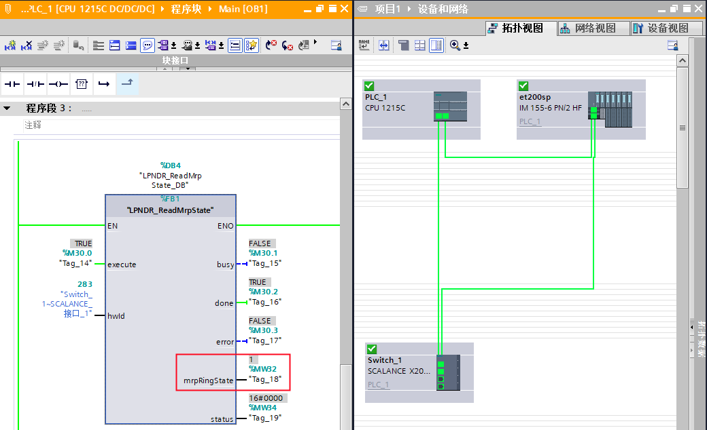{width="1040" height="634"}

图 13、MRP 环闭合状态

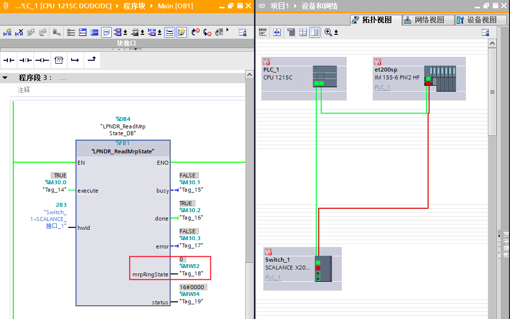{width="1040" height="651"}

图 14、MRP 环打开状态
