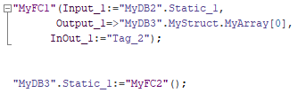
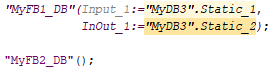
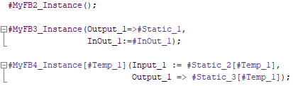
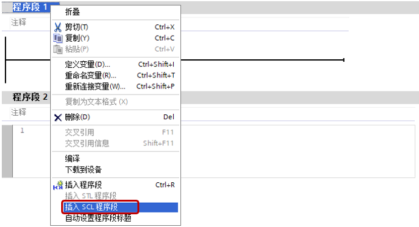

# SCL介绍

## SCL 编程语言

SCL（Structured Control Language，结构化控制语言）是一种基于 PASCAL 的高级编程语言。 这种语言基于标准 DIN EN 61131-3（国际标准为 IEC 1131-3）。

根据该标准，可对用于可编程逻辑控制器的编程语言进行标准化。 SCL 编程语言实现了该标准中定义的 ST 语言 (结构化文本) 的 PLCopen 初级水平。

S7-1200从V2.2版本开始支持SCL语言。

**语言元素**

SCL 除了包含 PLC 的典型元素（例如，输入、输出、定时器或存储器位）外，还包含高级编程语言。

* 表达式
    
* 赋值运算
    
* 运算符
    

**程序控制语句**

SCL 提供了简便的指令进行程序控制。例如，创建程序分支、循环或跳转。

**应用**

因此，SCL 尤其适用于下列应用领域：

* 数据管理
    
* 过程优化
    
* 配方管理
    
* 数学计算 / 统计任务
    

## 表达式

说明：表达式将在程序运行期间进行运算，然后返回一个值。一个表达式由操作数（如常数、变量或函数调用）和与之搭配的操作符（如 \*、/、\+ 或 -）组成。通过运算符可以将表达式连接在一起或相互嵌套。

**运算顺序**

表达式将按照下面因素定义的特定顺序进行运算：

* 相关运算符的优先级，优先级数越小越优先
    
* 同等优先级运算符的运算顺序按照从左到右的顺序
    
* 赋值运算的计算按照从右到左的顺序进行
    
* 括号优先级最高
    

**表达式类型**

不同的运算符，分别可使用以下不同类型的表达式：

* 算术表达式
    
* 关系表达式
    
* 逻辑表达式
    

## 算数表达式

**说明：算术表达式既可以是一个数字值，也可以是由带有算术运算符的两个值或表达式组合而成。**

算术运算符可以处理当前 CPU 所支持的各种数据类型。如果在该运算中有 2 个操作数，那么可根据以下条件来确定结果的数据类型：

* 如果这 2 个操作数均为有符号的整数，但长度不同，那么结果将采用长度较长的那个整数数据类型（例如，Int + DInt = DInt）。
    
* 如果这 2 个操作数均为无符号整数，但长度不同，那么结果将采用长度较长的那个整数数据类型（例如，USInt + UDInt = UDInt）。
    
* 如果一个操作数为有符号整数，另一个为无符号整数，那么结果将采用另一个长度较大的有符号数据类型（其包含此无符号整数）（例如，SInt + USInt = Int）
    
* 如果一个操作数为整数，另一个为浮点数，那么结果将采用浮点数的数据类型（例如，Int + Real = Real）。
    
* 如果 2 个操作数均为浮点数，但长度不同，结果将采用长度较长的那个浮点数的数据类型（例如，Real + LReal = LReal）。
    
* 对于操作数为"Time"和"日期和时间"数据类型组，运算结果的数据类型请参见表1。
    

**算术表达式的数据类型**

表1列出了在算术表达式中可使用的数据类型：

| 运算  | 运算符 | 优先级 | 第一个操作数 | 第二个操作数 | 结果  |
| --- | --- | --- | --- | --- | --- |
| 乘方  | **  | 2   | 整数/浮点数 | 整数/浮点数 | 浮点数 |
| 正号  | +   | 3   | 整数/浮点数 | -   | 整数/浮点数 |
| Time | Time |
| 负号  | -   | 整数/浮点数 | -   | 整数/浮点数 |
| Time | Time |
| 乘法  | *   | 4   | 整数/浮点数 | 整数/浮点数 | 整数/浮点数 |
| Time | 整数  | Time |
| 除法  | /   | 整数/浮点数 | 整数/浮点数（≠0） | 整数/浮点数 |
| Time | 整数  | Time |
| 取模  | MOD | 整数  | 整数  | 整数  |
| 加法  | +   | 5   | 整数/浮点数 | 整数/浮点数 | 整数/浮点数 |
| Time | Time | Time |
| Time | DInt | Time |
| TOD | Time | TOD |
| TOD | DInt | TOD |
| Date | TOD | DTL |
| DTL | Time | DTL |
| 减法  | -   | 整数/浮点数 | 整数/浮点数 | 整数/浮点数 |
| Time | Time | Time |
| Time | DInt | Time |
| TOD | Time | TOD |
| TOD | DInt | TOD |
| TOD | TOD | Time |
| Date | Date | Time |
| DTL | Time | DTL |
| DTL | DTL | Time |

**示例**

以下为一些算术表达式的示例：

```c
"MyTag1":= "MyTag2" * "MyTag3";
```
## 关系表达式

**说明：关系表达式将两个操作数的值或数据类型进行比较，然后得到一个布尔值。如果比较结果为真，则结果为 TRUE，否则为 FALSE。**

关系运算符可以处理当前 CPU 所支持的各种数据类型。结果的数据类型始终为 Bool。

编写关系表达式时，请注意以下规则：

* 以下数据类型组中的所有变量都可以进行比较：
    
    * 整数/浮点数
        
    * 位、位序列
        
    * 字符串
    
* 对于以下数据类型，只能比较相同类型的变量：
    
    * TIME
        
    * 日期和时间
        
    * UDT
        
    * Array
        
    * Struct
        
    * Variant

* String 比较是对以 Windows 字符集编码的字符进行比较；而 WSting比较则是对 UTF-16 编码的字符进行比较。在比较过程中，将比较变量的长度及各字符对应的数值。
    
* Array 比较需要数组维度、数组元素数据类型与数量完全相同
    
* UDT、Array、Struct、Variant等进行的比较只能使用S7-1200 V4.2及其以上的版本。
    

**关系表达式的数据类型**

表2列出了在关系表达式中可使用的数据类型/数据类型组：

| 运算  | 运算符 | 优先级 | 第一个操作数 | 第二个操作数 | 结果  |
| --- | --- | --- | --- | --- | --- |
| 小于、小于等于、大于、大于等于 | &lt;、<=、&gt;、>= | 6   | 整数/浮点数 | 整数/浮点数 | Bool |
| 位序列 | 位序列 | Bool |
| 字符串 | 字符串 | Bool |
| Time | Time | Bool |
| 日期和时间 | 日期和时间 | Bool |
| 等于、不等于 | =、<> | 7   | 整数/浮点数 | 整数/浮点数 | Bool |
| 位序列 | 位序列 | Bool |
| 字符串 | 字符串 | Bool |
| Time | Time | Bool |
| 日期和时间 | 日期和时间 | Bool |
| Variant | 任意数据类型 | Bool |
| UDT | UDT | Bool |
| Array | Array | Bool |
| Struct | Struct | Bool |

**示例**

以下举例说明了一个关系表达式：

```c
IF a > b THEN c:= a;  
IF A > 20 AND B < 20 THEN C:= TRUE;  
IF A<>(B AND C) THEN C:= FALSE;
```

## 逻辑表达式

**说明：逻辑表达式由两个操作数和逻辑运算符（AND、OR 或 XOR）或取反操作数 (NOT) 组成。**

逻辑运算符可以处理当前 CPU 所支持的各种数据类型。如果两个操作数都是 Bool 数据类型，则逻辑表达式的结果也为 Bool数据类型。如果两个操作数中至少有一个是位序列，则结果也为位序列而且结果是由最高操作数的类型决定。例如，当逻辑表达式的两个操作数分别是 Byte 类型和 Word 类型时，结果为 Word类型。

逻辑表达式中一个操作数为 Bool类型而另一个为位序列时，必须先将 Bool类型的操作数显式转换为位序列类型。

**逻辑表达式的数据类型**

下表列出了逻辑表达式中可使用的数据类型：

| 运算  | 运算符 | 优先级 | 第一个操作数 | 第二个操作数 | 结果  |
| --- | --- | --- | --- | --- | --- |
| 取反  | NOT | 3   | Bool | -   | Bool |
| 求反码 | 位序列 | -   | 位序列 |
| 与   | AND、& | 8   | Bool | Bool | Bool |
| 位序列 | 位序列 | 位序列 |
| 异或  | XOR | 9   | Bool | Bool | Bool |
| 位序列 | 位序列 | 位序列 |
| 或   | OR  | 10  | Bool | Bool | Bool |
| 位序列 | 位序列 | 位序列 |

**示例**

以下为一个逻辑表达式的示例：

```c
IF "MyTag1" AND NOT "MyTag2" THEN c := a;  
MyTag := A OR B;
```
## 赋值运算

**定义：通过赋值运算，可以将一个表达式的值分配给一个变量。赋值表达式的左侧为变量，右侧为表达式的值。**

函数名称也可以作为表达式。赋值运算将调用该函数，并返回其函数值，赋给左侧的变量。

赋值运算的数据类型取决于左边变量的数据类型。右边表达式的数据类型必须与该数据类型一致。

赋值运算的计算按照从右到左的顺序进行。

可通过以下方式编程赋值运算：

* **单赋值运算：**执行单赋值运算时，仅将一个表达式或变量分配给单个变量：

```c 
//示例：
a := b;
```  
* **多赋值运算：**执行多赋值运算时，一个指令中可执行多个赋值运算。
  
```c    
//示例：
a := b := c;

```

此时，将执行以下操作：

```c
b := c;

a := b;
```

* **组合赋值运算：**执行组合赋值运算时，可在赋值运算中组合使用操作符"+"、"-"、"*"和"/"：
```c   
//示例：
a += b;
```
此时，将执行以下操作：

```c
a := a + b;
```
也可多次组合赋值运算：
```c
a += b += c *= d;
```

此时，将按以下顺序执行赋值运算：

```c
c := c * d;

b := b + c;

a := a + b;
```   

**示例**

下表举例说明了单赋值运算的操作：

|     |     |
| --- | --- |
| "MyTag1" := "MyTag2"; | (\* 变量赋值 *) |
| "MyTag1" := "MyTag2" * "MyTag3"; | (\* 表达式赋值 *) |
| "MyTag" := "MyFC"(); | (\* 调用一个函数，并将函数值赋给 "MyTag" 变量 *) |
| #MyStruct.MyStructElement := "MyTag"; | (\* 将一个变量赋值给一个结构元素 *) |
| #MyArray\[2\] := "MyTag"; | (\* 将一个变量赋值给一个 ARRAY 元素 *) |
| "MyTag" := #MyArray\[1,4\]; | (\* 将一个 ARRAY 元素赋值给一个变量 *) |
| #MyString\[2\] := #MyOtherString\[5\]; | (\* 将一个 STRING 元素赋给另一个 STRING 元素 *) |

下表举例说明了多赋值运算的操作：

|     |     |
| --- | --- |
| "MyTag1" := "MyTag2" := "MyTag3"; | (\* 变量赋值 *) |
| "MyTag1" := "MyTag2" := "MyTag3" * "MyTag4"; | (\* 表达式赋值 *) |
| "MyTag1" := "MyTag2" := "MyTag3 := "MyFC"(); | (\* 调用一个函数，并将函数值赋值给变量 "MyTag1"、"MyTag1" 和 "MyTag1" *) |
| #MyStruct.MyStructElement1 := #MyStruct.MyStructElement2 := "MyTag"; | (\* 将一个变量赋值给两个结构元素 *) |
| #MyArray\[2\] := #MyArray\[32\] := "MyTag"; | (\* 将一个变量赋值给两个数组元素 *) |
| "MyTag1" := "MyTag2" := #MyArray\[1,4\]; | (\* 将一个数组元素赋值给两个变量 *) |
| #MyString\[2\] := #MyString\[3\]:= #MyOtherString\[5\]; | (\* 将一个 STRING 元素赋值给两个 STRING 元素 *) |

下表举例说明了组合赋值运算的操作：

|     |     |
| --- | --- |
| "MyTag1" += "MyTag2"; | (\* "MyTag1" 和 "MyTag2" 相加，并将相加的结果赋值给 "MyTag1"。*) |
| "MyTag1" -= "MyTag2" += "MyTag3"; | (\* "MyTag2" 和 "MyTag3" 相加。将相加的结果赋值给操作数"MyTag2"，再从 "MyTag1" 中减去"MyTag2"，计算结果将赋值给 "MyTag1"。*) |
| #MyArray\[2\] += #MyArray\[32\] += "MyTag"; | (\* 数组元素 "MyArray\[32\]" 加上 "MyTag"。计算结果将赋值给 "MyArray\[32\]"。之后这个数组元素 "MyArray\[32\]" 与数组中另一个元素"MyArray\[2\]"相加，然后将结果分配给数组元素 "MyArray\[2\]"。在该运算中，相应的数据类型必需兼容。*) |
| #MyStruct.MyStructElement1 /= #MyStruct.MyStructElement2 *= "MyTag"; | (\* 结构化元素 "MyStructElement2" 乘以 "MyTag"。计算结果将赋值给 "MyStructElement2"。之后，将结构化元素 "MyStructElement1" 除以 "MyStructElement2"，并将计算结果赋值给 "MyStructElement1"。在该运算中，相应的数据类型必需兼容。*) |

## 寻址与调用

## 寻址

SCL寻址分为符号寻址与地址寻址。

* 符号寻址
    * DB块变量："DB块名称"（."变量名称"）
    * PLC变量：变量名称
    * 局部变量：#变量名称
* 地址寻址
    * DB块变量：%DB块号（.变量地址），TIA PORTAL软件会判断该地址有没有对应符号名称，如果有则立即转换为符号名称，没有则保留绝对地址
    * PLC变量：%变量地址，TIA PORTAL软件会判断该地址有没有对应符号名称，如果有则立即转换为符号名称，没有则新建符号名称
    * Temp变量：SCL**不**支持非优化FC/FB的Temp变量的地址寻址

举例：

|     |     | 符号名 | 说明  |
| --- | --- | --- | --- |
| 符号寻址 | DB块变量 | "MyDB".Variable.Static1 |     |
| "MyDB".Array\[0\] | 访问数组元素 |
| "MyDB" | DB块名作为参数 |
| PLC变量 | "Start" |     |
| 局部变量 | #Input1 |     |
| #Temp1.x0 | 变量名片段访问 |
| 地址寻址 | DB块变量 | %DB2.DBB1 |     |
| %DB2 | DB块名作为参数，会立刻转换为DB块名 |
| PLC变量 | %M100.0 | 会立刻转换为"符号名" |
| %Q1.0:P | 会立刻转换为"符号名":P |

## 调用

程序调用分为以下几类：

* FC调用
* FB调用
* FB多重背景调用

调用可以从指令列表或者项目树程序块中拖拽入程序编辑区域，也可以直接输入。

**FC调用**

FC调用的格式是

* "FC块名称"(输入形参:=实参,输出形参=>实参,输入输出形参:=实参...)
* 返回值:=“FC块名称”(输入形参:=实参,输出形参=>实参,输入输出形参:=实参...)

FC调用需要确保所有形参都有对应实参。如果没有参数的FC也需要有括号。

如图所示的例子；



图1 FC调用

**FB调用**

FB调用的格式是

"背景数据块名称"(输入形参:=实参,输出形参=>实参,输入输出形参:=实参...)

一般情况下，FB的简单数据类型形参可以没有对应实参，复杂数据类型的输入、输出也可以没有对应实参，所以FB可以隐藏或不隐藏不出现的形参。如果没有参数的FB也需要有括号。

如图2所示，显示了一些FB调用的例子。



图2 FB调用

如图3所示，当FB的参数全部显示，在背景数据块右键可以激活"仅显示分配的参数"；当FB的参数只显示了分配的参数时，在背景数据块右键可以激活"显示所有参数"。


图3 显示分配/所有参数

**FB多重背景调用**

FB多重背景调用的格式是

* #多重背景(输入形参:=实参,输出形参=>实参,输入输出形参:=实参...)
* #多重背景\[索引\](输入形参:=实参,输出形参=>实参,输入输出形参:=实参...)

一般情况下，FB的简单数据类型形参可以没有对应实参，复杂数据类型的输入、输出也可以没有对应实参，所以FB可以隐藏或不隐藏不出现的形参。如果只有Static的FB也需要有括号。

如图4所示，显示了一些FB多重背景调用的例子。



图4 FB多重背景调用

注意：

对于定时器和计数器的SCL调用，有特殊的格式，请参考链接：定时器、计数器。

## 新建SCL

有两种方式新建SCL：

第一种是在新建块，选择OB/FC/FB后，设置语言为SCL，如图5所示。

第二种是在LAD、FBD中直接插入SCL语言段，这需要TIA PORTAL V14及其以上的版本，如图6所示。


图5 新建SCL块

①在项目树中，找到PLC，然后展开程序块，点击"添加新块"

②在弹出对话框中，选择块类型，可以是OB/FB/FC，

③选择语言为SCL



图6 在LAD中插入SCL段

## 区域与注释

和LAD/FBD不同，LAD/FBD在程序编辑器是一段一段的，编辑器可以插入新的网络段，每一个网络段可以有各自的注释。而SCL是文本语言，不分网络段（LAD/FBD语言内增加SCL除外），需要用其他的方法来解决。

## 区间

从TIA PORTAL V14以后，增加区间功能，使用指令：

REGION 区间名称

程序文本

ENDREGION

可以在指令中间增加需要编写的程序还不影响程序逻辑，并且支持嵌套。此外还可以像网络段一样收折叠来，如图7所示。


图7 区域

其中左边为区间总览，可以看出整体的结构

①使得程序或总览全部展开

②使得程序或总览全部折叠

③全部展开/折叠是针对总览与程序还是只针对总览，图中为针对总览与程序

④独立展开/折叠程序

## 注释

编辑器的空行，或者调用块的右侧均可以增加注释，如图8所示有两种方式注释：

第一种是： //注释内容

第二种是：(/*注释内容*/)

可以在工具栏中利用按钮整段注释或取消注释。此外从TIA PORTAL V16开始支持多语言注释，使用指令(*多语言注释内容*)，具体参考多[语言文档。](../../../08-Function/20-Language.md)


图8 注释

①注释掉选中段落

②对注释掉的段落取消注释