# SCL 指令

SCL作为一种编程语言，可以实现LAD/FBD所有的功能，大多数的指令与LAD/FBD都是相同的，只是在编辑器中的外形不同。只有一些指令使用是不太一样的甚至LAD/FBD没有的，这里只介绍这些不同的。

SCL特殊的指令有以下几种，如图1-3红框中的指令：

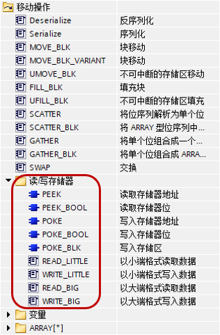

图1 读写存储器

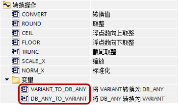

图2 转换操作

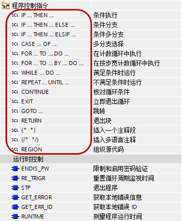

图3 程序控制指令

在这三部分中，读写存储器的PEEK POKE指令可以参考[链接](../03-Address/03-PEEK_POKE.html)，转换操作可以参考[链接](../../02-basic/01-Data_Type/08-DB_ANY.html#UDT)，这里只介绍图3的程序控制指令。

## 程序控制指令

程序控制指令见以下表格。

| 程序控制语句 |     | 说明  |
| --- | --- | --- |
| 选择  | [IF-THEN语句](02-Program.html#IF) | 用将程序执行转移到两个备选分支之一（取决于条件为 True 还是 False） |
| [CASE语句](02-Program.html#CASE) | 用于选择执行 n 个备选分支之一（取决于变量值） |
| 循环  | [FOR语句](02-Program.html#FOR) | 只要控制变量在指定值范围内，就重复执行某一语句序列 |
| [WHILE-DO语句](02-Program.html#WHILE) | 只要仍满足执行条件，就重复执行某一语句序列 |
| [REPEAT-UNTIL语句](02-Program.html#REPEAT) | 重复执行某一语句序列，直到满足终止条件为止 |
| 程序跳转 | [CONTINUE语句](02-Program.html#CONTINUE) | 停止执行当前循环迭代 |
| [EXIT语句](02-Program.html#EXIT) | 无论是否满足终止条件，都会随时退出循环 |
| [GOTO语句](02-Program.html#GOTO) | 使程序立即跳转到指定标签 |
| [RETURN语句](02-Program.html#RETURN) | 使程序立刻退出正在执行的块，返回到调用块 |

程序控制指令是SCL编程的基础，接近高级语言的指令，虽然这些功能通过LAD/FBD也可以实现，但使用SCL编写会更加方便，逻辑条理也更加清晰。

## IF：条件执行

**说明：使用"条件执行"指令，可以根据条件控制程序流的分支。该条件是结果为布尔值（True 或 False）的表达式。可以将Bool变量、逻辑表达式或比较表达式作为条件。**

执行该条件执行指令时，将对指定的表达式进行运算。如果表达式的值为 True，则表示满足该条件；如果其值为 False，则表示不满足该条件。

**参数**

根据分支的类型，可以对以下形式的指令进行编程：

* **IF...THEN... 分支：**
    
    IF &lt;条件&gt;
    
    THEN &lt;语句1&gt;
    
    END_IF;
    

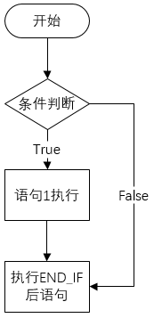

图4 IF...THEN... 分支

如果满足该条件，则将执行 THEN 后编写的指令。如果不满足该条件，则程序将从 END_IF 后的下一条指令开始继续执行。

* **IF...THEN... ELSE...分支：**
   
    
    IF &lt;条件&gt;
    
    THEN &lt;语句1&gt;
    
    ELSE &lt;语句2&gt;
    
    END_IF;
    

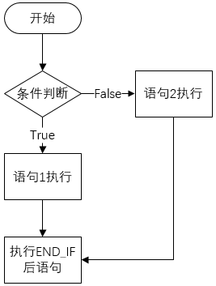

图5 IF...THEN... ELSE...分支

如果满足该条件，则将执行 THEN 后编写的语句。如果不满足该条件，则将执行 ELSE 后编写的语句。不论执行哪一个语句，之后都将从 END_IF 后的下一条指令开始继续执行。

* **IF...THEN... ELSIF...分支：**
    
    IF &lt;条件1&gt;
    
    THEN &lt;语句1&gt;
    
    ELSIF &lt;条件2&gt;
    
    THEN &lt;语句2&gt;
    
    END_IF;
    

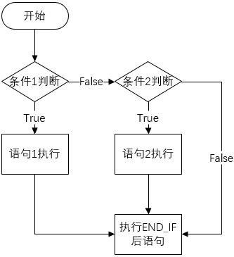

图6 IF...THEN... ELSIF...分支

如果满足条件1，则将执行 THEN 后的语句1，执行这些语句后，程序将从 END_IF 后继续执行。

如果不满足条件1，则将检查条件2。如果满足条件2，则将执行 THEN 后的语句2。执行这些语句后，程序将从 END_IF 后继续执行。

如果不满足任何条件，则直接执行 END_IF 后的程序部分。

**在 IF 指令内可以嵌套任意多个 ELSIF 和 THEN 组合。可以选择对 ELSE 分支进行编程。**

**参数**

下表列出了该指令的参数：

| 参数  | 数据类型 | 存储区 | 说明  |
| --- | --- | --- | --- |
| &lt;条件&gt; | BOOL | I、Q、M、D、L | 待求值的表达式。 |
| &lt;语句&gt; | -   |     | 在满足条件时，要执行THEN后的语句。如果不满足条件，则执行 ELSE 后编写的语句。 |

**示例**

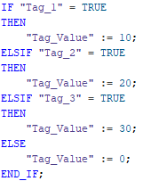

图7 IF示例

下表展示了不同的操作数数值对目标变量的影响：

| 操作数 | 值   |     |     |     |
| --- | --- | --- | --- | --- |
| "Tag_1" | True | False | False | False |
| "Tag_2" | False | True | False | False |
| "Tag_3" | False | False | True | False |
| "Tag_Value" | 10  | 20  | 30  | 0   |

## CASE：创建多路分支

**说明：****使用"创建多路分支"指令，可以根据数字表达式的值执行多个指令序列中的一个。**

按如下方式声明此指令：

CASE &lt;变量&gt; OF

&lt;常数1&gt;: &lt;语句1&gt;;

&lt;常数2&gt;: &lt;语句2&gt;;

......

&lt;常数n&gt;: &lt;语句n&gt;;

ELSE &lt;语句&gt;;

END_CASE;

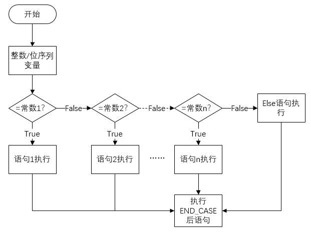

图8 CASE语句

**参数**

下表列出了该指令的参数：

| 参数  | 数据类型 | 存储区 | 说明  |
| --- | --- | --- | --- |
| &lt;变量&gt; | 整数、位序列* | I、Q、M、D、L | 与设定的常数值进行比较的值。 |
| &lt;常数&gt; | 位序列 | -   | 若为位序列，则常数可以为以下值：  * 二进制数（例如，2#10）      * 八进制数（例如，8#77）      * 十六进制数（例如，16#AD）      * 未定型的常数（例如，1000） |
| 整数  | 作为指令序列执行条件的常数值。常数可以为以下值：  * 整数（例如，5）      * 整数范围（例如，15 到 20）      * 由整数和范围组成的枚举（例如，10、11、15 到 20） |
| &lt;语句&gt; | -   | -   | 当表达式的值等于某个常数值时，将执行该常数后的各种指令。如果不满足条件，则执行 ELSE 后编写的指令。如果两个值不相等，则执行这些指令。 |

\* TIA PORTAL V16开始支持位序列数据类型的变量

**示例**

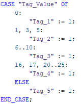

图9 CASE示例

下表展示了不同的操作数数值对目标变量的影响：

| 操作数 | 值   |     |     |     |     |
| --- | --- | --- | --- | --- | --- |
| "Tag_Value" | 0   | 1,3,5 | 6,7,8,9,10 | 16,17,20,21,22,23,24,25 | 其他  |
| "Tag_1" | 1   | -   | -   | -   | -   |
| "Tag_2" | -   | 1   | -   | -   | -   |
| "Tag_3" | -   | -   | 1   | -   | -   |
| "Tag_4" | -   | -   | -   | 1   | -   |
| "Tag_5" | -   | -   | -   | -   | 1   |

## FOR：在计数循环中执行

**说明：使用"在计数循环中执行"指令，重复执行程序循环，直至运行变量不在指定的取值范围内。**

也可以嵌套程序循环。在程序循环内，可以编写包含其它运行变量的其它程序循环。

通过指令"复查循环条件"(Continue)，可以终止当前正在运行的程序循环。通过指令"立即退出循环"(Exit)终止整个循环的执行。

**注意：**

**有关运行次数和运行变量的信息：**

**程序运行时无法更改运行次数。出于性能原因，应在块接口的"Temp"部分中声明运行变量。在循环中，该运行变量无法更改。**

按如下方式声明此指令：

FOR &lt;运行变量&gt; := &lt;起始值&gt; TO &lt;结束值&gt; BY &lt;增量&gt; DO

&lt;语句&gt;;

END_FOR;

如果增量为1，可以简写为：

FOR &lt;运行变量&gt; := &lt;起始值&gt; TO &lt;结束值&gt; DO

&lt;语句&gt;;

END_FOR;

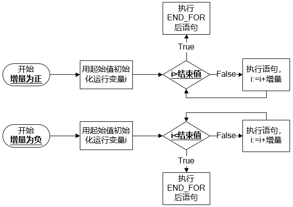

图10 FOR语句

下表列出了该指令的参数：

| 参数  | 数据类型 | 存储区 | 说明  |
| --- | --- | --- | --- |
| &lt;运行变量&gt; | 有符号整数、无符号整数* | I、Q、M、D、L | 执行循环时会计算其值的操作数。执行变量的数据类型将确定其它参数的数据类型。 |
| &lt;起始值&gt; | I、Q、M、D、L | 表达式，在运行变量首次执行循环时，将为运行变量分配该表达式的值。 |
| &lt;结束值&gt; | I、Q、M、D、L | 表达式，在运行程序最后一次循环时会为运行变量分配该表达式的值。在每个循环后都会检查运行变量的值：  * 未达到结束值：       执行符合 DO 的语句      * 达到结束值：       最后执行一次 FOR 语句      * 超出结束值：       完成 FOR 循环       执行该指令期间，不允许更改结束值。 |
| &lt;增量&gt; | I、Q、M、D、L | 表达式，根据增量表达式的值，执行变量在每次循环后都会递增（正增量）或递减（负增量）自身变量值。  如果未指定增量，则在每次循环后执行变量的值加 1。  执行该指令期间，不允许更改增量。 |
| &lt;语句&gt; | -   |     | 只要运行变量的值在取值范围内，每次循环都就会执行的语句。取值范围由起始值和结束值定义。 |

*TIA PORTAL V16开始支持无符号整数类型的变量

**示例**

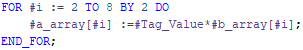

图11 FOR示例  

Tag\_Value 操作数乘以b\_array 数组变量的元素 (2, 4, 6, 8)。并将计算结果读入到a_array 数组变量的元素 (2, 4, 6, 8) 中。

下表展示了给定 Tag\_Value 与 b\_array\[i\] 的值得到 a_array\[i\] 的结果：

|     |     |     |     |     |
| --- | --- | --- | --- | --- |
| 设定  | Tag_Value |     |     |     |
| 值   | 5   |     |     |     |
| 设定  | b_array\[2\] | b_array\[4\] | b_array\[6\] | b_array\[8\] |
| 值   | 3   | 5   | 7   | 9   |
| 结果  | a_array\[2\] | a_array\[4\] | a_array\[6\] | a_array\[8\] |
| 值   | 15  | 25  | 35  | 45  |

## WHILE：满足条件时执行

**说明：使用"满足条件时执行"指令可以重复执行程序循环，直至不满足执行条件为止。该条件是结果为布尔值（True 或 False）的表达式。可以将逻辑表达式或比较表达式作为条件。**

执行该指令时，将对指定的表达式进行运算。如果表达式的值为 True，则表示满足该条件；如果其值为 False，则表示不满足该条件。

也可以嵌套程序循环。在程序循环内，可以编写包含其它运行变量的其它程序循环。

通过指令"复查循环条件"(Continue)，可以终止当前连续运行的程序循环。通过指令"立即退出循环"(Exit)终止整个循环的执行。

可按如下方式声明此指令：

WHILE &lt;条件&gt;

DO &lt;语句&gt;;

END_WHILE;

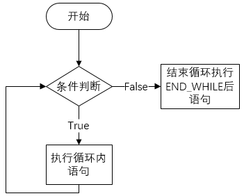

图12 WHILE语句

**参数**

下表列出了该指令的参数：

| 参数  | 数据类型 | 存储区 | 说明  |
| --- | --- | --- | --- |
| &lt;条件&gt; | BOOL | I、Q、M、D、L | 表达式，每次执行循环之前都需要进行求值。 |
| &lt;语句&gt; | -   |     | 在满足条件时，要执行的语句。如果不满足条件，则程序将从 END_WHILE 后继续执行。 |

**示例**

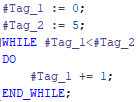

图13 WHILE示例

下表展示了循环初始和循环结束时变量值的变化

|     |     |     |
| --- | --- | --- |
|     | 初始  | 循环结束 |
| Tag_2 | 5   |     |
| Tag_1 | 0   | 5   |

## REPEAT：不满足条件时执行

**说明：使用"不满足条件时执行"指令可以重复执行程序循环，直至不满足执行条件为止。该条件是结果为布尔值（True 或 False）的表达式。可以将逻辑表达式或比较表达式作为条件。**

执行该指令时，将对指定的表达式进行运算。如果表达式的值为 True，则表示满足该条件；如果其值为 False，则表示不满足该条件。

**即使满足终止条件，至少也会执行一次循环内的语句。**

也可以嵌套程序循环。在程序循环内，可以编写包含其它运行变量的其它程序循环。

通过指令"复查循环条件"(Continue)，可以终止当前连续运行的程序循环。通过指令"立即退出循环"(Exit)终止整个循环的执行。

可按如下方式声明此指令：

REPEAT &lt;语句&gt;;

UNTIL &lt;条件&gt;

END_REPEAT;

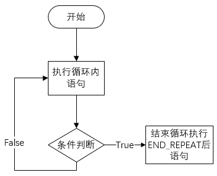

图14 REPEAT语句

**参数**

下表列出了该指令的参数：

| 参数  | 数据类型 | 存储区 | 说明  |
| --- | --- | --- | --- |
| &lt;语句&gt; | -   |     | 在设定条件的值为 False 时执行的指令。即使满足终止条件，此指令也执行一次。 |
| &lt;条件&gt; | BOOL | I、Q、M、D、L | 表达式，每次执行循环之后都需要进行求值。如果表达式的值为 False，则将再次执行程序循环。如果表达式的值为 True，则程序循环将从 END_REPEAT 后继续执行。 |

**示例**

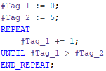

图15 REPEAT示例

下表展示了循环初始和循环结束时变量值的变化

|     |     |     |
| --- | --- | --- |
|     | 初始  | 循环结束 |
| Tag_2 | 5   |     |
| Tag_1 | 0   | 6   |

## CONTINUE：复查循环条件

**说明：使用"复查循环条件"指令，可以结束 FOR、WHILE 或 REPEAT 循环的当前程序运行。**

执行该指令后，将再次计算继续执行程序循环的条件。该指令将影响其所在的程序循环。

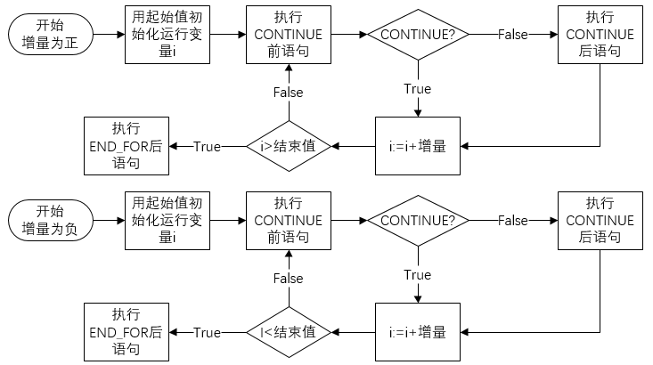

图16 CONTINUE用在FOR循环

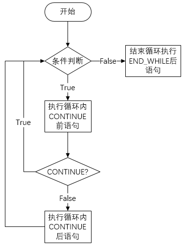

图17 CONTINUE用在WHILE循环

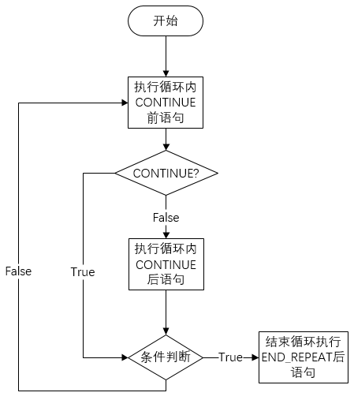

图18 CONTINUE用在REPEAT循环

**示例**

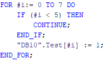

图19 CONTINUE示例

下表展示了计算结果：

|     |     |
| --- | --- |
| 变量  | 计算结果 |
| "DB10".Test\[0\] | -   |
| "DB10".Test\[1\] | -   |
| "DB10".Test\[2\] | -   |
| "DB10".Test\[3\] | -   |
| "DB10".Test\[4\] | -   |
| "DB10".Test\[5\] | 1   |
| "DB10".Test\[6\] | 1   |
| "DB10".Test\[7\] | 1   |

如果满足条件 i < 5，则不执行后续值分配 ("DB10".Test\[i\] := 1)。运行变量 (i) 以增量"1"递增，然后检查其当前值是否在设定的循环取值范围内。如果执行变量在循环取值范围内，则将再次计算 IF 的条件。

如果不满足条件 i < 5，则将执行后续值分配 ("DB10".Test\[i\] := 1) 并开始一个新循环。在这种情况下，执行变量也会以增量"1"进行递增并接受检查。

## EXIT：立即退出循环

**说明：使用"立即退出循环"指令，可以随时取消 FOR、WHILE 或 REPEAT 循环的执行，而无需考虑是否满足条件，并在循环结束（END\_FOR、END\_WHILE 或 END_REPEAT）后继续执行程序。**

该指令将影响其所在的程序循环。

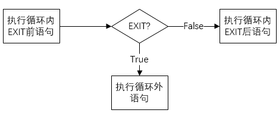

图20 EXIT语句

**示例**

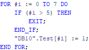

图21 EXIT示例

下表展示了计算结果：

|     |     |
| --- | --- |
| 变量  | 计算结果 |
| "DB10".Test\[0\] | 1   |
| "DB10".Test\[1\] | 1   |
| "DB10".Test\[2\] | 1   |
| "DB10".Test\[3\] | 1   |
| "DB10".Test\[4\] | 1   |
| "DB10".Test\[5\] | 1   |
| "DB10".Test\[6\] | -   |
| "DB10".Test\[7\] | -   |

如果满足条件 i > 5，则将取消循环执行。程序将从 END_FOR 后继续执行。

如果不满足条件 i <= 5，则将执行后续值分配 ("DB10".Test\[i\] :=1) 并开始一个新循环。将运行变量 (i) 以 1 进行递增，并进行检查该变量的当前值是否在程序中设定的循环取值范围之内。如果执行变量 (i) 在循环取值范围内，则将再次计算 IF 的条件。

## GOTO：跳转

**说明：使用"跳转"指令，可以从标注为跳转标签的指定点开始继续执行程序。**

跳转标签和"跳转"指令必须在同一个块中。在一个块中，跳转标签的名称只能指定一次。每个跳转标签可以是多个跳转指令的目标。不允许从"外部"跳转到程序循环内，但允许从循环内跳转到"外部"。

**注意：**

**LAD/FBD语言内的SCL段，不能使用GOTO指令。**

**跳转标签遵循以下语法规则：**

* 字母（a 至 z，A 至 Z）
    
* 字母和数字组合；请必须字母为开始
    

可按如下方式声明此指令：

GOTO &lt;跳转标签&gt;;

...

&lt;跳转标签&gt;: &lt;语句&gt;

**示例**

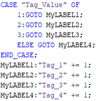

图22 GOTO示例

下表展示了每个操作数数值对目标变量的变化影响：

|     |     |     |     |     |     |     |     |     |
| --- | --- | --- | --- | --- | --- | --- | --- | --- |
| 操作数 | 值   |     |     |     |     |     |     |     |
| Tag_Value | 1   |     | 2   |     | 3   |     | 其他  |     |
|     | 初始值 | 结束值 | 初始值 | 结束值 | 初始值 | 结束值 | 初始值 | 结束值 |
| Tag_1 | 0   | 1   | 0   | 0   | 0   | 0   | 0   | 0   |
| Tag_2 | 0   | 1   | 0   | 1   | 0   | 0   | 0   | 0   |
| Tag_3 | 0   | 1   | 0   | 1   | 0   | 1   | 0   | 0   |
| Tag_4 | 0   | 1   | 0   | 1   | 0   | 1   | 0   | 1   |

根据"Tag\_Value"操作数的值，程序将从对应的跳转标签标识点开始继续执行。例如，如果"Tag\_Value"操作数的值为 2，则程序将从跳转标签"MyLABEL2"开始继续执行。在这种情况下，将跳过"MyLABEL1"跳转标签所标识的程序行。  

## RETURN：退出块

**说明：使用"退出块"指令，可以终止当前处理块中的程序执行，并在调用块中继续执行。**

如果该指令出现在块结尾处，则可以跳过。

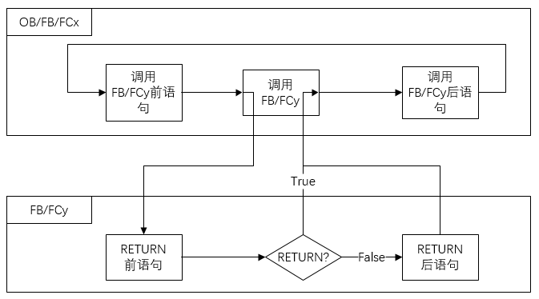

图23 RETURN语句

**示例**

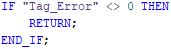

图24 RETURN示例

如果"Tag_Error"操作数的信号状态不为 0，则将终止当前处理块中的程序执行。