### 常见问题 {#常见问题 .STYLE1}

问题列表：

-   [如何监视循环指令？](03-FAQ.html#a)
-   [CASE OF 指令如何实现顺控功能？](03-FAQ.html#b)
-   [如何导入导出 SCL 源文件？](03-FAQ.html#c)
-   [如何使用经典 Step7 的接口型式？](03-FAQ.html#d)
-   [为什么 GOTO 指令会编译报错?](03-FAQ.html#e)

#### []{#a}问题1：如何监视循环指令？

正常监视如图1所示，无法监控到循环程序内部的执行情况。

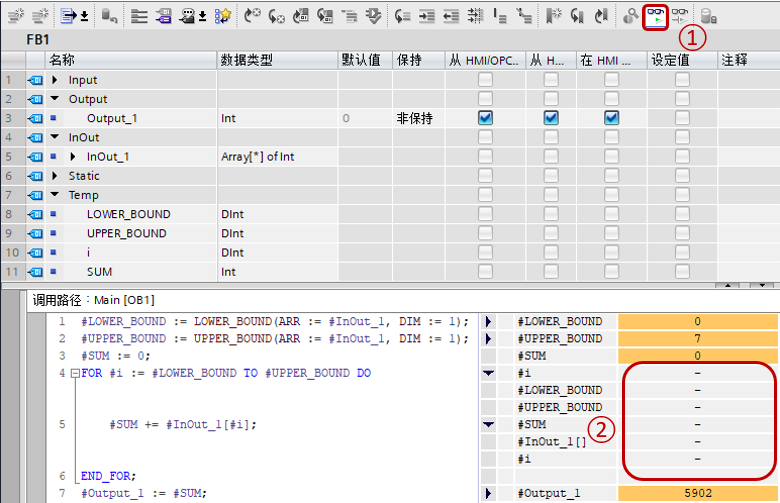{width="780" height="503"}

图1 监视页面

①点击监视按钮

②可以看到FOR循环内部没有任何变量显示

如果希望监视循环内部执行情况，可以在监视中的SCL程序任意位置，如图2中操作。

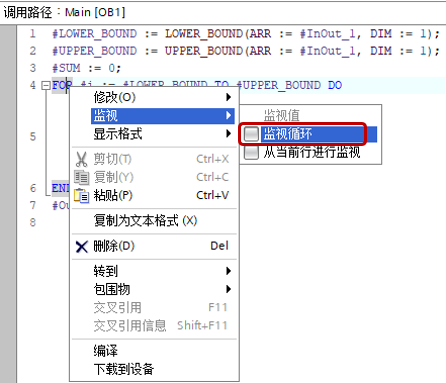{width="446" height="383"}

图2 点击监视循环

激活监视循环后，跳出窗口如图3所示，点击按钮"是"。

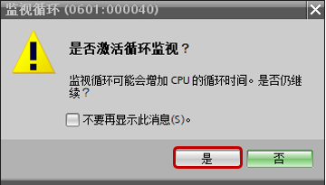{width="360" height="205"}

图3 警告窗口

之后，就可以如图4所示的，看到循环内的情况，不过这会造成增加CPU循环时间，并且只能监控到第一个循环。

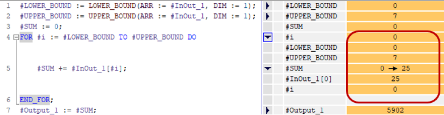{width="729" height="189"}

图4 监视循环

#### []{#b}问题2：CASE OF 指令如何实现顺控功能？

通过CASE
OF指令，可以比较容易实现类似顺控的功能，并且编程方法便捷、可读性较好。可以使用类似于下面的编程方式实现类似顺控的功能：

CASE 步骤号 OF //Int类型步骤号，一般位于FB的Static\
0:\
步骤0\
逻辑编程 //一般初始步不执行具体操作，只是初始化，然后是等待开始\
IF 条件 THEN\
步骤号:=1；\
ELSIF 错误 THEN\
步骤号:=100；\
END_IF;

1:\
步骤1\
逻辑编程\
置位复杂指令i.REQ\
IF 复杂指令i.DONE THEN\
复位复杂指令i.REQ\
步骤号:=2；\
ELSIF 复杂指令i.ERROR\
复位复杂指令i.REQ\
步骤号:=100；\
END_IF;

2:\
步骤2\
逻辑编程\
置位复杂指令m.REQ\
IF 复杂指令m.DONE THEN\
复位复杂指令m.REQ\
步骤号:=3；\
ELSIF 复杂指令m.ERROR\
复位复杂指令m.REQ\
步骤号:=100；\
END_IF;

.\
.\
.

n:\
步骤n\
逻辑编程\
置位复杂指令x.REQ\
IF 复杂指令x.DONE THEN\
复位复杂指令x.REQ\
步骤号:=n+1；\
ELSIF 复杂指令x.ERROR\
复位复杂指令x.REQ\
步骤号:=100；\
END_IF;\
.\
.\
.\
100:\
错误处理 逻辑编程\
步骤号:=0\
END_CASE;

复杂指令0 //复杂指令调用\
复杂指令1\
.\
.\
.\
复杂指令n

输出Busy、Done、Status等

**复杂指令一般包含：通信、运动控制、读配方、写数据日志、读写数据记录、定时器等异步指令，这些指令通常不放在CASE语句的逻辑中，而是在最后统一调用。**

**一般通过复杂指令完成位、错误位等作为跳转条件。如果是定时器，也可以通过判断时间是否到达作为跳转条件。**

例子：使用CASE
OF指令编程运动控制，第一步相对运动以200mm/s的速度移动10000mm，第二步速度控制以100mm/s的速度移动15s，第三步停止。

图5为FB块的参数部分，图6为程序。

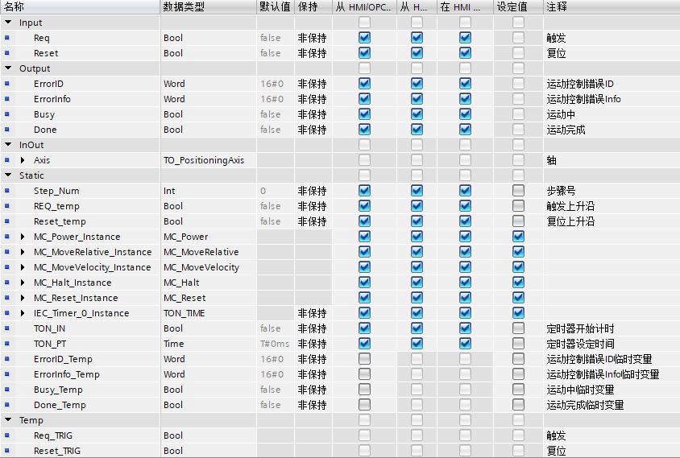{width="844" height="569"}

图5 FB参数

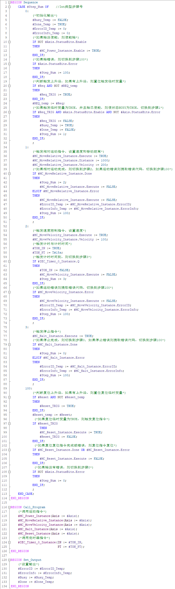{width="680" height="2281"}

图6 源程序

#### []{#c}问题3：如何导入导出 SCL 源文件？

可以将SCL编写的块，或者全局DB以及UDT导出成源文件，可以导出块或UDT，也可以导出所关联嵌套的块或者UDT，如图7所示。

  ------ --------------- ------------------ ---------- ---------- -------------------- ------------ ------------
                         外层块                                                                     
                         SCL编写 OB/FC/FB   全局DB     UDT        背景DB               工艺DB       PLC变量
  嵌套   无              可以导出           可以导出   可以导出   可以导出但没有变量   不可以导出   不可以导出
         UDT             可以导出           可以导出   可以导出   可以导出但没有变量   不可以导出   不可以导出
         SCL编写 FC/FB   可以导出           \-         \-         \-                   \-           \-
         背景DB          \-                 \-         \-         可以导出但没有变量   \-           \-
  ------ --------------- ------------------ ---------- ---------- -------------------- ------------ ------------

导出方式参见图7。

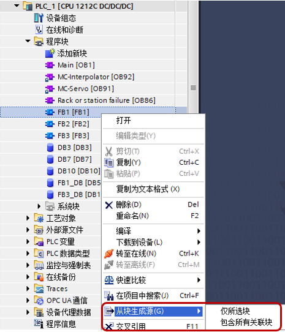{width="465" height="542"}

图7 导出源文件

通过选择"仅所选块"导出当前块，即表中绿色底色的部分。通过选择"包含所有关联块"，导出嵌套的UDT、程序块，即表中红色底色的部分。

导入源文件方式如图8-9所示。

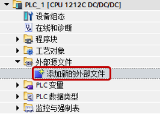{width="266" height="191"}

图8 导入源文件

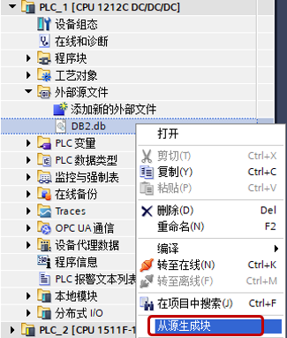{width="325" height="382"}

图9 从源生成块

通过导入的方式可以导入单独内容的源文件，也可以导入包含多个内容的源文件。

#### []{#d}问题4：如何使用经典 Step7 的接口型式？

在TIA PORTAL
V15.1之前，SCL块的接口方式和其他编程语言是一致的。从V15.1开始，SCL块的接口方式可以修改成和经典STEP7相同的方式，操作方式如图10所示。

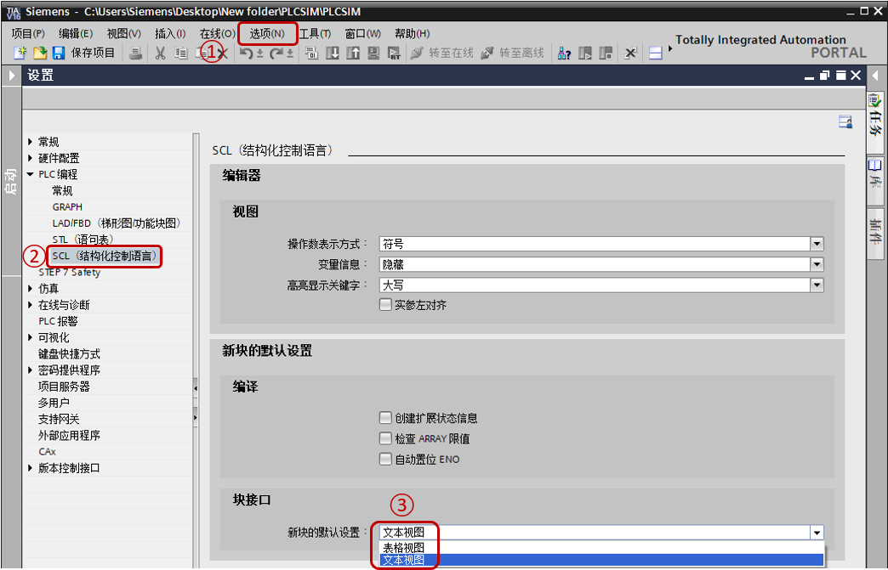{width="1044" height="671"}

图10 块接口设置

①在TIA PORTAL选项中选择设置

②左边选择"SCL（结构化控制语言）"

③在块接口选择"文本视图"，此设置默认选择表格视图。设置完，再新建的SCL块即使用所选择的视图。之前新建的SCL块不变。

如图11所示为文本视图的SCL。

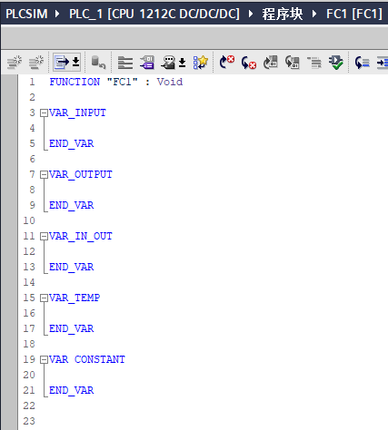{width="427" height="474"}

图11 文本视图SCL

#### []{#e}问题5：为什么 GOTO 指令会编译报错?

如图12-13所示，在LAD/FBD中的SCL编写GOTO指令时会编译报错，所以不要在这里编写GOTO指令。建议在LAD/FBD中的SCL不要使用过于复杂的编程，如果需要实现较为复杂的程序，建议单独把SCL组织成为一个子程序，然后在LAD/FBD中调用。

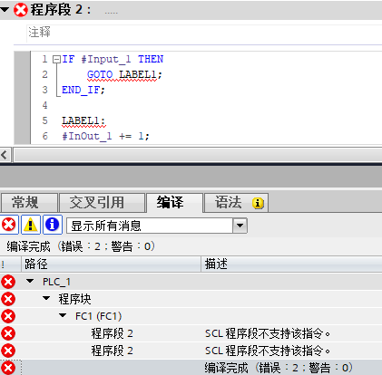{width="421" height="414"}

图12 编译报错

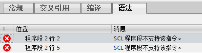{width="414" height="109"}

图13 语法错误
