### CEM 编程语言简介

博途 V17 中增加了新的编程语言 CEM（因果矩阵），如图 1 所示。

CEM
用于快速、清晰地定义直接因果关系。描述特定过程事件并定义可能的过程反应。在二维矩阵中相互分配。

在 CEM
方法中，过程事件称为"原因"，而过程反应则称为"结果"。原因负责激活一个或多个结果。原因由矩阵中的一行表示，结果由一列表示。交叉点将原因和结果彼此相连。其中指定影响相应的结果的具体原因。

明确表示原因和结果可确保能够在项目组态和调试阶段以及检修期间快速理解 CEM
程序。

S7-1200 支持版本：V4.2 及其以上。

{width="822" height="600"}

图 1. 因果矩阵

#### 创建 CEM 的规则

**块中原因与结果的数量**

-   CEM 块中最多可编程 250 条原因和 250 条结果。

**CEM 程序的运行特性**

-   CEM 程序先从上到下扫描原因，再从左到右扫描结果。

**块调用**

-   在 CEM 程序中，无法调用其它下级块。

**指令**

-   在编程时，只有"基本指令"选项板中的指令可用。用户在 CEM
    中无法使用其它选项板中的指令，例如，"扩展指令"选项板中的指令。

**优化块访问**

-   对于 CEM 块，将始终启用"优化块访问"属性，并且无法取消选中。

### CEM编程示例

#### 例程说明

一条生产线上有 3 条传送带（传送带 1\~3），传送带根据条件开启或关闭。

总共有 5 个条件（条件 1\~5）：

当条件 1，3，5 同时满足时，传送带 1 开启。条件 2，4 同时满足时，传送带 2
开启。条件 1，4，5 中任意两个满足，传送带 3 开启。

#### 编程步骤

**1、添加 CEM 功能块**

打开博途项目，在项目树中选择"添加新块"，如图 2 所示。

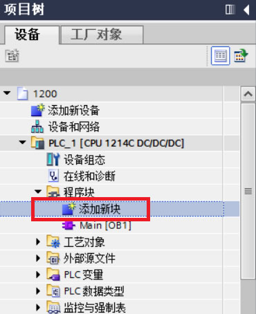{width="370" height="454"}

图 2. 添加新块

然后选择\"FB"，语言选择"CEM"，如图 3 所示。

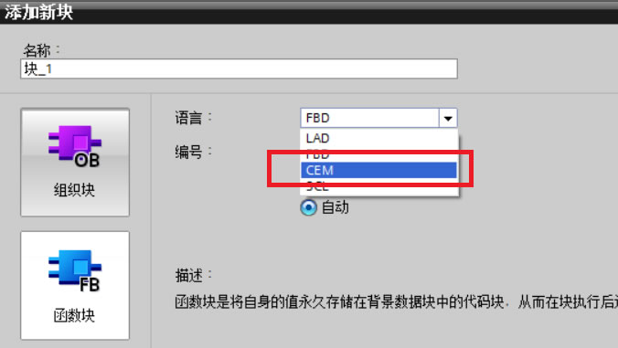{width="676" height="381"}

图 3. 选择 CEM

然后打开所建立的 FB 块，为该块添加 5 个输入参数（条件 1\~5），3
个输出参数（传送带 1\~3），数据类型都为 Bool，如图 4 所示。

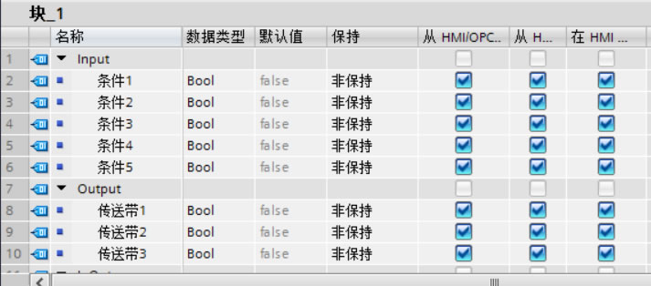{width="713" height="314"}

图 4. 添加输入以及输出参数

在原因列点击"新增"添加 5 个原因，如图 5 所示。

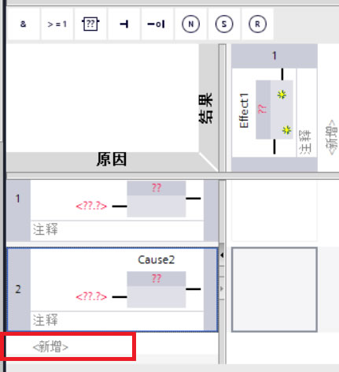{width="431" height="472"}

图 5. 添加原因

在结果行点击"新增"添加 3 个结果，如图 6 所示。

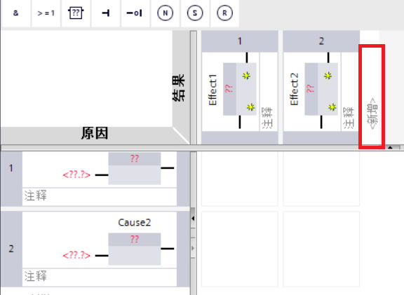{width="576" height="421"}

图 6. 添加结果

在原因里依次添加输入参数（条件 1\~5），如图 7 所示。

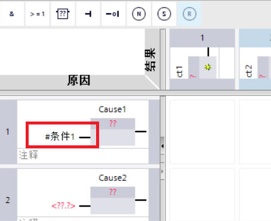{width="454" height="371"}

图 7.添加输入参数到原因

点击\"Cause1"下边的红色问号，在弹出的窗口中选择"赋值"，如图 8 所示。

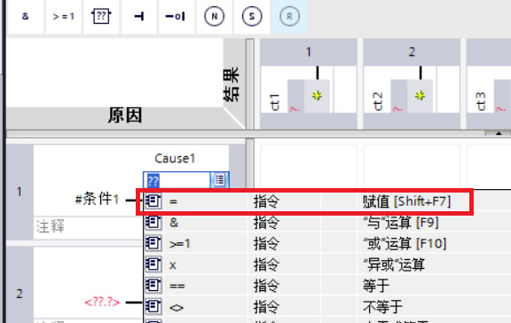{width="576" height="364"}

图 8. 选择赋值

输入的 5 个条件都重复此操作。

同样，在结果中依次添加输出参数（传送带 1\~3），如图 9 所示。

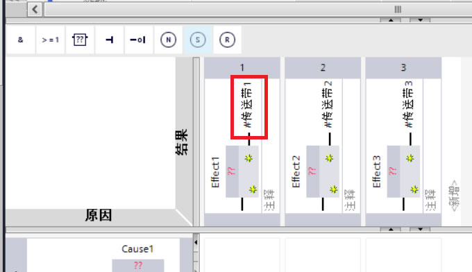{width="680" height="392"}

图 9. 添加输出参数到结果

点击\"Effect1"右边的红色问号，在弹出的窗口中选择"赋值"，如图 10 所示。

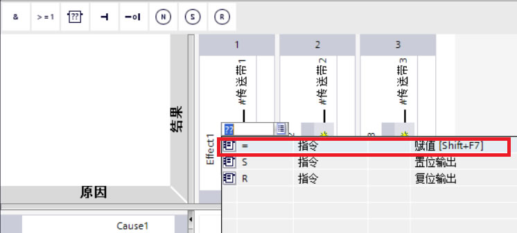{width="746" height="336"}

图 10. 选择赋值

点击\"条件 1\"行与\"传送带
1\"列的交叉点，在弹出的窗口中选择动作"N"，新建动作组 3 ，如图 11 所示。

同理设置\"条件 3\"、\"条件 5\"与\"传送带
1\"的交叉点，选择刚才建立的动作组3。

建立动作组 3 的原因是只有条件 1、3、5 三个条件同时满足，才激活\"传送带
1\"。

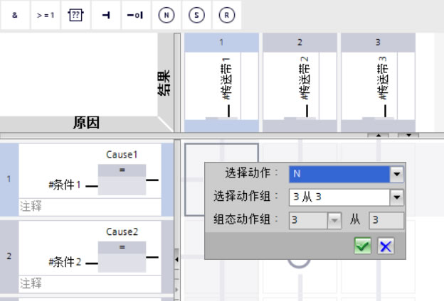{width="624" height="424"}

图 11. 设置动作与运行组

同理设置\"条件 2\"、\"条件 4\"与\"传送带
2\"的交叉点，也选择动作\"N\"，新建动作组 2。

建立动作组 2 的原因是只有条件 2、4 两个条件同时满足，才激活"传送带 2"。

最后设置"条件 1"、"条件 4"、"条件 5"与"传送带
3"的交叉点，选择动作"N"，新建动作组 2。

建立动作组 2 的原因是只要条件 1、4、5 任何两个条件满足，就激活"传送带
3"。

最终 3 条传送带的动作，如图 12 所示**。**

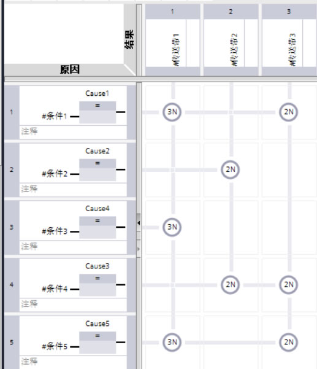{width="517" height="601"}

图 12. 3 条传送带的动作

#### 程序运行测试

在 OB1 中调用这个 FB 块，下载到 CPU 中运行。

如图 13 所示，只有条件 1、3、5 同时为"TRUE"时，"传送带
1"输出为\"TRUE\"。

同时因为条件 1、5 为\"TRUE\"，"传送带 3"输出为\"TRUE\"。

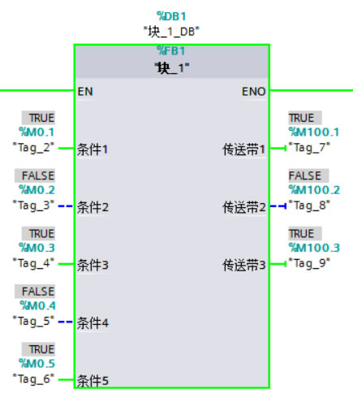{width="435" height="490"}

图 13. 传送带 1、3 开启

打开这个 FB 块，直接监视 CEM
程序，其中绿色的动作表示条件满足，蓝色动作表示条件不满足，如图 14 所示。

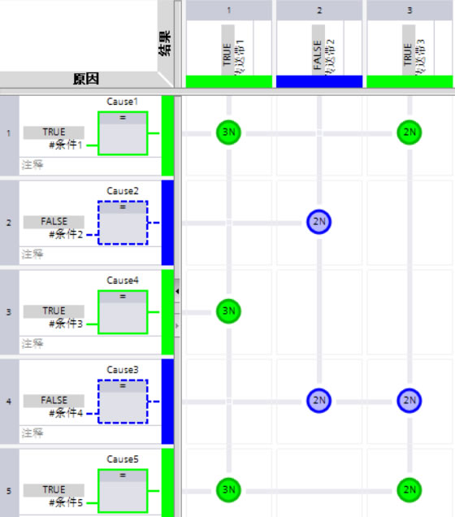{width="560" height="636"}

图 14. FB 块内部监视

如图 15 所示，只有条件 2、4 同时为"TRUE"时，"传送带 2"输出为\"TRUE\"。

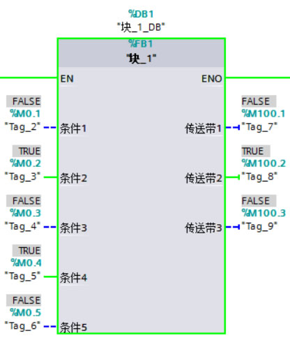{width="416" height="494"}

图 15. 传送带 2 开启

同时 FB 块内部监视，如图 16 所示。

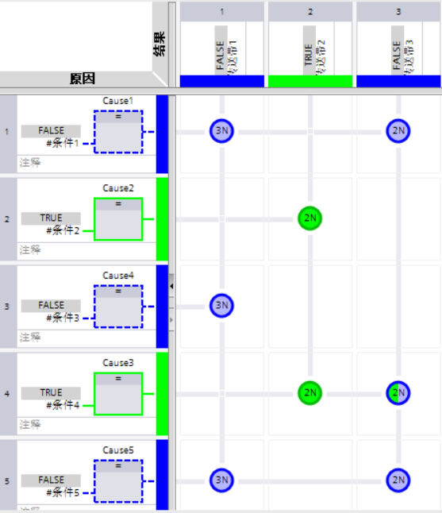{width="557" height="646"}

图 16. FB 块内部监视

如果条件 4、5 两个同时为"TRUE"时，"传送带 3"也输出为\"TRUE\"，如图 17
所示。

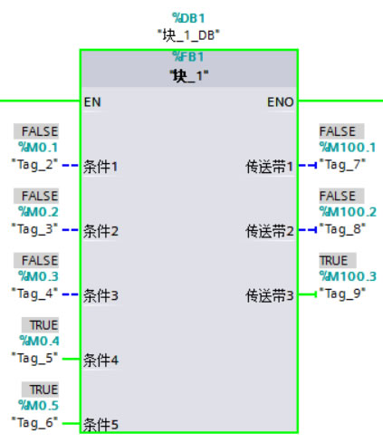{width="423" height="489"}

图 17.传送带 3 开启

同时 FB 块内部监视，如图 18 所示。

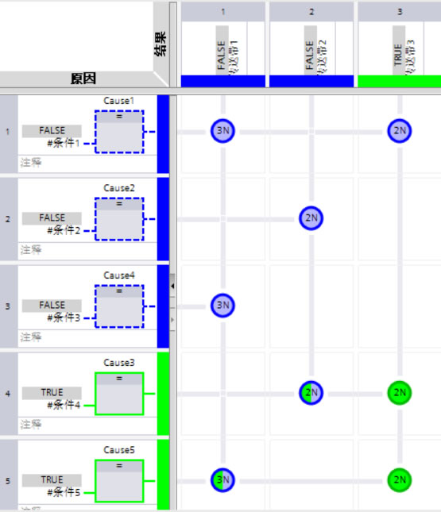{width="555" height="645"}

图 18. FB 块内部监视
