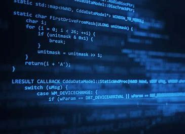
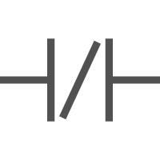
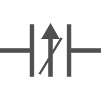

# 编程指令

## 基本指令

- {width="25" height="25"} __[位逻辑]__   位逻辑指令用于二进制数的逻辑运算。位逻辑运算的结果简称为 RLO。
位逻辑指令是最常用的指令之一，主要有与运算指令、与非运算指令、或运算指令、或
非运算指令。
- {width="25" height="25"} __[置位和复位]__   1位操作的 **\|S\|** 和 **\|R\|** 指令,多位操作的 **\|SET_BF\|** 和 **\|RESET_BF\|** 指令,​复位/置位优先触发器 **\|RS\|** 和 **\|SR\|** 指令。
- {width="25" height="25"} __[上升沿和下降沿]__   S7-1200 CPU中有多种沿检测指令，这些指令可以用于变量或者逻辑运算结果（RLO）的上升沿、下降沿检测。
- {width="20" height="20"} __[定时器]__   S7-1200的定时器为IEC定时器，用户程序中可以使用的定时器数量仅仅受CPU的存储器容量限制。
- {width="25" height="25"} __[计数器]__   S7-1200的计数器为IEC计数器，用户程序中可以使用的计数器数量仅受CPU的存储器容量限制。这里所说的是软件计数器，最大计数速率受所在OB的执行速率限制。
- {width="25" height="20"} __[比较指令]__   包含 比较值指令、IN_Range（范围内值）和 OUT_Range（范围外值）、变型和数组比较指令等。
- {width="20" height="20"} __[数学函数]__   包含加减乘除、取余、最大值最小值、乘方、对数、三角函数等指令。

  [位逻辑]: ./01-Basic/09-set.md
  [置位和复位]: ./01-Basic/09-set.md
  [上升沿和下降沿]: ./01-Basic/07-Edge.md
  [定时器]: ./01-Basic/01-TIMER.md
  [计数器]: ./01-Basic/02-COUNTER.md
  [比较指令]: ./01-Basic/03-compare/index.md
  [数学函数]: ./01-Basic/10-Math_functions/index.md