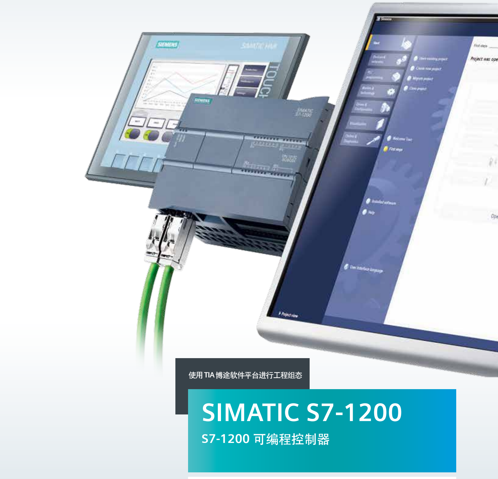

# 07-编程组态



```{toctree}
:maxdepth: 3

install
01-operation/index
02-basic/index
03-instruction/index

```


<!-- - [TIA Portal STEP 7 V18 安装](./install.md)
- [TIA Portal组态软件操作](./01-operation/index.md)
    - [新建项目](./01-operation/01-New_Project.md)
    - [CPU参数](./01-operation/02-CPU_Properties.md)
    - [常见问题FAQ](./01-operation/03-ConfigFAQ.md)
    - [项目下载](./01-operation/04-Download.md)
    - [运行时下载](./01-operation/05-download_run.md)
    - [硬件检测](./01-operation/06-detect_hardware.md)
    - [上载程序](./01-operation/07-upload_program.md)
    - [上载站点](./01-operation/08-upload_station.md)
    - [上传时版本的兼容性](./01-operation/09-upload_compatibility.md)
    - [项目升级](./01-operation/10-update.md)
    - [程序升级](./01-operation/11-Program_Update.md)

- [编程基础](./02-basic/index.md)
    - [数据类型](./02-basic/01-Data_Type/index.md)
    - [组织块OB](./02-basic/02-OB/01-intro.md)
    - [FC,FB功能块](./02-basic/03-Block/index.md)

- [编程指令](./03-instruction//index.md)
    - [基本指令](./03-instruction/01-Basic/index.md)
        - [位逻辑](./03-instruction/01-Basic/08-bit.md)
        - [置位和复位](./03-instruction/01-Basic/09-set.md)
        - [上升沿和下降沿](./03-instruction/01-Basic/07-Edge.md)
        - [定时器](./03-instruction/01-Basic/01-TIMER.md)
        - [计数器](./03-instruction/01-Basic/02-COUNTER.md)
        - [比较指令](./03-instruction/01-Basic/03-Compare_Variant.md) -->