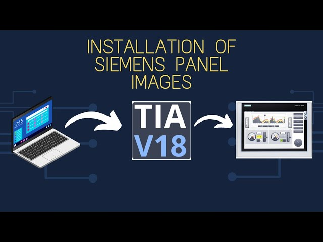

# TIA Portal STEP 7 V18 安装

## 安装条件

最新版本的 STEP 7 (TIA Portal) V18 已经可以从产品代理商处订购。安装 STEP 7 (TIA
Portal) V18之前，需要注意以下几点。

下表列出了安装 STEP 7 Basic / Professional V18 的基本要求。
安装 STEP 7 Basic / Professional V18 的要求 

### 1 硬件要求

安装 STEP 7 Basic / Professional V18 的计算机推荐满足以下需求: 

- 处理器： Intel® Core™ i5-8400H（2.5 到 4.2 GHz；4 核 + 超线程；8 MB 智能缓存） 
- 内存： 16GB或者更多（对于大型项目，为32GB) 
- 硬盘：SSD，配备至少50GB的存储空间 
- 图形分辨率：最小 1920 x 1080 
- 显示器：15.6" 宽屏显示 (1920 x 1080) 
 
### 2 软件要求

STEP 7 Professional / Basic V18 可以安装于以下操作系统

- Windows 11操作系统（64位）
- Windows 11 Home Version 21H2 * 
- Windows 11 Professional Version 21H2 
- Windows 11 Enterprise Version 21H2 
- Windows 10操作系统（64位）
- Windows 10 Home Version 21H2 * 
- Windows 10 Home Version 21H1 * 
- Windows 10 Professional Version 21H2 
- Windows 10 Professional Version 21H1 
- Windows 10 Enterprise Version 21H2 
- Windows 10 Enterprise Version 21H1 
- Windows 10 Enterprise Version 20H2 
- Windows 10 Enterprise Version 2009 
- Windows 10 Enterprise LTSC 2021 
- Windows 10 Enterprise LTSC 2019 
- Windows 10 Enterprise LTSC 2016 
- Windows Server(64位) 
- Windows Server 2022 Standard 
- Windows Server 2019 Standard 
- Windows Server 2016 Standard 

 *仅适用于基本版 
 
### 3 管理员权限

安装 STEP 7 (TIA Portal) V18 需要管理员权限。
 
### 4 同时安装 STEP 7 (TIA Portal) V18 和其他版本的 STEP 7

可以和 STEP 7 (TIA Portal) V18 同时安装的其他版本的 STEP 7 软件： 

- STEP 7 (TIA Portal) V13SP2 到 V17 
- STEP 7 V5.6 SP1 到 V5.6 SP2 
- STEP 7 Professional 2017 SR1 到 2017 SR2 

注意: 仅TIA PORTAL V13 SP1以后的项目才能升级到TIA PORTAL V18 
 
### 5 与SIMATIC HMI 产品的兼容性

可以和 STEP 7 (TIA Portal) V18 同时安装的 SIMATIC HMI 产品如下 

- WinCC flexible 2008 SP5 

WinCC and WinCC flexible 的 注意事项

- WinCC flexible 和 WinCC (TIA博途) 可以同时安装在同一台电脑上。 
- WinCC 和 WinCC TIA Professional不能同时安装在同一台电脑上。 

在STEP 7 V18 中使用“项目 > 项目移植…”功能，可将WINCC V7.5以上版本的项目移植到WINCC V18。
 
### 6 与STEP7项目的兼容性

在STEP 7 V18 中使用“项目 > 项目移植…”功能，可以将 STEP 7 V5.4 SP5以上版本的项目创建的项目移植到 STEP 7 V18。 
 
### 7 卸载 STEP 7 V18

有两种方式可以卸载 STEP 7 Basic / Professional V18： 

#### 通过控制面板卸载

- 在控制面板中点击“程序”，然后选择“程序和功能”。 
- 在“添加删除程序”对话框中双击 "Siemens Totally Integrated Automation
- Portal V18" 应用程序 
- 然后在提示的对话框中点击“下一步”。 
- 按照屏幕中的提示继续操作。

#### 通过 SIMATIC STEP 7 V18 安装盘卸载

- 插入 STEP 7 V18 安装盘到计算机的光驱中 
- 如果程序不能自动启动，打开 "Start.exe" 文件。 
- 选择对话框的显示语言。 
- 选择“卸载”选项然后点击“下一步〉”按钮。 
- 按照屏幕提示继续操作。 
 
### 8 修复 STEP 7 V18 软件

如果安装的 STEP 7 Basic / Professional V18 有缺陷或者由于意外损坏，可以选择 STEP 7 V18修复程序软件来修复。

- 插入 STEP 7 V18 安装盘到计算机的光驱。 
- 如果程序不能自动启动，打开 "Start.exe" 文件。 
- 选择对话框的显示语言。 
- 选择“修复”选项然后点击“下一步〉”按钮。 
- 按照屏幕上的提示继续操作。 
 
### 9 支持的虚拟系统

- VMware vSphere Hypervisor (ESXi) 6.7 
- VMware Workstation 15.5 
- VMware Player 15.5 
- Microsoft Hyper-V Server 2019 
 
### 10 与安全软件兼容性

- Symantec Endpoint Protection 14.3 
- Trend Micro Office Scan 14.0 
- McAfee EndPoint Security V10.6 
- McAfee EndPoint Security V10.7 
- Windows Defender 
- Microsoft Bitlocker 
- McAfee Application Control V8.3.3 
 
## TIA Portal STEP 7 V18 安装

参考[TIA Portal STEP 7 V17 安装](https://www.ittel.cn/archives/5290.html)

