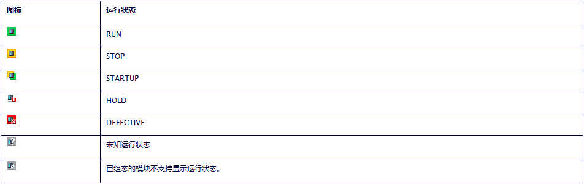
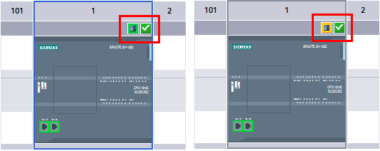
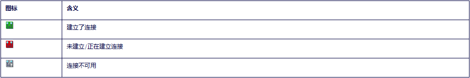
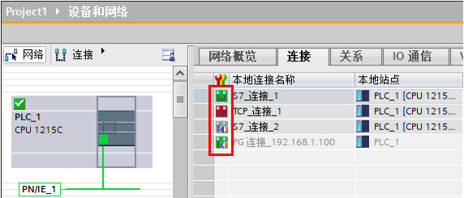
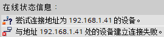
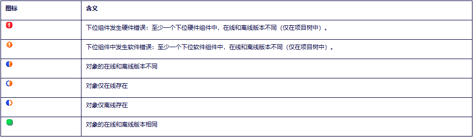
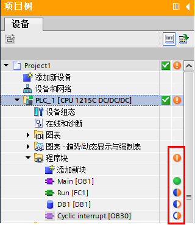

### TIA Portal 中各种常见图标的含义

在 TIA Portal 中，不同的视图使用不同的图标表示设备及程序的状态，
通过这些图标可以有助于快速诊断故障。

#### CPU 和 CP 的操作模式图标

CPU 和 CP 的运行状态图标及其各自的工作状态，如图 1 所示。

{width="952" height="300"}

图 1. CPU 和 CP 的运行状态图标

在设备视图中可以看到 CPU 操作模式不同，会用不同颜色的图标表示。如图 2
所示，左边 CPU 处于运行状态，右边 CPU 处于停止状态。

{width="534" height="212"}

图 2. CPU 运行状态图标

#### 通讯连接的诊断图标

在"网络视图 \> 连接"中，可以通过判断图标确认连接状态，如图 3
所示为连接图标。

{width="952" height="159"}

图 3. 连接图标

在连接的诊断图标右下部有小图标用来指示在线/离线比较结果，如图 4 所示。

{width="952" height="120"}

图 4. 连接比较

如图 5 所示，在"网络视图 \> 连接"中，看到 S7-1200 的几个连接的状态。

{width="572" height="245"}

图 5. 连接图标

红框中从上到下分别是：

-   连接已建立
-   未建立/正在建立连接
-   连接不可用，仅离线存在（也就是该连接未装载至 CPU）
-   连接已建立，仅在线存在（此连接为在线监视连接，所以仅在线存在）

#### 模块与设备的诊断图标

在项目树、下载页面等地方可以看到 TIA Portal 与 CPU 的连接状态图标，如图
6 所示。

{width="952" height="802"}

图 6. 连接图标

例如下载硬件组态时如果无法找到相应的设备，将出现如下提示如图 7
所示的图标。

{width="270" height="62"}

图 7. 连接图标

#### 程序比较状态的图标

在项目树中，当 CPU 转到在线后，可以通过如图 8
所示的图标，确认程序在线离线是否相同。

{width="952" height="276"}

图 8. 比较图标

如图 9 所示，为程序比较图标显示。

{width="320" height="370"}

图 9. 程序比较

红框中从上到下分别是：

-   程序块至少有一个在线离线不同
-   Main 程序在线离线相同
-   Run 程序在线离线不同
-   DB1 在线不存在离线存在
-   OB30 在线存在离线不存在
