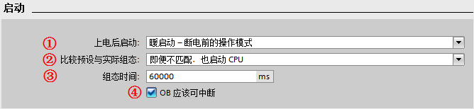

# 02 启动模式

S7-1200 CPU 通电后，它在开始执行循环用户程序之前首先执行启动程序。 CPU 支持以下组态选项：

- 不重新启动（保持为 STOP 模式）
- 暖启动 \- RUN 模式
- 暖启动 \- 断电前的模式（此为默认设置）

## 启动模式设置

S7-1200 启动模式可以在 **CPU 属性-常规-启动*- 进行设置。如下图 1 所示：

图 1 CPU 启动选项设置

  ① **上电后启动**：定义了 CPU 上电后的启动特性，共有以下三个选项，用户可根据项目的特点及安全性来选择，默认选项为 **暖启动-断电前的操作模式**：
  
   - **不重新启动（保持为 STOP 模式）**：CPU 上电后直接进入 STOP 模式；
   - **暖启动-RUN 模式**：CPU 上电后直接进入 RUN 模式；
   - **暖启动-断电前的操作模式**：选择该项后，CPU 上电后将按照断电前该 CPU 的 RUN 模式启动，即断电前CPU处于运行模式，则上电后 CPU 依然进入 RUN 模式；如果断电前 CPU 处于 STOP 状态，则上电后 CPU 进入 STOP 模式。
    
   如果在发生掉电或故障时，CPU 处于 STOP 模式，则 CPU 将在上电时进入 STOP 模式并保持 STOP 模式，直至收到进入 RUN 模式的命令；
          
   如果在发生掉电或故障时，CPU 处于 RUN 模式，则在未检测到可禁止 CPU 进入 RUN 模式的条件下，CPU 将在下次上电时进入 RUN 模式。
      
  
  ② **比较预设与实际组态**：定义了 S7-1200 PLC 站的实际组态与当前组态不匹配时的 CPU 启动特性：
  
   - **仅在兼容时，才启动 CPU**：所组态的模块与实际模块匹配（兼容）时，才启动 CPU。
   - **即便不匹配，也启动 CPU**：所组态的模块与实际模块不匹配（不兼容）时，也启动 CPU。
  
  :::{attention} 
  如果选择了 **即便不匹配，也启动 CPU**，此时的用户程序可能无法正常运行，必须采取相应措施！所以要慎重选择该项。 并且标准型 S7-1200 默认选择此设置。
  :::

  ③  **组态时间**：在 CPU 启动过程中，为集中式 I/O 和分布式 I/O分配参数的时间，包括为 CM 和 CP 提供电压和通信参数的时间。如果在设置的 **组态时间**内完成了集中式 I/O 和分布式 I/O的参数分配，则 CPU 立刻启动；如果在设置的 **组态时间**内，集中式 I/O 和分布式 I/O 未完成参数分配，则 CPU 将切换到 RUN 模式，但不会启动集中式 I/O 和分布式 I/O；
  
    
  ④  **OB 应该可中断**：激活 **OB 应该可中断**后，在 OB 运行时，更高优先级的中断可以中断当前 OB,在此 OB 处理完后，会继续处理被中断的 OB。如果不激活 **OB 应该可中断**，则优先级大于 2 的任何中断只可以中断循环 OB，但优先级为 2～25 的 OB 不可被更高优先级的 OB 中断。

## 启动 OB

关于启动 OB 的详细说明， 请参考以下文档：

[**S7-1200 启动(Start up)组织块**](../07-Program/02-basic/02-OB/08-OB100.htm)

## 常见问题

:::{hint}  1\. 哪些情况会导致 S7-1200 CPU 无法启动？
:::

以下的情况会导致 S7-1200 CPU 断电后再上电无法启动：

- 检测到的某些错误会阻止 CPU 进入 RUN 模式；
- 在 **CPU 属性-常规-启动*- 设置为不重新启动（保持为 STOP 模式）；
- 暖启动 \- 断电前的模式：CPU 组态为 **暖启动 - 断电前的模式**，且在发生掉电或故障时，CPU 处于 STOP 模式，则 CPU 将在上电时进入 STOP 模式并保持 STOP 模式；
- 安全型 CPU 不具备启动条件，例如没有分配 IO 设备设备名称。因为安全型 CPU 默认激活 **仅在兼容时，才启动 CPU**；
- 在 CPU 设备组态的属性里选择了 **允许通过用户程序重新组态设备**。而 WRREC 指令在启动 OB 中传送完控制数据记录后组态控制才会生效。如果已启用组态控制但 CPU 不具有控制数据记录，则在退出 STARTUP 模式时会转到 STOP 模式。

具体请参考：**[组态控制功能](15-Configure_Control/02-Configuration.html)**

:::{hint}  2\. 为什么 CPU 断电后，再上电 CPU 没有报任何错误，但 CPU 却运行不起来？
:::

答：原因是 CPU 没有硬件开关用于启停控制，CPU 上电后的启停由 CPU 属性中的 **启动**选项来决定（如图 1 所示）。

其默认设置为 **暖启动-断电前的操作模式**，此时如果是断电前 CPU 因故障停止，那么再上电后即使没有故障，CPU 也会延续断电前的状态，保持 STOP 模式。

或者设置成 **不重新启动**，则 CPU 上电后直接进入 STOP 模式。如果在以上两种模式下，CPU 无法启动，需要通过博途软件在线功能启动 CPU。

所以必须将启动选项设置为 **暖启动-RUN 模式**，才能保证在没有错误的情况下，CPU 上电后直接进入 RUN 模式。

:::{hint}  3\. CPU 属性的"启动"特性中, 设置的"比较预设与实际组态匹配"，这里的"匹配"或者"兼容"是什么含义？
:::

答：匹配 (兼容性）是指与当前的模块的输入和输出数量相匹配，而且电气和功能特性也相匹配。兼容模块必须能够完全替换已组态的模块；功能性可以更多，但不能比替换的模块少。 举例

说明，16 个通道的数字量输入模块可作为 8 个通道的数字量输入模块的兼容替换模块。反之则不兼容；16 个通道的晶体管数字量输出模块不可作为 16 个通道的继电器数字量输出模块的兼容替换模块。

所以，如果设置 **仅在兼容时，才启动 CPU**并且插入组态的模块兼容时，CPU 启动；如果插入的模块不兼容，则 CPU 无法启动。

如果选择 **即使不兼容也启动 CPU*- 的设置，此时如果插槽中插入一个模拟量输出模块或不插入任何模块，则与实际的16 个通道数字量输入的信号模块完全不兼容。虽然无法访问所组态的输入，但 CPU 仍可启动。

:::{hint}  4\. 为什么已经将"启动"选项设置为"暖启动-RUN 模式"下载组态后，CPU 无法启动，而 ERROR 灯也不报错？
:::

答：这种情况下查看诊断缓冲区，通常可以发现报错： **没有可用于中央设备选件处理的数据记录或无效**，如图 2 所示。

造成这个错误的原因是，CPU 属性的 **组态控制**中已激活 **允许通过用户程序重新组态设备**，如图 3 所示，但启动 OB 未传送一个有效的组态数据记录，则 CPU 从启动模式返回到 STOP 模式。

CPU 在这种情况下不会初始化集中式 I/O，导致启动失败。

如果用户并没有使用组态控制，一定确认取消激活 **允许通过用户程序重新组态设备**，以免造成不必要的错误。

图 2 组态控制造成的错误

图 3 组态控制配置