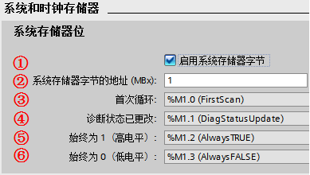
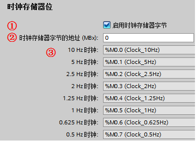

### 系统和时钟存储器

**"系统和时钟存储器"**页面可以设置M存储器的字节给系统和时钟存储器，然后程序逻辑可以引用他们的各个位用于逻辑编程。

**"系统存储器位"**：用户程序可以引用四个位：首次循环，诊断状态已更改，始终为
1，始终为 0。设置如图 1 所示：

{width="389" height="220"}

图 1 系统存储器设置

①激活"启用系统存储器字节"；

②系统存储器字节地址：设置分配给"系统存储器字节地址"的 MB 的地址；

③首次循环：在启动 OB 完成后第一个扫描周期该位置位为
1，之后的扫描周期复位为 0；

④诊断状态已更改：在诊断事件后的一个扫描周期内置位为 1。由于直到启动 OB
和程序循环 OB 首次执行完才能置位该位，所以在启动 OB 和程序循环 OB
首次执行完成才能判断是否发生诊断更改；

⑤始终为 1（高电平）：该位始终置位为 1；

⑥始终为 0（低电平）：该位始终设置为 0。

**"时钟存储器位"**：设置时钟存储器如图 2
所示，组态的时钟存储器的每一个位都是不同频率的时钟方波。

{width="388" height="280"}

图 2 时钟存储器设置

①激活"启用时钟存储器字节"；

②时钟存储器字节地址：设置分配给"时钟存储器字节地址"的MB的地址；

③被组态为时钟存储器中的 8 个位提供了 8
种不同频率的方波，可在程序中用于周期性触发动作。其每一位对应的周期与频率，参考表
1。

表 1 时钟存储器

  位号       7     6       5     4      3     2     1     0
  ---------- ----- ------- ----- ------ ----- ----- ----- -----
  周期(s)    2.0   1.6     1.0   0.8    0.5   0.4   0.2   0.1
  频率(Hz)   0.5   0.625   1     1.25   2     2.5   5     10

### 常见问题

**1. 为什么在组态了系统存储器后， \"常 1\"信号在程序中却不生效？**

答：组态或修改了系统存储器后，要确保将配置重新下载到
CPU，否则组态不生效。
