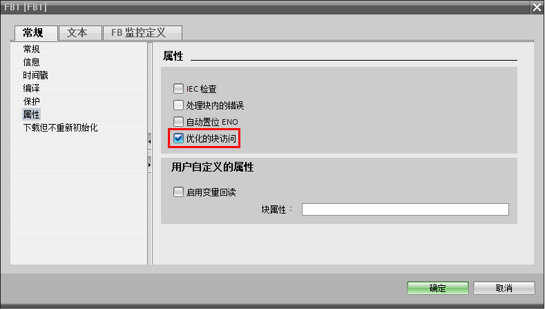
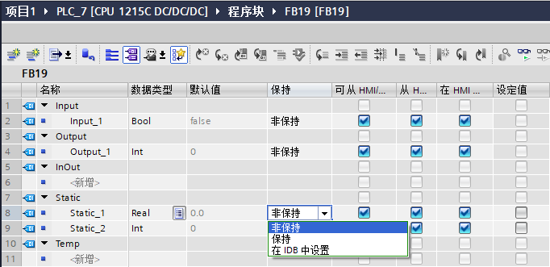
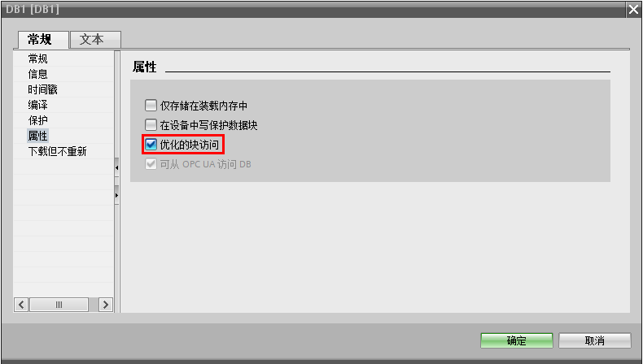
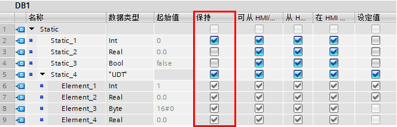
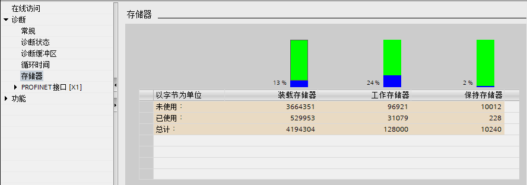
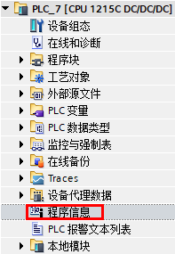
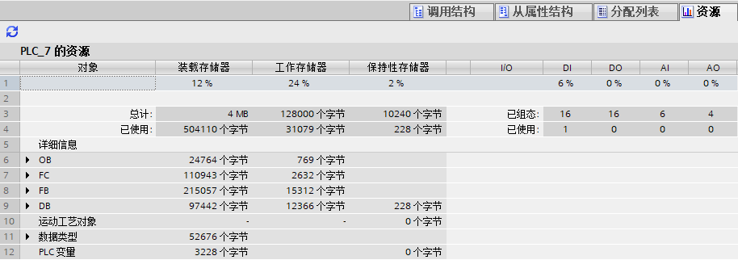
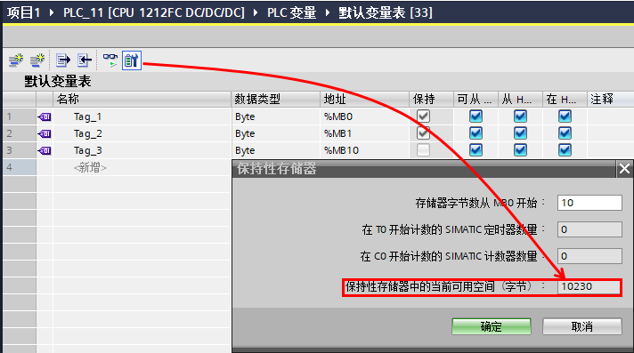

### S7-1200的内部存储区和掉电数据保持

S7-1200的内部存储区分为工作存储区、装载存储区和保持性存储区三种。

**装载存储区**：

> 是非易失性存储区。用于存储用户项目文件（用户程序、数据和组态）。
>
> 如果不使用存储卡，用户使用TIA
> PORTAL软件下载项目即下载到CPU内置的装载存储区中。
>
> 如果使用存储卡，用户使用TIA
> PORTAL软件下载项目即下载到存储卡中，即存储卡作为装载存储区。
>
> {width="15"
> height="15"}注意：使用大容量的存储卡，可以扩展装载存储区
>
> {width="15"
> height="15"}**项目中的符号名和注释也可以被下载到装载存储区中，极大地方便了用户的后期调试和维护。**

**工作存储区：**

> 是易失性存储区。CPU在执行用户程序时会将一些项目内容从装载存储区复制到工作存储区。断电后工作存储区中的内容断电后丢失，且不能被扩展。
>
> {width="15"
> height="15"}注意：使用大容量的存储卡，无法扩展工作存储区

**保持性存储区：**

> 用于在CPU断电时存储指定单元的过程数据，保证数据断电不丢失
>
> {width="15"
> height="15"}注意：使用大容量的存储卡，无法扩展保持存储区

内部存储区的具体大小请参考下表：

  型号           CPU 1211C   CPU 1212 (F)C     CPU 1214 (F)C     CPU 1215 (F)C     CPU 1217C
  -------------- ----------- ----------------- ----------------- ----------------- -----------
  工作存储区     75 kB       100 kB (150 kB)   150 kB (200 kB)   200 kB (250 kB)   250 kB
  装载存储区     1 MB        2 MB              4 MB              4 MB              4 MB
  保持性存储区   14 kB                                                             

表1：CPU 1200 的内部存储区大小

#### 如何实现内部数据的掉电保持？

需要被断电保持的数据必须被保持到保持性寄存器中。保持性寄存器中不需要超级电容供电维持，其中的数据可以永久保持。总共可以有10240个字节的数据具有保持特性。CPU暖启动或者断电再上电后，保持性存储区中的数据会保持为暖启动或者断电之前的数值，保持性存储区之外的数据会丢失，即恢复初始值。

CPU的M存储区、FB的背景数据块和全局数据块中的数据可以使用保持性存储区存储。

**1、M存储区**

用户可以在"PLC 变量"
标签页中，点击"保持"按钮来设定M存储区的保持范围，从MB0开始的连续字节数，例如设置10，则保持范围为MB0-MB9共10个字节，无法设置多个保持区，如下图所示：

{width="711" height="396"}

图1： 保持M存储区

**2、FB块的背景数据块**

FB块可以是优化的块或者非优化的块，新建的FB默认优化FB，可以在FB右键属性中修改，如图所示。

而系统FB，例如PID、运动控制、通讯等通常都是优化FB，无法修改优化属性。

优化FB的背景数据块是优化DB，非优化FB的背景数据块是非优化DB。

{width="789" height="450"}

图2：FB属性

**a. 对于优化FB**

背景数据块中的每个变量都可以单独指定断电保持特性。[打开FB]{.STYLE1}，在上方的接口区，用户可以在"保持"列中修改每个变量的保持特性，如下图所示：

{width="682" height="331"}

图3：修改优化FB的背景数据保持特性

可以将每个变量单独设置保持或者不保持。

如果选择在IDB中设置，则该变量的保持性可以在背景数据块中设置，也就是说同一个变量可能在不同的背景数据块中设置不同的保持性。

**b. 对于非优化FB**

只能整体地指定其背景数据块的保持特性，不能每个变量单独指定。打开FB的一个[背景数据块]{.STYLE1}，用户可以在"保持"列中修改每个变量的保持特性，如下图所示：

{width="683" height="196"}

图4：修改非优化FB的背景数据保持特性

如果多次调用经过上述设置的FB,
每次调用分配不同的背景数据块，用户可以分别指定每个背景数据块的保持特性。

**3、全局数据块**

与FB的背景数据块相同，全局数据块的也分为优化和非优化两种。使用优化DB块能够最优化地利用CPU内部的数据存储区。全局数据块的断电保持特性也与FB的背景数据块相同：

-   使用优化的全局数据块可以分别指定其内部[每个变量]{.STYLE1}的保存特性
-   使用非优化的全局数据块，只能对其**整体**指定一种保持特性

新建的DB默认优化DB，可以在DB右键属性中修改，如下图所示：

{width="790" height="448"}

图5：DB属性

与FB的背景数据块特性设置相同，用户可以打开DB，通过勾选"保持"一列设定变量的保持特性，如下图所示：

{width="664" height="213"}

图6：设定DB保持特性

{width="15"
height="15"}注意：FB、DB中的UDT、STRUCT内部的变量无法设置独立的保持性，也就是说UDT、STRUCT内部的变量的保持性是一致的。

#### 常见问题

{width="15"
height="15"}**如何在线查看S7-1200的内部存储区的使用情况？**

在项目树中展开PLC程序打开\"在线和诊断\"， 点击\"转到在线\"按钮使TIA
PORTAL在线连接到S7-1200
CPU，在"存储器"标签查看CPU内存使用情况，如下图所示：

{width="888" height="312"}

图7：在线查看存储区

{width="15"
height="15"}**如何查看用户项目需要的存储区大小？**

您可以在TIA PORTAL
软件资源窗口查看目前用户程序需要使用的存储区大小。在项目树中展开PLC程序，打开"程序信息"，如下图所示：

{width="197" height="285"}

图8： 打开程序信息

在资源窗口中，
可以查看到用户程序已经使用存储区资源和输入输出资源，如下图所示 ：

{width="914" height="322"}

图9：资源窗口

{width="15"
height="15"}如何查看还有多少可用的保持性存储区？

在PLC变量表中，单击工具标签栏中的"保持"按钮，新窗口中的最后一行即为剩余可用的保持性存储区资源大小，如下图所示：

{width="712" height="397"}

图10：查看保持性存储区资源
