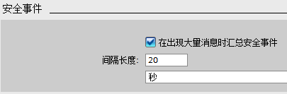

# 05 防护与安全/保护

\"访问级别\"：此界面可以设置该 PLC 的访问等级，共可设置 4
个访问等级，如图 1 所示：

{width="682" height="259"}

图 1 保护设置

可以选择以下保护等级：

-   "完全访问权限（无任何保护）"：为默认设置，无密码保护，允许完全访问。
-   "读访问权限"：没有输入密码的情况下，只允许进行只读访问，无法更改 CPU
上的任何数据，也无法装载任何块或组态。选择这个保护等级需要指定"完全访问权限（无任何保护）"的密码："密码
1"。如果需要写访问，则需要输入"密码 1"。
-   "HMI 访问权限"：选择这个保护等级对于 SIMATIC HMI
访问没有密码保护，但需要指定"完全访问权限（无任何保护）"的密码："密码
1"。 "读访问权限"的密码："密码
2"可选择设置，如果不设置则无法获得该访问权限。
-   "不能访问（完全保护）"：不允许任何访问，但需要指定"完全访问权限（无任何保护）"的密码："密码
1"。"读访问权限"的密码："密码 2"和"HMI 访问权限"的密码："密码
3"为可选设置，但如果不设置，就无法获得相应的访问权限。

对于 "读访问权限"，"HMI
访问权限"，"不能访问"这三种保护等级都可以设置层级保护密码，设置的密码分大小写。其中"完全访问权限"的"密码
1"永远是必填密码，而"读访问权限"，"HMI
访问权限"为可选密码。可以根据不同的需要将不同的保护等级分配给不同的用户。

如果将具有 "HMI
访问权限"的组态下载到 CPU 后，可以在无密码的情况下实现 HMI
访问功能。要具有"读访问权限"，用户必须输入"读访问权限"的已组态密码"密码
2"。要具有"完全访问权限"，用户必须输入"完全访问权限"的已组态密码"密码
1"。

**"连接机制"：**
设置激活"允许来自远程对象的 PUT/GET 通信访问"后（如图 2 所示）CPU
才允许与远程伙伴进行 PUT/GET 通信。

{width="436" height="84"}

图 2 连接机制设置

**\"安全事件\"：**
部分安全事件会在诊断缓冲区中生成重复条目，可能会堵塞诊断缓冲区。通过组态时间间隔来汇总安全事件可以抑制循环消息，时间间隔的单位可以设置为秒、分钟或小时，数值范围设置为
1～255。在每个时间间隔内，CPU 仅为每种事件类型生成一个组警报。 如图 3
所示。

{width="405" height="133"}

图 3 安全事件设置

如果选择对安全事件进行限定，即激活"在出现大量消息时汇总安全事件"，将限定（汇总）以下几种类型的事件：

-   使用正确或错误的密码转至在线状态
-   检测被操控的通信数据
-   检测存储卡上被操控的数据
-   检测被操控的固件更新文件
-   更改后的保护等级（访问保护）下载到 CPU
-   限制或启用密码合法性（通过指令或 CPU 显示器）
-   由于超出允许的并行访问尝试次数，在线访问被拒绝
-   当前在线连接处于禁用状态的超时
-   使用正确或错误的密码登录到 Web 服务器
-   创建 CPU 的备份
-   恢复 CPU 组态
-   在启动过程中：
    -   SIMATIC 存储卡上的项目发生变更（SIMATIC 存储卡不变）
    -   更换了 SIMATIC 存储卡

**"外部装载存储器"：**\
激活"禁止从内部装载存储器复制到外部装载存储器"，可以防止从 CPU
集成的内部装载存储器到外部装载存储器的复制操作，如图 4 所示。

{width="469" height="84"}

图4 外部装载存储器设置

## 常见问题

:::{seealso}  1. 忘记密码时，如何清除密码保护？
:::

如果密码被遗忘，用户只能使用 S7-1200
存储卡来清除PLC内部的程序和密码，详细请参考**[S7-1200存储卡](10-Memory_Card.html#C)**相关章节。

:::{seealso} 2. 如何对已有密码的 CPU 进行下载？
:::

对已有密码保护的 PLC 进行下载，您会看到下面的提示窗口：

{width="789" height="466"}

图 5 下载密码保护的 CPU

①处输入完全访问权限的密码

②点击"刷新"按钮即可正常下载

:::{seealso}  3. 为什么在 CPU 的属性中，\"防护与安全\"页面的\"连接机制\"中，无法激活\"允许来自远程对象的PUT/GET 通信访问\"，显示为灰色？
:::

答：造成这个现象的原因是因为已经将 CPU
的保护等级设置为最高\"不能访问（完全保护）\"，只有设置成其他保护等级，才能激活该选项。
