### S7-1200 程序块密码保护

S7-1200 程序块密码保护有以下几种类型

-   [程序块的专有技术保护](06-password.html#a)
-   [程序块的防拷贝保护](06-password.html#b)
-   [程序块的写保护](06-password.html#c)

#### []{#a}程序块的专有技术保护（Know-How-Project）

程序块的专有技术保护主要是对项目中的程序块（OB、FB、FC、DB）进行访问保护，如果没有专有技术保护密码则无法看到程序块中的具体内容，对于专有技术保护的
DB 块，如果没有密码只能读不能写。

本示例中以博途 V17，CPU1214C V4.5 为例，对程序块进行专有技术保护，如图 1
所示，需要在块属性中设置，具体步骤如下：

{width="354" height="824"}

图 1

1\. 选择需要保护的块，右键点击属性，如图 2 所示。

{width="790" height="449"}

图 2

2\. 在属性窗口中选择保护选项，点击保护按钮，如图 3 所示。

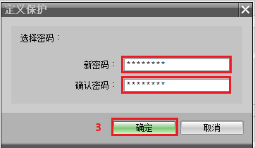{width="362" height="210"}

图 3

3\. 在弹出的定义保护窗口中，输入密码，点击确定按钮，如图 4 所示。

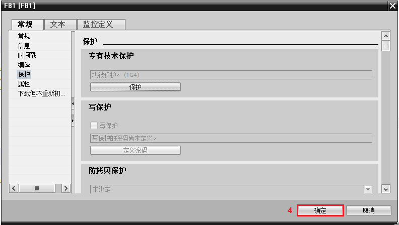{width="792" height="448"}

图 4

4\.
关闭定义保护窗口以后，在所选保护的窗口中再点击确定按钮，这样专利保护密码才可以生效，如果点击取消按钮，则该块不会被保护，如图
5 所示。

{width="321" height="22"}

图 5

5\.
当被保护的块密码生效以后，可以在项目树窗口中看到被保护的块左下角有小锁标志，如图
6 所示。

{width="359" height="188"}

图 6

6\.
当打开被保护的块时，弹出窗口提示需要该块的密码，输入正确密码，点击确定后可以看到该块完整内容；如果点击取消按钮，则只能看到块的接口，无法看到程序块内容，如图
7 所示。（如果是 DB 块，可以看到内容，但无法编辑）。

{width="1016" height="518"}

图 7

7\.
如果想取消密码，可以再次点击该块属性中选择保护选卡中的保护按钮，输入旧密码，点击删除按钮即可，如图
8
所示；如果希望修改密码，则输入旧密码，再输新密码和确认新密码，点击确定按钮。

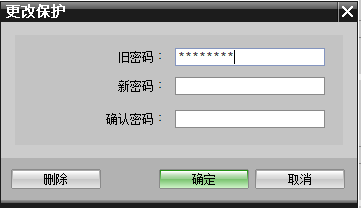{width="361" height="208"}

图 8

#### 常见问题

1\. 忘记专有技术保护密码怎么办？

没有办法，无法破解。

#### []{#b}程序块的防拷贝保护

对于 OB、FB、FC 块具有防拷贝保护功能，可以将该保护块绑定 CPU
或者存储卡的序列号，程序只能下载到所绑定的 CPU 或者存储卡中。

**注意：只有博途 V11 或者更高版本支持该功能。**

以 FC 块为例，防拷贝保护功能具体实现步骤如下：

1\. 选中需要保护的块，右键选择属性，如图 9 所示。

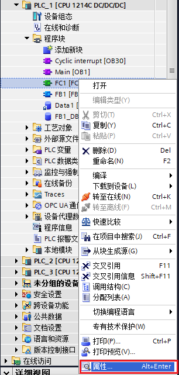{width="306" height="641"}

图 9

2\. 在属性窗口中选择保护选项，定义防拷贝保护功能，如图 10 所示。

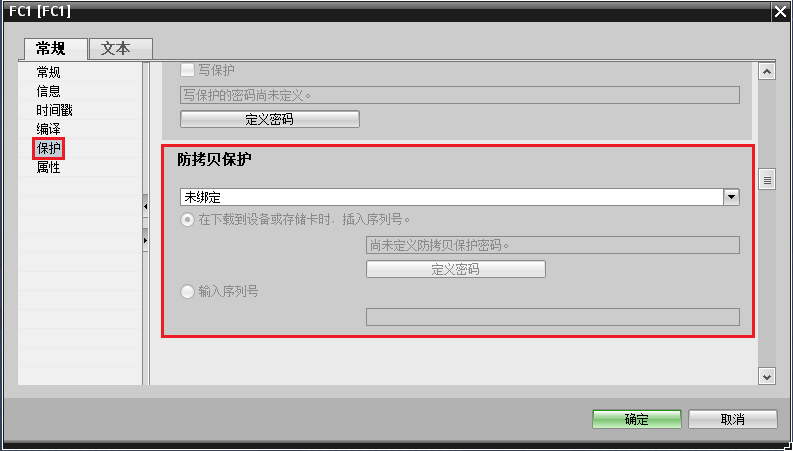{width="793" height="451"}

图 10

3\. 防拷贝保护功能有三个选择，默认为未绑定，如图 11 所示。

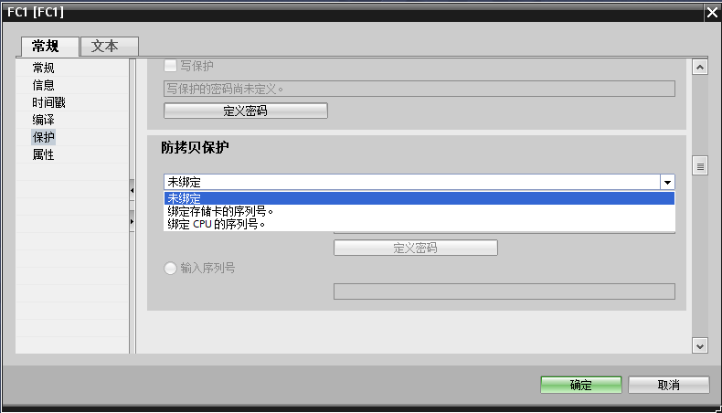{width="790" height="452"}

图 11

4\. 选择绑定存储卡的序列号或者绑定 CPU 的序列号。

**a.** 选择"在下载到设备或存储卡时，插入序列号"
。选择此选择时，无需手动输入序列号，下载到 CPU
后，系统会自动读取需要绑定的 CPU 序列号或者存储卡的序列号。

-   对于 S7-1200 V4.1
    及以上的固件版本，选择此项会提示"尚未定义防拷贝保护密码"，如图 12
    所示，点击定义密码，在弹出窗口中输入密码，点击确认按钮，如图13所示。设置此功能后，在下载程序时候必须输入下载块的密码。注意博途
    V13 SP1 或以上支持此功能。

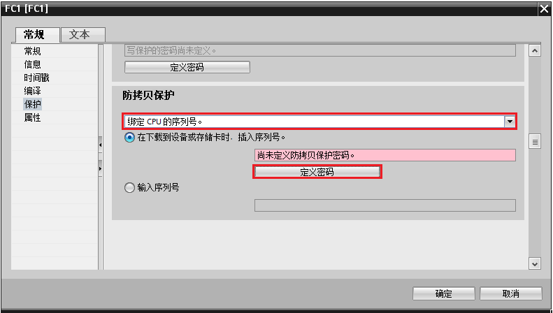{width="791" height="448"}

图 12

{width="362" height="209"}

图 13

-   对于 S7-1200 V4.0 及以前固件版本，无需定义防拷贝密码，如图 14
    所示，如果没有源程序，而是用上载程序下载到其他同型号的 CPU
    或卡时候，会提示下载到设备时出错，CPU 会停机，如图 15 所示。

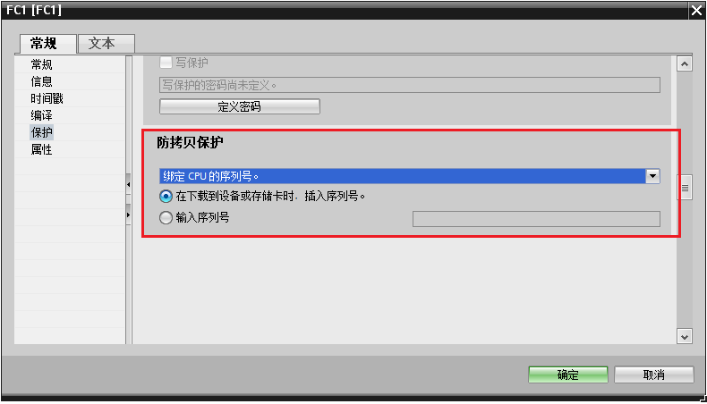{width="790" height="452"}

图 14

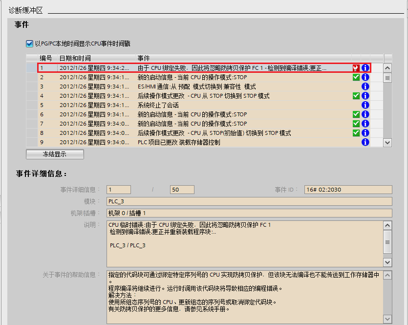{width="835" height="665"}

图 15

b\. 选择"输入序列号"，选择此项时候，需要手动输入 CPU
或者存储卡的序列号。如果收入输入序列号并下载到 CPU
中，即使有源程序，只要更换 CPU
或者存储卡，与绑定的序列号不一致，都无法正常下载，导致 CPU 停机。

**注意：**1.
如果定义了多个块的防拷贝保护，下载过程会提示输入多个密码，如图 16 所示。

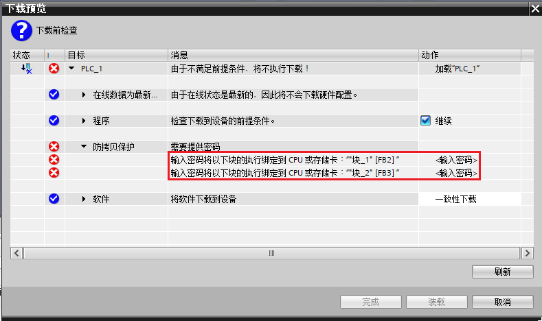{width="789" height="468"}

图 16

2\. 如果选择绑定存储卡的序列号，下载时候 CPU
中没有存储卡，会提示下载到设备时出错，如图 17 所示。

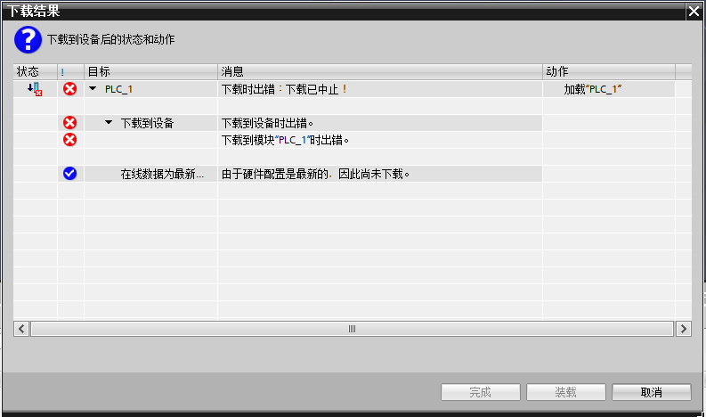{width="793" height="468"}

图 17

3\. 如果先设置了专有技术保护功能，则防拷贝功能变为灰色，无法设置，如图
18
所示；如果想同时使用两种功能，需要先设置防拷贝功能，再定义专有技术保护。

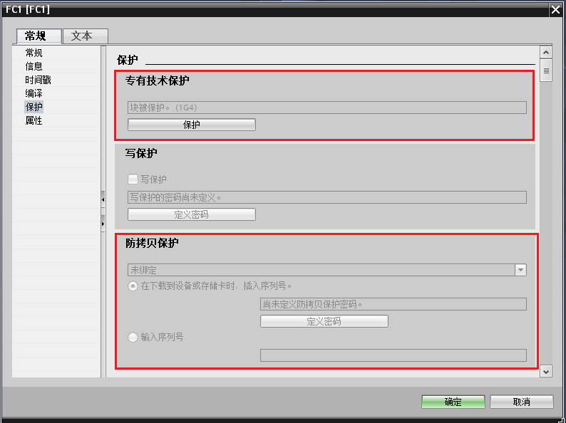{width="794" height="594"}

图 18

4\. 在专有技术保护存在的情况下，防拷贝保护密码也是可以修改的，如图 19
所示。

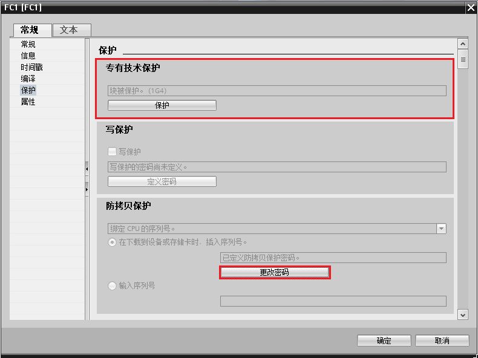{width="790" height="592"}

图 19

#### 常见问题

1、防拷贝保护功能是否可以取消？

①
如果没有使用"专有技术保护"功能，只使用了"防拷贝保护"功能，上载程序后时可以选择"未绑定"后重新下载，取消防拷贝保护功能。

②
如果使用了"专有技术保护"功能，防拷贝功能无法从上载的程序中取消。需要先取消专有技术保护。如图
20 所示。

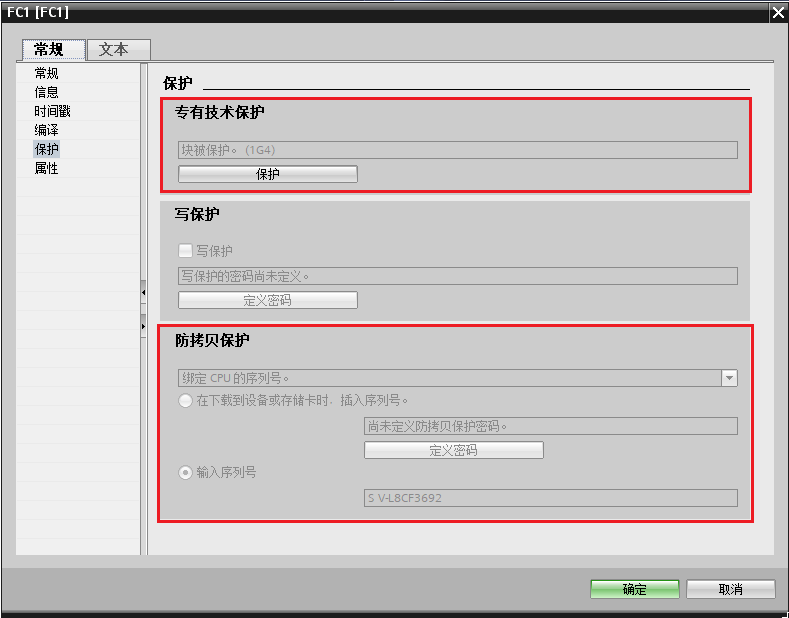{width="789" height="618"}

图 20

#### []{#c}程序块的写保护

对于 OB、FB、FC
块具有写保护功能，定义写保护后，该块只能进行读，而不能进行编辑。

具体步骤如下：

1\. 选择需要进行写保护功能的块，右键选择属性，如图 21 所示。

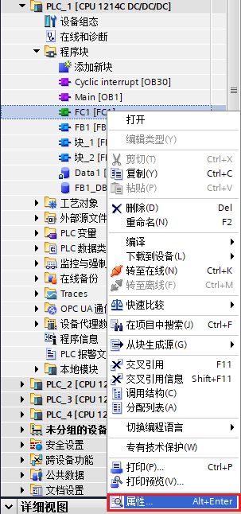{width="303" height="646"}

图 21

2\.
在属性窗口中选择保护选项，定义写保护功能，写保护功能首先需要定义密码，点击定义密码按钮，如图
22 所示。

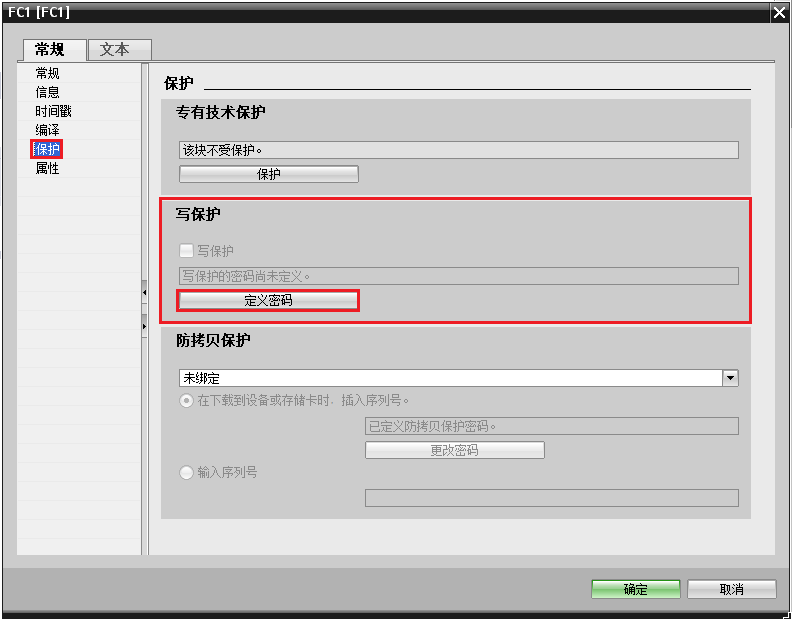{width="792" height="619"}

图 22

3\. 在弹出窗口中输入密码，点击确定按钮，如图 23 所示。

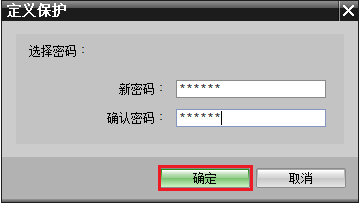{width="360" height="203"}

图 23

4\.
勾选写保护复选框，在弹出的访问保护窗口中输入定义的密码，点击确定按钮，如图
24 所示。

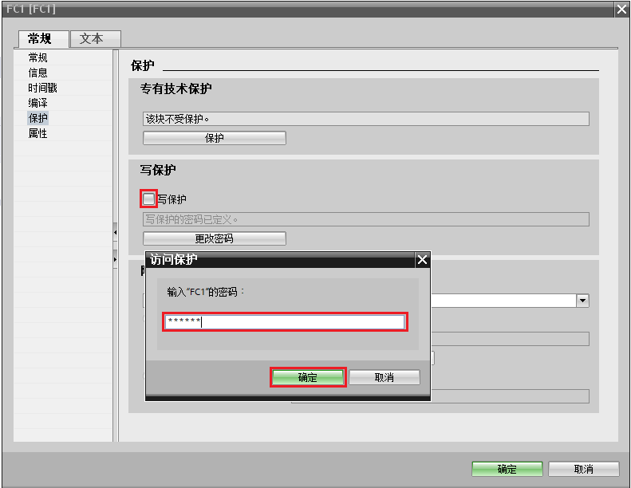{width="791" height="612"}

图 24

5\. 现在可以看到写保护复选框已经打√，点击窗口确定按钮，如图 25 所示。

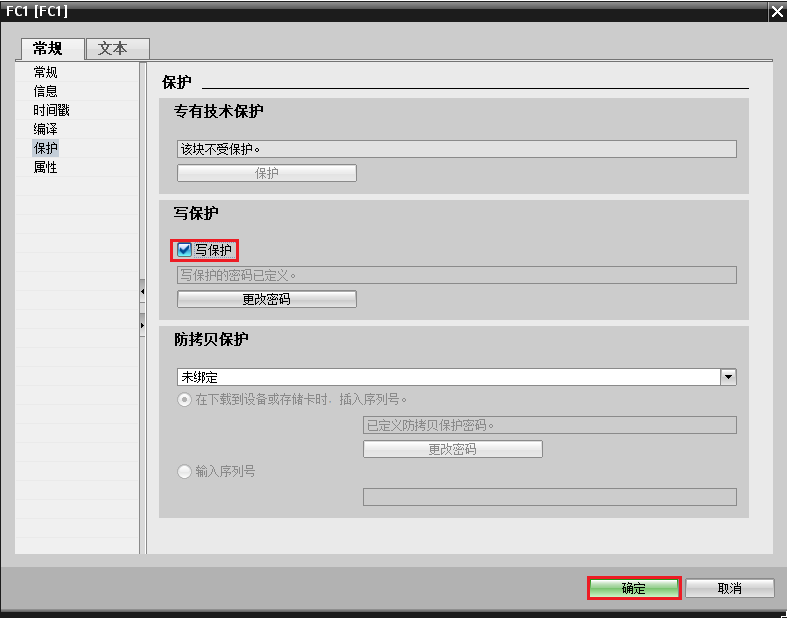{width="787" height="618"}

图 25

6\. 具有写保护功能的块，打开时窗口会出现提示：
由于该块设置为写保护，因此只能读取，如图 26 所示。

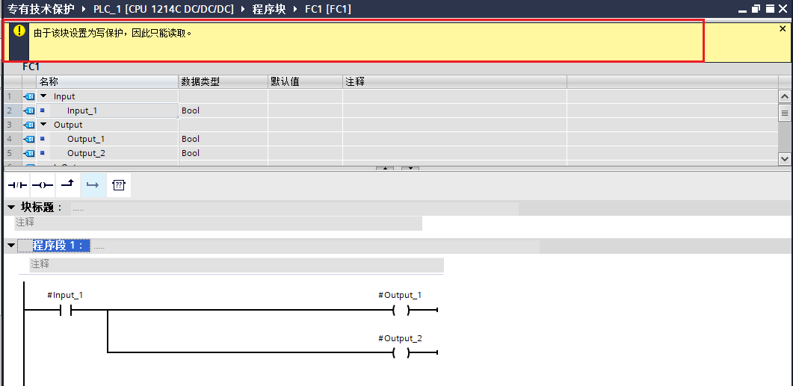{width="1061" height="517"}

图 26
