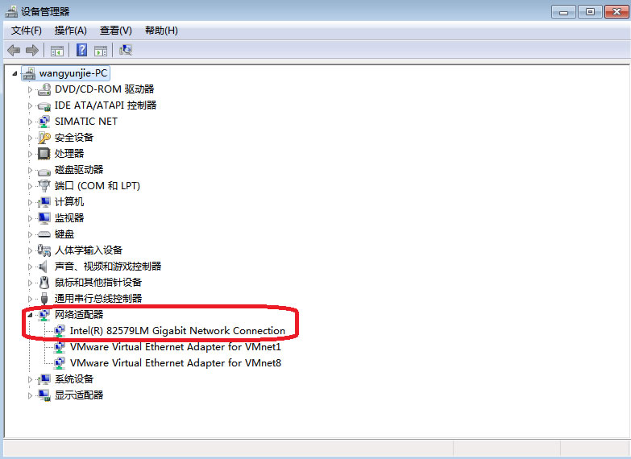
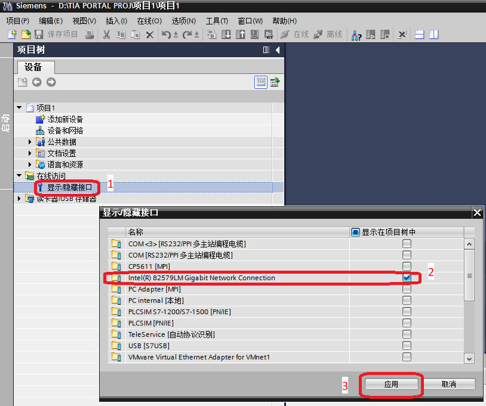
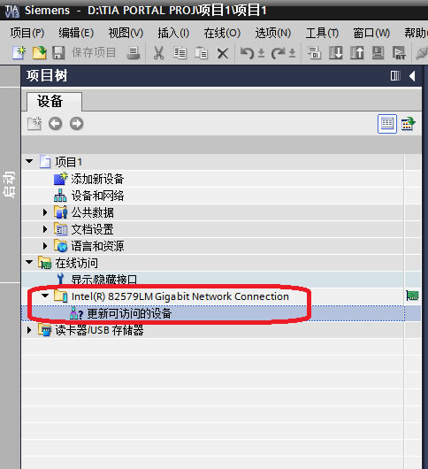
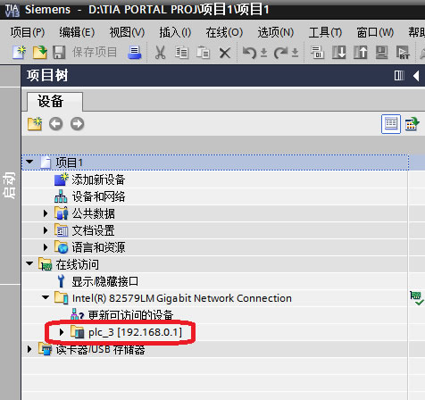

### 重置为出厂设置

在某些情况下，项目已编译通过，但在CPU下载时报错导致无法下载，需要把CPU重置为出厂设置，步骤如下：\

1．创建新项目。打开TIA
Portal软件，如图1所示，填写项目名称、路径等信息，点击创建。

{width="1053" height="365"}

图1.创建项目\

创建完成后，点击\"打开项目视图\"，如图2所示，进入项目视图。

{width="1109" height="795"}

图2.打开项目视图\

3．查找PC使用的网卡\
（1）点击开始菜单，打开控制面板，如图3所示。

{width="411" height="424"}

图3.进入控制面板\

（2）点击\"设备管理器\"，如图4所示

{width="1251" height="653"}

图4.进入设备管理器

（3）点开\"网络适配器\"，找到PC机使用的网卡名称，如图5所示。

{width="783" height="570"}

图5.查找网卡\

4．回到TIA
Portal软件，点开\"在线访问\"，找到PC机使用的网卡。如果没有出现该网卡的名称，按照如下方式操作：双击\"显示/隐藏接口\"，勾选网卡对应的复选框，点击\"应用\"，如图6所示

{width="814" height="681"}

图6.选择网卡\

5．找到网卡后，双击\"更新可访问的设备\"，系统开始扫描接口网络上的设备，如图7示。

{width="484" height="530"}

图7.搜索可访问设备\

6.扫描完成后，会显示已找到的可访问设备，如图8所示。

{width="476" height="448"}

图8.选择访问设备\

7．点开找到的设备，双击\"在线和诊断\"选项，如图9所示。

{width="481" height="529"}

图9.进入在线访问\

8．进入在线和诊断窗口后，点击功能标签下的\"重置为出厂设置\"选项，点击\"重置\"按钮，在弹出的复认窗口中选择\"是\"，如图10所示。

{width="902" height="520"}

图10.重置操作界面\

9．重置为出厂设置需要CPU在STOP操作模式下进行，在弹出的选择窗口中选择\"是\"，如图11所示。

{width="363" height="144"}

图11.CPU运行模式切换\

CPU开始进行重置操作，当消息显示\"模块已复位\"，如图12示，重置完成。

{width="924" height="248"}

图12.重置完成
