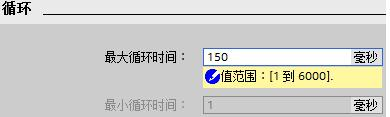
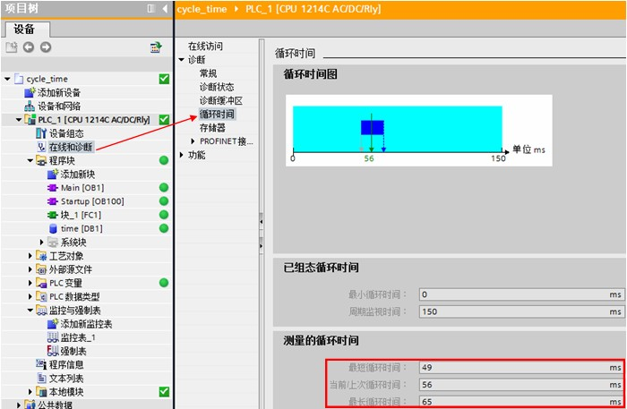

# 08 系统执行时间

S7-1200 CPU的循环扫描时间（看门狗时间）默认为150ms，最大可修改为6000ms，如图1：

图1\. 设置最大循环时间

当编程结束后，需要了解程序的循环周期，可通过如下方法查询。

将程序下载到PLC后，进行在线连接，查看路径：“在线和诊断”--->“循环时间”，如图2：

图2\. 查看PLC循环时间

## 常问问题

 ** 为何程序下载完毕后PLC无法运行，PLC诊断信息中出现“超出最大程序循环时间”？**  
  
可能的原因：

1、程序过长，执行时间超过设置的最大循环时间；

2、程序中有死循环程序导致执行时间超过最大循环时间；

3、定时中断程序的执行时间大于所设定的定时间隔时间，导致定时中断事件缓冲区溢出而停机。

## 应用例程

 按住 Shift 键时用鼠标点击下列链接，打开新浏览器窗口。

[**http://www.ad.siemens.com.cn/productportal/Prods/S7-1200\_PLC\_EASY_PLUS/S7-1200例程合集/编程/基本指令/程序控制操作.html**](http://www.ad.siemens.com.cn/productportal/Prods/S7-1200_PLC_EASY_PLUS/S7-1200例程合集/编程/基本指令/程序控制操作.html)