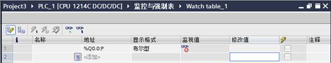
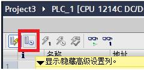
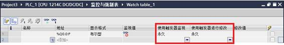
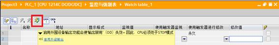
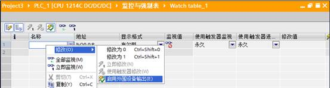

# 09 "启用外设输出"功能简介 

STEP7 V11 的监控变量表具有以下三方面功能：

1.  "监视变量"(Monitoring tags)，使用该功能可以在PG/PC
    上显示CPU 或用户程序中的各个变量的当前值。
2.  "修改变量"(Modifying
    tags)，使用该功能可以将特定值分配给用户程序或CPU
    中的各个变量。
3.  "启用外设输出"(Enable peripheral
    outputs)和"立即修改"(Modify now)。

其中"启用外设输出"(Enable peripheral
outputs)功能可以将特定值分配给处于STOP 模式下CPU
的各个外设输出，主要应用于在CPU
停止状态下对设备进行接线检查或调试。

## "启用外设输出"的使用条件

"启用外设输出"功能只有在满足以下几个条件时才有效：

1.  CPU 处于STOP 模式，并且未启用变量的强制功能。
2.  监控变量表布局设置为扩展显示模式。
3.  只能对外设输出地址区，即必须是带 ":P" 的 Q
    地址。
4.  已经建立与CPU 的在线连接。

## 操作步骤

在项目中新建一个监控变量表，或打开一个已经存在的监控变量表。根据实际需要，在变量表中添加要启动外设输出的地址，本例中添加"Q0.0:P"，如图1。　

{width="553" height="106"}

图 1：在变量表中添加变量

通过激活监控变量表中"显示/隐藏高级设置列"工具图标来设置变量表的布局为扩展显示模式（也可以通过菜单"在线\\扩展模式"或在变量表中点击鼠标右键选择快捷菜单项"扩展模式"来设置），如图
2。

{width="240" height="117"}

图2：显示/隐藏高级设置列

设置完成后，可以看到在变量表中增加了"使用触发器监视"和"使用监视器进行修改"的两个显示列，如图
3。

{width="566" height="90"}

图 3：扩展显示模式

建立与PLC 的在线连接，并将 CPU 的工作模式转换到
STOP，这时可以看到"启用外设输出"功能有效，如图 4。

{width="567" height="92"}

图 4：启用外围设备输出功能

通过工具栏上的"启用外设输出"图标或在监控变量表中点击鼠标右键选择快捷菜单使能"启用外设输出"功能，如图
5。

{width="553" height="148"}

图 5：使能"启用外围设备输出"功能

这时就可以修改"Q0.0:P"点的状态了。可以看到，如果在变量表中将"Q0.0:P"的值修改为
1，则模块的Q0.0 点的输出灯被点亮。

## "启用外设输出"功能的取消

可以通过如下几种方式取消"启用外设输出"功能：

1.  通过菜单命令取消。
2.  CPU 切换到运行模式。
3.  退出与 CPU 的在线连接。

:::{attention}
功能取消后不能再恢复，需要重新启用.
:::
