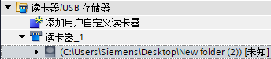

# 10 使用存储卡

S7-1200CPU使用的存储卡为SD卡，存储卡中可以存储用户项目文件，有如下几种主要功能：

1.  作为CPU的装载存储区，用户项目文件可以仅存储在卡中，CPU中没有项目文件
    ，离开存储卡无法运行。
2.  在没有编程器的情况下，作为向多个S7-1200PLC传送项目文件的介质。
3.  忘记密码时，清除CPU内部的项目文件和密码。
4.  12MB以上存储卡可以用于更新S7-1200CPU的固件版本。

{width="476" height="205"}

图1： S7-1200存储卡

存储卡功能链接：

- [10 使用存储卡](#10-使用存储卡)
  - [如何插入存储卡](#如何插入存储卡)
  - [存储卡的工作模式](#存储卡的工作模式)
  - [一、修改存储卡的工作模式](#一修改存储卡的工作模式)
  - [二、使用程序卡模式](#二使用程序卡模式)
  - [三、使用传送卡模式](#三使用传送卡模式)
  - [使用存储卡清除密码或恢复出厂设置](#使用存储卡清除密码或恢复出厂设置)
  - [使用存储卡更新S7-1200CPU的固件版本](#使用存储卡更新s7-1200cpu的固件版本)
  - [使用自定义读卡器制作程序文件](#使用自定义读卡器制作程序文件)
  - [使用TIA STEP7格式化存储卡](#使用tia-step7格式化存储卡)

## 如何插入存储卡

将CPU上挡板向下掀开，可以看到右上角有一MC卡槽，将存储卡缺口向上插入，如下图所示：

{width="499" height="332"}

图2： 插入存储卡

:::{attention}

-   对于S7-1200CPU，存储卡不是必须的。
-   将存储卡插到一个处于运行状态的CPU上，会造成CPU停机。
-   S7-1200 CPU 仅支持由西门子制造商预先格式化过的存储卡，
    即下列订货号产品：

| 订货号 | 容量  |
| --- | --- |
| SIMATIC MC 4 MB | 6ES7 954-8LC03-0AA0 |
| SIMATIC MC 12 MB | 6ES7 954-8LE03-0AA0 |
| SIMATIC MC 24 MB | 6ES7 954-8LF03-0AA0 |
| SIMATIC MC 256 MB | 6ES7 954-8LL03-0AA0 |
| SIMATIC MC 2G | 6ES7 954-8LP03-0AA0 |
| SIMATIC MC 32G | 6ES7 954-8LT03-0AA0 |

:::

表1：存储卡信息

- 如果使用 Windows 格式化程序对SIMATIC 存储卡重新进行格式化，CPU将无法使用该重新格式化的存储卡。（固件V2.0.1以前）

** 怎样检查一张 SIMATIC
存储卡（SMC）有非一致性或者是格式错误？如何修复？**

从固件V2.0.1开始才支持存储卡中隐藏文件的自动修复，早期的版本无此功能。

如果从S7-1200中修复存储卡，CPU中的程序将会自动载入存储卡中，之后CPU将不会有程序。

请参考以下链接

[**https://support.industry.siemens.com/cs/cn/zh/view/69063974**](https://support.industry.siemens.com/cs/cn/zh/view/69063974)

## 存储卡的工作模式

存储卡有两种工作模式：　

- 程序卡：存储卡作为S7-1200 CPU的装载存储区，所有程序和数据存储在卡中，CPU内部成的存储区中没有项目文件，设备运行中存储卡不能被拔出。
- 传送卡：用于从存储卡向CPU传送项目，传送完成后必须将存储卡拔出。CPU可以离开存储卡独立运行。

## 一、修改存储卡的工作模式

在TIA
PORTAL软件的项目视图下，点击左侧"项目树"\-\--\>\"读卡器/USB存储器\"
\-\--\>读卡器，如下图所示：

{width="205" height="74"}

图3：项目视图

右击存储卡的盘符（这里是F:），选择"属性"，打开下面窗口：

{width="790" height="494"}

图4：存储卡属性

用户在"Card type"选择需要的工作模式，点击"OK"完成设定。

## 二、使用程序卡模式

优点：更换CPU时不需要重新下载项目文件。

**装载用户项目文件到存储卡：**

-   第一步：按照上面方法将存储卡设定到"程序"模式。建议客户做此操作之前清除存储卡中的所有文件。

-   第二步：设置CPU的启动状态：在\"项目树\"中右击CPU选择"属性"，在"属性"窗口中点击"启动",此处必须选择"暖启动 -RUN模式"

{width="733" height="434"}

图5： 启动设置

-   第三步：将CPU断电。

-   第四步：将存储卡插到CPU卡槽内

-   第五步：将CPU上电

-   第六步：在TIA PORTAL 中点击下载，将项目文件全部下载到存储卡中。此时下载是将项目文件（包括用户程序、硬件组态和强制值）下载到存储卡中，而不是CPU内部集成的存储区中。

完成上述步骤后，CPU可以带卡正常运行。此时如果将存储卡拔出，CPU会报错，\"ERROR\"红灯闪烁。

 为什么插上存储卡后CPU的"MAINT"灯闪烁，使用TIA
PORTAL下载是提示报错"The download of the hardware configuration failed
(0050 -133 2 2458)"？

**回答**：请清除存储卡中的所有文件，重新使用TIA
PORTAL软件将存储卡设置到"程序"模式，然后再重复上述步骤。请您也检查存储卡上的拨码开关，检查存储卡是否处于写保护模式。

 为什么CPU断电上电后进入停止状态，而不进入运行状态？

**回答**：原因是CPU的启动方式不是"暖启动 -
RUN模式"，详细请参考上面"第二步"。

## 三、使用传送卡模式

 优点：在没有编程器的情况下，方便快捷地向多个S7-1200PLC拷贝项目文件。

**1、向处于传送模式的存储卡中装载项目**

-   第一步：按照上面方法将存储卡设定到"传送"模式。建议客户做此操作之前清除存储卡中的所有文件。

-   第二步：设置CPU的启动状态：在\"项目树\"中右击CPU选择"属性"，在"属性"窗口中点击"启动",此处必须选择"暖启动 -RUN模式"

-   第三步：直接拖拽PLC设备到存储卡盘符
   
{width="436" height="285"}

图6：拖拽

[用户也可以直接将一张已经做好的"程序卡"更改为"传送卡" 。
]{style="font-size: 14px"}

**2、从存储卡复制项目到S7-1200PLC**

-   第一步：将CPU断电
-   第二步：插卡到CPU卡槽
-   第三步：将CPU上电，用户会看到CPU的\"MAINT\"黄灯闪烁
-   第四步：将CPU断电，将存储卡拔出
-   第五步：将CPU上电

 为什么CPU断电上电后进入停止状态，而不进入运行状态？

**回答**：

1.  CPU的启动方式不是"暖启动 - RUN模式" ，详细请参考上面"第二步"。
2.  检查第三步，必须拖拽PLC项目到存储卡盘符，而不是程序块等其他项目内容。下载到存储卡中的项目文件有可能不完整，例如缺失硬件组态等。

## 使用存储卡清除密码或恢复出厂设置

如果客户忘记了之前设定到S7-1200的密码，通过"恢复出厂设置"无法清除S7-1200内部的程序和密码，因此唯一的清除方式是使用存储卡。详细步骤如下：

1.  使用一张存储卡，插在电脑读卡器中，清空内部文件。
2.  在TIA PORTAL中将存储卡的工作模式改成"传送"卡，参考图4。
3.  将S7-1200设备断电。
4.  插入存储卡到S7-1200CPU上。
5.  将S7-1200设备上电，此时CPU会停止。
6.  当"MAINT"指示灯闪烁，将S7-1200设备断电。
7.  取出存储卡后，将S7-1200设备上电，此时CPU密码及程序完全清除。

:::{attention}

-   不要格式化存储卡
-   清除密码的同时CPU的程序也同时清除
:::

## 使用存储卡更新S7-1200CPU的固件版本

S7-1200的固件版本可以从在[**此处**](../01-resource/08-online_download.htm#firm)查找下载链接。

:::{attention}
-   不同订货号的S7-1200CPU的固件文件不相同，下载地址也不相同。用户在下载和更新固件之前请核对产品订货号。
-   12M以下存储卡不能用于CPU固件升级。
-   固件升级前CPU内部存储的项目文件（程序块、硬件组态等）不受影响，不会被清除。
-   如果存储卡中的固件文件订货号与实际CPU的订货号不一致，即使执行了下列步骤，CPU的原固件版本也不会改变。

:::

**更新CPU的固件具体步骤如下：**

-   第一步：使用电脑通过读卡器清除存储卡中内容。 注意：：不要格式化存储卡！**
-   第二步：从西门子官方网站下载最新版本的固件文件。下载并解压缩，用户可以得到一个"S7_JOB.SYS"文件和"FWUPDATE.S7S"文件夹。
-   第三步： 将"S7_JOB.SYS"文件和"FWUPDATE.S7S"文件夹拷贝到存储卡中。
-   第四步：将存储卡插到CPU1200卡槽中。此时CPU会停止，"MAINT"指示灯闪烁。
-   第五步： 将CPU断电上电 。CPU的"RUN/STOP"指示灯黄绿交替闪烁说明固件正在被更新中。"RUN/STOP"指示灯亮(黄)，"MAINT"指示灯闪烁说明固件更新已经结束。
-   第六步： 拔出存储卡
-   第七步： 再次将CPU断电上电

用户可以在TIA PORTAL 软件\-\--\>在线和诊断\-\--\>诊断\-\--\>常规
中在线查看CPU目前的固件版本。

:::{attention}
S7-1200 CPU 固件版本在 V2.2
以下(包括V2.2)，可以降级（最低V1.0)或升级（最高V2.2)。\
S7-1200 CPU 固件版本在 V3.0
不可以降级至V2.2(或更低版本)，同样V2.2的固件版本不能升级至V3.0
:::

## 使用自定义读卡器制作程序文件

某些时候，需要将程序文件发给别人，但对方没有TIA
PORTAL，只有存储卡或者Simatic Automation
tool软件，这样就无法发送TIA的项目文件，这种情况下可以将存储卡文件发送给对方，操作步骤如下：

1\. 在TIA
PORTAL软件的项目视图下，点击左侧"项目树"\-\--\>\"读卡器/USB存储器\"
\-\--\>添加用户自定义读卡器，参考图3

双击"添加用户自定义读卡器"，弹出如图7所示

{width="349" height="417"}

图7 添加自定义读卡器"

选择合适的位置，点击图7左下角按钮"新建文件夹"，将会在指定位置新建文件夹，这个文件夹就是一个自定义读卡器。

2\. 新建文件夹后，在项目树下的读卡器/USB存储器\"
将出现如图8所示的读卡器。

{width="344" height="76"}

图8 自定义读卡器

这个读卡器就是指定位置下建的文件夹（图中为桌面建立的New folder(2)）。

3\. 根据需要，按照图4方式将自定义读卡器改为"传送"卡或"程序"卡

4\. 按照图6方式将程序拖拽至该读卡器中。

5\. 此时打开自定义的读卡器文件夹就能看到程序文件，如图9所示。

{width="432" height="167"}

图9 程序文件

## 使用TIA STEP7格式化存储卡

从组态的CPU版本V4.2开始，可以通过 STEP 7 在线和诊断工具格式化连接的 CPU
中的存储卡。

**使用TIA STEP7格式化存储卡的具体步骤如下：**\

-   第一步： 确保 CPU 处于 STOP 模式。注意如果 CPU 处于 RUN模式时启动了格式化操作，STEP 7 将 提示您允许 STEP 7 将 CPU 置于STOP模式下。
-   第二步： 将存储卡插入到连接的 CPU。
-   第三步： 通过项目中的 CPU 或项目树中在线访问中的可访问设备打开连接的
CPU 的\"在线和诊断\"。
-   第四步： 选择所连 CPU 的\"转到在线\"选项。
-   第五步： 选择\"功能\"菜单中的\"格式化存储卡\"。
-   第六步： 单击\"格式\"。
-   第七步： 单击\"是\"确认提示。

上述步骤如图10所示：

[{width="1155" height="673"}]{.STYLE1}

图10 TIA STEP7格式化存储卡

然后 STEP 7 格式化存储卡，完成后在信息窗口中显示一条消息。完成后 CPU
处于 STOP 模式，STOP 和 MAINT 灯闪烁。此时还不能切换到 RUN
模式，必须执行以下任一步骤：

-   移除存储卡并重启 CPU。如果 CPU 的内部装载存储器含有程序，CPU将带程序启动。
-   不移除存储卡重启 CPU：如果 CPU 的内部装载存储器含有程序，CPU将该程序复制到 存储卡然后带程序重启。如果内部装载存储器不含程序，CPU将更改存储卡为程序卡并等待下载。

:::{attention}
格式化存储卡对内部装载存储器没有影响。
当插入存储卡（在插入存储卡和执行格式化操作中间未重启 CPU）时 CPU
正在使用内部装载存储器，CPU 将保持内部装载存储器的内容。
:::