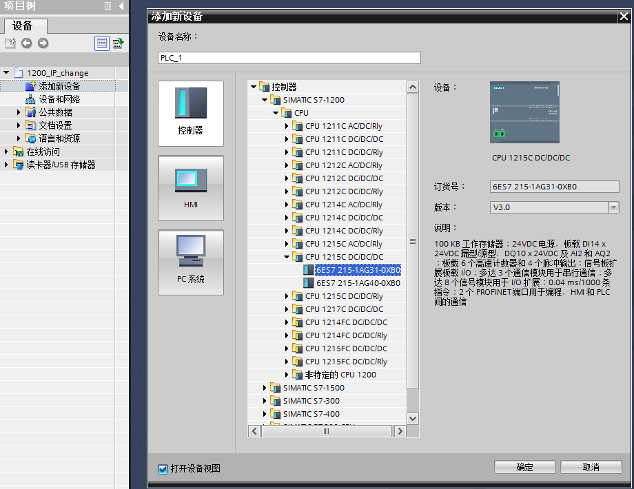
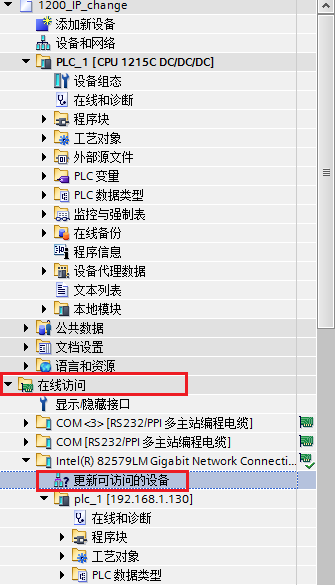
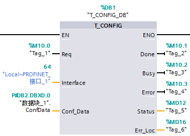
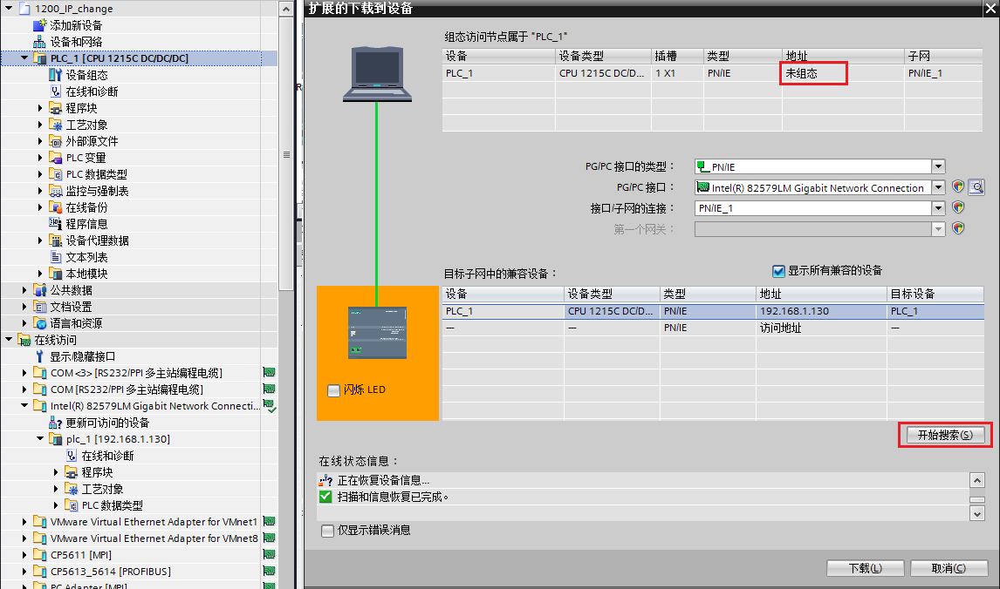
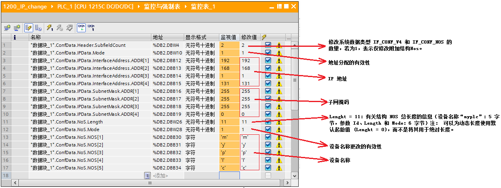
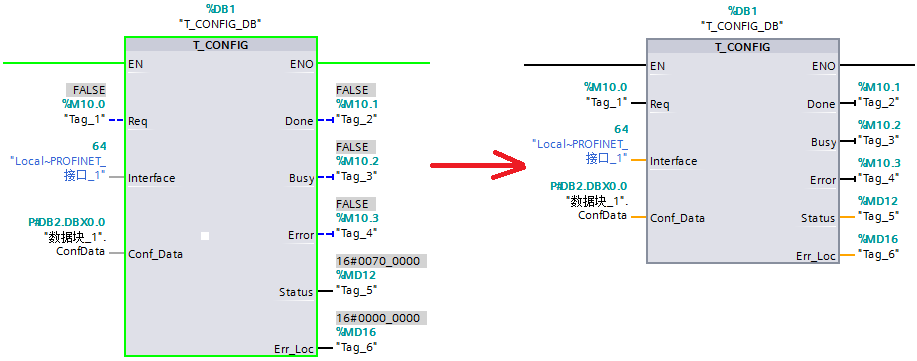

# 使用T-CONFIG指令修改S7-1200的IP地址和设备名称

使用 S7-1200 的 T-CONFIG 指令可以修改 S7-1200的 IP
地址和设备名称，下面详细介绍该指令的使用方法。

硬件：

1.  CPU 1215C DC/DC/DC，V3.0，(6ES7 215-1AG31-0AB0)

软件：

1.  TIA Portal Step7 V13

## 1. 创建新项目

新建一个项目，项目名称"1200_IP_change"，添加 S7-1200
新设备，控制器选择"6ES7 215-1AG31-0XB0"，设备名称为"PLC_1"，如图 1
所示。

{width="920" height="710"}

图 1 创建 S7-1200 新项目

## 2. 网络接口组态

创建项目名称"1200_IP_change"，进入"设备组态"，设置 PROFINET
接口；首先添加新子网"PN/IE_1"，设置 IP
地址"192.168.1.130"，子网掩码"255.255.255.0"，PROFINET设备名称设置成"plc_1"，如图
2 所示。将该项目编译保存，并下载到 CPU 中。

{width="1002" height="745"}

图 2 CPU 网络接口组态

## 3. 在线查看设备名称和 IP 地址

从项目树中的"在线访问"中找到该电脑的网卡（本项目的网卡是"Intel(R)82579LM
Gigabit Network
Connecti.."），双击"更新可访问的设备"，等待一段时间可以浏览到网络上可访问的设备，如图
3 所示。\
图 3 显示浏览到一个设备，设备名称是"plc_1"，IP
地址是"192.168.1.130"。与之前设置的 CPU 的PROFINET
接口网络设置的设备名称和 IP 地址一致。

{width="336" height="585"}

图 3 在线查看当前设备名称和 IP 地址

## 4. 调用功能块 T_CONFIG

在主程序OB1中调用T_CONFIG功能块，从"通信-\>开放式用户通信-\>其他"处拖入功能块
T_CONFIG。并为该功能块的参数 Interface 指定 PROFINET 接口的硬件 ID，管脚
interface
选择"Local～PROFINET_接口_1"，该管脚的具体含义可以看功能块的帮助文档（鼠标点击选中该功能块，手指按键盘的
F1 键 ）。如图 4 所示。

{width="1061" height="386"}

图 4 调用 T-CONFIG 功能块

## 5. 功能块管脚

功能块T_CONFIG，有一个管脚 Conf_Data，本文着重介绍该管脚。在管脚
CONF_DATA
中引用结构"ConfigData"，该结构需要在全局数据块中创建。首先，新建一个数据块
DB2，如图 5 所示，在 DB2 中新建一个变量"ConfData",数据类型为
Struct，在变量下新建 3
个子变量：Header、IPData、Nos，数据类型分别为：IF_CONF_Header、IF_CONF_v4、IF_CONF_NOS，这
3
个数据类型直接手动输入就可以。该管脚的具体含义可以看功能块的帮助文档（鼠标点击选中该功能块，手指按键盘的
F1 键 ）。

{width="678" height="227"}

图 5 新建 DB 块并创建变量

## 6. 功能块 T_CONFIG 管脚的填写

前面已经填写了管脚 "Interface"，并管脚 "Conf_Data"
分配地址为"DB2.ConfData"，Req、Done、Busy、Error、Status、Err_Loc
分别填写地址：M10.0、M10.1、M10.2、M10.3、MD12 和 MD16。如图 6 所示。

{width="379" height="271"}

图 6 功能块 T_CONFIG 管脚的填写

## 7. 修改 CPU 网络组态

进入 CPU 的"PROFINET 接口"，将 IP 协议选择为"在设备中直接设定 IP
地址"，将 PROFINET 选择为"在设备中直接设定 PROFINET 设备名称"，如图 7
所示。

{width="661" height="556"}

图 7 修改 PROFINET 接口选项

## 8. 再次下载项目

编译保存该项目，再次整体下载该项目，弹出下载界面"扩展的下载到设备"，可以看到组态访问节点的
PLC_1
的地址显示"未组态"，点击按键"开始搜索"，直到"目标子网中的兼容设备"表格中显示出
PLC_1，地址显示"192.168.1.130"，用鼠标选中该设备，点击右下角的"下载"。如图
8 所示。

{width="1146" height="676"}

图 8 重新下载项目

## 9. 展开数据块

项目下载完成后，展开数据块 DB2 的 3 个变量，如图 9 所示。

{width="439" height="724"}

图 9 展开 DB2 的变量

# 10. 监控修改变量

将项目在线，从项目树中的"PLC_1-\>监控与强制表"中新建一个监控表（本例新建为"监控表_1"），将数据块
DB2 的一些需要修改的变量从 DB2
中拖拽到监控表中，具体变量参见下图的监控表，如图 10 所示。

{width="1238" height="466"}

[图 10 监控表修改相关变量]{.STYLE8}

## 11. 执行功能块指令

进入主程序并在线，给管脚 "Req"
一个脉冲信号，主程序会立即进入离线状态，这表示设备名称和 IP
地址已经被修改成功，如图 11 所示。

{width="917" height="361"}

图 11 在线执行功能块指令

## 12 再次在线查看设备名称和 IP 地址

再次执行步骤 3，从项目树中的"在线访问"中的"更新可访问的设备"，查看该 CPU
的PROFINET 接口网络设置的设备名称和 IP 地址一致，如图 12
所示。可以看到图中的 CPU 的设备名称修改成"myplc"，IP
地址修改成"192.168.1.131"。

{width="316" height="590"}

图 12 在线查看 CPU 设备名称和 IP 地址

# 修改 IP 地址应用例程

**请参考以下链接：**

<http://www.ad.siemens.com.cn/productportal/Prods/S7-1200_PLC_EASY_PLUS/S7-1200例程合集/功能/修改IP.html>
