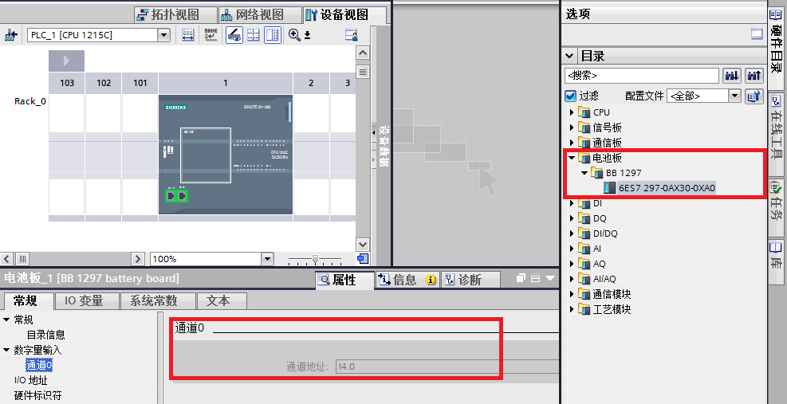

### BB 1297 电池板 

S7-1200 BB 1297 电池板适用于实时时钟的长期备份。 它可插入 S7-1200
CPU（固件版本 3.0 及更高版本）正面的板插槽中。BB 1297 不能与较早版本的
CPU 一起使用。

必须将 BB 1297 添加到设备组态并将硬件配置下载到 CPU 中，BB 1297
电池板才能正常工作。

|     |     |
| --- | --- |
| 技术数据 | BB 1297 电池板 |
| 订货号 | 6ES7 297-0AX30-0XA0 |
| 功耗  | 0.5W |
| 电流消耗（SM 总线） | 11mA |
| 电流消耗（24 VDC） | 无   |
| 保持时间 | 大约 1 年 |
| 电池类型 | CR 1025 |
| 额定电压 | 3 V |
| 额定容量 | 至少 30mAH |

#### 安装或更换 BB 1297 电池板中的电池 

**BB 1297 只是电池板，必须由用户另行购买电池，电池型号为 CR1025。**

安装 BB 1297 中的电池，请执行以下步骤, 如下图 1 所示：
1. 在 BB 1297 中，将 CR1025
电池正极朝上，负极靠近印刷线路板来安装新电池。
2. 安装 BB 1297 电池板。

更换 BB 1297 中的电池,请执行以下步骤，如下图 1 所示：
1. 将 BB 1297 从 CPU 中取出。
2. 使用小号螺丝刀小心地取下旧电池。 将电池从卡夹下部推出。
3. 安装新的 CR1025 替换电池时，使电池正极朝上，负极靠近印刷线路板。
4. 重新安装 BB 1297 电池板。
{width="546" height="381"}

图 1. BB 1297 电池板安装电池

#### BB 1297 电池板诊断

BB 1297 电池板可通过指示灯，结合模板地址和诊断缓冲区进行诊断。

|     |     |
| --- | --- |
| 诊断  | BB 1297 电池板 |
| 临界电池电压 | <2.5 V |
| 电池诊断 | 低压指示灯：电池电压低会使 CPU MAINT LED 呈琥珀色常亮。   诊断缓冲区事件：16#06:2700"需要子模块维护：至少一个电池已耗尽 (BATTF) |
| 电池状态 | 提供的电池状态位   0 = 电池正常   1 = 电池电量低 |
| 电池状态更新 | 电池状态会在开机时更新，之后在 CPU 处于 RUN 模式时，每天更新一次。 |

BB 1297 电池板提供的电池状态位可在"设备视图-属性-常规-数字量输入-通道0"查看,
例如 I4.0。 如下图 2 所示：

{width="987" height="507"}

图 2.电池状态位

以上地址也可在"设备视图-属性-常规-数字量输入-I/O地址"更改。如下图 3
所示：

{width="703" height="234"}

图 3.修改电池状态位地址

#### 常见问题

  **S7-1200 CPU
的数据断电保持功能是否需要 BB 1297 电池板？**

如果对 S7-1200 CPU DB 和 M 区数据设置了断电保持，无需再使用 BB 1297
电池板，即可实现数据永久保持。 S7-1200 BB 1297
电池板适用于实时时钟的断电保持。

  **BB 1297 电池板插入 CPU
就能实现实时时钟的断电保持吗？**

使用 BB 1297 实现实时时钟的断电保持必须注意以下两点：

1. BB 1297 只是电池板，必须由用户另行购买电池，电池型号为 CR1025。

2. 必须将 BB 1297 添加到设备组态并将硬件配置下载到 CPU 中，BB 1297
电池板才能正常工作。

  **BB 1297
电池板能对实时时钟断电保持多长时间？**

使用 BB1297 电池板和 CR1025
电池，能对实时时钟断电保持大约一年。可编程使用提供的电池状态位如
I4.0=1，检测电池电量低。
