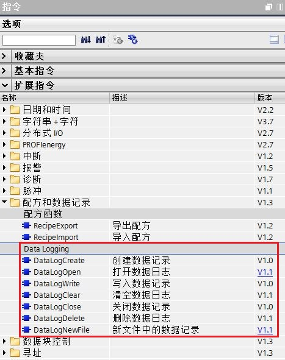

# 13 数据日志

## 数据日志介绍

S7-1200 CPU 为固件版本 V2.0 以上及编程软件版本在 STEP 7 V11 以上提供数据日志功能。

可以用“Data Logging”指令将运行数据值存储在永久性日志文件中，数据日志文件按照标准 CSV 格式存储在 S7-1200 CPU 装载存储器或 S7-1200 SIMATIC 存储卡中。

使用S7-1200 CPU内置的 Web 服务器，可管理数据日志文件，实现数据日志文件的下载、删除和重命名； 或将数据日志文件传送到PC，使用标准电子表格工具（如Excel）分析数据。

## 数据日志的程序指令

数据日志的程序指令 Data Logging 用于在程序中创建、打开、写入、清空、关闭、删除以及新建数据日志。从“指令” ->“扩展指令”->“配方和数据记录”下可调用相关功能指令。如下图1所示：



图1.数据日志指令

 注：只有组态 S7-1200 CPU固件版本为 V2.0 以上及使用的编程软件版本为 STEP 7 V11 以上，才可按照如上图1所示调用数据日志指令！

对于DataLogClose与DataLogDelete两条指令需要S7-1200 CPU固件版本为 V4.2 及其以上才可以使用。


# 13 数据日志

```{toctree}
:maxdepth: 1

02-Getting_Start
03-use
04-FAQ

```